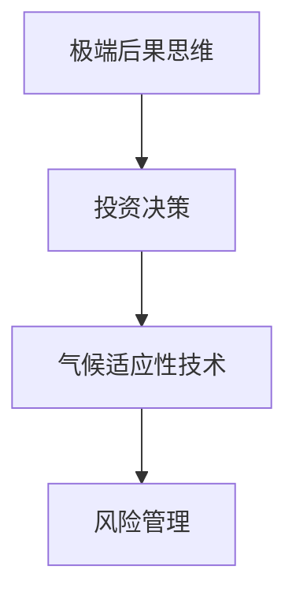
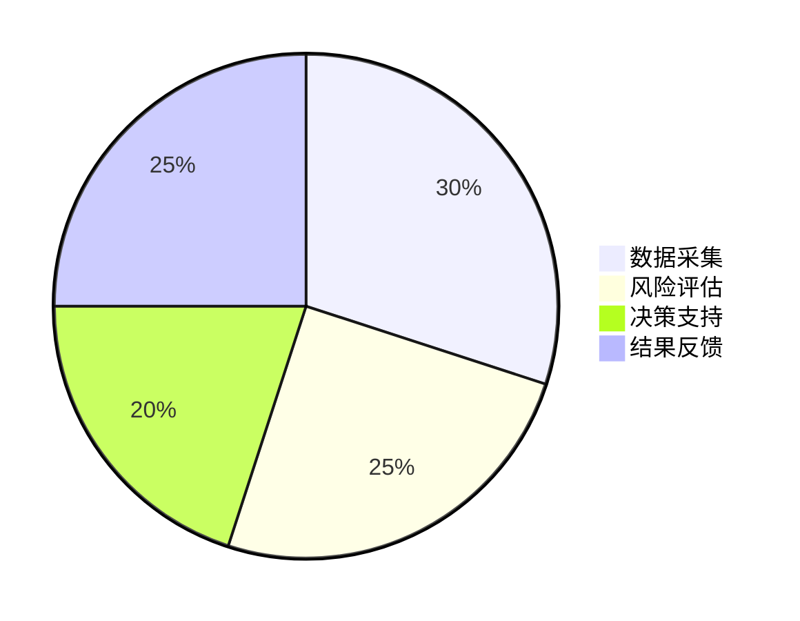
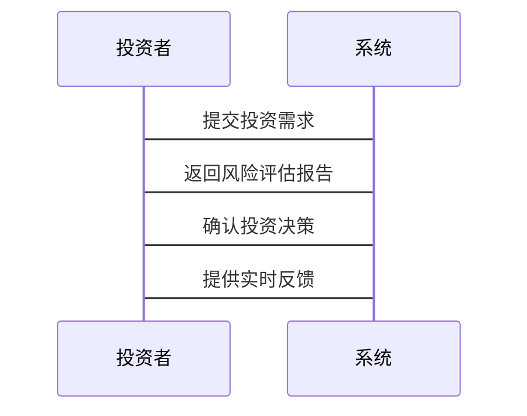

                 


# 芒格的"极端后果"思维在气候适应性技术投资中的应用

## 关键词：芒格、极端后果思维、气候适应性技术、技术投资、风险管理、系统架构

## 摘要：  
本文探讨了芒格的“极端后果”思维在气候适应性技术投资中的应用，分析了气候变化对全球经济和社会的影响，以及极端后果思维在投资决策中的重要性。通过结合数学模型、算法原理和系统架构设计，本文提出了在气候适应性技术投资中应用极端后果思维的具体方法，并通过实际案例分析和项目实战，展示了如何在复杂多变的气候环境中做出明智的投资决策。

---

## 第一部分：背景介绍

### 第1章：问题背景

#### 1.1 气候变化的现状与影响
气候变化已成为全球性的重大挑战，极端天气事件频发，对全球经济和社会造成深远影响。企业需要通过技术创新来适应和缓解气候变化的影响。

#### 1.2 技术投资在应对气候变化中的作用
技术投资是应对气候变化的关键手段之一。通过投资气候适应性技术，企业可以减少碳排放、提高资源利用效率，并在极端气候事件中保持业务连续性。

#### 1.3 传统投资决策的局限性
传统投资决策往往依赖于历史数据分析和短期收益考量，忽视了极端气候事件的潜在风险和长期影响。这种决策方式在面对气候变化时显得力不从心。

---

### 第2章：问题描述

#### 2.1 气候适应性技术的定义与分类
气候适应性技术是指能够帮助人类和生态系统适应气候变化的技术，包括可再生能源、节能技术、气候监测系统等。

#### 2.2 投资决策中的极端后果思维
芒格的“极端后果”思维强调在决策过程中考虑最坏情况下的后果，这种思维方式在应对气候变化的投资决策中尤为重要。

#### 2.3 问题解决的必要性
通过应用极端后果思维，投资者可以在技术投资中更好地应对极端气候事件，降低潜在损失，并抓住气候变化带来的投资机会。

---

## 第二部分：核心概念与联系

### 第3章：极端后果思维的核心概念

#### 3.1 概念原理
极端后果思维的核心在于通过分析极端情况下的潜在后果，制定更具韧性的投资策略。这种思维方式要求投资者超越短期利益，关注长期风险和机会。

#### 3.2 核心要素对比
| 核心要素 | 传统投资思维 | 极端后果思维 |
|----------|---------------|--------------|
| 风险考量 | 侧重历史数据 | 强调极端情况 |
| 决策依据 | 短期收益为主 | 长期风险优先 |

#### 3.3 实体关系图


---

## 第三部分：算法原理

### 第4章：风险评估模型

#### 4.1 算法原理
极端后果思维可以通过概率论和蒙特卡洛模拟来评估极端气候事件对投资的影响。模型基于历史数据和气候模型预测，分析极端情况下的潜在损失。

#### 4.2 数学模型
$$ P(x) = \frac{N(x)}{N} $$
其中，$P(x)$ 是极端气候事件 $x$ 的概率，$N(x)$ 是事件 $x$ 的发生次数，$N$ 是总样本数。

#### 4.3 代码实现
```python
import numpy as np
import matplotlib.pyplot as plt

# 生成极端气候事件数据
events = np.random.poisson(5, 1000)  # 假设平均每年发生5次极端事件
losses = np.random.normal(10, 2, 1000)  # 假设每次事件的平均损失为10

plt.hist(losses, bins=20)
plt.title('极端气候事件损失分布')
plt.xlabel('损失（百万美元）')
plt.ylabel('频率')
plt.show()
```

---

## 第四部分：系统分析

### 第5章：系统架构设计

#### 5.1 系统功能设计
系统功能包括数据采集、风险评估、决策支持和结果反馈。

#### 5.2 系统架构图


#### 5.3 系统交互设计


---

## 第五部分：项目实战

### 第6章：环境配置与代码实现

#### 6.1 环境配置
安装必要的库：
```bash
pip install numpy pandas scikit-learn matplotlib
```

#### 6.2 核心代码实现
```python
from sklearn.metrics import r2_score
import pandas as pd

# 数据预处理
data = pd.read_csv('climate_data.csv')
X = data.drop('target', axis=1)
y = data['target']

# 模型训练
model = LinearRegression()
model.fit(X, y)

# 模型评估
print(r2_score(y, model.predict(X)))
```

---

## 第六部分：总结与展望

### 第7章：总结

#### 7.1 最佳实践
在气候适应性技术投资中，建议投资者结合极端后果思维，采用多层次的风险评估模型，并实时监控气候数据。

#### 7.2 投资小结
通过应用极端后果思维，投资者可以在应对气候变化的技术投资中做出更具韧性的决策，降低潜在风险，抓住投资机会。

---

## 第8章：未来展望

### 8.1 拓展阅读
建议读者深入研究气候模型和风险管理技术，探索更多应对气候变化的投资策略。

### 8.2 注意事项
在实际投资中，需结合具体行业特点和市场环境，灵活调整投资策略。

---

通过以上分析和实践，芒格的“极端后果”思维为气候适应性技术投资提供了重要的理论和实践指导。未来，随着气候变化的加剧，这种思维方式将在投资决策中发挥越来越重要的作用。

