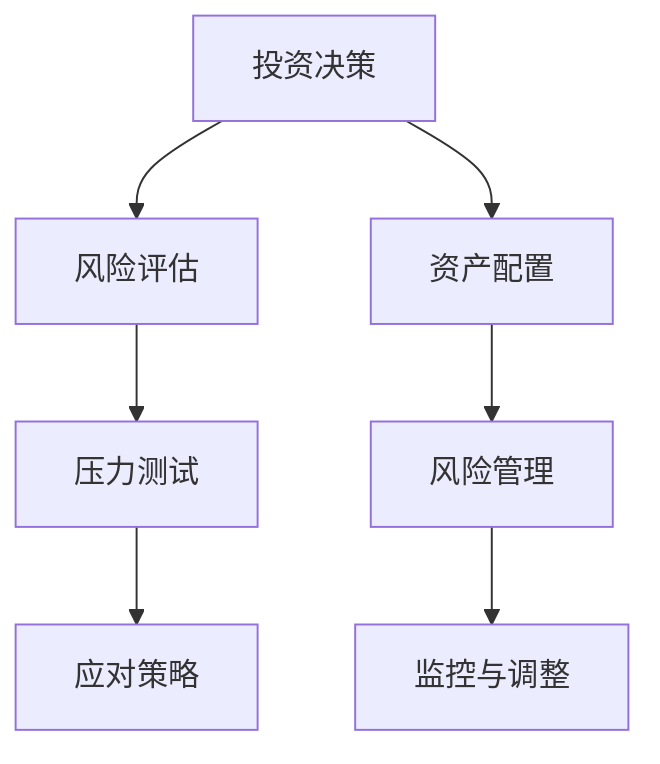
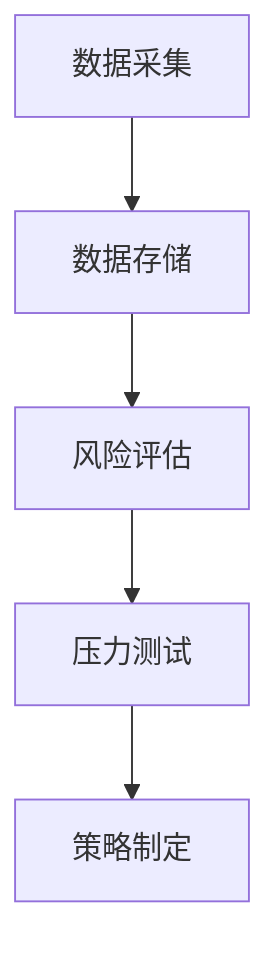

                 


# 芒格的"极端后果"思维：在投资中考虑最坏情况

> 关键词：芒格，极端后果思维，投资决策，风险管理，防御性投资

> 摘要：芒格的“极端后果”思维是一种以考虑最坏情况为核心的投资方法。本文从芒格的投资哲学出发，详细分析了极端后果思维的核心概念、数学模型、系统架构和实际应用，结合具体案例，探讨了如何通过极端后果思维在投资中规避风险、制定防御性策略。

---

# 第1章:芒格的生平与投资理念

## 1.1芒格的生平简介

### 1.1.1芒格的早年经历
查理·芒格（Charlie Munger）1924年出生于美国密苏里州，早年就读于哈佛大学法学院，后转学到加州大学伯克利分校，获得法律学位。他早期的职业生涯涉及法律和投资领域，逐渐形成了独特的投资哲学。

### 1.1.2芒格的伯克希尔 Hathaway 投资历程
1959年，芒格与沃伦·巴菲特（Warren Buffett）合作，开始管理伯克希尔·哈撒韦公司（Berkshire Hathaway）。芒格的投资理念帮助伯克希尔实现了从一家纺织公司向多元化投资公司的转型，奠定了其在全球投资界的地位。

### 1.1.3芒格的投资哲学与思想体系
芒格的投资哲学强调“逆向思维”和“安全边际”，即从反方向思考问题，并在投资中留出足够的安全空间以应对不确定性。他的思想体系强调跨学科思维，将心理学、经济学和决策科学融为一体。

---

## 1.2芒格的"极端后果"思维的来源

### 1.2.1芒格思维的形成背景
芒格的极端后果思维源于他对人类心理的深刻理解。他认为，投资者在决策中往往过于乐观，忽视了最坏情况的可能性。因此，他提出在投资前必须考虑最极端的负面场景。

### 1.2.2芒格对投资风险的思考
芒格认为，投资中的风险往往来自不可预见的极端事件。传统的投资分析通常假设市场是理性的，但现实中市场的非理性行为会导致极端后果。因此，投资者必须在决策中预留足够的安全边际。

### 1.2.3芒格"极端后果"思维的核心理念
芒格的极端后果思维强调，在投资前必须考虑最坏情况，并确保在最坏情况下依然能够生存和盈利。这种思维不仅适用于投资，也适用于其他决策领域。

---

## 1.3"极端后果"思维在投资中的重要性

### 1.3.1传统投资思维的局限性
传统投资思维通常基于对市场的乐观假设，忽视了极端情况的可能性。这种思维在市场正常运行时表现良好，但在极端情况下往往会导致重大损失。

### 1.3.2极端后果思维的优势与价值
极端后果思维的优势在于其防御性。通过考虑最坏情况，投资者能够提前制定应对策略，避免在极端情况下遭受重大损失。这种思维在风险管理中具有极高的价值。

### 1.3.3芒格投资理念的实际应用
芒格的极端后果思维在伯克希尔的投资实践中得到了广泛应用。例如，在2008年金融危机期间，伯克希尔通过持有优质资产和保守的资产负债表，成功抵御了市场的剧烈波动。

---

# 第2章:极端后果思维的核心概念

## 2.1极端后果思维的定义与特点

### 2.1.1极端后果思维的定义
极端后果思维是指在决策过程中，优先考虑最坏情况的可能性，并制定相应的应对策略。这种方法的核心在于通过考虑极端情况来优化决策。

### 2.1.2极端后果思维的核心特征
- **防御性**：极端后果思维强调防御性策略，确保在最坏情况下依然能够生存。
- **保守性**：这种方法要求投资者在决策中预留足够的安全空间，避免过度冒险。
- **全面性**：极端后果思维要求投资者全面考虑可能的风险因素，包括市场、行业和公司层面的风险。

### 2.1.3极端后果思维与其他投资策略的区别
与传统投资策略相比，极端后果思维更加注重风险管理和防御性策略。它不仅关注收益，更关注在极端情况下的 survivability（生存能力）。

---

## 2.2极端后果思维的决策框架

### 2.2.1风险评估与压力测试
极端后果思维的决策框架包括以下步骤：
1. **风险识别**：识别可能影响投资的所有风险因素。
2. **压力测试**：评估这些风险在极端情况下的影响。
3. **应对策略**：制定应对极端情况的策略。

### 2.2.2防御性投资策略
防御性投资策略的核心是通过分散投资、持有优质资产和保持足够的流动性来抵御极端风险。

### 2.2.3极端后果思维的数学模型

#### 2.2.3.1风险评估模型
风险评估模型用于量化投资的潜在风险。常见的风险评估模型包括 VaR（Value at Risk）和 CVaR（Conditional Value at Risk）。

#### 2.2.3.2压力测试模型
压力测试模型用于评估投资在极端市场条件下的表现。通过模拟极端市场环境，投资者可以评估其投资组合在最坏情况下的表现。

---

## 2.3极端后果思维的系统分析

### 2.3.1投资系统的构成要素
投资系统由以下几个要素构成：
1. **资产配置**：决定投资组合中各类资产的权重。
2. **风险管理**：通过分散投资和风险对冲来降低风险。
3. **监控与调整**：定期监控投资组合的表现，并根据市场变化进行调整。

### 2.3.2系统风险与非系统风险的区分
系统风险是整个市场或经济环境带来的风险，而非系统风险是特定于某个资产或行业的风险。极端后果思维要求投资者同时考虑系统风险和非系统风险。

### 2.3.3极端后果思维的系统架构图


---

# 第3章:极端后果思维在投资中的应用

## 3.1极端后果思维在市场周期中的应用

### 3.1.1市场周期的定义与特征
市场周期包括繁荣、衰退、萧条和复苏四个阶段。极端后果思维要求投资者在每个阶段都考虑最坏情况。

### 3.1.2极端后果思维在市场周期中的应用策略
1. **繁荣阶段**：避免过度乐观，控制杠杆。
2. **衰退阶段**：寻找被低估的资产，进行防御性投资。
3. **萧条阶段**：保持充足流动性，避免进一步损失。
4. **复苏阶段**：逐步增加投资，抓住反弹机会。

### 3.1.3典型市场周期案例分析
2008年金融危机就是一个典型的市场周期案例。极端后果思维的应用帮助伯克希尔在危机中保持了强大的资本实力。

---

## 3.2极端后果思维在行业风险中的应用

### 3.2.1行业风险的定义与分类
行业风险是指特定行业面临的独特风险，包括政策风险、技术风险和经济周期风险。

### 3.2.2极端后果思维在行业风险评估中的应用
1. **政策风险**：考虑政策变化对行业的潜在影响。
2. **技术风险**：评估技术变革对行业的影响。
3. **经济周期风险**：分析经济周期对行业的影响。

### 3.2.3行业风险案例分析
20世纪90年代的科技股泡沫就是一个典型案例。极端后果思维的应用帮助投资者避免了重大损失。

---

## 3.3极端后果思维在公司基本面分析中的应用

### 3.3.1公司基本面分析的核心要素
公司基本面分析的核心要素包括财务状况、管理层素质、行业地位和竞争优势。

### 3.3.2极端后果思维在公司基本面分析中的应用
1. **财务状况**：评估公司在极端情况下的偿债能力。
2. **管理层素质**：评估管理层在极端情况下的应对能力。
3. **行业地位**：评估公司在行业中的竞争力。
4. **竞争优势**：评估公司的核心竞争优势。

### 3.3.3公司基本面案例分析
2008年金融危机期间，极端后果思维帮助投资者避免了对低质量资产的投资，成功实现了资产保值。

---

# 第4章:极端后果思维的数学模型与算法原理

## 4.1极端后果思维的数学模型

### 4.1.1风险评估模型
风险评估模型用于量化投资的潜在风险。常见的风险评估模型包括 VaR 和 CVaR。

#### VaR模型
VaR（Value at Risk）是指在一定置信水平下，投资组合可能遭受的最大损失。例如，95%置信水平下的VaR表示在95%的概率下，投资组合的最大损失。

#### CVaR模型
CVaR（Conditional Value at Risk）是指在超过 VaR 的情况下，投资组合的平均损失。CVaR 比 VaR 更能反映极端情况下的损失。

### 4.1.2压力测试模型
压力测试模型用于评估投资在极端市场条件下的表现。常见的压力测试模型包括历史模拟法和蒙特卡洛模拟法。

#### 历史模拟法
历史模拟法通过回顾历史市场数据，评估投资在极端情况下的表现。

#### 蒙特卡洛模拟法
蒙特卡洛模拟法通过生成大量的随机市场情景，评估投资在极端情况下的表现。

---

## 4.2极端后果思维的算法原理

### 4.2.1风险评估算法
风险评估算法用于量化投资的潜在风险。常见的风险评估算法包括标准差、方差和协方差。

#### 标准差与方差
标准差和方差是衡量投资组合风险的常用指标。标准差表示投资收益的波动性，方差表示收益的离散程度。

#### 协方差
协方差用于衡量两个资产之间的相关性。正协方差表示资产之间正相关，负协方差表示负相关。

### 4.2.2压力测试算法
压力测试算法用于评估投资在极端市场条件下的表现。常见的压力测试算法包括极端值分析和情景分析。

#### 极端值分析
极端值分析通过识别数据中的极端值，评估其对投资组合的影响。

#### 情景分析
情景分析通过模拟不同市场情景，评估投资在极端情况下的表现。

---

## 4.3极端后果思维的数学公式

### 4.3.1 VaR公式
$$ \text{VaR} = \mu + z \cdot \sigma $$
其中，$\mu$ 是平均收益，$z$ 是对应于置信水平的 z 值，$\sigma$ 是收益的标准差。

### 4.3.2 CVaR公式
$$ \text{CVaR} = \frac{1}{1 - \alpha} \int_{\alpha}^{1} x f(x) dx $$
其中，$\alpha$ 是置信水平，$f(x)$ 是收益的概率密度函数。

### 4.3.3标准差公式
$$ \sigma = \sqrt{\frac{1}{n} \sum_{i=1}^{n} (x_i - \mu)^2} $$
其中，$x_i$ 是观察值，$\mu$ 是平均值，$n$ 是观察次数。

---

# 第5章:极端后果思维的系统架构与实现

## 5.1系统分析与架构设计

### 5.1.1系统功能设计
极端后果思维的投资系统需要具备以下功能：
1. **数据采集**：采集市场数据和公司基本面数据。
2. **风险评估**：评估投资的潜在风险。
3. **压力测试**：评估投资在极端情况下的表现。
4. **策略制定**：制定应对极端情况的策略。

### 5.1.2系统架构设计


### 5.1.3系统接口设计
系统接口设计包括数据接口和用户接口。数据接口用于与其他系统交换数据，用户接口用于与用户交互。

### 5.1.4系统交互设计
系统交互设计包括用户与系统的交互流程和界面设计。用户可以通过界面输入投资参数，系统根据参数生成风险评估和应对策略。

---

## 5.2极端后果思维的算法实现

### 5.2.1算法实现步骤
极端后果思维的算法实现步骤包括：
1. **数据采集**：采集市场数据和公司基本面数据。
2. **数据预处理**：对数据进行清洗和转换。
3. **风险评估**：计算投资的 VaR 和 CVaR。
4. **压力测试**：模拟极端市场情景，评估投资表现。
5. **策略制定**：根据评估结果制定应对策略。

### 5.2.2算法实现代码
以下是极端后果思维的算法实现代码：

```python
import numpy as np
import pandas as pd

def calculate VaR(data, confidence_level):
    # 计算 VaR
    sorted_data = np.sort(data)
    index = int(len(data) * confidence_level)
    VaR = sorted_data[index]
    return VaR

def calculate CVaR(data, confidence_level):
    # 计算 CVaR
    sorted_data = np.sort(data)
    index = int(len(data) * confidence_level)
    CVaR = np.mean(sorted_data[index:])
    return CVaR
```

---

## 5.3极端后果思维的项目实战

### 5.3.1环境安装
极端后果思维的项目实战需要安装以下环境：
1. Python 3.8 或更高版本。
2. NumPy 和 Pandas 库。

### 5.3.2核心代码实现
以下是极端后果思维的核心代码实现：

```python
import numpy as np
import pandas as pd

def extreme_consequences_thinking(data, confidence_level):
    # 计算 VaR
    sorted_data = np.sort(data)
    index = int(len(data) * confidence_level)
    VaR = sorted_data[index]
    
    # 计算 CVaR
    CVaR = np.mean(sorted_data[index:])
    
    return VaR, CVaR
```

### 5.3.3案例分析
以下是极端后果思维的案例分析：

```python
# 示例数据
data = np.random.normal(0, 1, 1000)
confidence_level = 0.95

# 计算 VaR 和 CVaR
VaR, CVaR = extreme_consequences_thinking(data, confidence_level)

print("VaR:", VaR)
print("CVaR:", CVaR)
```

---

## 5.4极端后果思维的项目小结

### 5.4.1项目总结
通过极端后果思维的系统架构与实现，我们可以有效地评估投资的风险，并制定应对极端情况的策略。

### 5.4.2注意事项
在实际应用中，需要注意数据的准确性和模型的适用性。同时，要定期更新模型，以应对市场的变化。

### 5.4.3拓展阅读
推荐阅读芒格的《Poor Charlie's Almanack》和巴菲特的《The Intelligent Investor》，以进一步理解极端后果思维的投资哲学。

---

# 第6章:极端后果思维的总结与展望

## 6.1总结

### 6.1.1极端后果思维的核心要点
极端后果思维的核心要点包括：
1. 考虑最坏情况。
2. 制定防御性策略。
3. 评估风险并制定应对策略。

### 6.1.2极端后果思维的应用价值
极端后果思维的应用价值在于其防御性策略和风险管理系统。通过考虑最坏情况，投资者可以避免重大损失，并在极端情况下保持投资组合的稳健。

---

## 6.2展望

### 6.2.1极端后果思维的未来发展
极端后果思维的未来发展将更加注重系统性和量化分析。随着人工智能和大数据技术的发展，极端后果思维将更加精准和高效。

### 6.2.2极端后果思维的未来挑战
极端后果思维的未来挑战包括数据的准确性和模型的适用性。同时，如何将极端后果思维应用于更多领域也是一个重要的课题。

---

# 第7章:极端后果思维的最佳实践与小结

## 7.1最佳实践

### 7.1.1极端后果思维的实践要点
1. 在投资前考虑最坏情况。
2. 制定防御性策略。
3. 定期评估和调整投资组合。

### 7.1.2极端后果思维的注意事项
1. 数据的准确性。
2. 模型的适用性。
3. 定期更新策略。

---

## 7.2小结

### 7.2.1极端后果思维的核心思想
极端后果思维的核心思想是在投资中考虑最坏情况，并制定相应的应对策略。这种方法不仅适用于投资领域，也适用于其他决策领域。

### 7.2.2极端后果思维的未来展望
随着技术的发展，极端后果思维将在更多领域得到应用，为投资者和决策者提供更加精准和有效的工具。

---

通过以上章节的详细分析，我们可以看到，芒格的“极端后果”思维是一种以考虑最坏情况为核心的投资方法。通过系统的分析和实际案例的分析，我们可以更好地理解极端后果思维的应用价值和实际操作方法。

