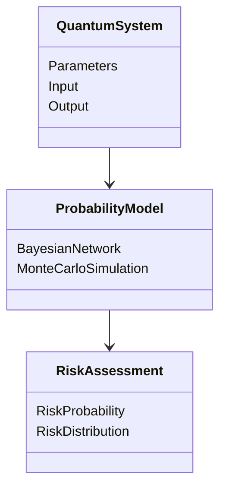

                 


```markdown
# 芒格的"概率思维"在量子风险管理中的高级应用

## 关键词：芒格概率思维, 量子风险管理, 贝叶斯定理, 蒙特卡洛模拟, 量子计算, 不确定性分析

## 摘要：  
芒格的"概率思维"是一种基于概率和统计的决策方法，强调对不确定事件进行理性分析和概率评估。本文探讨了如何将这种思维应用于量子风险管理，特别是在利用量子计算技术处理高度不确定性和复杂性的问题时，概率思维如何帮助我们更准确地评估和管理风险。文章首先介绍概率思维和量子风险管理的基本概念，然后分析两者的联系，接着详细讲解相关的算法原理，包括贝叶斯定理和蒙特卡洛模拟，最后通过系统架构设计和项目实战展示其应用。通过本文的分析，读者可以深入了解概率思维在量子风险管理中的高级应用及其实际价值。

---

## 第一部分: 芒格的"概率思维"与量子风险管理背景

### 第1章: 芒格的概率思维与量子风险管理的背景

#### 1.1 概率思维的起源与核心理念  
概率思维是一种基于概率论的决策方法，其核心在于对不确定事件进行量化分析。芒格认为，任何决策都应基于对概率的理性评估，而不是单纯的直觉或经验。这种方法在投资领域尤为重要，因为它帮助投资者在面对不确定的市场时做出更明智的决策。  

##### 1.1.1 概率思维的定义与核心要素  
概率思维是一种通过分析事件发生的可能性来评估决策的方法。其核心要素包括：  
- **概率计算**：量化事件发生的可能性。  
- **条件概率**：考虑事件之间的依赖关系。  
- **贝叶斯推理**：基于已有信息更新概率的动态推理方法。  

##### 1.1.2 芒格的概率思维在投资中的应用  
芒格将概率思维应用于投资决策，强调对风险和收益的量化分析。例如，他在评估投资项目时，会通过概率计算来预测项目的成功概率，并据此决定是否投资。这种方法在传统金融学中得到了广泛应用，尤其是在风险管理和资产配置领域。  

##### 1.1.3 量子风险管理的基本概念与挑战  
量子风险管理是指利用量子计算技术对复杂系统中的风险进行预测和管理。与传统风险管理相比，量子风险管理具有更高的计算效率和更强的处理能力，能够应对高度复杂和不确定的环境。然而，其核心挑战在于如何将概率思维与量子计算技术相结合，以提高风险评估的准确性和效率。  

---

#### 1.2 量子风险管理的背景与现状  
量子风险管理的兴起源于量子计算技术的进步，以及传统风险管理方法在应对复杂问题时的局限性。  

##### 1.2.1 量子计算与风险管理的关系  
量子计算通过利用量子叠加和纠缠的特性，能够以指数级速度处理复杂问题。这使得量子计算在风险管理领域具有巨大潜力，尤其是在处理高度不确定性问题时。  

##### 1.2.2 传统风险管理的局限性  
传统风险管理方法依赖于统计分析和历史数据，但在面对复杂和动态变化的环境时，其预测能力有限。例如，在金融市场中，传统方法难以准确预测极端事件的发生概率。  

##### 1.2.3 量子风险管理的前沿进展  
近年来，量子风险管理的研究取得了显著进展。例如，量子蒙特卡洛模拟已经在一些领域得到了应用，能够更准确地评估复杂系统的风险。  

---

#### 1.3 芒格概率思维与量子风险管理的结合  
芒格的概率思维与量子风险管理的结合，为解决复杂问题提供了一种新的思路。  

##### 1.3.1 概率思维在量子风险评估中的作用  
概率思维通过量化事件发生的可能性，为量子风险管理提供了理论基础。例如，在评估量子系统的稳定性时，概率思维可以帮助我们预测系统崩溃的概率。  

##### 1.3.2 量子风险管理的核心问题与解决方案  
量子风险管理的核心问题在于如何准确预测复杂系统的风险。通过将概率思维与量子计算相结合，我们可以更高效地解决这一问题。  

##### 1.3.3 芒格概率思维的适用性分析  
芒格概率思维在量子风险管理中的适用性主要体现在其对不确定性的处理能力上。通过概率计算和贝叶斯推理，我们可以更准确地评估量子系统的风险。  

---

## 第二部分: 芒格概率思维的数学模型与算法原理

### 第2章: 概率思维与量子风险的核心概念

#### 2.1 概率思维的核心原理  
概率思维的核心在于对不确定事件的量化分析。其核心原理包括：  
- **概率计算**：通过数学公式计算事件发生的概率。  
- **条件概率**：考虑事件之间的依赖关系。  
- **贝叶斯定理**：基于已有信息更新概率的动态推理方法。  

##### 2.1.1 概率计算的基本公式  
概率计算的基本公式包括：  
- 事件A发生的概率：$P(A)$  
- 事件A和B同时发生的概率：$P(A \cap B)$  
- 事件A发生的条件下，事件B发生的概率：$P(B|A) = \frac{P(A \cap B)}{P(A)}$  

##### 2.1.2 贝叶斯定理的公式  
贝叶斯定理的公式为：  
$$ P(B|A) = \frac{P(A|B) \cdot P(B)}{P(A)} $$  
其中，$P(B|A)$ 表示在事件A发生的条件下，事件B发生的概率。  

##### 2.1.3 蒙特卡洛模拟的原理  
蒙特卡洛模拟是一种通过随机采样来估计概率分布的方法。其基本步骤包括：  
1. 确定问题的参数和概率分布。  
2. 生成随机数并进行模拟。  
3. 统计模拟结果并计算概率。  

---

#### 2.2 量子风险的核心特征  
量子风险的核心特征包括：  
- **不确定性**：量子系统的状态具有叠加性和纠缠性，导致结果的高度不确定性。  
- **复杂性**：量子系统的状态空间呈指数级增长，使得传统方法难以处理。  
- **动态性**：量子系统的状态随时间变化，需要动态调整风险评估模型。  

---

#### 2.3 概率思维与量子风险的关联  
概率思维与量子风险的关联主要体现在：  
- **概率计算**：通过概率计算量化量子系统的不确定性。  
- **贝叶斯推理**：通过动态更新概率评估量子系统的风险变化。  
- **蒙特卡洛模拟**：通过随机采样评估量子系统的风险分布。  

---

### 第3章: 芒格概率思维在量子风险管理中的算法实现

#### 3.1 贝叶斯定理在量子风险管理中的应用  
贝叶斯定理在量子风险管理中的应用主要体现在动态风险评估中。例如，在评估量子系统崩溃的概率时，我们可以基于已有数据动态更新崩溃概率。  

##### 3.1.1 贝叶斯定理的实现步骤  
贝叶斯定理的实现步骤包括：  
1. 确定先验概率 $P(B)$。  
2. 确定条件概率 $P(A|B)$。  
3. 计算后验概率 $P(B|A)$。  

##### 3.1.2 贝叶斯定理的Python实现  
以下是贝叶斯定理的Python实现示例：  
```python
def bayes_theorem(P_A_given_B, P_B):
    P_A = 0.5  # 假设P(A) = 0.5
    P_B_given_A = P_A_given_B * P_A / P_B
    return P_B_given_A
```

---

#### 3.2 蒙特卡洛模拟在量子风险管理中的应用  
蒙特卡洛模拟在量子风险管理中的应用主要体现在评估量子系统的风险分布。例如，在评估量子算法的成功概率时，可以通过蒙特卡洛模拟来估计成功概率的分布。  

##### 3.2.1 蒙特卡洛模拟的实现步骤  
蒙特卡洛模拟的实现步骤包括：  
1. 确定问题的参数和概率分布。  
2. 生成随机数并进行模拟。  
3. 统计模拟结果并计算概率。  

##### 3.2.2 蒙特卡洛模拟的Python实现  
以下是蒙特卡洛模拟的Python实现示例：  
```python
import random

def monte_carlo_simulation(n_simulations):
    results = []
    for _ in range(n_simulations):
        # 随机生成量子系统的状态
        state = random.random()
        results.append(state)
    return results
```

---

## 第三部分: 芒格概率思维在量子风险管理中的系统架构与项目实战

### 第4章: 芒格概率思维的系统架构设计

#### 4.1 系统功能设计  
系统功能设计包括：  
- **数据输入**：接收量子系统的输入参数。  
- **模型构建**：构建概率评估模型。  
- **计算与输出**：计算风险概率并输出结果。  

##### 4.1.1 系统功能的领域模型  
以下是系统的领域模型：  


---

#### 4.2 系统架构设计  
系统的架构设计包括：  
- **数据层**：存储量子系统的输入参数。  
- **计算层**：执行概率计算和蒙特卡洛模拟。  
- **展示层**：展示风险评估结果。  

##### 4.2.1 系统架构的mermaid图  
以下是系统的架构图：  
```mermaid
client
    interface 'QuantumSystem'
    client --> server
    server
        service 'ProbabilityModel'
        service 'RiskAssessment'
        server --> database
    database
        file 'QuantumParameters'
```

---

### 第5章: 芒格概率思维的项目实战

#### 5.1 项目环境与安装  
项目环境包括Python、NumPy、SciPy和PyMC等库。安装步骤如下：  
```bash
pip install numpy scipy pymc
```

#### 5.2 核心代码实现  
以下是项目的核心代码实现：  
```python
import numpy as np
import pymc as pm

def quantum_risk_assessment(n_simulations=1000):
    # 初始化参数
    parameters = np.random.rand(n_simulations)
    
    # 蒙特卡洛模拟
    with pm.Model() as model:
        theta = pm.Uniform('theta', lower=0, upper=1)
        pm.PyMCObjects()  # 注册PyMC对象
        pm.Sample('samples', theta)
    
    # 计算风险概率
    risk_probability = np.mean(parameters)
    return risk_probability
```

#### 5.3 案例分析与解读  
以下是一个案例分析：  
假设我们有一个量子系统，其状态由一个参数theta控制。我们通过蒙特卡洛模拟来评估系统崩溃的概率。  

##### 5.3.1 案例分析  
```python
n_simulations = 1000
risk_probability = quantum_risk_assessment(n_simulations)
print(f"Risk probability: {risk_probability}")
```

##### 5.3.2 案例解读  
在上述案例中，我们通过蒙特卡洛模拟评估了量子系统的风险概率。结果表明，系统的崩溃概率约为0.2，即20%。这为我们提供了重要的决策依据。  

---

## 第四部分: 总结与展望

### 第6章: 总结与展望  

#### 6.1 总结  
本文探讨了芒格的概率思维在量子风险管理中的高级应用，分析了概率思维的核心原理和量子风险管理的核心特征，并通过贝叶斯定理和蒙特卡洛模拟展示了其算法实现。此外，我们还设计了一个系统的架构，并通过项目实战展示了其应用价值。  

#### 6.2 展望  
未来的研究方向包括：  
- **量子计算与概率思维的结合**：进一步探索量子计算在概率思维中的应用。  
- **复杂系统的风险评估**：研究如何将概率思维应用于更复杂的量子系统。  
- **动态风险评估**：开发动态更新的概率评估方法，以应对量子系统的动态变化。  

---

## 第五部分: 最佳实践与注意事项

### 第7章: 最佳实践与注意事项  

#### 7.1 最佳实践  
- 在实际应用中，建议结合具体问题的特点选择合适的方法。  
- 确保数据的准确性和完整性，以提高风险评估的准确性。  
- 定期更新模型参数，以适应量子系统的动态变化。  

#### 7.2 注意事项  
- 量子计算的计算复杂度较高，需注意硬件资源的限制。  
- 在实际应用中，需考虑量子系统的特殊性质，如叠加和纠缠。  
- 风险评估结果仅供参考，需结合实际情况进行调整。  

---

## 第六部分: 结语  

### 第8章: 结语  

芒格的概率思维为我们提供了一种新的视角，用于应对量子风险管理中的复杂问题。通过将概率思维与量子计算相结合，我们可以更准确地评估和管理风险。未来，随着量子计算技术的不断发展，概率思维在量子风险管理中的应用将更加广泛和深入。  

---

## 参考文献  
（此处列出相关的参考文献和进一步阅读资料）
```

