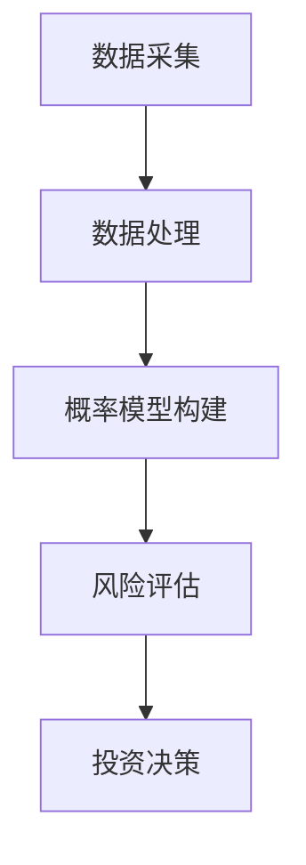

                 


# 芒格的"概率思维"在风险投资组合管理中的高级应用

---

## 关键词  
概率思维、投资组合管理、风险评估、贝叶斯定理、芒格投资理念

---

## 摘要  
本文深入探讨了芒格的"概率思维"在风险投资组合管理中的高级应用。通过结合概率论、统计学和投资学的原理，分析了概率思维在投资决策、风险评估和资产配置中的重要性。文章从概率思维的核心概念出发，逐步展开其在投资组合管理中的实际应用，包括贝叶斯定理在投资决策中的应用、概率分布模型在风险评估中的作用，以及如何利用概率思维优化投资组合的收益与风险平衡。最后，本文还结合实际案例，探讨了概率思维在投资组合管理中的高级策略。

---

## 第1章：概率思维与投资组合管理概述

### 1.1 芒格的概率思维简介  
芒格的"概率思维"是其投资理念的核心之一。他强调，投资者应以概率的角度看待市场和资产，通过分析各种可能的结果和其概率分布，制定最优的投资策略。  
- **1.1.1 芒格的概率思维核心理念**  
  芒格认为，投资的本质是通过概率思维来降低不确定性，寻找具有较高概率的"安全边际"。  
- **1.1.2 投资组合管理的基本概念**  
  投资组合管理是指通过科学的方法构建和调整资产组合，以实现收益最大化和风险最小化的目标。  

### 1.2 概率思维的核心概念  
- **1.2.1 概率的基本定义与特性**  
  概率是对某一事件发生可能性的度量，其取值范围在0到1之间。  
- **1.2.2 投资中的概率分布类型**  
  常见的概率分布包括正态分布、泊松分布和幂律分布等，不同的分布类型对应不同的风险特征。  
- **1.2.3 投资组合风险与收益的数学模型**  
  通过概率分布模型，可以量化投资组合的期望收益和风险（如方差和标准差）。

---

## 第2章：概率思维的核心原理与数学模型

### 2.1 贝叶斯定理与投资决策  
贝叶斯定理是一种用于更新概率的数学工具，广泛应用于投资决策中。  
- **2.1.1 贝叶斯定理的基本原理**  
  贝叶斯定理公式为：$$ P(A|B) = \frac{P(B|A) \cdot P(A)}{P(B)} $$  
  其中，$P(A|B)$ 表示在事件B发生的条件下，事件A发生的概率。  
- **2.1.2 贝叶斯定理在投资中的应用**  
  例如，投资者可以通过贝叶斯定理更新对某只股票未来表现的预期概率。

### 2.2 大数定律与概率分布  
大数定律指出，随着样本数量的增加，样本均值会趋近于总体均值。  
- **2.2.1 大数定律的定义与应用**  
  在投资组合管理中，大数定律为风险分散提供了理论基础。  
- **2.2.2 常见概率分布模型**  
  正态分布常用于描述资产收益，而幂律分布则适用于描述极端事件的概率。

### 2.3 期望值与风险调整后的收益  
- **2.3.1 期望值的计算方法**  
  期望值公式为：$$ E[X] = \sum_{i=1}^{n} P_i \cdot X_i $$  
  其中，$P_i$ 是第$i$种结果发生的概率，$X_i$ 是对应的结果值。  
- **2.3.2 风险调整后的收益模型**  
  风险调整后的收益可以通过减去风险溢价来计算。

---

## 第3章：概率思维在投资组合管理中的应用

### 3.1 投资组合优化与概率思维  
- **3.1.1 现代投资组合理论（MPT）与概率思维的结合**  
  MPT通过概率模型优化资产配置，以实现风险最小化下的收益最大化。  
- **3.1.2 概率分布与资产配置**  
  通过分析不同资产的收益概率分布，投资者可以优化资产配置比例。

### 3.2 风险评估与概率模型  
- **3.2.1 风险分类与概率评估**  
  风险可以分为市场风险、信用风险等，每种风险都有其概率分布特征。  
- **3.2.2 蒙特卡洛模拟在风险评估中的应用**  
  蒙特卡洛模拟是一种基于概率分布的随机模拟方法，用于评估投资组合在不同情景下的表现。

### 3.3 投资决策中的概率思维  
- **3.3.1 投资标的筛选与概率分析**  
  通过概率思维分析标的的基本面和技术面，评估其上涨和下跌的概率。  
- **3.3.2 投资组合的动态调整**  
  根据市场变化和概率模型的更新，动态调整投资组合的配置。

---

## 第4章：概率思维的高级应用与系统架构

### 4.1 概率思维与机器学习  
- **4.1.1 机器学习在概率评估中的应用**  
  使用机器学习算法预测资产收益的概率分布。  
- **4.1.2 概率模型的优化与改进**  
  通过机器学习技术提高概率模型的精度和效率。

### 4.2 系统架构设计  
- **4.2.1 系统功能设计**  
  包括数据采集、概率模型构建、风险评估和投资决策模块。  
- **4.2.2 系统架构图**  
  使用Mermaid绘制系统架构图，展示各模块之间的关系。

### 4.3 项目实战与代码实现  
- **4.3.1 项目环境安装**  
  需要安装Python、Pandas、NumPy等工具。  
- **4.3.2 核心代码实现**  
  使用Python实现贝叶斯定理和蒙特卡洛模拟的代码。  
- **4.3.3 案例分析**  
  通过具体案例展示概率思维在投资组合管理中的应用。

---

## 第5章：总结与展望

### 5.1 最佳实践 tips  
- 定期更新概率模型，根据市场变化调整投资策略。  
- 结合机器学习和大数据技术，提高概率模型的精度。

### 5.2 小结  
芒格的"概率思维"为投资组合管理提供了科学的方法论，通过概率模型和数学工具，投资者可以更好地应对市场的不确定性，实现收益与风险的最优平衡。

### 5.3 注意事项  
- 概率模型的结果仅供参考，实际投资需结合市场环境和具体情况进行判断。  
- 避免过度依赖概率模型，忽略基本面分析的重要性。

### 5.4 拓展阅读  
推荐阅读《Fooled by Randomness》和《The Intelligent Investor》等书籍，深入理解概率思维在投资中的应用。

---

## 附录：相关代码与工具

### 附录A：概率模型代码示例  
```python
import numpy as np
import matplotlib.pyplot as plt

# 生成正态分布随机数
mu = 0
sigma = 1
n = 1000
data = np.random.normal(mu, sigma, n)

# 绘制概率密度函数图
plt.hist(data, bins=20, density=True, alpha=0.6, color='b')
plt.xlabel('Value')
plt.ylabel('Probability Density')
plt.title('Normal Distribution')
plt.show()
```

### 附录B：系统架构图  


---

通过以上目录结构，本文将系统地介绍芒格的概率思维在风险投资组合管理中的高级应用，结合理论、算法和实际案例，帮助读者深入理解并掌握这一投资理念的核心思想和实践方法。

