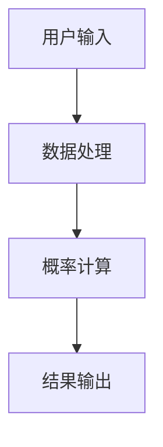
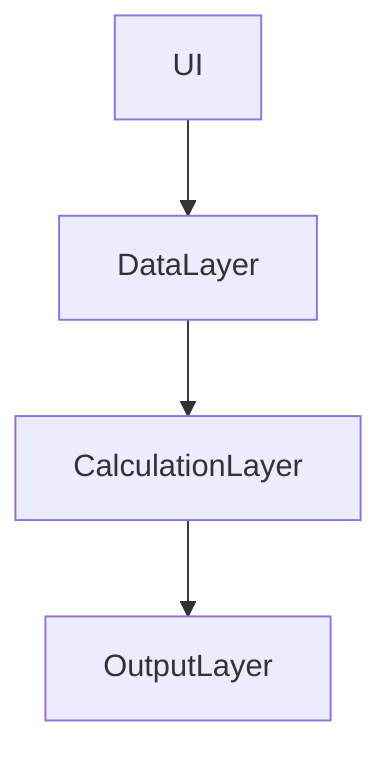
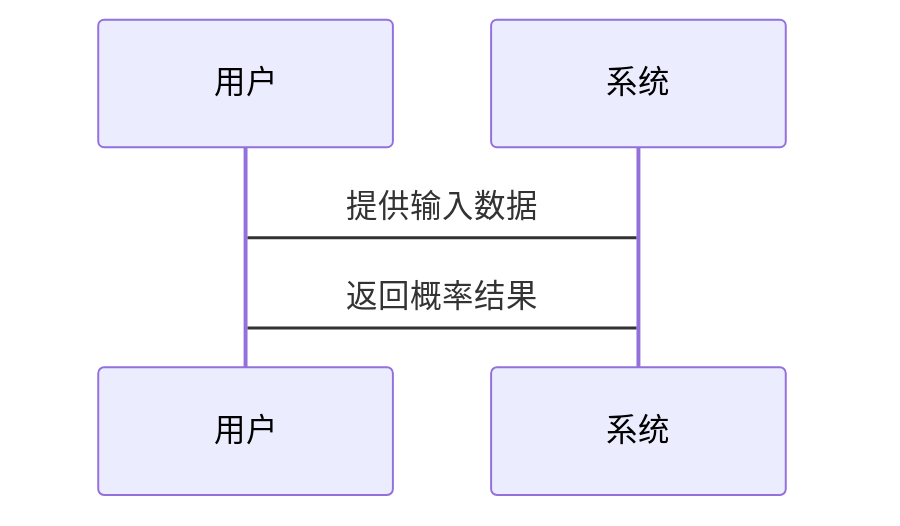

                 


# 芒格的"概率思维"：在不确定性中做出明智决策

## 关键词：概率思维、芒格、贝叶斯定理、蒙特卡洛模拟、决策模型、不确定性

## 摘要：芒格的概率思维是一种通过数学原理和实际案例分析，在不确定性中做出明智决策的方法。本文将从概率思维的背景、核心概念、算法实现、系统架构设计以及项目实战等方面进行详细阐述，帮助读者掌握如何在不确定环境中应用概率思维进行有效决策。

---

# 第1章: 芒格的概率思维基础

## 1.1 概率思维的起源

### 1.1.1 概率论的基本概念

概率论是研究随机现象的数学工具，其核心在于通过数学模型描述不确定性。概率思维是一种基于概率论的思维方式，通过分析事件发生的可能性来辅助决策。

### 1.1.2 芒格的概率思维思想

芒格将概率思维应用于投资和生活决策中，强调通过分析事件的可能结果及其概率分布，来评估不同选择的潜在风险和收益。

### 1.1.3 概率思维在决策中的重要性

在不确定性环境中，概率思维帮助我们量化风险，评估可能结果，从而做出更明智的决策。例如，在投资决策中，概率思维可以帮助投资者评估不同投资组合的潜在收益和风险。

---

# 第2章: 概率思维的核心概念与数学基础

## 2.1 概率的基本原理

### 2.1.1 概率空间的定义

概率空间由样本空间、事件和概率测度组成。样本空间是所有可能结果的集合，事件是样本空间的子集，概率测度将概率分配给每个事件。

### 2.1.2 独立事件与条件概率

独立事件是指一个事件的发生不影响另一个事件的概率。条件概率是指在给定某个事件发生的条件下，另一个事件发生的概率。

### 2.1.3 贝叶斯定理的数学公式

贝叶斯定理描述了在已知条件下，事件的后验概率如何计算。其公式为：

$$P(A|B) = \frac{P(B|A)P(A)}{P(B)}$$

其中，$P(A|B)$ 是在事件B发生的条件下，事件A发生的概率。

## 2.2 概率思维的核心要素

### 2.2.1 概率分布的类型

概率分布可以分为离散型和连续型。离散型分布如二项分布，连续型分布如正态分布。

### 2.2.2 随机变量与概率密度函数

随机变量是概率空间中的函数，概率密度函数描述了随机变量的概率分布。

### 2.2.3 芝诺悖论与概率的哲学思考

芝诺悖论通过无限分割的距离，提出了概率的哲学问题，即如何在无限可能性中做出决策。

---

# 第3章: 芒格的概率思维与决策模型

## 3.1 芒格决策模型的构建

### 3.1.1 概率树的构建方法

概率树是一种展示所有可能结果及其概率的工具，通常用于投资决策和风险评估。

### 3.1.2 贝叶斯网络的构建与应用

贝叶斯网络是一种有向无环图，用于表示变量之间的依赖关系，并计算后验概率。

### 3.1.3 芒格决策模型的数学表达

通过概率树和贝叶斯网络，芒格模型可以量化不同决策路径的概率和收益，帮助做出最优选择。

## 3.2 概率思维在实际决策中的应用

### 3.2.1 投资决策中的概率分析

在投资决策中，概率分析用于评估不同投资组合的潜在收益和风险。

### 3.2.2 管理决策中的概率模型

管理者可以利用概率模型评估不同决策的可能结果，优化资源配置。

### 3.2.3 日常生活中的概率思维

日常生活中的决策，如医疗诊断和旅行计划，都可以通过概率思维进行优化。

---

# 第4章: 概率思维的算法实现与代码解析

## 4.1 蒙特卡洛模拟的实现

### 4.1.1 蒙特卡洛模拟的原理

蒙特卡洛模拟是一种通过随机采样来估计概率分布的方法，常用于复杂系统的建模。

### 4.1.2 蒙特卡洛模拟的Python代码实现

以下是一个简单的蒙特卡洛模拟代码示例：

```python
import random

def monte_carlo_simulation(n):
    heads = 0
    for _ in range(n):
        if random.random() < 0.5:
            heads += 1
    return heads / n

print(monte_carlo_simulation(1000))
```

### 4.1.3 蒙特卡洛模拟的应用案例

蒙特卡洛模拟广泛应用于金融、物理等领域，用于估计系统的概率分布和风险评估。

## 4.2 贝叶斯定理的代码实现

### 4.2.1 贝叶斯定理的数学推导

贝叶斯定理通过已知条件概率计算后验概率，公式为：

$$P(A|B) = \frac{P(B|A)P(A)}{P(B)}$$

### 4.2.2 贝叶斯定理的Python代码实现

以下是一个简单的贝叶斯定理实现示例：

```python
def bayes_theorem(P_A, P_B_given_A, P_B):
    return (P_B_given_A * P_A) / P_B

P_A = 0.3
P_B_given_A = 0.7
P_B = 0.5

print(bayes_theorem(P_A, P_B_given_A, P_B))
```

### 4.2.3 贝叶斯定理的实际应用

贝叶斯定理广泛应用于机器学习、数据分析等领域，用于分类和预测。

---

# 第5章: 概率思维的系统分析与架构设计

## 5.1 概率思维系统的功能需求

### 5.1.1 系统功能模块划分

概率思维系统通常包括数据输入、概率计算、结果输出等功能模块。

### 5.1.2 系统功能流程图

使用mermaid流程图展示系统功能流程：



### 5.1.3 系统功能的实现方式

系统功能的实现需要结合具体应用场景，选择合适的算法和工具。

## 5.2 概率思维系统的架构设计

### 5.2.1 系统架构的模块划分

概率思维系统通常包括数据层、计算层和应用层。

### 5.2.2 系统架构的实现方式

使用mermaid架构图展示系统架构：



### 5.2.3 系统架构的优缺点分析

模块化设计提高了系统的可维护性和扩展性，但也增加了开发和维护成本。

## 5.3 系统接口设计和交互流程

### 5.3.1 系统接口设计

系统接口需要定义输入输出格式，确保模块之间的通信。

### 5.3.2 系统交互流程

使用mermaid序列图展示系统交互流程：



---

# 第6章: 概率思维的项目实战与案例分析

## 6.1 项目实战环境配置

### 6.1.1 开发环境的安装与配置

需要安装Python和相关库，如NumPy和Pandas。

### 6.1.2 数据集的获取与预处理

根据具体项目需求，获取相关数据集并进行预处理。

## 6.2 项目实战的代码实现

### 6.2.1 项目核心代码的实现

以下是概率思维项目的核心代码示例：

```python
import numpy as np
import pandas as pd

# 示例数据集
data = pd.DataFrame({
    '事件': ['A', 'A', 'B', 'B'],
    '概率': [0.3, 0.7, 0.2, 0.8]
})

# 概率计算
result = data.groupby('事件')['概率'].mean()

print(result)
```

### 6.2.2 代码的功能分析与解读

上述代码通过分组计算每个事件的平均概率，展示了如何利用概率思维进行数据分析。

## 6.3 项目实战

### 6.3.1 投资决策中的概率分析

假设我们有两个投资选项，分别计算它们的期望收益和风险。

### 6.3.2 案例分析与详细解读

通过具体案例分析，展示概率思维在实际项目中的应用和效果。

## 6.4 项目总结

概率思维项目实战帮助我们掌握了如何将理论应用于实际，提高了决策的科学性和准确性。

---

# 第7章: 总结与展望

## 7.1 概率思维的核心要点回顾

概率思维通过量化不确定性，帮助我们在决策中考虑各种可能的结果及其概率。

## 7.2 未来的发展方向

随着人工智能和大数据技术的发展，概率思维的应用将更加广泛和深入。

## 7.3 最佳实践 tips

- 保持对概率模型的持续学习和更新
- 在实际应用中结合具体情境调整模型参数
- 注意概率思维的局限性和适用范围

---

通过以上章节的详细阐述，我们深入探讨了芒格的概率思维及其在实际决策中的应用。希望读者能够通过本文，掌握概率思维的核心原理和实际应用，从而在不确定性中做出明智的决策。

