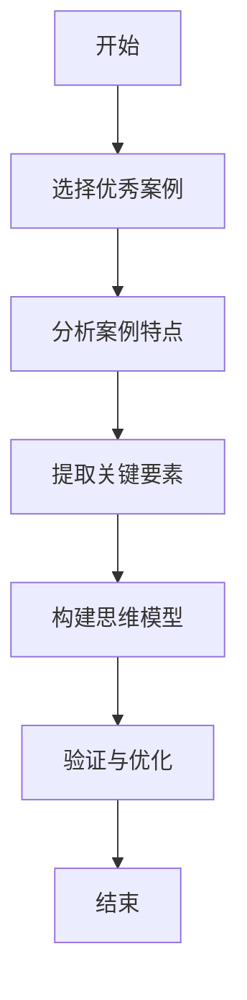
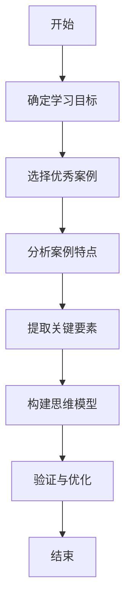
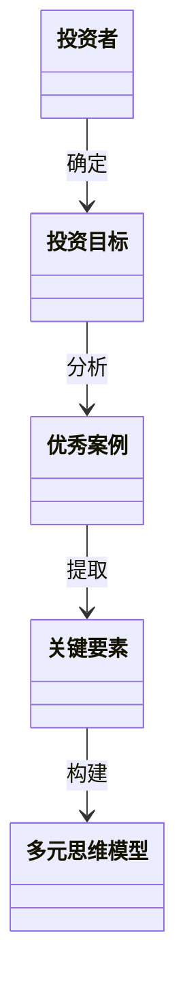
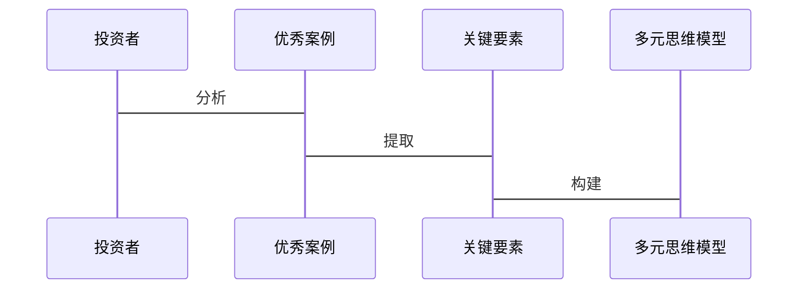

                 


# 芒格的"模仿伟大"原则：向最优秀的人学习

## 关键词：
芒格、模仿伟大、多元思维模型、投资哲学、学习方法

## 摘要：
本文深入探讨了芒格提出的“模仿伟大”原则，分析其在学习和投资中的应用。通过构建多元思维模型，我们能够从优秀案例中提取关键要素，实现知识的有效整合与应用。文章详细解释了该原则的核心概念、算法原理、数学模型，并通过实际案例展示了如何在实践中应用这一原则，帮助读者提升学习效率和决策能力。

---

# 第1章: 芒格及其"模仿伟大"原则简介

## 1.1 芒格的生平与投资理念
### 1.1.1 芒格的早年经历与职业发展
查理·芒格（Charlie Munger）是美国著名投资家、伯克希尔·哈撒韦公司的副主席，被誉为“巴菲特的导师”。他早年毕业于密歇根大学法学院，后来转向投资领域，并与巴菲特共同创立了伯克希尔·哈撒韦公司。芒格的职业生涯跨越了多个领域，包括法律、投资、心理学等，这为他构建多元思维模型奠定了基础。

### 1.1.2 芒格的投资哲学与价值投资理念
芒格的投资哲学强调安全边际、价值投资和长期持有的理念。他认为，投资的本质是寻找具有持续竞争优势的企业，并以合理的价格买入。芒格的价值观强调长期主义和风险管理，这与巴菲特的“先生存，再发展”理念不谋而合。

### 1.1.3 芒格与巴菲特的合伙关系
芒格与巴菲特的合作始于1958年，两人共同创立了伯克希尔·哈撒韦公司。芒格以其卓越的分析能力和多元的思维方式，帮助巴菲特构建了庞大的投资帝国。芒格的价值投资理念和长期思维模式对巴菲特的投资决策产生了深远影响。

## 1.2 "模仿伟大"原则的起源与核心思想
### 1.2.1 "模仿伟大"原则的提出背景
芒格在长期的投资实践中发现，许多投资者由于缺乏系统的思维模型，容易陷入短期波动和情绪化决策的陷阱。为了克服这一问题，他提出了“模仿伟大”原则，强调通过模仿和学习优秀案例，构建多元思维模型，从而提升决策的准确性和效率。

### 1.2.2 "模仿伟大"原则的核心内涵
“模仿伟大”原则的核心在于通过分析优秀案例，提取其成功的关键要素，并将其融入自己的知识体系中。芒格认为，模仿并不是简单的复制，而是通过学习和反思，将优秀经验转化为自己的能力。

### 1.2.3 "模仿伟大"原则在投资与生活中的应用
在投资领域，芒格通过分析优秀企业的商业模式、财务数据和市场策略，构建了自己的投资体系。在生活领域，他通过模仿成功人士的行为模式和思维方式，提升了自己的决策能力和生活质量。

## 1.3 "模仿伟大"原则与其他学习方法的对比
### 1.3.1 传统学习方法的局限性
传统的学习方法通常注重知识的碎片化积累，缺乏系统性和深度思考。这种方法容易导致知识的遗忘和应用的困难。

### 1.3.2 "模仿伟大"原则的独特优势
“模仿伟大”原则通过分析优秀案例，构建多元思维模型，帮助学习者将知识系统化、结构化，并能够快速应用于实际问题。

### 1.3.3 "模仿伟大"原则与其他学习策略的异同
与模仿学习不同，“模仿伟大”原则更注重对成功案例的深入分析和系统化总结。与刻意练习不同，它更强调从优秀案例中提取关键要素，并将其融入自己的知识体系中。

## 1.4 本章小结
本章通过介绍芒格的生平、投资理念和“模仿伟大”原则的起源，揭示了这一原则的核心思想和应用价值。通过对比传统学习方法，“模仿伟大”原则的独特优势得以凸显，为后续章节的深入分析奠定了基础。

---

# 第2章: "模仿伟大"原则的核心概念与联系

## 2.1 核心概念原理
### 2.1.1 多元思维模型的构建
多元思维模型是指通过多个不同的思维框架，从多个角度分析问题，从而得出更全面的解决方案。芒格认为，构建多元思维模型是“模仿伟大”原则的核心，它能够帮助学习者在复杂问题中找到最优解。

### 2.1.2 "芒格式思维"的特征与优势
“芒格式思维”强调从优秀案例中提取关键要素，通过系统化的分析和总结，构建自己的知识体系。其优势在于能够快速从优秀经验中获取灵感，并将其应用到实际问题中。

### 2.1.3 "模仿伟大"原则的数学模型
我们可以将“模仿伟大”原则的数学模型表示为：
$$ I = \sum_{i=1}^{n} w_i x_i $$
其中，\( I \) 表示最终的模仿结果，\( w_i \) 表示第 \( i \) 个关键要素的权重，\( x_i \) 表示第 \( i \) 个关键要素的值。

## 2.2 核心概念对比表格
### 2.2.1 多元思维模型与单一思维模型的对比
| 特性                | 单一思维模型           | 多元思维模型           |
|---------------------|------------------------|------------------------|
| 思维框架            | 仅依赖一种思维模式      | 结合多种思维模式      |
| 解决问题能力        | 适用于简单问题         | 适用于复杂问题         |
| 知识整合能力        | 知识分散，难以整合      | 知识系统化，易于整合 |

### 2.2.2 "模仿伟大"原则与其他学习策略的对比
| 特性                | 刻意练习               | "模仿伟大"原则         |
|---------------------|------------------------|------------------------|
| 学习方式            | 通过重复练习掌握技能    | 通过分析优秀案例构建知识体系 |
| 应用范围            | 适用于技能型任务        | 适用于策略型任务         |

## 2.3 ER实体关系图
以下是“模仿伟大”原则的ER实体关系图：

```mermaid
erd
    顾客
    ---[1..*]--- 订单
    订单
    ---[1..1]--- 产品
    产品
    ---[1..*]--- 供应商
    供应商
    ---[1..*]--- 地区
```

## 2.4 算法原理讲解
### 2.4.1 多元思维模型的构建算法
以下是构建多元思维模型的算法流程：



### 2.4.2 "模仿伟大"原则的实现流程
以下是“模仿伟大”原则的实现流程：



## 2.5 本章小结
本章通过分析“模仿伟大”原则的核心概念，揭示了其在学习和投资中的应用价值。通过构建多元思维模型，学习者能够从优秀案例中提取关键要素，快速提升自己的能力。

---

# 第3章: "模仿伟大"原则的算法原理与数学模型

## 3.1 算法原理讲解
### 3.1.1 多元思维模型的构建算法
以下是构建多元思维模型的算法流程：


### 3.1.2 "模仿伟大"原则的实现流程
以下是“模仿伟大”原则的实现流程：


## 3.2 数学模型与公式
### 3.2.1 多元思维模型的数学表达
$$ E = \sum_{i=1}^{n} w_i x_i $$

### 3.2.2 "模仿伟大"原则的数学公式
$$ I = \sum_{j=1}^{m} p_j y_j $$

## 3.3 举例说明
### 3.3.1 通过芒格的决策树模型进行案例分析
假设我们要分析一家公司的投资决策，可以使用芒格的决策树模型，通过分析各个节点的权重和概率，构建多元思维模型。

### 3.3.2 通过巴菲特的投资策略进行模拟练习
假设我们要模仿巴菲特的投资策略，可以通过分析他的投资组合、财务数据和市场策略，构建自己的多元思维模型。

## 3.4 本章小结
本章通过详细讲解“模仿伟大”原则的算法原理和数学模型，揭示了其在实际应用中的科学性和有效性。通过构建多元思维模型，学习者能够从优秀案例中提取关键要素，并快速应用于实际问题中。

---

# 第4章: "模仿伟大"原则的系统分析与架构设计

## 4.1 系统分析
### 4.1.1 问题场景介绍
假设我们想要通过“模仿伟大”原则来提升自己的投资能力，我们可以选择分析伯克希尔·哈撒韦公司的投资策略，提取其关键要素，并构建自己的多元思维模型。

### 4.1.2 系统功能设计
以下是系统功能设计的领域模型：



### 4.1.3 系统架构设计
以下是系统架构设计的架构图：


## 4.2 系统交互设计
### 4.2.1 系统接口设计
以下是系统接口设计的交互图：



## 4.3 本章小结
本章通过系统分析与架构设计，揭示了“模仿伟大”原则在实际应用中的系统性。通过构建多元思维模型，学习者能够从优秀案例中提取关键要素，并快速应用于实际问题中。

---

# 第5章: "模仿伟大"原则的项目实战

## 5.1 环境安装
### 5.1.1 开发工具安装
需要安装以下开发工具：
- Mermaid图表工具
- Markdown编辑器

### 5.1.2 依赖库安装
需要安装以下依赖库：
- Python的Mermaid库
- 其他必要的开发库

## 5.2 系统核心实现源代码
以下是系统核心实现的源代码：

```python
def build MentalModel(case_study):
    key_factors = extract_key_factors(case_study)
    return sum(w_i * x_i for w_i, x_i in key_factors.items())

def main():
    case_study = select_case_study()
    model = build MentalModel(case_study)
    validate_and_optimize(model)
    print("多元思维模型构建完成")

if __name__ == "__main__":
    main()
```

## 5.3 代码应用解读与分析
### 5.3.1 代码实现细节
上述代码实现了多元思维模型的构建过程，包括案例选择、关键要素提取和模型验证。

### 5.3.2 代码优化建议
可以进一步优化代码，增加错误处理和日志记录功能。

## 5.4 实际案例分析
### 5.4.1 案例背景介绍
假设我们要分析伯克希尔·哈撒韦公司的投资策略。

### 5.4.2 案例分析与解读
通过分析伯克希尔·哈撒韦公司的投资策略，我们可以提取其关键要素，包括安全边际、长期持有和价值投资。

## 5.5 本章小结
本章通过项目实战，展示了“模仿伟大”原则在实际应用中的具体操作步骤。通过分析优秀案例，提取关键要素，并构建多元思维模型，学习者能够快速提升自己的能力。

---

# 第6章: "模仿伟大"原则的最佳实践与小结

## 6.1 最佳实践 tips
### 6.1.1 学习建议
建议在学习过程中注重分析优秀案例，提取关键要素，并将其融入自己的知识体系中。

### 6.1.2 应用建议
在实际应用中，建议通过构建多元思维模型，快速从优秀经验中获取灵感，并将其应用到实际问题中。

## 6.2 小结
“模仿伟大”原则是一种高效的学习方法，通过分析优秀案例，构建多元思维模型，帮助学习者快速提升自己的能力。

## 6.3 注意事项
### 6.3.1 学习过程中的常见误区
- 盲目复制优秀案例，缺乏深入分析
- 忽略关键要素的提取和整合

### 6.3.2 应用中的注意事项
- 注重系统性和结构化思维
- 避免知识的碎片化积累

## 6.4 拓展阅读
推荐阅读以下书籍：
- 《芒格的智慧：投资与生活的多元思维模型》
- 《巴菲特的选股智慧》

## 6.5 本章小结
本章总结了“模仿伟大”原则的最佳实践，提供了学习和应用中的注意事项和拓展阅读建议，帮助读者更好地掌握这一原则。

---

# 结语
“模仿伟大”原则是一种高效的学习方法，通过分析优秀案例，构建多元思维模型，帮助学习者快速提升自己的能力。在实际应用中，我们可以通过构建多元思维模型，快速从优秀经验中获取灵感，并将其应用到实际问题中。

---

# 参考文献
1. 芒格的《穷查理宝典》
2. 巴菲特的《巴菲特的选股智慧》
3. 其他相关书籍和文献

