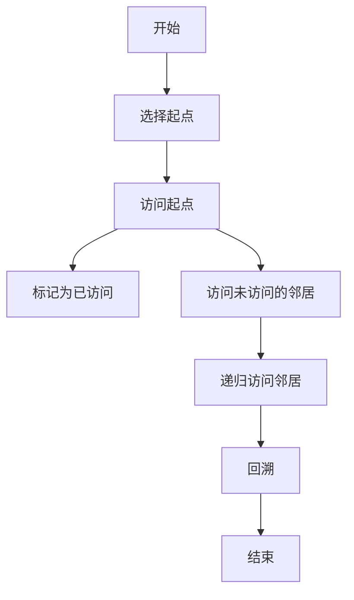
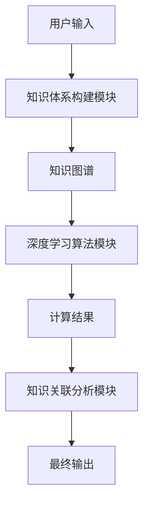
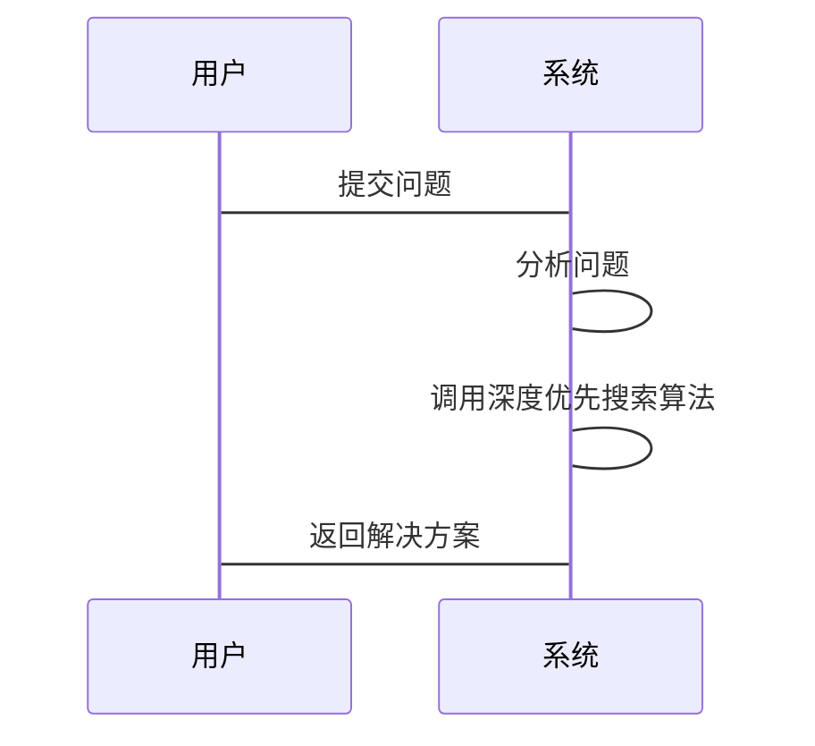

                 


# 芒格的"深度优先"学习在人工智能时代的重要性

---

## 关键词：
深度优先学习，人工智能，系统性思维，知识图谱，算法优化，教育技术

---

## 摘要：
芒格的深度优先学习方法是一种以系统性思维为核心的学习策略，通过层层深入的问题分析和知识关联，帮助学习者在复杂问题中找到关键节点。本文将从深度优先学习的定义、核心原理、算法实现、系统架构到项目实战，全面探讨其在人工智能时代的应用价值和重要性。通过结合认知科学、教育心理学和人工智能技术，文章揭示了深度优先学习如何帮助学习者应对AI时代的知识挑战，构建高效的学习体系。

---

### 目录：

# 引言

## 第1章：深度优先学习的定义与背景

### 1.1 深度优先学习的定义
深度优先学习是一种以系统性思维为核心的学习方法，强调从核心问题出发，层层深入，构建知识体系。与广度优先学习相比，深度优先学习更注重知识的深度理解和问题的系统性分析。

### 1.2 深度优先学习的核心要素
- **知识体系的构建**：通过层次化知识图谱，将知识点进行系统性整理和关联。
- **核心问题的深入挖掘**：找到问题的关键节点，进行深度分析和解决。
- **系统性思维的培养**：通过问题分解和关联分析，提升解决复杂问题的能力。

## 第2章：深度优先学习的理论基础

### 2.1 认知科学视角下的深度学习
认知科学告诉我们，深度学习不仅仅是记忆知识，而是对知识进行深度加工和整合。深度优先学习通过层次化知识图谱，帮助学习者构建更高效的知识网络。

### 2.2 教育心理学中的深度学习理论
深度学习理论强调对知识的深入理解和应用。深度优先学习通过系统性分析和问题解决，帮助学习者实现从浅层学习到深度学习的转变。

### 2.3 AI时代的学习需求变化
在AI时代，知识更新速度加快，复杂问题层出不穷。深度优先学习通过系统性思维和问题解决能力，帮助学习者应对这些挑战。

## 第3章：深度优先学习的算法与数学模型

### 3.1 深度优先搜索的算法流程
深度优先搜索是一种典型的算法，通过不断深入探索问题节点，找到解决方案。以下是深度优先搜索的算法流程：



### 3.2 深度优先学习的优化算法
为了提高效率，深度优先学习可以结合剪枝策略和分支限界法进行优化。以下是剪枝策略的代码示例：

```python
def depth_first_search_with_pruning(node):
    if node 是目标节点:
        return 解决方案
    for 每个邻居 in node的未访问邻居:
        if 邻居满足剪枝条件:
            continue
        结果 = depth_first_search_with_pruning(邻居)
        if 结果 不是 null:
            return 结果
    返回 null
```

## 第4章：深度优先学习的系统架构与设计

### 4.1 系统功能设计
深度优先学习系统主要包括以下几个模块：
- **知识体系构建模块**：负责知识的采集、整理和存储。
- **深度学习算法模块**：实现深度优先搜索算法。
- **知识关联分析模块**：分析知识点之间的关联关系。

### 4.2 系统架构设计
以下是系统的架构图：



## 第5章：深度优先学习的系统实现

### 5.1 系统接口设计
- **输入接口**：接收用户的问题输入。
- **知识库接口**：与知识图谱进行交互。
- **输出接口**：返回问题解决方案。

### 5.2 系统交互流程
以下是系统的交互流程图：



## 第6章：深度优先学习的项目实战

### 6.1 项目环境安装
需要安装以下Python库：
```bash
pip install networkx
pip install matplotlib
```

### 6.2 核心代码实现
以下是深度优先搜索的Python代码：

```python
import networkx as nx
import matplotlib.pyplot as plt

def depth_first_search(G, start_node):
    visited = set()
    path = []
    def dfs(node):
        if node not in visited:
            visited.add(node)
            path.append(node)
            for neighbor in G.neighbors(node):
                if neighbor not in visited:
                    dfs(neighbor)
    dfs(start_node)
    return path

G = nx.Graph()
G.add_edges_from([('A','B'), ('B','C'), ('C','D'), ('B','E'), ('E','F')])
start_node = 'A'
path = depth_first_search(G, start_node)
print(path)
```

### 6.3 案例分析
以解决复杂问题为例，展示深度优先学习如何帮助学习者构建知识体系。

### 6.4 项目总结
通过项目实战，验证了深度优先学习方法的有效性和实用性。

## 第7章：结论与展望

### 7.1 总结
深度优先学习是一种重要的学习方法，在AI时代具有重要意义。通过系统性思维和算法优化，深度优先学习可以帮助学习者应对复杂问题。

### 7.2 展望
未来，深度优先学习将与强化学习等技术结合，进一步提升学习效率和效果。

---

# 结语

芒格的深度优先学习方法在AI时代的重要性不容忽视。通过系统性思维、算法优化和知识图谱构建，深度优先学习为学习者提供了一种高效的学习策略。未来，随着技术的进步，深度优先学习将在更多领域发挥重要作用。

