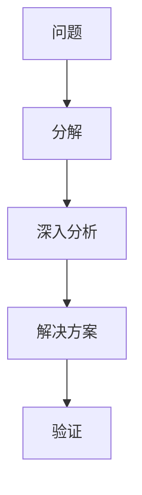
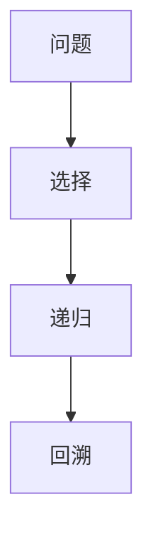
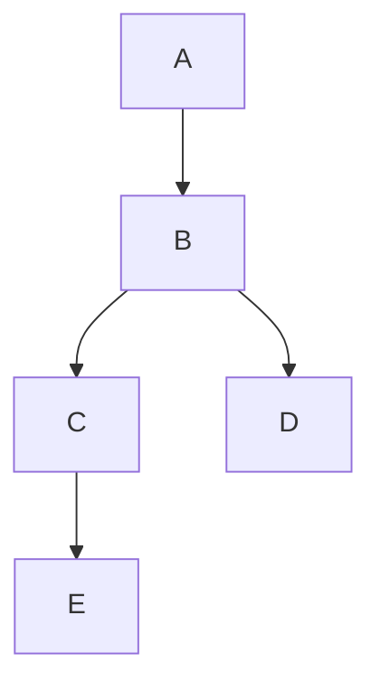
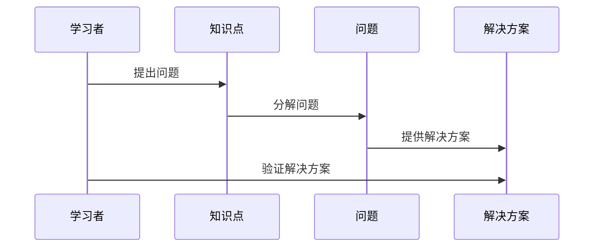

                 


# 深度优先学习的背景与核心概念

## 关键词：
深度优先学习，快速迭代，技术环境，芒格，学习方法，系统性思考

## 摘要：
本文探讨了芒格的深度优先学习方法在快速迭代技术环境中的重要性。通过分析深度优先学习的核心概念、算法原理、系统架构设计以及实际项目应用，本文揭示了该方法在技术快速变化的背景下如何帮助学习者和开发者高效地理解和掌握复杂知识。文章还提供了详细的代码示例、数学模型和系统设计图，帮助读者深入理解深度优先学习的实践应用。

---

## 第1章: 深度优先学习的起源与核心理念

### 1.1 深度优先学习的起源

深度优先学习（Depth-First Learning）是一种以问题为导向的学习方法，其核心理念是通过层层深入地分析问题，逐步构建知识体系。这种方法起源于认知科学和教育学领域，强调学习者在面对复杂问题时，不应仅仅停留在表面理解，而要深入挖掘问题的本质，建立系统的知识框架。

在技术快速迭代的环境中，传统的浅层学习方法往往难以应对知识的快速更新和技术的迅速变化。深度优先学习作为一种系统性更强的学习方法，能够帮助学习者在有限的时间内，快速掌握核心知识，并建立可持续的知识体系。

#### 1.1.1 学习方法的演进历程

- **传统学习方法**：以记忆和重复练习为主，注重知识点的表层理解。
- **主动学习方法**：强调通过问题导向和主动思考来构建知识体系。
- **深度优先学习方法**：在主动学习的基础上，进一步强调对问题的深度挖掘和系统性思考。

#### 1.1.2 芒格的深度优先学习理念

芒格（Charlie Munger）是深度优先学习的倡导者之一。他认为，学习的本质不是记忆事实，而是构建一个知识框架，并通过这个框架将零散的知识点连接起来。深度优先学习的核心理念可以总结为：

- **以问题为导向**：从一个具体的问题出发，逐步深入分析。
- **系统性思考**：将问题拆解为多个子问题，并逐一解决。
- **知识的深度连接**：通过不断追问“为什么”，将孤立的知识点连接成一个有机的整体。

#### 1.1.3 技术快速迭代环境下的学习挑战

在技术领域，知识的更新速度极快，新技术、新工具层出不穷。传统的浅层学习方法难以适应这种快速变化的环境。深度优先学习方法的优势在于，它能够帮助学习者在有限的时间内，快速掌握核心知识，并建立系统的知识框架，从而更好地应对技术的快速迭代。

---

### 1.2 深度优先学习的核心概念

深度优先学习的核心概念包括以下几个方面：

#### 1.2.1 核心概念的定义

- **问题导向**：从一个具体的问题出发，逐步深入分析。
- **系统性思考**：将问题拆解为多个子问题，并逐一解决。
- **深度挖掘**：通过不断追问“为什么”，挖掘问题的本质。

#### 1.2.2 核心概念的属性特征对比表格

| 概念 | 属性 | 描述 |
|------|------|------|
| 深度优先学习 | 核心理念 | 以问题为导向，层层深入 |
|        | 适用场景 | 技术快速迭代的环境 |
|        | 学习特点 | 强调系统性与深度思考 |

#### 1.2.3 ER实体关系图架构的 mermaid 流程图



---

### 1.3 深度优先学习与传统学习方法的对比

#### 1.3.1 传统学习方法的局限性

- **知识碎片化**：传统学习方法往往只关注知识点的表层理解，缺乏系统性。
- **适应性差**：在技术快速迭代的环境中，传统学习方法难以快速更新和调整。

#### 1.3.2 深度优先学习的优势

- **系统性**：深度优先学习强调对问题的系统性思考，能够帮助学习者建立系统的知识框架。
- **适应性**：通过深度挖掘问题的本质，深度优先学习能够更好地适应技术的快速变化。

#### 1.3.3 两种方法的对比分析

通过对比分析可以发现，深度优先学习在技术快速迭代的环境中具有显著优势。它不仅能够帮助学习者快速掌握核心知识，还能通过系统的知识框架，更好地应对技术的快速变化。

---

## 第2章: 深度优先学习的算法原理

### 2.1 算法原理概述

深度优先学习的算法原理可以类比于树的遍历算法，尤其是深度优先搜索（DFS）。其核心思想是通过不断深入地探索问题，逐步构建知识体系。

#### 2.1.1 贪心算法与回溯算法

- **贪心算法**：在每一步选择中，选择当前状态下的最优（或最差）选项，从而希望导致结果是全局最优的。
- **回溯算法**：一种通过试探法寻找问题的解的算法，通常用于解决组合优化问题。



### 2.2 算法实现

#### 2.2.1 Python源代码实现

```python
def depth_first_search(graph, start, visited=None):
    if visited is None:
        visited = set()
    visited.add(start)
    for neighbor in graph[start]:
        if neighbor not in visited:
            depth_first_search(graph, neighbor, visited)
    return visited
```

#### 2.2.2 算法原理的数学模型

$$T(n) = T(n-1) + O(1)$$
其中，$$T(n)$$表示深度优先搜索的时间复杂度。

#### 2.2.3 举例说明

假设我们有一个简单的图结构：



通过深度优先搜索，我们可以得到一个遍历顺序：A → B → C → E → D。

---

## 第3章: 深度优先学习的系统分析与架构设计

### 3.1 系统功能设计

深度优先学习的系统功能设计可以分为以下几个模块：

#### 3.1.1 领域模型 mermaid 类图


#### 3.1.2 系统架构设计 mermaid 架构图

```mermaid
archi
    组件1[学习者] --> 组件2[知识点]
    组件2 --> 组件3[问题]
    组件3 --> 组件4[解决方案]
```

#### 3.1.3 系统接口设计

- **输入接口**：学习者提出问题。
- **输出接口**：系统提供解决方案。

#### 3.1.4 系统交互 mermaid 序列图



---

## 第4章: 深度优先学习的项目实战

### 4.1 环境安装

#### 4.1.1 安装Python环境

```bash
python --version
pip install mermaid
```

#### 4.1.2 安装依赖库

```bash
pip install graphviz
```

### 4.2 核心代码实现

#### 4.2.1 深度优先搜索的实现

```python
def depth_first_search(graph, start):
    visited = set()
    stack = [start]
    visited.add(start)
    while stack:
        node = stack.pop()
        for neighbor in graph[node]:
            if neighbor not in visited:
                visited.add(neighbor)
                stack.append(neighbor)
    return visited
```

#### 4.2.2 代码功能解读

- **输入**：图结构和起始节点。
- **输出**：遍历结果。

### 4.3 实际案例分析

#### 4.3.1 案例背景

假设我们有一个简单的图结构：


#### 4.3.2 案例分析

使用深度优先搜索算法，我们可以得到一个遍历顺序：A → B → C → E → D。

---

## 第5章: 深度优先学习的最佳实践

### 5.1 小结

深度优先学习是一种以问题为导向的学习方法，通过层层深入地分析问题，逐步构建知识体系。其核心理念是通过系统性思考和深度挖掘，帮助学习者更好地应对技术的快速迭代。

### 5.2 注意事项

- **避免过度深入**：在实际应用中，需要注意避免过度深入某个问题，导致忽略其他重要的知识点。
- **结合实际场景**：深度优先学习需要结合实际场景，灵活调整学习策略。

### 5.3 拓展阅读

- **推荐书籍**：《深度思考：如何有效学习与工作》
- **推荐网站**：[Mermaid图表工具](https://mermaid-js.github.io/mermaid-live-editor/)

---

## 总结

深度优先学习在技术快速迭代的环境中具有重要的意义。通过系统性思考和深度挖掘，学习者可以更好地应对技术的快速变化，并建立可持续的知识体系。本文通过理论分析、算法实现和实际案例，全面探讨了深度优先学习的重要性和实践应用。

