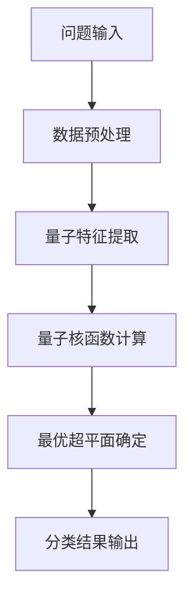
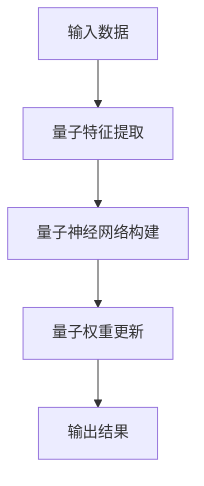
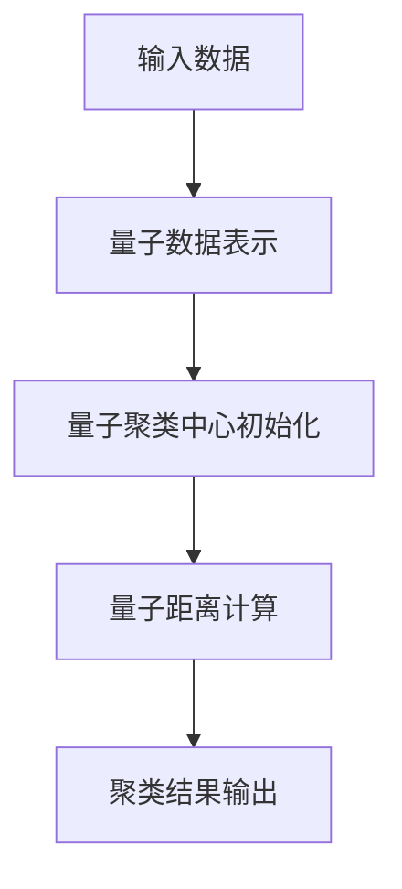
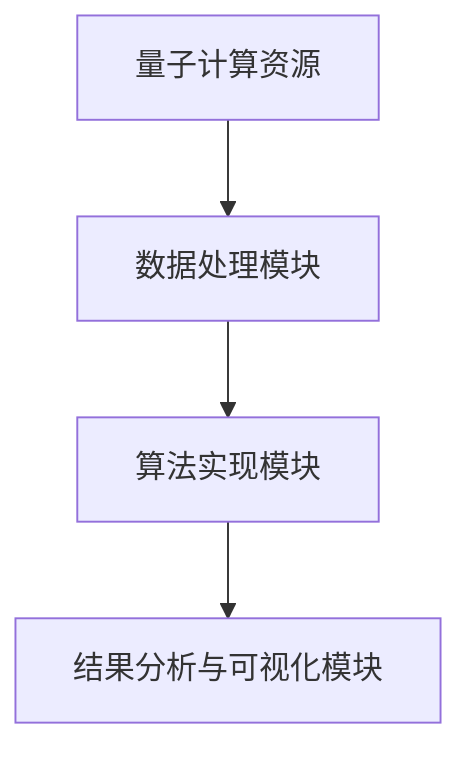

                 


# 芒格的"深度优先"学习在量子机器学习中的重要性

---

## 关键词：
- 深度优先学习
- 量子机器学习
- 量子计算
- 芒格学习方法
- 量子算法

---

## 摘要：
芒格的“深度优先”学习方法是一种系统性的学习策略，强调深入理解核心概念，并通过不断深入探讨问题来加强理解。本文探讨了这种方法在量子机器学习中的重要性，分析了其在算法设计、系统架构和复杂问题解决中的应用。通过具体案例，展示了深度优先学习如何帮助研究者高效地整合多学科知识，推动量子机器学习的发展。

---

## 第1章：芒格的“深度优先”学习方法

### 1.1 深度优先学习的定义与核心理念

深度优先学习（Depth-First Learning）是一种系统性的学习策略，强调从单一问题出发，深入探究其各个方面，直至彻底理解。与广泛涉猎表面知识的传统学习方法不同，深度优先学习注重构建坚实的知识基础，并通过不断深入探讨问题来加强理解。

**核心理念：**
1. **系统性思维**：从单一问题出发，逐步扩展到相关领域，形成系统性的知识网络。
2. **深入理解**：强调对核心概念的透彻理解，而非广泛覆盖表面知识。
3. **问题导向**：以解决问题为导向，注重将知识应用于实际场景。

### 1.2 深度优先学习与传统学习方式的对比

| 特性 | 深度优先学习 | 传统学习 |
|------|--------------|----------|
| 学习策略 | 系统性、深入 | 广泛性、浅层 |
| 知识结构 | 网络化、深度 | 树状、分散 |
| 学习效果 | 高效解决问题 | 知识覆盖面广 |

### 1.3 深度优先学习的实际应用

深度优先学习不仅适用于学术研究，还可应用于实际问题解决。例如，在软件开发中，通过深入理解问题本质，能够快速定位并解决复杂问题。在量子机器学习领域，这种学习方法帮助研究者高效地整合多学科知识，推动算法创新。

---

## 第2章：量子机器学习的基础

### 2.1 量子计算与量子机器学习的定义

量子计算利用量子叠加和纠缠的特性，能够在某些情况下比经典计算更高效。量子机器学习则是利用量子计算的优势，设计新的算法和模型，以解决复杂问题。

### 2.2 量子机器学习的核心算法

量子支持向量机、量子神经网络和量子聚类算法是量子机器学习中的核心算法。这些算法利用量子计算的优势，能够在某些任务上实现超越经典算法的性能。

### 2.3 量子机器学习的数学基础

量子机器学习的数学基础包括量子态的表示、量子测量和量子算法的复杂性分析。理解这些数学原理是应用深度优先学习方法的基础。

---

## 第3章：芒格学习方法与量子机器学习的结合

### 3.1 深度优先学习在量子算法设计中的应用

在设计量子算法时，深度优先学习方法帮助研究者从单一问题出发，逐步深入理解算法的各个方面。例如，在设计量子支持向量机时，研究者需要深入理解支持向量机的工作原理以及量子计算的特性，这种系统性学习方法能够帮助他们有效地结合两者的优势，设计出更高效的算法。

### 3.2 深度优先学习在量子数据处理中的应用

深度优先学习方法在量子数据处理中也表现出色。例如，在处理量子数据时，研究者需要深入理解量子数据的表示与操作，这种系统性学习方法能够帮助他们更好地处理量子数据，提高算法的性能。

### 3.3 深度优先学习在量子机器学习研究中的优势

深度优先学习方法在量子机器学习研究中具有显著优势。通过深入理解量子算法的核心概念，研究者能够更高效地设计和优化算法，提高研究效率。此外，深度优先学习方法还能够帮助研究者在跨学科领域中建立联系，促进创新性的解决方案。

---

## 第4章：量子机器学习的算法原理

### 4.1 量子支持向量机的算法原理

量子支持向量机是一种基于量子计算的支持向量机算法。通过利用量子叠加的特性，量子支持向量机能够在量子态空间中寻找最优解，从而实现高效的分类任务。

**算法流程图：**



### 4.2 量子神经网络的算法原理

量子神经网络是一种基于量子计算的神经网络算法。通过利用量子纠缠的特性，量子神经网络能够处理大规模数据，并在某些任务上实现超越经典神经网络的性能。

**算法流程图：**



### 4.3 量子聚类算法的实现

量子聚类算法是一种基于量子计算的聚类算法。通过利用量子叠加的特性，量子聚类算法能够快速找到数据中的聚类中心，并实现高效的聚类任务。

**算法流程图：**



---

## 第5章：量子机器学习的系统架构与项目实战

### 5.1 系统架构设计

量子机器学习系统的架构设计需要考虑量子计算资源、数据处理模块、算法实现模块和结果分析与可视化模块等多个方面。通过模块化设计和分层架构，可以实现系统的高效运行和扩展。

**系统架构图：**



### 5.2 项目实战

在实际项目中，研究者需要安装必要的量子计算和机器学习环境，编写量子算法的代码，并进行实验和分析。以下是量子支持向量机的核心实现代码：

```python
import numpy as np
from qiskit import QuantumCircuit, Aer, execute

def quantum_svm():
    # 数据预处理
    X = np.array([[x1, x2], ...])
    y = np.array([labels])
    
    # 量子特征提取
    feature_map = ...  # 定义量子特征映射
    
    # 量子核函数计算
    kernel_matrix = ...  # 计算核矩阵
    
    # 最优超平面确定
    support_vectors = ...  # 找出支持向量
    
    # 分类结果输出
    result = ...  # 输出分类结果
    return result
```

### 5.3 实际案例分析

通过具体案例分析，可以验证深度优先学习方法在量子机器学习中的有效性。例如，在量子聚类算法中，研究者通过深入理解量子数据的表示与操作，能够设计出更高效的算法，提高聚类的准确率。

---

## 第6章：总结与展望

### 6.1 总结

芒格的深度优先学习方法在量子机器学习中具有重要的应用价值。通过系统性的学习和深入理解核心概念，研究者能够更高效地设计和优化量子算法，推动量子机器学习的发展。

### 6.2 展望

未来，随着量子计算技术的不断发展，深度优先学习方法在量子机器学习中的应用将更加广泛。研究者需要继续探索深度优先学习与其他学习方法的结合，以实现更高效的算法设计和优化。

---

## 参考文献

- 量子计算与量子机器学习的相关研究论文
- 芒格的“深度优先”学习方法的理论书籍
- 相关技术博客和文章

---

通过以上分析，我们可以看到芒格的深度优先学习方法在量子机器学习中的重要性。通过系统性的学习和深入理解核心概念，研究者能够更高效地设计和优化量子算法，推动量子机器学习的发展。

