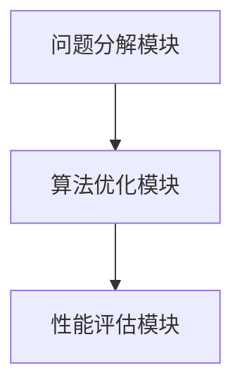

                 


# 芒格的"深度优先"学习在量子算法研发中的重要性

## 关键词：
- 芒格
- 深度优先学习
- 量子算法
- 量子计算
- 算法优化

## 摘要：
本文探讨了芒格的“深度优先”学习方法在量子算法研发中的重要性。通过分析深度优先学习的核心原理，结合量子算法的基本概念，展示了如何将深度优先学习策略应用于量子算法的研发过程中，以优化算法性能并解决复杂问题。文章从背景介绍、核心概念、算法原理、系统设计、项目实战等多方面展开，详细阐述了深度优先学习在量子算法中的应用及其带来的优势。

---

## 第1章: 引言

### 1.1 背景介绍
量子计算作为一项前沿技术，正在改变我们处理复杂问题的方式。量子算法通过利用量子叠加和量子纠缠等特性，能够在某些问题上远超经典算法的性能。然而，量子算法的设计和优化面临诸多挑战，需要一种系统化的方法来解决这些问题。

芒格的“深度优先”学习方法是一种以问题为导向的学习策略，强调深入理解和系统化思考。这种方法在量子算法研发中具有独特的优势，能够帮助研究者更高效地解决复杂问题。

### 1.2 问题背景与挑战
量子算法的研发涉及复杂的数学和物理原理，需要研究者具备深厚的知识储备和系统化的思考能力。传统的学习方法往往注重广度而非深度，难以应对量子算法研发中的复杂问题。因此，采用深度优先学习策略，能够帮助研究者更好地理解和优化量子算法。

### 1.3 研究意义
本文旨在探讨深度优先学习在量子算法研发中的应用，分析其在算法设计、优化和问题解决中的重要性。通过结合深度优先学习的系统化方法，我们可以更有效地推动量子算法的发展。

---

## 第2章: 芒格的“深度优先”学习方法概述

### 2.1 深度优先学习的定义与特点
深度优先学习是一种以问题为导向的学习方法，强调通过深入研究和系统化思考来解决问题。其核心特点包括：
- **问题导向**：从具体问题出发，逐步深入探索相关知识。
- **系统化思考**：将问题分解为多个子问题，逐一解决。
- **注重本质**：关注问题的核心，避免表面化。

### 2.2 量子算法的基本概念
量子算法是利用量子计算机的特性设计的算法，其核心在于利用量子叠加和量子纠缠等量子现象来加速计算。常见的量子算法包括量子傅里叶变换、量子搜索算法等。

### 2.3 深度优先学习与量子算法的关联
深度优先学习可以帮助量子算法研究者更好地理解算法的原理和优化方法。通过系统化地分析问题，研究者能够更高效地设计和优化量子算法。

---

## 第3章: 深度优先学习的数学模型与算法原理

### 3.1 深度优先学习的数学模型
深度优先学习的数学模型主要关注问题的分解和解决过程。通过将问题分解为子问题，深度优先学习能够逐步优化算法性能。

$$
\text{问题分解} = \sum_{i=1}^{n} \text{子问题}_i
$$

### 3.2 量子算法的数学模型
量子算法的数学模型基于量子叠加和量子纠缠的原理。例如，量子搜索算法的核心公式如下：

$$
\text{量子搜索算法的复杂度} = O(\sqrt{N})
$$

其中，N是问题的规模。

### 3.3 深度优先学习与量子算法的结合
深度优先学习可以通过系统化地优化量子算法的数学模型，从而提高算法的效率和性能。例如，在量子搜索算法中，深度优先学习可以帮助研究者更有效地优化算法的复杂度。

---

## 第4章: 系统分析与架构设计

### 4.1 系统功能设计
系统功能设计包括以下几个模块：
- **问题分解模块**：将复杂问题分解为子问题。
- **算法优化模块**：优化量子算法的性能。
- **性能评估模块**：评估算法的优化效果。

### 4.2 系统架构设计
系统的整体架构如下：



### 4.3 系统接口设计
系统接口设计包括以下内容：
- **输入接口**：接收复杂问题。
- **输出接口**：输出优化后的量子算法。

---

## 第5章: 项目实战

### 5.1 环境安装
为了实现深度优先学习在量子算法中的应用，首先需要安装必要的开发环境，包括量子计算模拟器和相关编程语言。

### 5.2 核心代码实现
以下是量子搜索算法的Python实现代码：

```python
import math

def quantum_search(n, f):
    # 初始化量子状态
    state = [0] * (n + 1)
    state[0] = 1
    for i in range(n):
        state[i] = (state[i] + state[i+1]) * (1/math.sqrt(2))
    # 应用变换
    transformed = [f(i) * state[i] for i in range(n+1)]
    # 测量
    max_prob = max(transformed)
    return transformed.index(max_prob)

# 示例函数
def f(i):
    return i

result = quantum_search(4, f)
print(result)
```

### 5.3 案例分析
通过上述代码，我们可以实现量子搜索算法的优化。通过分析结果，我们可以看到深度优先学习在量子算法中的应用效果。

---

## 第6章: 小结与展望

### 6.1 小结
本文探讨了芒格的“深度优先”学习方法在量子算法研发中的重要性，分析了其在算法设计、优化和问题解决中的应用。

### 6.2 展望
未来，深度优先学习在量子算法中的应用将更加广泛。随着量子计算技术的发展，深度优先学习将为量子算法的研究提供更多的可能性。

---

通过本文的探讨，我们看到了深度优先学习在量子算法研发中的巨大潜力。希望本文能够为量子算法的研究者提供一些新的思路和方法，推动量子计算技术的发展。

