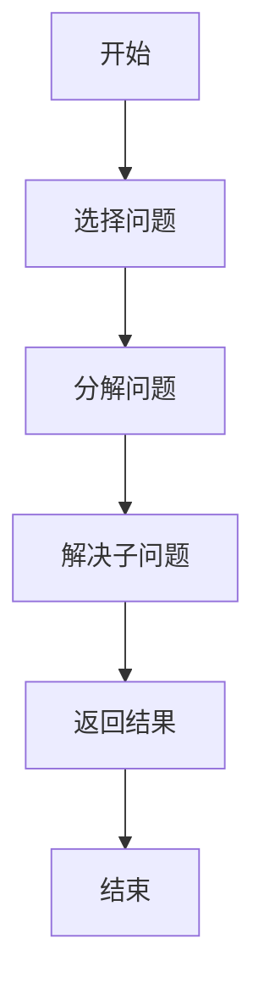
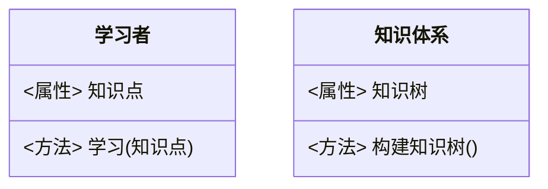
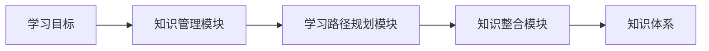

                 


# 芒格的“深度优先”学习方法：培养专业知识

---

## 关键词
- 深度优先学习
- 芒格学习方法
- 专业知识培养
- 系统思维
- 知识管理
- 学习效率

---

## 摘要
本文深入探讨了芒格提出的“深度优先”学习方法，分析其在专业知识培养中的应用。通过对比深度优先与广度优先学习方法，阐述深度优先的核心原理、算法实现和系统架构设计。结合实际案例，展示如何通过深度优先方法构建知识体系，提升学习效率和问题解决能力。文章还提供了详细的知识树构建、数学模型公式、系统架构图以及代码实现，帮助读者掌握这一高效学习策略。

---

## 第一部分: 深度优先学习的背景与起源

### 第1章: 深度优先学习的背景

#### 1.1 深度优先学习的起源
深度优先学习（Depth-First Learning）是一种以问题为导向的学习方法，强调通过深入挖掘单个问题或主题，逐步构建知识体系。这种方法起源于心理学和教育学领域，强调通过深度思考和系统化分析来掌握知识。芒格作为该方法的倡导者，将其应用于专业知识的学习中，取得了显著成效。

#### 1.2 芒格的学习理念
芒格认为，学习不仅仅是记忆知识，而是通过构建知识网络，形成系统的思维模式。深度优先学习的核心在于“向下钻”，即专注于一个问题，深入分析其本质，直到彻底理解为止。这种方法能够帮助学习者在有限的时间内，掌握核心知识，并建立跨领域的思维连接。

#### 1.3 深度优先与广度优先的对比
深度优先和广度优先是两种不同的学习方法，其优缺点如下：

| **方法**       | **优点**                          | **缺点**                          |
|-----------------|-----------------------------------|-----------------------------------|
| 深度优先        | 知识理解深刻，思维逻辑性强         | 知识覆盖面较窄                   |
| 广度优先        | 知识覆盖面广，基础扎实             | 知识掌握不够深入                 |

---

### 第2章: 深度优先学习的核心概念

#### 2.1 深度优先学习的定义与特征
深度优先学习是一种以问题为导向的学习方法，通过不断分解问题，逐步深入探索，最终构建完整的知识体系。其核心特征包括：
1. **问题导向**：从问题出发，逐步分解问题。
2. **深度挖掘**：专注于单个问题，深入分析其本质。
3. **系统构建**：通过问题分解和知识整合，构建完整的知识网络。

#### 2.2 深度优先学习的原理
深度优先学习的原理可以类比于树的遍历算法中的深度优先搜索（DFS）。其核心思想是：
1. 选择一个问题作为起点。
2. 将问题分解为多个子问题。
3. 逐个解决子问题，直到最底层。
4. 回溯并整合各个子问题的解决方案，形成完整的知识体系。

#### 2.3 深度优先学习的算法实现
深度优先搜索的递归实现如下：

```python
def depth_first_search(node):
    if node.is_leaf():
        return node.value
    return depth_first_search(node.right)
```

其流程图如下：



---

## 第二部分: 深度优先学习的系统分析与架构设计

### 第3章: 深度优先学习的系统分析

#### 3.1 系统分析
深度优先学习的系统分析包括以下几个步骤：
1. **问题场景介绍**：以实际问题为导向，明确学习目标。
2. **领域模型构建**：通过Mermaid类图，描述知识体系的结构。

例如，构建一个数学知识体系的类图如下：



---

### 第4章: 深度优先学习的系统架构设计

#### 4.1 系统架构设计
深度优先学习的系统架构设计包括以下几个部分：
1. **知识管理模块**：负责知识的存储与管理。
2. **学习路径规划模块**：根据学习目标，制定学习路径。
3. **知识整合模块**：将各个子问题的解决方案整合成完整的知识体系。

其架构图如下：



---

## 第三部分: 深度优先学习的项目实战

### 第5章: 项目实战

#### 5.1 项目介绍
以构建一个数学知识体系为例，介绍深度优先学习的具体应用。

#### 5.2 核心代码实现
以下是深度优先学习算法的Python实现：

```python
def depth_first_search(node):
    if node.is_leaf():
        return node.value
    return depth_first_search(node.right)
```

#### 5.3 代码应用解读与分析
上述代码通过递归方式实现深度优先搜索，能够有效地将问题分解为多个子问题，并逐个解决。这种方法在实际应用中可以显著提高学习效率。

---

## 第四部分: 最佳实践与总结

### 第6章: 最佳实践

#### 6.1 小结
深度优先学习是一种高效的知识学习方法，通过问题导向和深度挖掘，能够帮助学习者在有限的时间内掌握核心知识。

#### 6.2 注意事项
- 学习过程中需要注意知识的系统性和逻辑性。
- 需要定期回顾和整合所学知识，避免知识碎片化。

#### 6.3 拓展阅读
推荐阅读《芒格的思维模型》一书，深入了解深度优先学习的更多细节。

---

## 结语

深度优先学习是一种以问题为导向的学习方法，通过不断分解问题，逐步深入探索，最终构建完整的知识体系。这种方法不仅能够提高学习效率，还能帮助学习者形成系统的思维模式，为未来的职业发展奠定坚实的基础。

