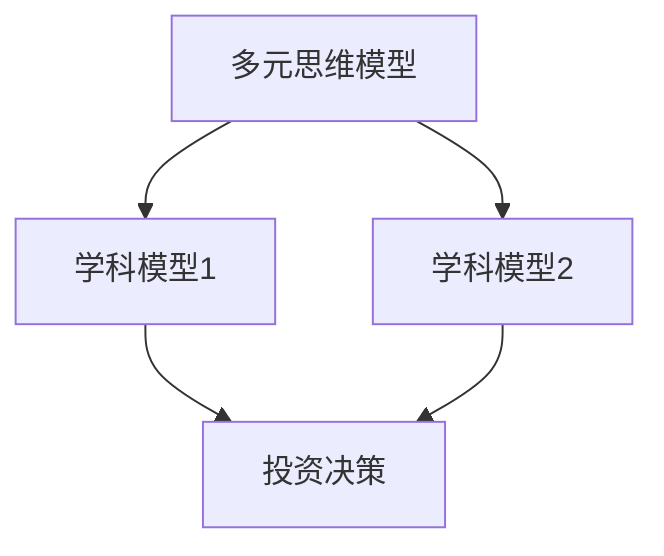
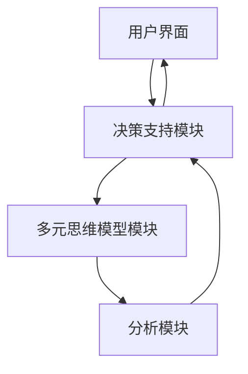

                 


# 芒格的"清晰思考"在投资决策中的重要性

## 关键词：芒格，清晰思考，投资决策，思维模型，机会成本，多元思维，系统架构

## 摘要：芒格的“清晰思考”是一种独特的思维方式，通过多元思维模型和系统性分析，帮助投资者做出更明智的决策。本文从背景、原理、算法、数学模型、系统架构和实战案例等方面，详细探讨了芒格思维模型的应用及其在投资中的重要性。

---

## 第一部分：芒格“清晰思考”的背景与定义

### 第1章：芒格“清晰思考”的背景与定义

#### 1.1 问题背景：投资决策中的思维误区

投资决策中常见的误区包括情绪化决策、过度自信和忽视长期价值。传统投资方法往往依赖市场分析或短期指标，忽视了对底层逻辑的深入理解。

#### 1.2 芒格思维模型的解决方法

芒格的多元思维模型强调通过跨学科的思考，将多个领域的知识整合，形成对问题的全面理解。这种方法帮助投资者避免单一视角的局限性。

#### 1.3 芒格思维模型的核心要素

- **多元性**：涵盖多个学科的思维模型。
- **关联性**：模型之间的相互联系和影响。
- **实用性**：能够实际应用于投资决策。

---

## 第二部分：芒格思维模型的核心原理

### 第2章：多元思维模型的构建与应用

#### 2.1 多元思维模型的原理

多元思维模型将多个学科的原理和规律整合，形成一个综合的分析框架。通过这种模型，投资者可以更全面地评估投资标的的价值。

#### 2.2 多元思维模型的属性对比

| 属性 | 描述 |
|------|------|
| 多元性 | 包括多个学科的模型 |
| 关联性 | 模型之间相互关联 |
| 适用性 | 适用于不同投资场景 |

#### 2.3 多元思维模型的ER实体关系图



---

## 第三部分：芒格思维模型的算法原理

### 第3章：芒格思维模型的算法实现

#### 3.1 机会成本分析算法

机会成本是选择一种投资方案而放弃其他可能获得的收益。通过算法计算不同投资选择的机会成本，帮助投资者做出更明智的决策。

#### 3.2 机会成本的计算公式

$$\text{机会成本} = \sum_{i=1}^{n} w_i \times c_i$$

其中，\(w_i\) 是第i个投资的权重，\(c_i\) 是第i个投资的机会成本。

#### 3.3 机会成本分析的Python实现代码

```python
def calculate_opportunity_cost(investments):
    total = 0
    for investment in investments:
        total += investment['weight'] * investment['cost']
    return total

investments = [
    {'name': '股票', 'weight': 0.6, 'cost': 0.15},
    {'name': '债券', 'weight': 0.3, 'cost': 0.05},
    {'name': '房地产', 'weight': 0.1, 'cost': 0.20}
]

opportunity_cost = calculate_opportunity_cost(investments)
print(f"机会成本为: {opportunity_cost}")
```

---

## 第四部分：芒格思维模型的数学模型

### 第4章：多元思维模型的数学模型

#### 4.1 多元思维模型的数学表达

$$M = \{m_1, m_2, ..., m_n\}$$

其中，\(m_i\) 表示第i个思维模型。

#### 4.2 思维模型之间的关系

$$R = \{r_{ij}\}$$

其中，\(r_{ij}\) 表示模型i和模型j之间的关系强度。

---

## 第五部分：芒格思维模型的系统架构

### 第5章：系统架构设计

#### 5.1 系统功能设计

- **数据采集**：收集多来源的投资数据。
- **模型分析**：应用多元思维模型进行分析。
- **决策支持**：生成投资决策建议。

#### 5.2 系统架构图



---

## 第六部分：芒格思维模型的项目实战

### 第6章：项目实战分析

#### 6.1 案例分析：某公司投资决策

通过应用芒格的多元思维模型，分析某公司的财务状况、行业地位和管理团队，评估其投资价值。

#### 6.2 环境配置与代码实现

```python
def analyze_company(company_data):
    # 应用多元思维模型进行分析
    pass

company_data = {
    '财务状况': {' revenue': 100, 'profit': 20},
    '行业地位': '领先',
    '管理团队': '优秀'
}

result = analyze_company(company_data)
print(f"投资建议: {result}")
```

---

## 第七部分：芒格思维模型的最佳实践

### 第7章：最佳实践与小结

#### 7.1 最佳实践

- 定期更新知识库，保持模型的有效性。
- 结合实际案例，不断优化分析框架。

#### 7.2 小结

芒格的“清晰思考”通过多元思维模型和系统性分析，帮助投资者做出更明智的决策，值得在投资实践中广泛应用。

---

通过以上结构，我们可以全面了解芒格的“清晰思考”在投资决策中的重要性，并将其应用于实际投资中，提升决策的准确性和效率。

