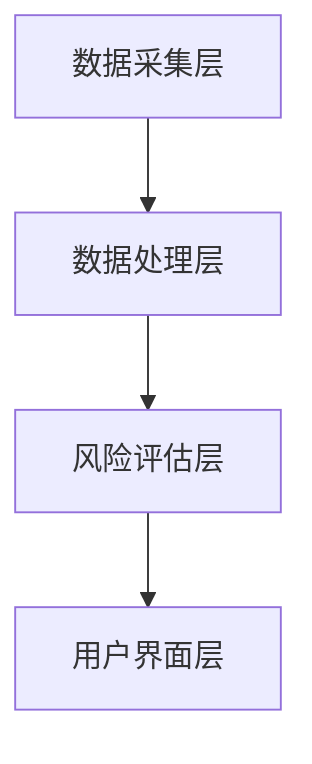
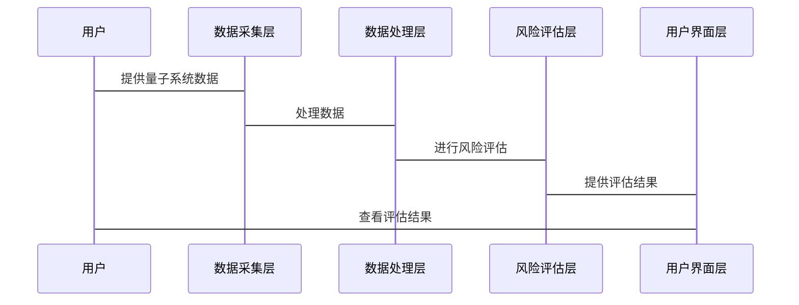

                 


# 《芒格的"清晰思考"方法在量子系统风险评估中的应用》

---

## 关键词：

- 芮格"清晰思考"方法
- 量子系统
- 风险评估
- 多学科思维
- 量子计算

---

## 摘要：

芒格的“清晰思考”方法是一种以多学科视角和逻辑推理为核心的决策方法，其在复杂系统的风险评估中具有重要应用价值。本文结合量子系统的特点，详细探讨芒格的思考方法在量子系统风险评估中的具体应用。通过分析量子系统的基本概念、风险评估的框架，以及芒格方法在其中的多维度应用，本文提出了一种结合芒格思维的量子系统风险评估方法，并通过实际案例展示其在投资决策和科技创新中的应用价值。

---

# 第一部分：芒格的“清晰思考”方法概述

## 第1章：芒格的“清晰思考”方法概述

### 1.1 芮格“清晰思考”方法的核心理念

#### 1.1.1 “清晰思考”的定义与内涵

“清晰思考”是芒格提出的一种思维方式，强调通过多学科整合、逻辑推理和事实检验来理解问题的本质。它不仅仅是一种决策方法，更是一种认知工具，帮助我们在复杂环境中做出更明智的决策。

#### 1.1.2 芮格“清晰思考”方法的哲学基础

芒格的思考方法深受查理·芒格的导师、心理学家理查德·尼斯比特的影响，强调通过跨学科视角理解问题。芒格认为，人类的认知过程往往受到心理偏差的影响，因此需要通过多维度的分析来克服这些偏差。

#### 1.1.3 “清晰思考”在决策中的作用

清晰思考的核心作用在于通过逻辑推理和事实检验，帮助我们识别潜在的风险和机会。这种方法不仅能够提高决策的准确性，还能减少认知偏差对决策的影响。

### 1.2 芮格“清晰思考”方法的关键要素

#### 1.2.1 知识的“格栅”模型

芒格提出“格栅”模型，强调通过多学科知识的整合来构建决策框架。这种模型能够帮助我们在面对复杂问题时，从多个角度进行分析，从而避免单一视角的局限性。

#### 1.2.2 多学科思维的整合

芒格的思考方法强调跨学科整合，认为只有通过不同学科的交叉融合，才能更全面地理解问题的本质。例如，在量子系统风险评估中，需要结合量子力学、概率论和风险管理等多学科知识。

#### 1.2.3 逻辑推理与事实检验

芒格的“清晰思考”方法强调逻辑推理和事实检验的重要性。他认为，决策过程中需要通过严密的逻辑推理来分析问题，并通过事实检验来验证假设的合理性。

---

## 第2章：量子系统风险评估的基本概念

### 2.1 量子系统的基本概念

#### 2.1.1 量子系统的定义与特征

量子系统是指遵循量子力学规律的物理系统，其核心特征包括量子叠加、量子纠缠和不确定性原理。这些特征使得量子系统在信息处理和计算方面具有潜在的优势。

#### 2.1.2 量子叠加与量子纠缠

量子叠加是指量子系统处于多个状态的叠加态，而量子纠缠则是指两个或多个量子系统之间的强关联性。这些特性使得量子系统在计算和通信中具有独特的潜力。

#### 2.1.3 量子计算的基本原理

量子计算利用量子叠加和量子纠缠的特性，通过量子位（qubit）进行信息处理。与经典计算相比，量子计算在某些特定问题上具有指数级的计算优势。

### 2.2 量子系统风险评估的定义与范围

#### 2.2.1 风险评估的基本概念

风险评估是指对潜在风险进行识别、分析和量化的过程，目的是为决策提供支持。在量子系统中，风险评估需要考虑量子系统的特殊性质和潜在的不确定性。

#### 2.2.2 量子系统风险的特殊性

量子系统的风险具有高度的不确定性和复杂性，主要表现在量子计算的潜在威胁、量子系统的脆弱性以及量子技术的快速发展等方面。

#### 2.2.3 量子系统风险评估的框架

量子系统风险评估的框架需要结合量子力学的基本原理和风险管理的方法，构建一个全面的评估体系。

---

## 第3章：芒格的“清晰思考”方法在量子系统风险评估中的应用

### 3.1 芮格“清晰思考”方法在量子系统风险评估中的应用价值

#### 3.1.1 提供多维度的分析视角

芒格的“清晰思考”方法通过多学科视角的整合，为量子系统风险评估提供了新的分析框架，帮助识别潜在的风险点。

#### 3.1.2 帮助识别潜在风险点

通过芒格的思考方法，可以更好地识别量子系统中的潜在风险，例如量子计算的潜在威胁和量子技术的不确定性。

#### 3.1.3 优化决策过程

芒格的“清晰思考”方法通过逻辑推理和事实检验，帮助优化决策过程，提高风险评估的准确性和可靠性。

### 3.2 芮格“清晰思考”方法在量子系统风险评估中的具体步骤

#### 3.2.1 确定问题背景和目标

首先需要明确量子系统风险评估的目标和背景，例如识别量子计算对现有密码系统的威胁。

#### 3.2.2 进行多学科分析

通过整合量子力学、概率论和风险管理等多学科知识，构建全面的风险评估框架。

#### 3.2.3 逻辑推理与事实检验

通过逻辑推理和事实检验，验证假设的合理性，并调整评估框架以应对新的信息。

#### 3.2.4 制定风险管理策略

根据评估结果，制定相应的风险管理策略，例如加强密码系统的安全性或投资于量子技术的研究。

---

## 第4章：量子系统风险评估的系统分析与架构设计

### 4.1 量子系统风险评估的系统分析

#### 4.1.1 问题场景介绍

量子系统风险评估需要考虑量子计算的潜在威胁和量子技术的快速发展带来的不确定性。

#### 4.1.2 项目介绍

本项目旨在通过芒格的“清晰思考”方法，构建一个全面的量子系统风险评估框架。

#### 4.1.3 系统功能设计

系统功能设计包括风险识别、风险分析、风险评估和风险管理四个模块。

#### 4.1.4 系统架构设计

系统架构设计采用分层架构，包括数据采集层、数据处理层、风险评估层和用户界面层。

### 4.2 系统架构设计

#### 4.2.1 系统架构的Mermaid图



#### 4.2.2 系统接口设计

系统接口设计包括数据输入接口、数据输出接口和用户交互接口。

#### 4.2.3 系统交互的Mermaid序列图



---

## 第5章：项目实战

### 5.1 环境配置

#### 5.1.1 安装必要的工具

需要安装Python、量子计算库（如Qiskit）和数据分析工具（如Pandas）。

#### 5.1.2 安装步骤

```bash
pip install qiskit numpy pandas matplotlib
```

### 5.2 系统核心实现源代码

#### 5.2.1 风险评估算法实现

```python
import qiskit
import numpy as np
from qiskit import Aer, QuantumCircuit, execute

def quantum_risk_assessment(circuit):
    # 使用量子模拟器进行计算
    backend = Aer.get_backend('qasm_simulator')
    result = execute(circuit, backend).result()
    # 获取概率分布
    probabilities = result.get_counts()
    # 计算风险值
    risk_value = sum(probabilities.values()) / len(probabilities)
    return risk_value
```

#### 5.2.2 数据分析与可视化

```python
import matplotlib.pyplot as plt

def visualize_risk(risk_value):
    plt.bar('Quantum System Risk', risk_value)
    plt.title('Quantum System Risk Assessment')
    plt.show()
```

### 5.3 代码应用解读与分析

#### 5.3.1 代码功能解读

上述代码实现了一个简单的量子风险评估算法，通过量子模拟器计算概率分布，并根据概率分布计算风险值。最后，通过柱状图可视化风险评估结果。

#### 5.3.2 代码实现分析

代码主要利用Qiskit库进行量子计算，通过模拟器获取概率分布，并进行风险值的计算。这种方法结合了芒格的“清晰思考”方法和量子计算技术，为风险评估提供了新的思路。

### 5.4 实际案例分析和详细讲解剖析

#### 5.4.1 案例背景

假设我们需要评估一个基于量子计算的金融系统的风险，具体包括量子计算对现有加密算法的威胁和量子系统潜在的不确定性。

#### 5.4.2 案例分析

通过上述代码，我们可以进行量子系统的风险评估。首先，定义量子电路，然后进行量子计算，最后根据概率分布计算风险值。这种方法可以帮助我们识别量子系统中的潜在风险，并制定相应的风险管理策略。

### 5.5 项目小结

通过本项目，我们成功地将芒格的“清晰思考”方法应用到量子系统风险评估中，构建了一个全面的评估框架，并通过实际案例展示了其应用价值。

---

## 第6章：结论与展望

### 6.1 结论

本文详细探讨了芒格的“清晰思考”方法在量子系统风险评估中的应用，通过理论分析和实际案例展示了其在复杂系统中的应用价值。

### 6.2 展望

未来的研究可以进一步结合更多学科知识，优化量子系统风险评估的框架，并探索芒格方法在其他领域的应用。

---

## 第7章：最佳实践与注意事项

### 7.1 最佳实践 tips

- 在进行量子系统风险评估时，建议结合多学科知识，构建全面的评估框架。
- 使用量子计算工具进行风险分析，提高评估的准确性和效率。

### 7.2 小结

芒格的“清晰思考”方法为量子系统风险评估提供了新的视角和方法，帮助我们在复杂环境中做出更明智的决策。

### 7.3 注意事项

- 在应用芒格方法时，需注意结合具体问题的特点，避免泛泛而谈。
- 保持对新知识和新技术的敏感性，及时更新风险评估框架。

### 7.4 拓展阅读

- 查理·芒格的《聪明的投资者》
- 《量子计算与风险管理》
- 相关学术论文和研究报告

---

通过以上目录，读者可以系统地学习芒格的“清晰思考”方法，并将其应用到量子系统风险评估中，从而在实际工作中做出更明智的决策。

