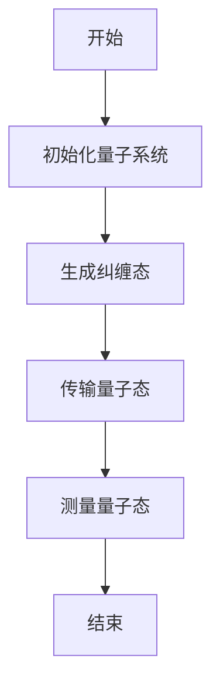
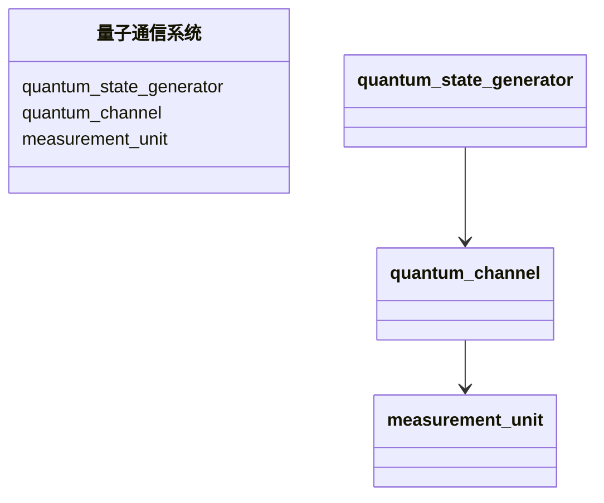
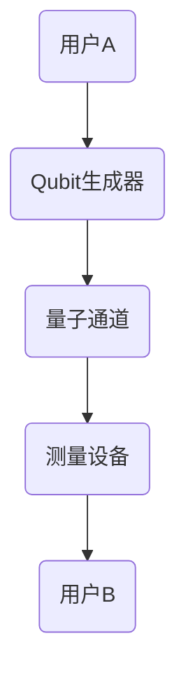

                 


# 芒格的"清晰思考"方法在量子纠缠通信策略制定中的运用

---

## 关键词
芒格思考方法，量子纠缠，通信策略，量子通信，技术应用

---

## 摘要
本文探讨了芒格“清晰思考”方法在量子纠缠通信策略制定中的应用。通过分析芒格的“心智模型”和“逆向思维”等核心理念，结合量子纠缠通信的基本原理，展示了如何运用清晰的思维方式解决复杂的技术问题。文章从背景介绍、核心概念、算法原理、系统架构到项目实战，层层深入，详细阐述了清晰思考在量子通信中的实际应用，并通过具体案例分析，验证了其有效性和优势。

---

## 目录大纲结构

### 第一部分: 芒格的“清晰思考”方法与量子纠缠通信概述

#### 第1章: 芒格的“清晰思考”方法
- 1.1 “心智模型”的概念与特点
- 1.2 “逆向思维”的应用与优势
- 1.3 “清晰思考”在决策中的重要性

#### 第2章: 量子纠缠通信的基本概念
- 2.1 量子纠缠的定义与特性
- 2.2 量子纠缠通信的应用场景

### 第二部分: 芒格“清晰思考”方法在量子纠缠通信中的应用

#### 第3章: 清晰思考与量子纠缠通信的结合
- 3.1 清晰思考在量子通信问题分析中的作用
- 3.2 清晰思考在通信策略制定中的应用

#### 第4章: 清晰思考方法在量子通信中的具体应用
- 4.1 清晰思考在量子密钥分发中的应用
- 4.2 清晰思考在量子通信网络设计中的应用

### 第三部分: 量子纠缠通信的数学模型与算法原理

#### 第5章: 量子纠缠通信的数学模型
- 5.1 量子态的数学描述
- 5.2 量子纠缠态的数学表达
- 5.3 算法原理的数学模型和公式

#### 第6章: 量子纠缠通信的算法原理
- 6.1 算法流程图
- 6.2 量子纠缠态的生成与传输
- 6.3 量子密钥分发协议的实现

### 第四部分: 量子纠缠通信的系统架构与设计

#### 第7章: 量子纠缠通信的系统架构设计
- 7.1 系统功能设计
- 7.2 系统架构图
- 7.3 系统接口设计

#### 第8章: 量子纠缠通信的项目实战
- 8.1 环境搭建与配置
- 8.2 核心代码实现
- 8.3 项目案例分析

### 第五部分: 最佳实践与总结

#### 第9章: 最佳实践与小结
- 9.1 实践中的注意事项
- 9.2 项目总结与经验分享
- 9.3 拓展阅读与深入学习

---

## 第1章: 芒格的“清晰思考”方法

### 1.1 “心智模型”的概念与特点
芒格的“心智模型”是指通过构建多个学科的基本思维模型，来帮助我们更好地理解问题和解决问题。这些模型包括概率论、决策论、心理学等，帮助我们在复杂问题中找到清晰的解决方案。

### 1.2 “逆向思维”的应用与优势
逆向思维是指从问题的反面出发，思考可能的原因和解决方案。这种方法可以帮助我们在复杂的系统中找到关键问题，并制定有效的应对策略。

### 1.3 “清晰思考”在决策中的重要性
清晰思考是芒格决策的核心原则，它要求我们在面对复杂问题时，能够系统性地分析问题，避免被情绪和偏见影响，从而做出更理性的决策。

---

## 第2章: 量子纠缠通信的基本概念

### 2.1 量子纠缠的定义与特性
量子纠缠是指两个或多个粒子之间存在强烈的量子关联，使得对其中一个粒子的测量会立即影响另一个粒子的状态，即使它们相隔很远。这种现象被称为“非局域性”。

### 2.2 量子纠缠通信的应用场景
量子纠缠通信在量子密钥分发、量子隐形传态等领域有广泛应用。通过量子纠缠，可以实现信息的安全传输和高效处理。

---

## 第3章: 清晰思考与量子纠缠通信的结合

### 3.1 清晰思考在量子通信问题分析中的作用
通过清晰思考，我们可以明确量子通信的目标、拆解问题的关键点，并从多个维度进行分析，从而制定出更有效的解决方案。

### 3.2 清晰思考在通信策略制定中的应用
清晰思考帮助我们在制定通信策略时，能够全面考虑各种可能的因素，优化协议设计，并预判潜在问题，从而提高策略的可行性和效果。

---

## 第4章: 清晰思考方法在量子通信中的具体应用

### 4.1 清晰思考在量子密钥分发中的应用
通过清晰思考，我们可以优化量子密钥分发协议，确保通信的安全性和高效性。具体包括协议设计、错误检测和纠错等环节。

### 4.2 清晰思考在量子通信网络设计中的应用
清晰思考帮助我们在设计量子通信网络时，能够合理规划网络架构，优化资源分配，并提高系统的可靠性和容错能力。

---

## 第5章: 量子纠缠通信的数学模型

### 5.1 量子态的数学描述
量子态可以用向量或密度矩阵表示，例如，一个两态量子系统的态可以表示为：

$$|\psi\rangle = \alpha|0\rangle + \beta|1\rangle$$

其中，$\alpha$ 和 $\beta$ 是复数，满足 $|\alpha|^2 + |\beta|^2 = 1$。

### 5.2 量子纠缠态的数学表达
一个典型的纠缠态是Bell态，例如：

$$|\Phi^+\rangle = \frac{1}{\sqrt{2}}(|00\rangle + |11\rangle)$$

---

## 第6章: 量子纠缠通信的算法原理

### 6.1 算法流程图


### 6.2 量子纠缠态的生成与传输
量子纠缠态的生成通常通过量子门操作实现，例如Hadamard门和CNOT门的组合。

---

## 第7章: 量子纠缠通信的系统架构设计

### 7.1 系统功能设计
系统功能包括量子态生成、量子态传输、测量与解码等模块。



### 7.2 系统架构图


---

## 第8章: 量子纠缠通信的项目实战

### 8.1 环境搭建与配置
需要搭建量子计算环境，配置必要的量子计算库和工具。

### 8.2 核心代码实现
以下是量子纠缠态生成的Python代码示例：

```python
from qiskit import QuantumCircuit, execute, Aer

qc = QuantumCircuit(2)
qc.h(0)
qc.cx(0, 1)
qc.measure_all()

result = execute(qc, Aer.get_backend('qasm_simulator')).result()
print(result)
```

### 8.3 项目案例分析
通过具体案例分析，验证清晰思考方法在量子通信中的实际应用效果，并总结经验教训。

---

## 第9章: 最佳实践与小结

### 9.1 实践中的注意事项
在实际应用中，需要注意量子系统的稳定性、环境干扰等问题。

### 9.2 项目总结与经验分享
总结项目实施过程中的经验，分享清晰思考方法在量子通信中的优势和不足。

### 9.3 拓展阅读与深入学习
推荐相关书籍和资源，供读者进一步深入学习。

---

## 结语
通过本文的探讨，我们可以看到，芒格的“清晰思考”方法在量子纠缠通信策略制定中具有重要的应用价值。它不仅帮助我们更好地理解复杂问题，还为技术创新提供了新的思路。未来，随着量子计算和通信技术的不断发展，清晰思考方法将在更多领域发挥重要作用。

