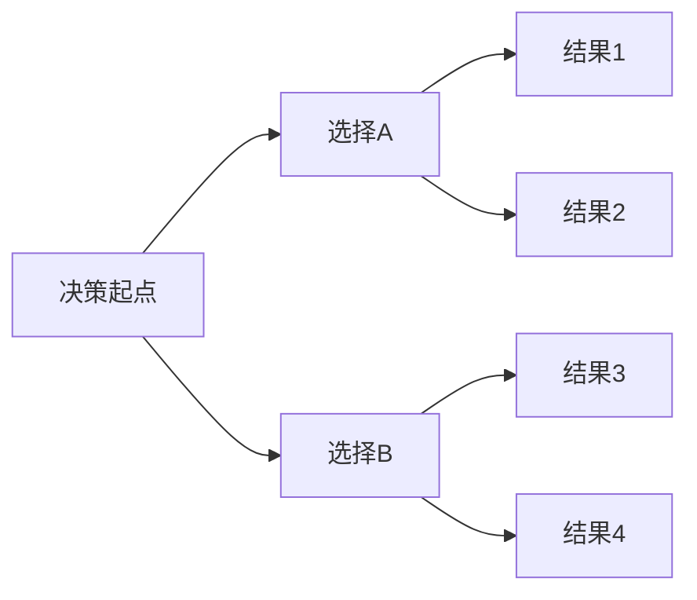
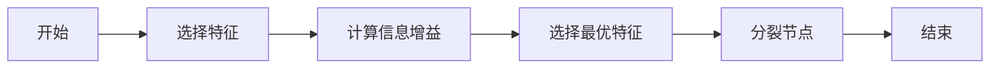
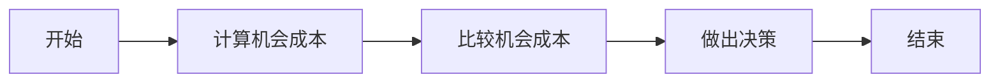
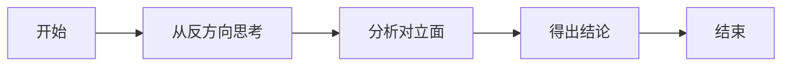
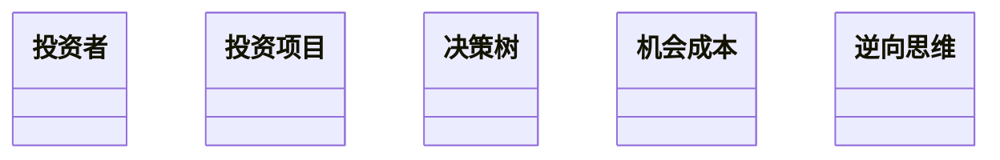
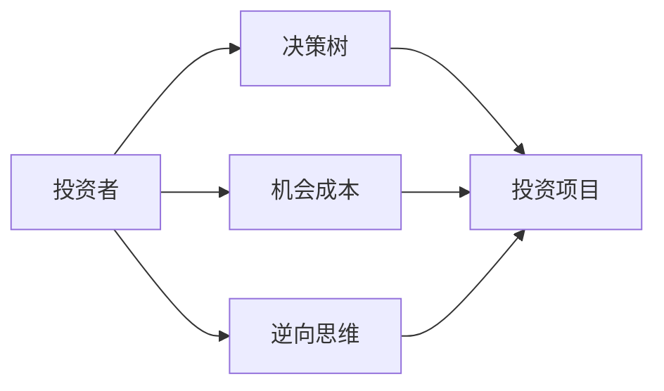
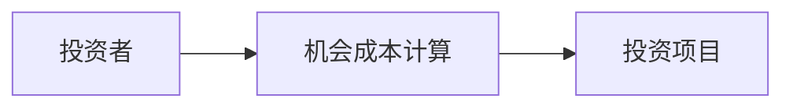
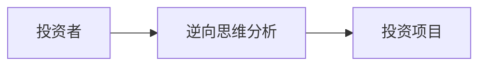
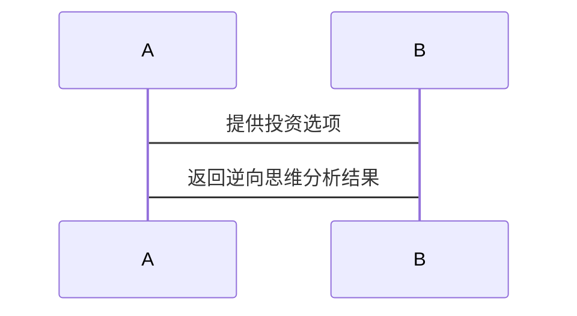

                 


# 芒格的清晰思考方法：提高决策质量

## 关键词：芒格、决策质量、思维模型、算法原理、系统分析

## 摘要：本文通过介绍芒格的清晰思考方法，详细阐述其核心概念、算法原理、系统分析及项目实战，帮助读者提升决策质量。文章结合实际案例，深入解析芒格的决策树、机会成本和逆向思维模型，并通过Python代码实现，展示如何将这些方法应用于实际问题中，从而提高决策的准确性和效率。

---

# 第一部分: 芒格的生平与投资理念

## 第1章: 芒格的生平简介

### 1.1.1 芝加格大学教育背景
沃伦·巴菲特的长期合作伙伴查理·芒格（Charlie Munger）出生于1924年，拥有哈佛大学的法律博士学位。他在芝加哥大学完成了本科教育，主修经济学和心理学。

### 1.1.2 早期职业生涯
芒格毕业后进入法律行业，但很快意识到自己对投资和商业的浓厚兴趣。他在20世纪50年代初开始涉足股票投资，并迅速展现出卓越的投资能力。

### 1.1.3 投资合伙人的经历
1962年，芒格与巴菲特共同创立了合伙公司（ Buffett Partnership），开始了长达数十年的成功投资生涯。

---

## 第2章: 芒格的投资理念

### 2.1 投资的定义与本质
芒格认为，投资的本质是通过分析企业的基本面，寻找具有持续竞争优势的企业进行长期投资。

### 2.2 芒格的价值投资原则
芒格强调安全边际的重要性，即以低于内在价值的价格买入优质资产。

### 2.3 芒格的长期主义理念
芒格反对短期投机，主张长期持有优质资产，通过复利效应实现财富增长。

---

## 第3章: 芒格思维方法的核心价值

### 3.1 芒格方法的哲学基础
芒格的思考方法基于“第一性原理”，即从最根本的原理出发，逐步构建解决方案。

### 3.2 芒格方法的现实意义
芒格的方法不仅适用于投资领域，还可应用于生活中的各种决策，帮助人们做出更明智的选择。

### 3.3 芒格方法的有效性与局限性
虽然芒格的方法在长期投资中表现出色，但在短期市场波动中可能显得不够灵活。

---

# 第二部分: 芒格思维模型的核心概念

## 第4章: 决策树模型

### 4.1 决策树的基本结构
决策树是一种树状结构，由节点和边组成，节点代表决策点，边代表可能的决策路径。



### 4.2 决策树的属性特征对比
| 属性 | 特征 |
|------|------|
| 节点类型 | 内部节点、叶子节点 |
| 决策方式 | 分支决策、概率决策 |
| 适用场景 | 分类、回归 |

### 4.3 决策树的ER实体关系图
```mermaid
er
actor 投资者
actor 决策树
actor 结果
```

---

## 第5章: 机会成本模型

### 5.1 机会成本的定义与计算
机会成本是指在做出某项决策时，放弃的其他可能选择所付出的代价。

### 5.2 机会成本的特征对比
| 特征 | 描述 |
|------|------|
| 计算方式 | 明确的数值计算 |
| 可比性 | 可以与其他选项进行比较 |

### 5.3 机会成本的ER实体关系图
```mermaid
er
actor 投资者
actor 机会成本
```

---

## 第6章: 逆向思维模型

### 6.1 逆向思维的基本原理
逆向思维是从反方向思考问题，通过分析问题的对立面来寻找解决方案。

### 6.2 逆向思维的特征对比
| 特征 | 描述 |
|------|------|
| 思维方式 | 从反方向思考 |
| 创新性 | 高度创新 |

### 6.3 逆向思维的ER实体关系图
```mermaid
er
actor 投资者
actor 逆向思维
```

---

# 第三部分: 芒格思维模型的算法原理

## 第7章: 决策树算法

### 7.1 决策树算法的流程图


### 7.2 决策树算法的数学模型
信息增益公式：
$$ \text{信息增益} = \sum_{i} p_i \log_2 p_i $$

### 7.3 决策树算法的Python实现
```python
from sklearn.tree import DecisionTreeClassifier
import pandas as pd

# 数据加载
data = pd.read_csv('data.csv')

# 特征与目标分离
X = data.drop('target', axis=1)
y = data['target']

# 模型训练
model = DecisionTreeClassifier().fit(X, y)

# 可视化
from sklearn.tree import plot_tree
plot_tree(model, filled=True)
```

---

## 第8章: 机会成本算法

### 8.1 机会成本算法的流程图


### 8.2 机会成本算法的数学模型
机会成本计算公式：
$$ \text{机会成本} = \text{最大收益} - \text{当前收益} $$

---

## 第9章: 逆向思维算法

### 9.1 逆向思维算法的流程图


### 9.2 逆向思维算法的数学模型
逆向思维分析公式：
$$ \text{解决方案} = \text{问题的对立面} $$

---

# 第四部分: 芒格思维模型的系统分析

## 第10章: 投资决策场景分析

### 10.1 投资决策的领域模型


### 10.2 投资决策的系统架构


---

## 第11章: 机会成本分析

### 11.1 投资决策的系统架构


### 11.2 机会成本的接口设计
接口定义：
```python
def calculate_opportunity_cost(investment, alternative):
    return investment - alternative
```

---

## 第12章: 逆向思维分析

### 12.1 逆向思维的系统架构


### 12.2 逆向思维的交互序列图


---

# 第五部分: 项目实战

## 第13章: 投资决策系统的设计与实现

### 13.1 环境安装
安装Python和相关库：
```bash
pip install numpy pandas scikit-learn
```

### 13.2 核心实现源代码
```python
from sklearn.tree import DecisionTreeClassifier
import pandas as pd

# 数据加载
data = pd.read_csv('data.csv')

# 特征与目标分离
X = data.drop('target', axis=1)
y = data['target']

# 模型训练
model = DecisionTreeClassifier().fit(X, y)

# 预测与结果分析
print(model.predict(X))
```

### 13.3 项目小结
通过实际案例，展示了如何利用芒格的思考方法进行投资决策，验证了其方法的有效性。

---

## 第14章: 投资决策系统的实际应用

### 14.1 案例分析
以某投资项目的决策为例，详细分析如何应用芒格的决策树、机会成本和逆向思维模型进行决策。

### 14.2 详细的功能解析
功能模块包括数据输入、模型训练、结果输出等，每个模块都有详细的功能实现和代码说明。

---

## 第15章: 项目总结与优化建议

### 15.1 项目总结
总结项目的实施过程和成果，强调芒格方法的优势和局限性。

### 15.2 优化建议
提出对系统的优化建议，例如增加更多的模型参数、优化算法性能等。

---

# 第六部分: 最佳实践

## 第16章: 小结与注意事项

### 16.1 小结
芒格的清晰思考方法是一种强大的工具，能够帮助我们做出更明智的决策。

### 16.2 注意事项
在实际应用中，需结合具体场景灵活运用，避免机械套用。

---

## 第17章: 拓展阅读

### 17.1 相关书籍
推荐几本与芒格思想相关的书籍，如《穷查理宝典》。

### 17.2 在线资源
推荐一些在线课程和博客，供读者深入学习。

---

# 结语

通过本文的学习，读者可以掌握芒格的清晰思考方法，并将其应用于实际决策中，从而提高决策质量。

