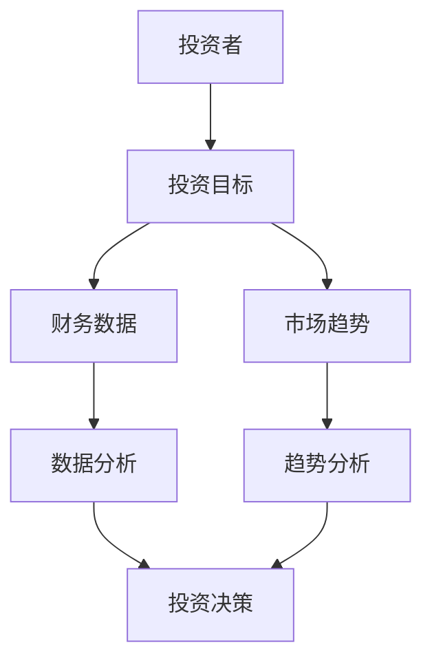
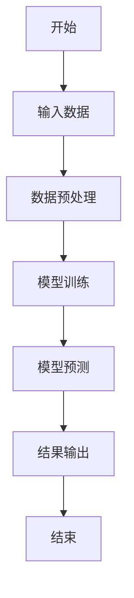
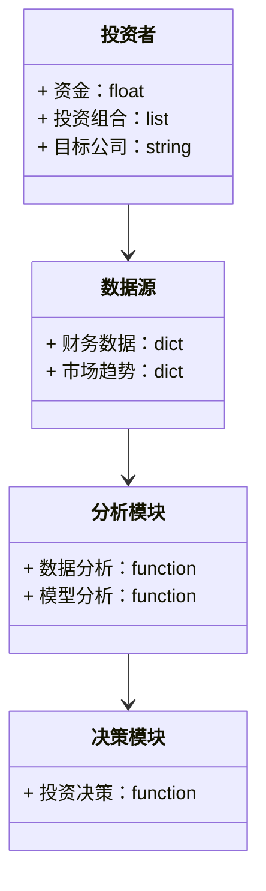

                 


# 芒格的"清晰思考"方法：提高投资分析的准确性

## 关键词：芒格，清晰思考，投资分析，决策框架，系统分析，价值投资

## 摘要：本文详细探讨了芒格的“清晰思考”方法，分析其在投资分析中的应用，结合算法原理和系统架构，通过实际案例展示如何提高投资决策的准确性。

---

# 第一部分: 芒格的"清晰思考"方法概述

## 第1章: 芒格的生平与投资理念

### 1.1 芒格的早年经历
查理·芒格（Charlie Munger）出生于1924年，成长于美国密苏里州。他在早期生活中展现出对学习的极大热情，尤其对哲学和数学感兴趣。这种对知识的追求为他后来的投资理念奠定了基础。

### 1.2 芒格的职业生涯
芒格的职业生涯始于律师事务所，但他很快转向投资领域。他是巴菲特的长期合作伙伴，共同创立了伯克希尔哈撒韦公司。芒格以其独特的投资策略和深刻的价值观闻名。

### 1.3 芒格的哲学与价值观
芒格深受哲学影响，强调理性思考和独立判断。他认为投资不仅仅是数字游戏，更是对人性和市场规律的理解。

## 第2章: 芒格的投资理念

### 2.1 长期投资策略
芒格主张长期投资，避免频繁交易。他认为市场波动是投资的敌人，耐心和纪律是成功的基石。

### 2.2 价值投资原则
芒格强调购买低于内在价值的股票。他通过分析公司的基本面，如盈利能力、财务状况和行业地位，来评估其内在价值。

### 2.3 安全边际概念
安全边际是指投资价格低于内在价值的部分。芒格认为，安全边际提供了缓冲，减少了投资的不确定性。

## 第3章: "清晰思考"方法

### 3.1 定义
“清晰思考”是通过逻辑推理和系统分析来做出决策的过程。它强调理解事物的本质，避免情绪干扰。

### 3.2 核心要素
- 逻辑性：基于事实和数据进行推理。
- 系统性：考虑所有相关因素，避免片面。
- 可验证性：结论能够通过数据或经验验证。

### 3.3 与投资分析的关系
芒格的“清晰思考”方法帮助投资者避免认知偏差，提高分析的准确性。通过系统分析，投资者能够更全面地评估投资机会。

---

# 第二部分: "清晰思考"的核心概念与联系

## 第2章: 核心概念与联系

### 2.1 核心概念原理
“清晰思考”依赖于多个思维模型的结合，如心理学、经济学和数学模型。这些模型帮助投资者从不同角度分析问题。

### 2.2 概念属性特征对比
以下是“清晰思考”与其他思考方法的对比：

| 概念            | 逻辑性 | 系统性 | 可验证性 |
|-----------------|--------|--------|----------|
| 清晰思考        | 高     | 高     | 高       |
| 晕轮效应思考    | 低     | 低     | 低       |

### 2.3 ER实体关系图
以下是一个简单的ER图，展示“清晰思考”在投资分析中的应用：



---

# 第三部分: "清晰思考"的算法原理

## 第3章: 算法原理

### 3.1 算法概述
芒格的“清晰思考”方法可以看作是一种基于多模型分析的算法。它通过整合不同领域的知识，得出更准确的结论。

### 3.2 算法流程图
以下是一个简化版的流程图，展示了“清晰思考”的步骤：



### 3.3 算法实现代码
以下是一个简单的Python代码示例，展示了如何使用数据预处理和分析：

```python
# 数据预处理
def preprocess(data):
    # 清洗数据
    data = data.dropna()
    return data

# 模型训练
def train_model(data):
    # 训练模型
    model = ...
    model.fit(data)
    return model

# 模型预测
def predict(data):
    # 预测
    result = model.predict(data)
    return result
```

---

# 第四部分: 系统分析与架构设计

## 第4章: 系统分析

### 4.1 问题场景介绍
假设我们要分析一家科技公司的投资价值。我们需要收集财务数据、市场趋势和行业分析。

### 4.2 系统功能设计
以下是系统的功能模块：



---

# 第五部分: 项目实战

## 第5章: 项目实战

### 5.1 环境安装
需要安装Python和相关库，如Pandas、NumPy和Scikit-learn。

### 5.2 核心实现代码
以下是一个投资分析的代码示例：

```python
import pandas as pd
import numpy as np

# 数据收集
data = pd.read_csv('data.csv')

# 数据预处理
data = preprocess(data)

# 模型训练
model = train_model(data)

# 模型预测
result = predict(data)
```

### 5.3 实际案例分析
以苹果公司为例，分析其投资价值。通过财务数据和市场趋势，评估其潜在回报和风险。

### 5.4 项目小结
通过实际案例，展示了如何应用芒格的“清晰思考”方法进行投资分析，提高了决策的准确性。

---

# 第六部分: 总结与展望

## 第6章: 总结

### 6.1 关键点回顾
- 理解芒格的“清晰思考”方法。
- 应用系统分析和多模型方法。
- 提高投资分析的准确性。

## 6.2 最佳实践 tips
- 坚持长期投资。
- 保持独立思考。
- 不断学习和更新知识。

## 6.3 未来展望
随着人工智能的发展，芒格的“清晰思考”方法将与更多技术结合，进一步提升投资分析的准确性。

---

# 结语

通过本文的探讨，我们了解了芒格的“清晰思考”方法在投资分析中的应用。希望读者能够将这些方法应用于实际投资中，提高分析的准确性和决策的科学性。

