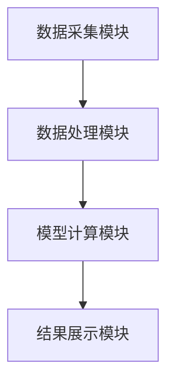

                 


# 芒格的"第一原理"思维在投资分析中的应用

> 关键词：芒格，第一原理，投资分析，价值评估，数学模型，算法实现

> 摘要：本文深入探讨了芒格的"第一原理"思维在投资分析中的应用，通过背景介绍、核心概念、算法原理、系统架构和项目实战等多个维度，详细分析了如何利用这一思维方法进行投资决策。文章结合实际案例，展示了如何将"第一原理"思维转化为数学模型和算法，并通过系统架构设计和项目实现，验证其在投资分析中的有效性和实用性。

---

# 第一部分: 芒格的"第一原理"思维概述

## 第1章: "第一原理"思维的起源与核心概念

### 1.1 芒格的生平与投资哲学

查理·芒格（Charlie Munger）是伯克希尔·哈撒韦公司的副主席，被誉为沃伦·巴菲特（Warren Buffett）的“幕后智囊”。芒格的投资哲学以“第一原理”思维为核心，强调从最基本的逻辑起点出发，寻找投资中的本质规律。

#### 1.1.1 芒格的生平简介
查理·芒格出生于1924年，美国密苏里州堪萨斯市。他毕业于密歇根大学和哈佛法学院，是一位成功的律师和投资者。芒格的智慧和投资理念深深影响了巴菲特，两人共同创造了伯克希尔·哈撒韦的辉煌业绩。

#### 1.1.2 芒格的投资哲学与思维方式
芒格的投资哲学强调“逆向思维”和“多学科思维模型”。他认为，投资者应该从最基本的逻辑起点出发，寻找投资中的本质规律，而不是盲目追随市场潮流。

#### 1.1.3 "第一原理"思维的提出与应用
“第一原理”（First Principles）是哲学中的一个重要概念，指从最基本的公理或假设出发，推导出其他结论。芒格将其应用于投资分析，强调从企业的基本面出发，分析其内在价值和竞争优势。

---

### 1.2 "第一原理"思维的核心概念

#### 1.2.1 "第一原理"的定义与特征
“第一原理”是指从最基本的逻辑起点出发，通过逻辑推理得出结论。其特征包括：
1. **基础性**：从最基础的公理或假设出发。
2. **逻辑性**：通过严密的逻辑推理得出结论。
3. **实用性**：能够应用于实际问题的解决。

#### 1.2.2 "第一原理"思维在投资分析中的应用背景
传统投资分析方法往往依赖于市场情绪和技术指标，容易受到短期波动的影响。芒格提出“第一原理”思维，旨在从企业的基本面出发，分析其内在价值，从而做出更理性的投资决策。

#### 1.2.3 投资分析中的核心问题与解决路径
投资分析中的核心问题包括：
1. 企业的内在价值是多少？
2. 企业的竞争优势是什么？
3. 企业的长期发展前景如何？

通过“第一原理”思维，投资者可以从企业的核心业务、财务数据和行业环境出发，逐步分析其内在价值和竞争优势。

---

## 第2章: "第一原理"思维与传统投资分析方法的对比

### 2.1 传统投资分析方法的优缺点

#### 2.1.1 基于市场情绪的分析方法
传统投资分析方法往往依赖于市场情绪和技术指标，容易受到短期波动的影响。这种方法的优点是能够快速捕捉市场机会，但缺点是缺乏对企业的深入分析，容易受到市场噪声的干扰。

#### 2.1.2 技术分析与基本面分析的局限性
技术分析依赖于价格和成交量的变化，往往忽视了企业的基本面。基本面分析虽然考虑了企业的财务数据，但容易受到会计处理和管理层决策的影响。

#### 2.1.3 传统方法的适用场景与局限性
传统方法适用于短期交易和市场趋势预测，但对于长期投资决策，往往缺乏足够的深度和广度。

---

### 2.2 "第一原理"思维的优势与特点

#### 2.2.1 从底层逻辑出发的投资分析
“第一原理”思维从企业的核心业务和行业环境出发，分析其内在价值和竞争优势，从而做出更理性的投资决策。

#### 2.2.2 基于本质的长期价值判断
通过“第一原理”思维，投资者能够识别出真正具有长期竞争优势的企业，从而做出更稳健的投资决策。

#### 2.2.3 抵制短期市场波动的干扰
“第一原理”思维强调长期价值，能够帮助投资者抵制短期市场波动的干扰，避免盲目跟随市场情绪。

---

## 第3章: "第一原理"思维在投资决策中的应用框架

### 3.1 投资分析的系统性框架

#### 3.1.1 投资目标的设定与分解
投资者需要明确自己的投资目标，例如追求长期资本增值还是稳定收益。目标的分解包括时间跨度、风险承受能力和收益预期。

#### 3.1.2 投资策略的选择与优化
根据投资目标，选择合适的投资策略，例如价值投资、成长投资或趋势投资。优化策略包括资产配置、风险管理和绩效评估。

#### 3.1.3 投资组合的构建与调整
根据策略选择合适的资产和个股，构建投资组合，并定期调整以适应市场变化。

---

### 3.2 "第一原理"思维的应用步骤

#### 3.2.1 确定投资目标的核心要素
投资者需要明确投资目标的核心要素，例如企业的竞争优势、财务健康状况和行业前景。

#### 3.2.2 分析核心要素的内在逻辑
从企业的核心业务出发，分析其竞争优势、财务数据和行业环境，逐步推理出企业的内在价值。

#### 3.2.3 构建基于"第一原理"的投资策略
根据分析结果，制定基于内在价值的投资策略，例如买入低估股票或规避高估股票。

#### 3.2.4 实施与监控策略的执行情况
投资者需要定期监控投资组合的表现，根据市场变化和企业情况调整策略。

---

# 第二部分: "第一原理"思维的数学模型与算法原理

## 第4章: "第一原理"思维的数学模型

### 4.1 投资分析的数学模型概述

#### 4.1.1 基于"第一原理"的数学建模方法
“第一原理”思维可以通过数学建模的方法，将企业的内在价值和竞争优势转化为具体的数学公式。

#### 4.1.2 投资分析中的关键数学工具
常用的数学工具包括：
- 现金流贴现模型（DCF）
- 市盈率（P/E）
- 市净率（P/B）

#### 4.1.3 数学模型的构建与验证
通过收集企业的财务数据和行业数据，构建数学模型，并通过历史数据验证其准确性。

---

### 4.2 基于"第一原理"的价值评估模型

#### 4.2.1 内在价值的计算公式
$$ V = \frac{CF}{r - g} $$
其中，\( V \) 是内在价值，\( CF \) 是自由现金流，\( r \) 是贴现率，\( g \) 是增长率。

#### 4.2.2 现金流贴现模型的详细解释
现金流贴现模型（DCF）是基于“第一原理”思维的重要工具。通过预测企业的未来现金流，将其贴现为当前的内在价值。

---

## 第5章: "第一原理"思维的算法实现

### 5.1 投资分析算法的实现步骤

#### 5.1.1 数据收集与预处理
收集企业的财务数据、行业数据和市场数据，并进行清洗和标准化处理。

#### 5.1.2 核心要素的识别与权重分配
识别企业的核心要素，例如收入、利润、市场份额等，并为其分配权重。

#### 5.1.3 投资策略的优化与验证
通过算法优化投资策略，并通过历史数据验证其有效性。

---

### 5.2 价值评估模型的代码实现

#### 5.2.1 环境安装与数据导入
安装必要的Python库，例如pandas、numpy和scipy，并导入企业财务数据。

#### 5.2.2 模型实现与结果分析
编写现金流贴现模型的代码，计算企业的内在价值，并与市场价格进行对比。

#### 5.2.3 代码实现示例
```python
import pandas as pd
import numpy as np

# 导入企业财务数据
df = pd.read_csv('financial_data.csv')

# 计算自由现金流
free_cash_flow = df['现金流'] * (1 - df['税率'])

# 计算贴现率和增长率
discount_rate = 0.1
growth_rate = 0.05

# 计算内在价值
intrinsic_value = free_cash_flow / (discount_rate - growth_rate)

print(intrinsic_value)
```

---

## 第6章: 系统分析与架构设计方案

### 6.1 投资分析系统的功能设计

#### 6.1.1 系统功能模块
- 数据采集模块
- 数据处理模块
- 模型计算模块
- 结果展示模块

#### 6.1.2 系统功能流程
从数据采集到模型计算，再到结果展示，整个流程需要清晰的逻辑和模块划分。

---

### 6.2 系统架构设计

#### 6.2.1 系统架构图
使用Mermaid图展示系统的模块结构和功能流程。



#### 6.2.2 接口设计与交互流程
定义系统之间的接口，例如数据输入接口和结果输出接口，并通过Mermaid序列图展示交互流程。

---

## 第7章: 项目实战

### 7.1 环境安装与数据准备

#### 7.1.1 环境安装
安装必要的Python库，例如pandas、numpy和scipy。

#### 7.1.2 数据准备
收集目标企业的财务数据和行业数据，整理成可分析的格式。

---

### 7.2 系统实现与代码解读

#### 7.2.1 核心代码实现
编写基于“第一原理”的投资分析系统的核心代码，并进行详细解读。

#### 7.2.2 代码实现示例
```python
import pandas as pd
import numpy as np

# 数据采集模块
def data_collection():
    df = pd.read_csv('financial_data.csv')
    return df

# 数据处理模块
def data_preprocessing(df):
    df = df.dropna()
    df = df[['收入', '利润', '市场份额']]
    return df

# 模型计算模块
def calculate_intrinsic_value(df):
    df['贴现率'] = 0.1
    df['增长率'] = 0.05
    df['内在价值'] = df['利润'] / (df['贴现率'] - df['增长率'])
    return df

# 结果展示模块
def display_results(df):
    print(df.head())
    print("平均内在价值:", df['内在价值'].mean())

# 主函数
def main():
    df = data_collection()
    df = data_preprocessing(df)
    df = calculate_intrinsic_value(df)
    display_results(df)

if __name__ == "__main__":
    main()
```

---

### 7.3 案例分析与结果解读

#### 7.3.1 案例分析
以苹果公司为例，分析其内在价值和竞争优势。

#### 7.3.2 结果解读
通过代码计算出苹果公司的内在价值，并与市场价格进行对比，验证模型的有效性。

---

## 第8章: 最佳实践与小结

### 8.1 最佳实践 tips

1. **坚持长期投资**：避免短期市场波动的干扰，坚持长期价值投资。
2. **多维度分析**：结合财务数据、行业环境和管理层决策，进行综合分析。
3. **持续学习**：不断提升自己的知识储备和分析能力。

### 8.2 小结

芒格的“第一原理”思维是一种从最基本逻辑起点出发的投资分析方法，能够帮助投资者识别企业的内在价值和竞争优势。通过系统的数学建模和算法实现，投资者可以更科学地做出投资决策。

### 8.3 注意事项

- **数据质量**：确保数据的准确性和完整性。
- **模型假设**：合理假设，避免过度依赖模型。
- **风险管理**：制定有效的风险管理策略，避免重大损失。

### 8.4 拓展阅读

- 《芒格的投资思想》
- 《第一原理：从零开始构建你的知识体系》
- 《投资学原理》

---

# 结语

芒格的“第一原理”思维为投资分析提供了一种全新的视角，通过系统的数学建模和算法实现，投资者可以更科学地识别企业的内在价值和竞争优势。希望本文能够为投资者提供有价值的参考，帮助他们在复杂多变的市场中做出更明智的投资决策。

