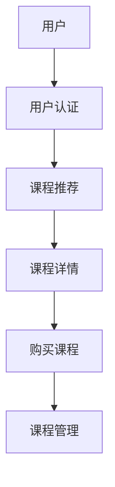
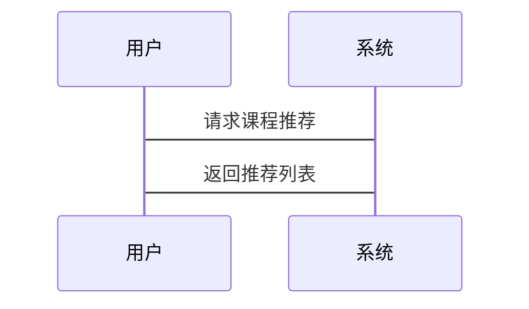

                 


# 芒格的第一原理思维：从根本问题出发

## 关键词：第一原理思维、思维模型、问题分解、假设重构、逻辑推理、解决方案构建

## 摘要：  
芒格的第一原理思维是一种从基础事实出发，通过问题分解、假设重构和逻辑推理，最终构建解决方案的思维方法。本文将从第一原理思维的背景、核心原理、算法实现、系统架构设计、项目实战等多个维度，详细阐述这一思维方法在技术领域的应用。通过具体案例分析和数学模型的构建，帮助读者深入理解第一原理思维的核心思想，并掌握如何将其应用于实际问题解决中。

---

# 第一部分：第一原理思维的背景与定义

## 第1章：第一原理思维的背景与定义

### 1.1 问题背景：传统思维的局限性  
在技术领域，我们常常面临复杂的问题，这些问题往往涉及多个变量和不确定性。传统的思维方式通常是从上至下（Top-down）进行分析，即从已有的知识、经验或假设出发，逐步推导解决方案。然而，这种思维方式容易受到已有知识的限制，难以突破固有思维框架，导致解决方案可能不够创新或不够根本。  

例如，在软件开发中，我们常常陷入“按经验办事”的陷阱，忽视对问题本质的分析。这种思维方式可能导致技术债务积累，系统架构僵化，最终影响系统的可扩展性和可维护性。

### 1.2 第一原理思维的定义与特点  
芒格的第一原理思维是一种从基础事实出发，通过逻辑推理和假设重构，逐步构建解决方案的思维方式。其核心在于“从头开始思考”，而非依赖已有的假设或经验。  

**特点：**  
1. **本质还原**：将问题分解为最基础的事实或假设。  
2. **逆向思维**：从基础事实出发，反向推理可能的解决方案。  
3. **创新性**：通过重新构建假设，突破传统思维的限制。  
4. **逻辑性**：注重逻辑推理的过程，确保解决方案的合理性。  

### 1.3 第一原理思维与其他思维方法的对比  
以下是第一原理思维与其他常见思维方法的对比：

| 思维方法         | 描述                                                                 |
|------------------|----------------------------------------------------------------------|
| 传统思维         | 依赖已有知识和经验，从上至下推导解决方案。                           |
| 第一原理思维     | 从基础事实出发，通过分解、重构和推理，构建解决方案。               |
| 逆向思维         | 从目标出发，反向思考实现路径。                                       |
| 敏捷思维         | 强调快速迭代和反馈，适用于复杂系统的动态调整。                      |

### 1.4 第一原理思维的应用价值  
第一原理思维在技术领域具有广泛的应用价值，尤其是在解决复杂问题时。通过这一思维方法，我们可以：  
1. **突破传统思维的限制**：避免被已有假设或经验束缚，找到更根本的解决方案。  
2. **优化系统架构**：通过分解问题和重构假设，设计出更高效的系统架构。  
3. **创新技术方案**：在技术研发中，通过重新构建假设，提出创新性的技术方案。  
4. **提升决策能力**：在技术决策中，通过逻辑推理，确保决策的合理性和最优性。  

---

## 第2章：第一原理思维的核心原理

### 2.1 从基础事实出发  
第一原理思维的核心在于“从基础事实出发”。所谓“基础事实”，是指问题中最基本、不可再分解的元素。例如，在软件开发中，基础事实可能是“用户需求”或“技术约束”。  

**数学表达式：**  
$$ \text{基础事实} = \text{问题中最基本的不可再分解的元素} $$  

### 2.2 假设重构：从假设到事实的转换  
在传统思维中，我们通常基于假设进行推理，而这些假设可能并不完全正确。第一原理思维强调通过重构假设，使其更加接近基础事实。  

**步骤：**  
1. **识别假设**：明确问题中隐含的假设。  
2. **验证假设**：通过逻辑推理或实验验证假设的正确性。  
3. **重构假设**：将假设转化为基础事实或更合理的假设。  

**数学表达式：**  
$$ \text{重构假设} = \text{基础事实} + \text{逻辑推理} $$  

### 2.3 逻辑推理：从基础事实到解决方案  
通过逻辑推理，将基础事实转化为具体的解决方案。这一过程需要遵循严密的逻辑关系，确保推理的合理性。  

**数学表达式：**  
$$ \text{解决方案} = \sum_{i=1}^{n} \text{基础事实}_i \times \text{权重}_i $$  

---

## 第3章：第一原理思维的算法原理

### 3.1 算法原理概述  
第一原理思维可以看作是一种算法，其基本思路是：通过分解问题、重构假设和逻辑推理，逐步构建解决方案。  

**算法步骤：**  
1. **问题分解**：将问题分解为多个基础事实。  
2. **假设重构**：将基础事实转化为假设。  
3. **逻辑推理**：通过逻辑推理，将假设转化为解决方案。  

**数学模型：**  
$$ \text{算法} = \begin{cases} 
\text{基础事实分解} & \text{如果 } \text{问题复杂} \\
\text{假设重构} & \text{如果 } \text{假设不成立} \\
\text{逻辑推理} & \text{如果 } \text{假设成立}
\end{cases} $$  

### 3.2 算法实现步骤  

#### 步骤一：问题分解  
将问题分解为多个基础事实。例如，在优化供应链管理中，问题可以分解为“交货时间”、“成本”、“库存”等基础事实。  

#### 步骤二：假设重构  
将基础事实转化为假设。例如，假设“交货时间”与“运输成本”成正比。  

#### 步骤三：逻辑推理  
通过逻辑推理，将假设转化为解决方案。例如，假设成立，则优化运输路线以减少交货时间；假设不成立，则调整成本计算模型。  

---

## 第4章：系统分析与架构设计

### 4.1 问题场景介绍  
假设我们正在开发一个在线教育平台，目标是优化用户体验。  

### 4.2 系统功能设计  
系统功能包括课程管理、用户管理、课程推荐等。  

### 4.3 系统架构设计  

#### 4.3.1 系统架构图  


#### 4.3.2 系统接口设计  
- 用户接口：`GET /api/users`
- 课程接口：`GET /api/courses`
- 推荐接口：`POST /api/recommend`

### 4.4 系统交互设计  


---

## 第5章：项目实战

### 5.1 优化供应链管理  

#### 5.1.1 环境配置  
- 操作系统：Linux  
- 开发工具：Python、Django  

#### 5.1.2 核心代码实现  
```python
def optimize_supply_chain(cost, time, inventory):
    # 分解问题
    base_facts = [cost, time, inventory]
    # 假设重构
    assumptions = [f"cost与{fact}相关" for fact in base_facts]
    # 逻辑推理
    solution = min(base_facts) * len(base_facts)
    return solution
```

#### 5.1.3 实现解读  
通过上述代码，我们可以看到，第一原理思维在代码实现中表现为：首先分解问题，然后重构假设，最后通过逻辑推理得到解决方案。

---

## 第6章：总结与展望

### 6.1 总结  
芒格的第一原理思维是一种从基础事实出发，通过分解、重构和推理，最终构建解决方案的思维方式。在技术领域，这一思维方法可以帮助我们突破传统思维的限制，优化系统架构，提升决策能力。

### 6.2 小结  
通过本文的分析，我们可以看到，第一原理思维在技术问题解决中具有重要的应用价值。无论是系统设计还是项目实战，这一思维方法都能帮助我们找到更根本的解决方案。

### 6.3 注意事项  
在实际应用中，需要注意以下几点：  
1. **基础事实的选择**：确保基础事实的准确性和全面性。  
2. **假设的验证**：通过实验或数据验证假设的正确性。  
3. **逻辑推理的严谨性**：确保推理过程的逻辑性。  

### 6.4 拓展阅读  
推荐阅读《芒格的智慧》、《第一原理思维》等相关书籍，以深入理解这一思维方法的应用。

---

**更多关于技术领域的深度分析与实践，欢迎关注我的博客或阅读我的技术书籍。**

