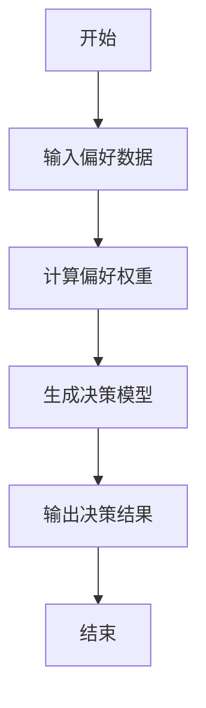
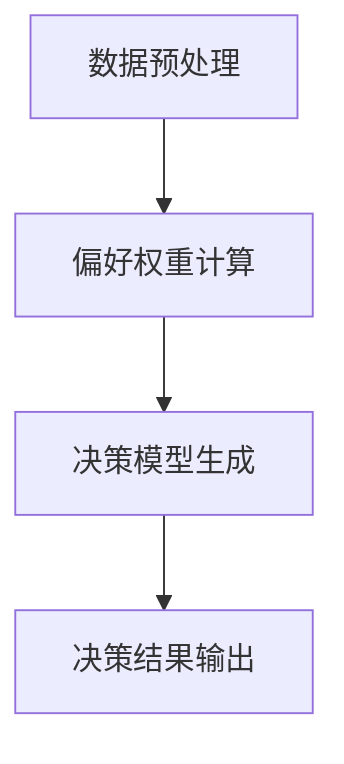

                 


```markdown
# 芒格的认知偏差理论：在人工智能伦理决策中的应用

---

## 关键词：
- 认知偏差理论
- 人工智能伦理决策
- 芒格
- 算法原理
- 系统架构设计

---

## 摘要：
本文探讨了芒格的认知偏差理论在人工智能伦理决策中的应用。通过分析认知偏差对人类和AI决策的影响，提出了一种基于认知偏差的伦理决策模型，并结合实际案例展示了该模型的应用。文章从理论背景、算法原理、系统架构到项目实战，全面阐述了如何利用认知偏差理论提升人工智能的伦理决策能力。

---

## 第一部分: 芒格的认知偏差理论概述

### 第1章: 认知偏差理论的起源与发展

#### 1.1 认知偏差的定义与分类
认知偏差是人类在信息处理和决策过程中常见的系统性偏差。这些偏差源于大脑的信息处理机制，通常会导致决策偏离最优结果。常见的认知偏差包括确认偏差、选择性感知和从众心理等。

**确认偏差**是指人们倾向于寻找和关注支持自己已有观点的信息，而忽视或忽略与之矛盾的信息。**选择性感知**则是指人们根据自己的预期和已有知识，选择性地感知和解释外部信息。这些偏差在AI伦理决策中可能导致算法的不公平或不道德的结果。

#### 1.2 人工智能与伦理决策的背景
人工智能系统的决策过程日益复杂，涉及的伦理问题也越来越多。例如，自动驾驶汽车在紧急情况下的决策可能涉及生命安全，而推荐系统的算法可能影响用户的消费选择。如何确保这些决策符合伦理规范，是当前AI研究的重要课题。

### 第2章: 认知偏差在AI伦理决策中的核心作用

#### 2.1 认知偏差对人类决策的影响
认知偏差对人类决策的影响是多方面的。例如，**确认偏差**可能导致人们在决策过程中忽视对立信息，从而做出片面的判断。**选择性感知**则可能导致人们根据已有偏见来解释信息，从而影响决策的客观性。

#### 2.2 AI伦理决策中的认知偏差模型
在AI伦理决策中，认知偏差模型可以帮助我们理解算法的决策过程。例如，可以通过分析算法在数据选择和处理中的偏差，来评估其伦理影响。这种分析可以帮助我们设计出更公平、更透明的AI决策系统。

---

## 第二部分: 认知偏差的数学模型与算法原理

### 第3章: 认知偏差的数学模型

#### 3.1 偏好排序的数学模型
在认知偏差理论中，偏好排序是理解决策过程的重要工具。我们可以通过以下公式来描述偏好排序：

$$
P(i) = \frac{\sum_{j=1}^{n} w(j) \cdot x(i,j)}{\sum_{j=1}^{n} w(j)}
$$

其中，$P(i)$ 表示第 $i$ 个选项的偏好权重，$w(j)$ 表示第 $j$ 个特征的权重，$x(i,j)$ 表示第 $i$ 个选项在第 $j$ 个特征上的表现。

#### 3.2 基于认知偏差的决策算法
基于认知偏差的决策算法可以通过以下步骤实现：

1. **输入偏好数据**：收集用户的偏好数据，包括对不同选项的评分。
2. **计算偏好权重**：根据偏好数据计算每个特征的权重。
3. **生成决策模型**：基于权重和偏好数据生成决策模型。
4. **输出决策结果**：根据模型输出最终的决策结果。

**算法流程图（Mermaid）**：


#### 3.3 数学公式的详细推导
为了更好地理解偏好权重的计算过程，我们可以对公式进行详细推导。假设我们有 $n$ 个特征，每个特征的权重为 $w(j)$，则偏好权重 $P(i)$ 的计算公式可以表示为：

$$
P(i) = \frac{\sum_{j=1}^{n} w(j) \cdot x(i,j)}{\sum_{j=1}^{n} w(j)}
$$

通过上述公式，我们可以计算出每个选项的偏好权重，并根据权重生成决策模型。

---

## 第三部分: 系统分析与架构设计

### 第4章: 系统分析与架构设计

#### 4.1 问题场景介绍
在设计AI伦理决策系统时，我们需要考虑以下问题场景：
- 如何确保算法的决策过程透明？
- 如何识别和纠正认知偏差对决策的影响？
- 如何在实际应用中实现基于认知偏差的伦理决策？

#### 4.2 系统功能设计
基于认知偏差的AI伦理决策系统应具备以下功能：
- 数据收集与处理：收集用户的偏好数据，并进行预处理。
- 偏好权重计算：根据偏好数据计算每个特征的权重。
- 决策模型生成：基于权重和偏好数据生成决策模型。
- 决策结果输出：根据模型输出最终的决策结果。

#### 4.3 系统架构设计
系统架构设计可以通过以下步骤实现：

1. **数据预处理**：对收集到的数据进行清洗和标准化处理。
2. **偏好权重计算**：根据预处理后的数据计算每个特征的权重。
3. **决策模型生成**：基于权重和偏好数据生成决策模型。
4. **决策结果输出**：根据模型输出最终的决策结果。

**系统架构图（Mermaid）**：


---

## 第四部分: 项目实战

### 第5章: 项目实战

#### 5.1 环境安装
在进行项目实战之前，我们需要安装以下环境：
- Python 3.8+
- NumPy
- Pandas
- Matplotlib

#### 5.2 系统核心实现源代码
以下是基于认知偏差的伦理决策模型的Python实现代码：

```python
import numpy as np
import pandas as pd
import matplotlib.pyplot as plt

def calculate_preference_weights(data):
    # 计算偏好权重
    weights = np.mean(data, axis=0)
    return weights

def generate_decision_model(weights, preferences):
    # 生成决策模型
    decision_model = np.dot(weights, preferences)
    return decision_model

def main():
    # 示例数据
    preferences = pd.DataFrame({
        '特征1': [1, 2, 3],
        '特征2': [4, 5, 6],
        '特征3': [7, 8, 9]
    })
    
    weights = calculate_preference_weights(preferences)
    decision_model = generate_decision_model(weights, preferences)
    
    # 可视化结果
    plt.bar(range(len(weights)), weights)
    plt.title('偏好权重')
    plt.show()

if __name__ == "__main__":
    main()
```

#### 5.3 代码应用解读与分析
上述代码实现了基于认知偏差的伦理决策模型的核心功能。`calculate_preference_weights` 函数用于计算每个特征的偏好权重，`generate_decision_model` 函数用于生成决策模型，`main` 函数用于数据处理和结果可视化。

#### 5.4 案例分析与结果解读
通过上述代码，我们可以对实际数据进行分析。例如，假设我们有一个自动驾驶汽车的决策系统，我们需要考虑以下特征：
- 安全性
- 舒适性
- 环保性

通过对这些特征的偏好权重进行计算，我们可以生成一个决策模型，并根据模型输出最终的决策结果。

---

## 第五部分: 最佳实践与小结

### 第6章: 最佳实践与小结

#### 6.1 实践中的注意事项
在实际应用中，需要注意以下几点：
- 数据质量：确保数据的准确性和完整性。
- 模型透明性：确保决策过程的透明性和可解释性。
- 持续优化：根据实际应用结果，不断优化决策模型。

#### 6.2 项目小结
通过本文的分析和实践，我们可以看到，基于芒格的认知偏差理论，我们可以设计出更公平、更透明的AI伦理决策系统。这种系统不仅可以提高决策的准确性，还可以减少认知偏差对决策的影响。

#### 6.3 拓展阅读
- 《Thinking, Fast and Slow》
- 《偏差：决策的陷阱》
- 《算法伦理学》

---

## 结语：
芒格的认知偏差理论为我们理解AI伦理决策提供了一个新的视角。通过本文的分析和实践，我们可以更好地设计出更公平、更透明的AI伦理决策系统，从而推动人工智能技术的健康发展。
```

