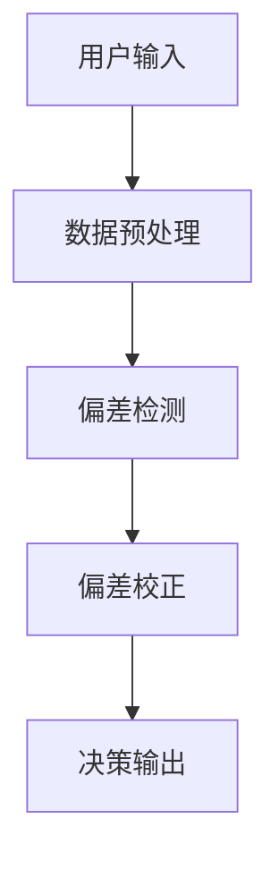

                 

# 芒格的认知偏差理论：在人工智能决策时代的应用

**关键词：** 认知偏差、芒格理论、人工智能决策、算法优化、系统架构

**摘要：**  
芒格的认知偏差理论揭示了人类在决策过程中常见的心理偏差，这些偏差在人工智能时代同样影响着AI的决策过程。本文将从认知偏差的基本理论出发，分析其在人工智能决策中的表现，探讨如何通过算法优化和系统设计来校正这些偏差，从而提升AI的决策质量。文章结合实际案例，详细讲解了认知偏差检测与校正的算法实现，以及在金融、医疗等领域的应用，为人工智能决策优化提供了新的思路。

---

## 第一部分：认知偏差的基本理论

### 第1章：认知偏差的核心概念

#### 1.1 认知偏差的定义与分类
认知偏差是人类在信息处理和决策过程中常见的系统性错误。这些偏差源于大脑的简化处理机制，使得人们在面对复杂信息时，倾向于选择性地感知、记忆和判断。常见的认知偏差包括：
- **确认偏差（Confirmation Bias）**：倾向于寻找和确认支持已有假设的信息，忽略矛盾信息。
- **选择性注意（Selective Attention）**：关注某些信息而忽略其他信息。
- **锚定效应（Anchoring Effect）**：过度依赖初始信息，导致决策偏差。
- **从众效应（Conformity Effect）**：为了融入群体而改变自身判断。

#### 1.2 认知偏差的形成机制
认知偏差的形成与大脑的信息处理机制密切相关。大脑在面对复杂问题时，倾向于采用简化的方式进行判断，以节省认知资源。这种简化处理可能导致以下后果：
- **信息处理的简化**：大脑倾向于快速决策，而非深思熟虑。
- **情感因素的干扰**：情感倾向会扭曲信息处理过程。
- **记忆偏差**：记忆中的信息会被有意或无意地扭曲，以符合已有认知框架。

#### 1.3 认知偏差对决策的影响
认知偏差会显著影响决策的质量，尤其是在复杂决策场景中。例如：
- **金融投资中的确认偏差**：投资者倾向于寻找支持自己投资决策的信息，导致过度自信和投资失误。
- **医疗诊断中的从众效应**：医生在面对不确定的诊断时，可能因从众效应而忽略患者的真实症状。

---

### 第2章：芒格认知偏差理论的核心思想

#### 2.1 芒格理论的核心观点
芒格的认知偏差理论强调了以下几点：
- **偏差的系统性**：认知偏差是人类决策过程中的必然现象，而非随机错误。
- **偏差的可预测性**：通过研究偏差的类型和特征，可以预测和校正偏差。
- **偏差的双重性**：虽然偏差可能导致错误决策，但也可能在某些情况下被利用以优化结果。

#### 2.2 芒格理论与决策优化
芒格理论为决策优化提供了理论基础。通过识别和校正认知偏差，可以显著提升决策的质量。例如：
- **在投资决策中**：通过识别确认偏差，投资者可以更加客观地评估信息，避免过度自信。
- **在医疗诊断中**：通过识别从众效应，医生可以更加独立地分析患者症状，避免随波逐流的错误诊断。

---

## 第二部分：人工智能决策机制

### 第3章：人工智能决策的基本原理

#### 3.1 人工智能决策的核心技术
人工智能决策主要依赖以下技术：
- **机器学习**：通过训练数据，模型可以学习决策规则。
- **深度学习**：通过多层神经网络，模型可以处理复杂信息。
- **强化学习**：通过试错机制，模型可以优化决策策略。

#### 3.2 人工智能决策中的偏差表现
在人工智能决策中，认知偏差可能以以下形式表现：
- **数据偏差**：训练数据中的偏差会直接影响模型的决策。
- **算法偏差**：算法的设计可能导致决策偏差。
- **结果偏差**：模型输出的结果可能因偏差而产生错误。

---

### 第4章：认知偏差在人工智能中的具体表现

#### 4.1 数据偏差
数据偏差是人工智能决策中的常见问题。例如：
- **训练数据中的样本偏差**：某些群体或场景的数据不足，导致模型对这些群体的决策不准确。
- **标签偏差**：标签的标注偏差会影响模型的训练效果。

#### 4.2 模型偏差
模型偏差源于算法设计的局限性。例如：
- **决策树的偏差**：决策树的分支设计可能导致对某些特征的过度依赖。
- **神经网络的偏差**：网络结构的设计可能忽略某些重要的特征。

---

## 第三部分：认知偏差的算法优化

### 第5章：认知偏差检测算法

#### 5.1 基于统计的偏差检测
通过统计方法，可以检测数据中的偏差。例如：
- **分布差异检测**：通过比较不同群体的分布，发现数据偏差。
- **异常值检测**：通过识别异常值，发现数据中的偏差。

#### 5.2 基于机器学习的偏差检测
机器学习算法可以用于检测认知偏差。例如：
- **偏差检测模型**：通过训练模型，识别数据中的偏差。
- **偏差分类模型**：通过分类算法，判断数据中的偏差类型。

---

### 第6章：认知偏差的校正算法

#### 6.1 数据清洗方法
通过清洗数据，可以消除数据中的偏差。例如：
- **重新采样**：通过调整数据样本，平衡数据分布。
- **数据增强**：通过增加数据多样性，减少偏差。

#### 6.2 模型优化方法
通过优化模型，可以减少偏差的影响。例如：
- **参数调节**：通过调整模型参数，减少偏差。
- **模型融合**：通过融合多个模型，减少偏差。

---

## 第四部分：系统架构与实际应用

### 第7章：系统架构设计

#### 7.1 系统功能设计
认知偏差校正系统的核心功能包括：
- **偏差检测**：识别数据中的偏差。
- **偏差校正**：通过算法校正偏差。
- **结果评估**：评估校正后的决策质量。

#### 7.2 系统架构图
以下是认知偏差校正系统的架构图：

---

### 第8章：实际应用案例

#### 8.1 金融领域的应用
在金融领域，认知偏差校正算法可以用于投资决策优化。例如：
- **投资组合优化**：通过校正数据偏差，优化投资组合。
- **风险评估**：通过校正模型偏差，提高风险评估的准确性。

#### 8.2 医疗领域的应用
在医疗领域，认知偏差校正算法可以用于诊断优化。例如：
- **诊断模型优化**：通过校正数据偏差，提高诊断准确性。
- **治疗方案优化**：通过校正模型偏差，优化治疗方案。

---

## 第五部分：总结与展望

### 第9章：总结

#### 9.1 核心观点回顾
认知偏差是人类和人工智能决策中的常见问题，但通过算法优化和系统设计，可以显著减少偏差的影响。

#### 9.2 最佳实践
- **数据清洗**：在数据预处理阶段，进行充分的数据清洗。
- **模型优化**：在模型设计阶段，进行偏差校正。
- **结果评估**：在决策输出阶段，评估校正效果。

### 第10章：未来展望

#### 10.1 拓展方向
- **多模态数据处理**：结合文本、图像等多种数据类型，进一步减少偏差。
- **实时校正**：开发实时校正算法，提高决策的及时性。
- **个性化校正**：根据不同场景和用户需求，进行个性化校正。

---

**结语：**  
芒格的认知偏差理论为人工智能决策优化提供了重要的理论基础。通过算法优化和系统设计，可以显著减少认知偏差的影响，提升AI的决策质量。未来，随着技术的不断发展，认知偏差校正算法将更加精准，人工智能决策将更加智能和可靠。

