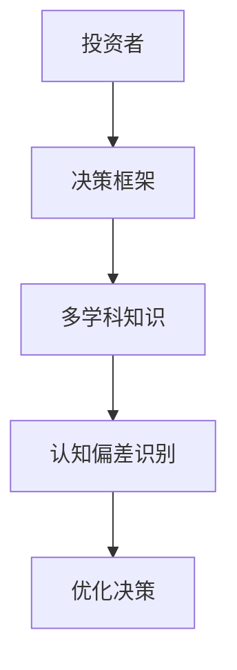

                 


# 芒格的认知偏差理论：如何克服投资中的心理陷阱

---

## 关键词  
认知偏差，芒格，投资心理学，决策框架，心理陷阱

---

## 摘要  
本文深入探讨了芒格的认知偏差理论，分析了认知偏差对投资决策的负面影响，并提供了克服这些心理陷阱的方法和策略。通过结合实际案例和系统化的决策框架，本文为投资者提供了实用的工具，帮助他们在投资过程中避免常见心理陷阱，提升决策的科学性和有效性。

---

# 第一部分：认知偏差与芒格投资理论基础

## 第1章：认知偏差的基本概念

### 1.1 认知偏差的定义与分类  
认知偏差是指人们在信息处理和决策过程中，由于主观因素的影响，导致偏离事实或理性判断的倾向。以下是常见的认知偏差类型：  
- **确认偏差**：倾向于寻找支持已有观点的信息，忽视相反证据。  
- **从众心理**：因害怕孤立而随大流，可能导致错误决策。  
- **过度自信**：高估自身判断的准确性，忽略不确定性。  

### 1.2 芝加哥学派与芒格的理论背景  
芒格的认知偏差理论深受芝加哥学派的影响，强调人类决策的非理性特征。芒格提出，投资者应通过构建决策框架来识别和克服认知偏差。  

### 1.3 投资中的认知偏差问题  
认知偏差在投资中尤为常见，可能导致投资者做出非理性决策，如高位买入或低位卖出。克服这些偏差是投资成功的关键。

---

## 第2章：认知偏差的分类与影响

### 2.1 确认偏差  
确认偏差使投资者倾向于寻找支持自己观点的信息，忽视相反证据。例如，投资者可能只关注利好消息，而忽略负面信号。  

### 2.2 从众心理  
从众心理可能导致投资者盲目跟风，忽视独立分析。例如，市场热炒某股票时，投资者可能盲目追涨，忽视其基本面。  

### 2.3 过度自信  
过度自信使投资者高估自己的判断能力，低估风险。例如，投资者可能认为自己能精准预测市场走势，而忽视市场的不确定性。  

### 2.4 案例分析：认知偏差在实际投资中的表现  
- **案例1**：投资者A在市场热炒某科技股时，盲目跟风买入，未关注其高估值风险。  
- **案例2**：投资者B在持有某股票后，只关注正面新闻，忽视负面消息，导致高位被套。  

---

## 第3章：认知偏差的识别与克服方法

### 3.1 认知偏差的识别方法  
- **自我反思法**：定期回顾自己的决策，识别是否存在认知偏差。  
- **对比分析法**：通过对比不同观点，识别是否存在选择性信息处理。  
- **数据验证法**：用数据验证自己的观点，避免主观判断。  

### 3.2 认知偏差的克服策略  
- **提高自我认知**：通过学习和反思，识别自己的认知偏差。  
- **建立决策框架**：芒格提出“格栅式思维”，通过多学科知识构建决策框架。  
- **寻求外部反馈**：与他人讨论，避免从众心理和过度自信。  

---

## 第4章：认知偏差与投资决策

### 4.1 投资决策中的常见认知偏差  
- **确认偏差**：投资者倾向于寻找支持自己观点的信息，导致决策失误。  
- **从众心理**：投资者随大流，忽视独立分析。  
- **过度自信**：投资者高估自身判断能力，低估风险。  

### 4.2 芒格的决策框架  
芒格的“格栅式思维”强调多学科知识的交叉应用，帮助投资者全面分析问题。例如，在投资决策中，应结合经济学、心理学、统计学等多学科知识，避免单一视角的偏差。  

---

## 第5章：系统分析与架构设计

### 5.1 问题场景介绍  
投资者在面对复杂市场环境时，容易受到认知偏差的影响，导致决策失误。  

### 5.2 系统功能设计  
- **领域模型**：构建投资者行为模型，分析其决策过程中的认知偏差。  
- **系统架构**：设计一个基于芒格决策框架的投资分析系统，帮助投资者识别和克服认知偏差。  

### 5.3 系统架构设计  
以下是系统架构的mermaid图：  



---

## 第6章：项目实战

### 6.1 环境安装  
- **工具**：使用Excel或Python进行数据分析，结合MindMap工具进行决策框架设计。  

### 6.2 核心实现  
- **代码示例**：以下是一个基于Python的认知偏差识别工具的代码示例：  

```python  
def identify_bias(feedback):  
    biases = ["确认偏差", "从众心理", "过度自信"]  
    for bias in biases:  
        if feedback.find(bias) != -1:  
            return bias  
    return "无明显偏差"  

# 示例应用  
feedback = "这个股票上涨是必然的，我之前也买过类似的股票，都涨了。"  
result = identify_bias(feedback)  
print(f"识别到的认知偏差：{result}")  
```

### 6.3 案例分析  
- **案例1**：投资者A在市场热炒某股票时，使用上述工具识别到“从众心理”，并决定独立分析，避免盲目跟风。  

---

## 第7章：总结与建议

### 7.1 小结  
芒格的认知偏差理论为我们提供了克服投资心理陷阱的工具和方法。通过识别和克服认知偏差，投资者可以做出更理性的决策。  

### 7.2 最佳实践 tips  
- **定期反思**：定期回顾自己的决策，识别是否存在认知偏差。  
- **构建框架**：使用芒格的决策框架，结合多学科知识进行分析。  
- **寻求反馈**：与他人讨论，避免从众心理和过度自信。  

### 7.3 拓展阅读  
- 《投资最重要的事情》——本杰明·格雷厄姆  
- 《行为学的投资者》——查尔斯·达尔文  

---

通过以上方法，投资者可以有效克服认知偏差，提升投资决策的科学性和准确性。芒格的理论为我们提供了宝贵的指导，帮助我们在复杂多变的市场中做出更明智的选择。

