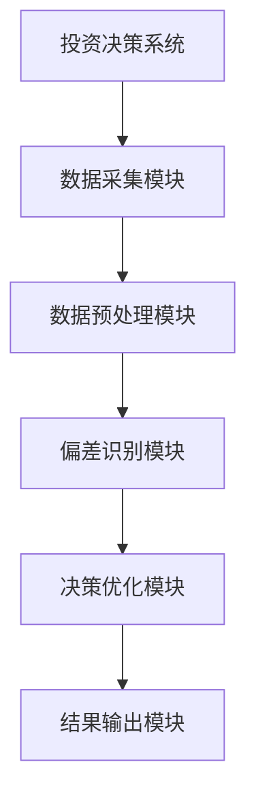

                 


# 芒格的"误判心理学"应用：提高投资决策质量

## 关键词
- 误判心理学
- 投资决策
- 心理偏差
- 芒格思想
- 投资策略
- 心理学模型

## 摘要
本文深入探讨了芒格的“误判心理学”在投资决策中的应用，分析了常见心理偏差对投资决策的影响，并提出了基于心理学原理的投资优化策略。通过数学建模和系统设计，本文提供了一套识别和优化心理偏差的方法，帮助投资者提高决策质量。

---

# 第一部分：芒格的“误判心理学”概述

## 第1章：芒格的“误判心理学”背景与核心概念

### 1.1 投资决策中的心理学问题
- 1.1.1 投资决策中的常见心理偏差：确认偏差、从众心理、损失厌恶等。
- 1.1.2 误判心理学的核心问题：心理偏差如何影响投资决策。
- 1.1.3 芒格的“误判心理学”在投资中的重要性：如何通过识别和避免心理偏差提高决策质量。

### 1.2 心理偏差与投资决策
- 1.2.1 心理偏差的定义与分类：认知偏差、情感偏差、行为偏差。
- 1.2.2 常见心理偏差对投资决策的影响：从众心理导致跟风投资，确认偏差导致过度自信。
- 1.2.3 心理偏差与投资失败的案例分析：真实案例中心理偏差的表现和后果。

### 1.3 芒格的“误判心理学”理论框架
- 1.3.1 芒格的“误判心理学”核心思想：通过识别和纠正心理偏差优化决策。
- 1.3.2 芒格对心理偏差的分类与分析：具体偏差的定义、特征及对决策的影响。
- 1.3.3 芒格的“误判心理学”在投资中的应用：如何在实际投资中应用这些理论。

---

## 第2章：心理偏差的数学模型与分析

### 2.1 心理偏差的数学建模
- 2.1.1 心理偏差的数学表达：使用概率论和统计学模型描述偏差。
- 2.1.2 常见心理偏差的数学模型：从众心理的统计分布模型，确认偏差的概率模型。
- 2.1.3 心理偏差对投资决策的影响公式：量化偏差对决策质量的影响。

### 2.2 心理偏差与投资决策的数学关系
- 2.2.1 心理偏差对投资决策的数学影响：偏差如何影响收益和风险。
- 2.2.2 投资决策中的概率与统计分析：如何通过数据分析识别偏差。
- 2.2.3 心理偏差与投资收益的数学关系：建立偏差与收益的数学模型。

---

## 第3章：芒格的“误判心理学”算法原理

### 3.1 心理偏差识别算法
- 3.1.1 心理偏差识别的算法步骤：数据收集、特征提取、偏差分类。
- 3.1.2 心理偏差识别的数学模型：使用分类算法识别偏差。
- 3.1.3 心理偏差识别的算法实现：Python代码示例。

### 3.2 投资决策优化算法
- 3.2.1 投资决策优化的算法原理：基于偏差识别优化决策。
- 3.2.2 投资决策优化的数学模型：构建优化模型。
- 3.2.3 投资决策优化的算法实现：使用优化算法改进决策质量。

---

## 第4章：系统分析与架构设计

### 4.1 投资决策系统框架
- 4.1.1 投资决策系统的组成：数据采集模块、偏差识别模块、决策优化模块。
- 4.1.2 投资决策系统的功能模块：数据预处理、偏差分析、决策优化。
- 4.1.3 投资决策系统的架构图：使用Mermaid绘制系统架构图。

### 4.2 心理偏差识别与优化模块
- 4.2.1 心理偏差识别模块的设计：功能设计与实现。
- 4.2.2 心理偏差优化模块的设计：优化策略与实现。
- 4.2.3 模块之间的交互关系：数据流与功能交互。

---

## 第5章：项目实战与案例分析

### 5.1 项目环境与工具安装
- 5.1.1 开发环境的搭建：操作系统、编程语言、开发工具。
- 5.1.2 必要工具的安装：数据处理工具、建模工具、可视化工具。
- 5.1.3 数据集的准备：收集投资决策数据，提取心理偏差特征。

### 5.2 心理偏差识别与优化的实现
- 5.2.1 代码实现的详细步骤：从数据预处理到模型训练。
- 5.2.2 代码的功能解读：关键函数和模块的解释。
- 5.2.3 代码的优化与改进：性能优化和功能扩展。

### 5.3 案例分析与结果解读
- 5.3.1 案例背景介绍：具体投资案例的选择。
- 5.3.2 案例分析过程：偏差识别、决策优化。
- 5.3.3 案例结果的解读：优化后的决策效果分析。

---

## 第6章：最佳实践与小结

### 6.1 最佳实践总结
- 6.1.1 心理偏差识别的关键点：数据质量、模型选择、结果验证。
- 6.1.2 投资决策优化的注意事项：模型的适用性、数据的代表性、结果的可解释性。

### 6.2 投资决策优化的策略
- 6.2.1 通过心理偏差识别优化投资决策。
- 6.2.2 结合技术分析和基本面分析提高决策质量。
- 6.2.3 定期回顾和优化投资策略。

### 6.3 未来研究方向
- 6.3.1 更复杂的心理偏差模型研究。
- 6.3.2 人工智能在心理偏差识别中的应用。
- 6.3.3 投资决策系统与心理偏差识别系统的集成。

---

## 附录：相关代码与工具

### 附录A：心理偏差识别代码示例
```python
def identify_bias(data):
    # 数据预处理
    processed_data = preprocess(data)
    # 偏差识别
    bias = classify(processed_data)
    return bias
```

### 附录B：系统架构图


### 附录C：数学公式
$$
\text{收益} = \text{投资金额} \times (1 + \text{收益率})
$$

---

通过以上目录，我们可以系统地学习芒格的“误判心理学”在投资决策中的应用，从理论到实践，逐步优化投资决策质量。

