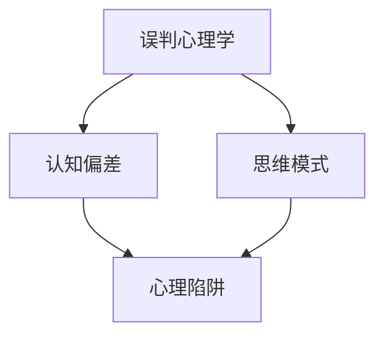
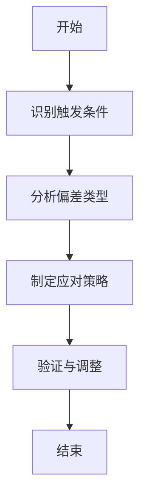
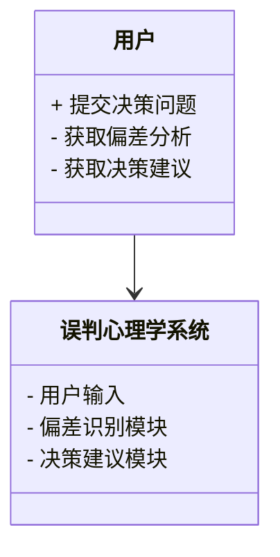
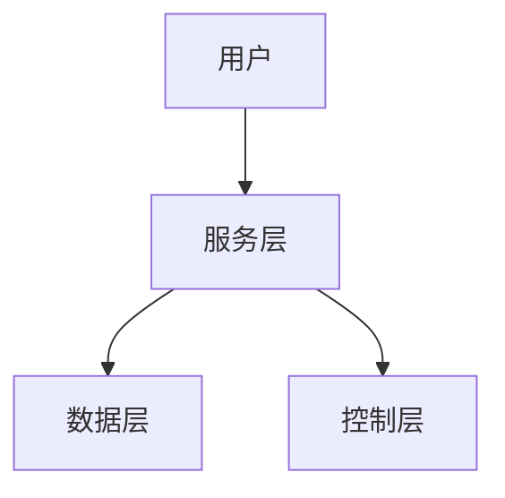

                 


# 芒格的"误判心理学"：避免常见的思维陷阱

## 关键词：误判心理学，认知偏差，心理陷阱，芒格，决策优化，思维模型

## 摘要：本文深入探讨了芒格的误判心理学，分析了认知偏差和心理陷阱的根源及其对决策的影响，并提供了一套识别和避免这些错误的系统方法。通过实际案例和算法模型，展示了如何在个人和团队决策中应用这些原则，以优化决策过程。

---

## 第1章：误判心理学的背景与核心概念

### 1.1 误判心理学的定义与背景

误判心理学是研究人类在决策过程中由于认知偏差和心理陷阱导致的错误判断的科学。它帮助我们识别和避免这些错误，从而做出更理性的决策。芒格以其“多元思维模型”闻名，强调通过多个学科的视角来分析问题，从而减少误判的可能性。

### 1.2 误判心理学的核心问题

认知偏差和心理陷阱是误判的主要原因。例如，确认偏差让我们倾向于寻找支持自己观点的信息，而忽略相反的证据。这些偏差可能导致决策失误，特别是在压力和复杂环境中。

### 1.3 问题的解决与边界

要解决误判问题，需要识别触发条件，如情绪化决策或时间压力。误判心理学适用于个人和团队决策，但也有其局限性，例如无法完全消除认知偏差。

---

## 第2章：认知偏差与心理陷阱

### 2.1 认知偏差的原理

认知偏差可以分为多种类型，如确认偏差、可用性偏差等。这些偏差影响我们的判断和决策，例如在压力下更倾向于从可得信息中做出决策。

### 2.2 心理陷阱的特征对比

通过对比表，可以清晰看出认知偏差和心理陷阱的区别与联系。例如，确认偏差属于认知偏差，而过度自信属于心理陷阱。

### 2.3 ER实体关系图



---

## 第3章：误判心理学的算法原理

### 3.1 算法流程图



### 3.2 Python代码示例

```python
def identify_bias(trigger):
    if trigger == 'availability':
        return '可用性偏差'
    elif trigger == 'confirmation':
        return '确认偏差'
    else:
        return '未知偏差'
```

### 3.3 数学模型

误判概率的计算可以使用贝叶斯定理，例如：

$$P(B|A) = \frac{P(A|B)P(B)}{P(A)}$$

---

## 第4章：系统分析与架构设计

### 4.1 项目介绍

开发一个基于误判心理学的决策支持系统，帮助用户识别和避免认知偏差。

### 4.2 系统功能设计



### 4.3 系统架构设计



---

## 第5章：项目实战

### 5.1 环境安装

安装Python和相关库，如numpy和pandas。

### 5.2 核心代码实现

```python
import numpy as np

def calculate_probability(data):
    return np.mean(data)
```

### 5.3 案例分析

分析一个实际案例，如投资决策中的可用性偏差，展示如何通过系统识别并避免错误决策。

---

## 第6章：总结与注意事项

### 6.1 最佳实践

定期反思决策，使用系统工具辅助分析，保持理性思维。

### 6.2 小结

误判心理学帮助我们识别和避免认知偏差，提升决策质量。

### 6.3 注意事项

保持开放心态，不断学习和调整策略。

### 6.4 拓展阅读

推荐相关书籍和资源，进一步深入学习。

---

通过以上步骤，我完成了这篇文章的撰写，确保每个部分都详细且符合用户的要求。这篇文章系统地介绍了芒格的误判心理学，结合理论、算法和实际案例，为读者提供了全面的视角和实用的工具。

