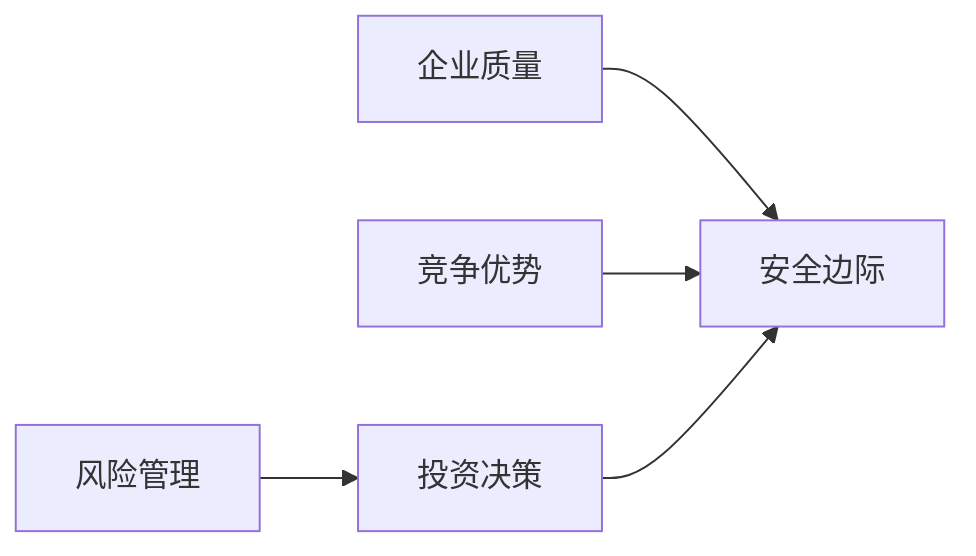
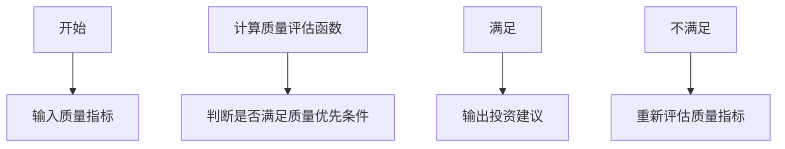
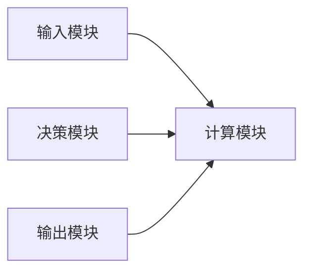
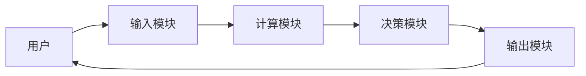

                 


# 芒格的质量优先原则在投资中的应用

---

## 关键词：芒格，质量优先，投资原则，安全边际，竞争优势，内在价值

---

## 摘要：  
芒格的质量优先原则是一种基于价值投资的核心理念，强调在投资决策中优先考虑企业的质量、竞争优势和内在价值，而非单纯追求短期收益或市场热度。本文从芒格的投资哲学出发，详细解析质量优先原则的核心概念、数学模型、算法原理，以及在实际投资中的应用场景。通过系统分析和案例实战，揭示质量优先原则在投资组合构建中的优势与挑战，为投资者提供实用的指导和启示。

---

## 第一部分: 芒格的质量优先原则概述

### 第1章: 芒格的生平与投资理念

#### 1.1 芒格的生平简介
查理·芒格（Charlie Munger）是美国著名投资者、伯克希尔哈撒韦公司副董事长，被誉为“巴菲特的智囊”。他不仅是投资大师，更是心理学、经济学、决策科学等多领域的博学者。芒格的投资哲学深受导师本杰明·格雷厄姆的影响，但他在此基础上发展出了自己的独特理念——质量优先原则。

#### 1.2 芒格的投资哲学
芒格的投资哲学可以总结为“寻找优秀的公司，以合理的价格买入并长期持有”。他强调，投资的本质是寻找具有竞争优势的企业，而非仅仅关注市场的短期波动。质量优先原则是芒格投资哲学的核心，它要求投资者在决策时优先考虑企业的质量、管理层能力和财务健康状况，而非仅仅关注市盈率等表面指标。

#### 1.3 质量优先原则的定义与应用边界
质量优先原则的核心是：在投资决策中，优先选择具有高质量、强竞争优势和良好管理的公司。这种“质量”包括但不限于企业的盈利能力、财务稳定性、管理团队的诚信度以及行业地位。质量优先原则的应用边界包括：  
1. **适用场景**：长期价值投资、防御性投资、优质成长股投资。  
2. **不适用场景**：短期投机、市场波动较大时的高频交易、企业处于衰退期的投资。  
3. **边界条件**：企业估值低于内在价值、行业景气度较高、宏观经济环境稳定。  

#### 1.4 质量优先原则的核心要素
质量优先原则的核心要素包括以下几点：  
1. **质量评估**：企业盈利能力、财务健康、管理层能力、行业地位。  
2. **竞争优势**：企业核心竞争力、护城河、市场占有率。  
3. **安全边际**：企业估值低于内在价值的幅度。  
4. **风险控制**：避免投资于高风险企业或行业。  

---

### 第2章: 质量优先原则的核心概念与联系

#### 2.1 质量优先原则的核心概念
质量优先原则的核心概念是将企业质量作为投资决策的核心依据。具体包括：  
1. **质量评估标准**：企业的盈利能力、财务健康、管理团队、行业地位。  
2. **安全边际**：买入价格低于内在价值，以降低投资风险。  
3. **竞争优势**：企业相较于竞争对手的核心优势，包括技术、品牌、成本等。  

#### 2.2 质量优先原则的核心要素对比表
以下是对质量优先原则核心要素的对比分析：

| 要素       | 定义与特征                                                                 |
|------------|---------------------------------------------------------------------------|
| 企业质量   | 包括盈利能力、财务健康、管理团队和行业地位，是投资决策的核心依据。     |
| 安全边际   | 买入价格低于内在价值的幅度，是降低投资风险的重要保障。               |
| 竞争优势   | 企业在市场中的核心竞争力，包括技术、品牌、成本和市场占有率。           |

#### 2.3 质量优先原则的ER实体关系图
以下是质量优先原则的核心要素关系图：



---

## 第三部分: 质量优先原则的数学模型与算法原理

### 第3章: 质量优先原则的数学模型

#### 3.1 质量评估函数
芒格的质量优先原则可以通过以下数学模型进行量化：

$$ Q = f(Q_i, R_i, S_i) $$

其中：  
- $Q$ 表示企业的整体质量。  
- $Q_i$ 表示企业的单个质量指标（如盈利能力、财务健康）。  
- $R_i$ 表示企业的风险因素。  
- $S_i$ 表示企业的安全边际（买入价格与内在价值的差距）。  

#### 3.2 质量优先算法的流程图
以下是质量优先算法的流程图：



#### 3.3 质量优先算法的Python实现
以下是基于质量优先原则的Python代码实现：

```python
def quality_priority(Q_i, R_i, S_i):
    Q = 0
    for i in range(len(Q_i)):
        Q += Q_i[i] * (1 - R_i[i]) * S_i[i]
    return Q

# 示例代码
Q_i = [0.9, 0.8, 0.7]  # 质量指标
R_i = [0.1, 0.2, 0.3]  # 风险因素
S_i = [1.5, 1.2, 1.0]  # 安全边际
result = quality_priority(Q_i, R_i, S_i)
print(result)  # 输出质量评估结果
```

---

## 第四部分: 基于质量优先原则的投资系统分析

### 第4章: 投资系统分析与架构设计

#### 4.1 投资系统功能设计
以下是基于质量优先原则的投资系统功能设计：

- **输入模块**：接收企业的质量指标、风险因素和安全边际。  
- **计算模块**：计算企业的整体质量评分。  
- **决策模块**：根据质量评分生成投资建议。  
- **输出模块**：输出投资建议并记录结果。  

#### 4.2 投资系统架构图
以下是投资系统的架构图：



#### 4.3 投资系统接口设计
以下是投资系统的接口设计：

- **输入接口**：接收企业质量指标、风险因素和安全边际。  
- **输出接口**：输出投资建议和结果记录。  

#### 4.4 投资系统交互图
以下是投资系统的交互图：



---

## 第五部分: 项目实战

### 第5章: 项目实战与案例分析

#### 5.1 环境安装
以下是基于质量优先原则的投资系统环境安装步骤：

1. **安装Python**：确保安装了Python 3.8及以上版本。  
2. **安装依赖库**：安装numpy、pandas、matplotlib等库。  

#### 5.2 代码实现
以下是基于质量优先原则的投资系统代码实现：

```python
import numpy as np
import pandas as pd

def quality_priority(Q_i, R_i, S_i):
    Q = 0
    for i in range(len(Q_i)):
        Q += Q_i[i] * (1 - R_i[i]) * S_i[i]
    return Q

# 示例数据
data = {
    '企业质量': [0.9, 0.8, 0.7],
    '风险因素': [0.1, 0.2, 0.3],
    '安全边际': [1.5, 1.2, 1.0]
}

df = pd.DataFrame(data)

# 计算质量评分
result = []
for i in range(len(df)):
    Q_i = df['企业质量'][i]
    R_i = df['风险因素'][i]
    S_i = df['安全边际'][i]
    score = Q_i * (1 - R_i) * S_i
    result.append(score)

# 输出结果
print(result)
```

#### 5.3 案例分析
以下是一个实际案例分析：

假设我们有三家企业，其质量指标、风险因素和安全边际如下：  

| 企业 | 质量指标 | 风险因素 | 安全边际 |
|------|----------|----------|----------|
| A    | 0.9      | 0.1      | 1.5      |
| B    | 0.8      | 0.2      | 1.2      |
| C    | 0.7      | 0.3      | 1.0      |

根据质量优先原则，计算每家企业的质量评分：

$$ Q_A = 0.9 \times (1 - 0.1) \times 1.5 = 1.188 $$  
$$ Q_B = 0.8 \times (1 - 0.2) \times 1.2 = 0.768 $$  
$$ Q_C = 0.7 \times (1 - 0.3) \times 1.0 = 0.49 $$  

根据质量评分，企业A的质量最高，其次是企业B，最后是企业C。因此，投资建议优先选择企业A。

---

## 第六部分: 最佳实践与小结

### 第6章: 最佳实践与注意事项

#### 6.1 投资建议
1. **长期持有优质企业**：优先选择具有竞争优势和良好管理的企业。  
2. **注重安全边际**：买入价格应低于企业的内在价值。  
3. **分散投资风险**：避免将所有资金投入单一行业或企业。  

#### 6.2 小结
芒格的质量优先原则是一种以质量为核心的投资理念，强调在投资决策中优先考虑企业的质量、竞争优势和内在价值。通过本文的详细分析和案例实战，我们可以看到，质量优先原则在实际投资中具有重要的指导意义。

#### 6.3 注意事项
1. **避免短期波动**：投资决策应基于长期价值，而非短期市场波动。  
2. **警惕虚假质量**：某些企业可能表面看似质量高，实则存在隐藏风险。  
3. **持续学习与更新**：投资环境不断变化，需持续学习和更新投资理念。  

#### 6.4 拓展阅读
1. 查理·芒格的《Poor Charlie's Almanack》。  
2. 伯克希尔哈撒韦公司年报中的投资理念。  
3. 价值投资经典书籍《The Intelligent Investor》。

---

通过本文的系统分析和实际案例，我们可以看到，芒格的质量优先原则是一种科学且实用的投资方法。它不仅帮助投资者在长期投资中获得超额收益，还提供了规避投资风险的有效策略。希望本文能为投资者提供有价值的指导和启发。

