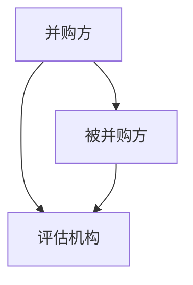
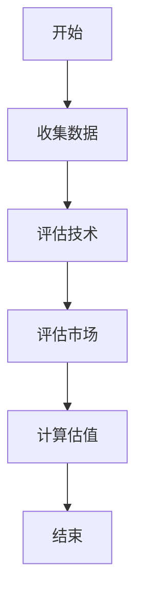
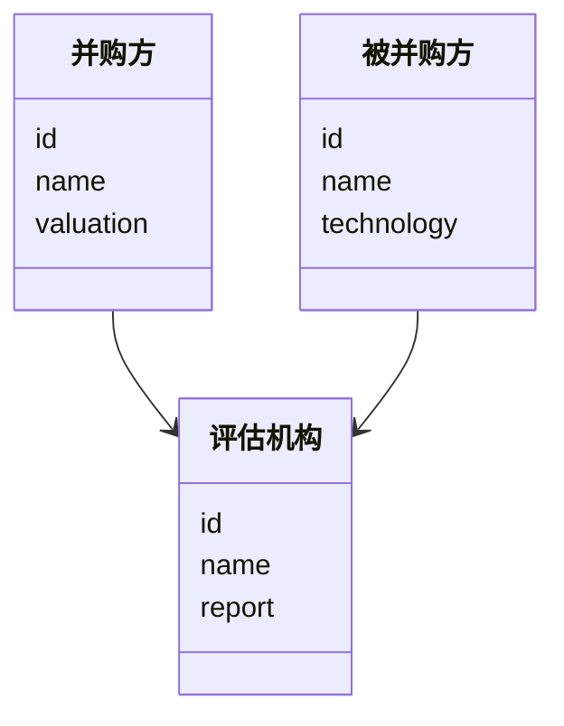
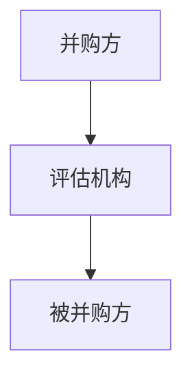

                 


# 芒格的"赢家的诅咒"提醒在高科技并购中的应用

## 关键词：
芒格, 赢家的诅咒, 高科技并购, 并购评估模型, 系统架构设计

## 摘要：
本文探讨了芒格提出的“赢家的诅咒”在高科技并购中的应用，分析了并购中的常见问题、赢家的诅咒的具体表现及其应对策略，结合并购评估模型和系统架构设计，提供了实际案例分析和解决方案，帮助读者理解如何避免并购中的陷阱。

---

# 第一部分：背景介绍

## 第1章：芒格的“赢家的诅咒”概述

### 1.1 问题背景
#### 1.1.1 并购中的常见问题
- 并购后的整合困难
- 资产评估不准确
- 文化冲突和管理问题

#### 1.1.2 赢家的诅咒概念
- 赢家的诅咒定义
- 高科技并购中的特殊挑战

#### 1.1.3 高科技并购的独特性
- 技术更新快
- 估值不确定性高

### 1.2 问题描述
#### 1.2.1 赢家的诅咒的具体表现
- 并购后表现不佳
- 估值过高导致的财务压力

#### 1.2.2 高科技并购中的特殊挑战
- 技术依赖性
- 市场变化快

#### 1.2.3 问题的边界与外延
- 适用范围
- 不适用情况

### 1.3 问题解决
#### 1.3.1 解决问题的方法
- 严格的估值模型
- 并购后的整合计划

#### 1.3.2 赢家的诅咒的应对策略
- 采用动态估值法
- 加强并购后的管理

---

# 第二部分：核心概念与联系

## 第2章：赢家的诅咒的原理

### 2.1 核心概念原理
#### 2.1.1 赢家的诅咒的定义
- 赢家的诅咒是指并购后表现不如预期的现象

#### 2.1.2 高科技并购中的应用
- 技术评估的重要性
- 市场变化对并购的影响

### 2.2 核心要素组成
#### 2.2.1 并购方的期望
- 期望与实际的差距

#### 2.2.2 被并购方的价值评估
- 技术评估与市场评估

### 2.3 实体关系图


---

# 第三部分：算法原理讲解

## 第3章：并购评估模型

### 3.1 算法原理


### 3.2 Python 实现
```python
def evaluate_acquisition(value, risk):
    return value * (1 - risk)
```

---

# 第四部分：系统分析与架构设计

## 第4章：高科技并购系统架构

### 4.1 领域模型


### 4.2 系统架构图


---

# 第五部分：项目实战

## 第5章：案例分析与实现

### 5.1 环境安装
- 安装必要的工具和库

### 5.2 系统核心实现源代码
```python
def calculate_valuation(value, risk_factor):
    return value * (1 - risk_factor)
```

### 5.3 案例分析
#### 5.3.1 并购前的评估
- 使用模型评估被并购方的估值

#### 5.3.2 并购过程中的策略
- 管理整合和风险管理

#### 5.3.3 并购后的整合
- 技术整合与团队融合

---

# 第六部分：总结与展望

## 第6章：总结与展望

### 6.1 小结
- 赢家的诅咒的核心概念
- 系统架构设计的重要性

### 6.2 注意事项
- 模型的局限性
- 数据质量的重要性

### 6.3 未来研究方向
- 更精确的评估模型
- 更有效的整合策略

---

# 附录

## 附录A：术语解释
- 赢家的诅咒：并购后表现不如预期的现象

## 附录B：参考文献
-芒格的相关著作
-其他参考文献

---

# 结束语
本文通过详细分析芒格的“赢家的诅咒”在高科技并购中的应用，结合理论与实践，为读者提供了系统化的解决方案和实际案例分析，帮助避免并购中的常见问题。

