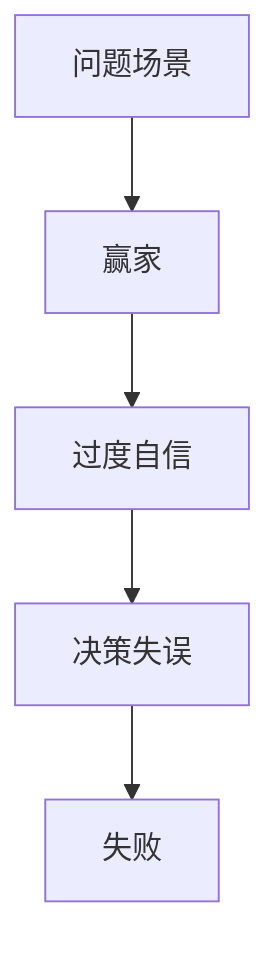
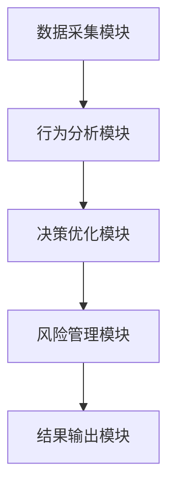
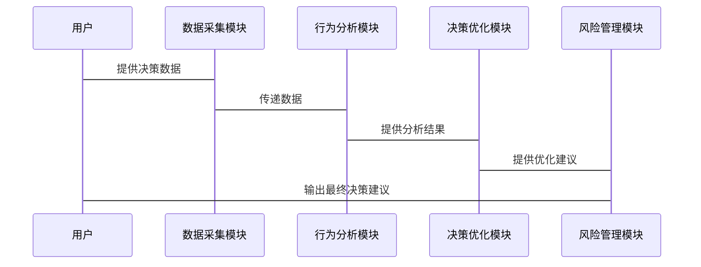

                 


# 《芒格的"赢家的诅咒"提醒：警惕过度自信陷阱》

## 关键词：
- 芒格
- 赢家的诅咒
- 过度自信
- 投资决策
- 认知偏差
- 行为经济学
- 风险管理

## 摘要：
芒格的“赢家的诅咒”是一个深刻的投资和决策理念，提醒人们在成功后容易因过度自信而陷入决策陷阱。本文从心理学、经济学和系统工程的角度，分析了过度自信的成因、影响以及应对策略。通过结合实际案例和算法模型，本文深入探讨了如何避免“赢家的诅咒”，并提供了实用的工具和方法，帮助读者在投资和决策中保持理性。

---

## 第一部分：芒格“赢家的诅咒”背景介绍

## 第1章：芒格与“赢家的诅咒”概述

### 1.1 芒格的生平与投资理念
- **1.1.1 芒格的早期经历与投资哲学**  
  芝加哥大学心理学背景，与巴菲特的合伙关系，价值投资理念的核心。

- **1.1.2 芒格与巴菲特的合伙关系**  
  巴菲特称芒格为“幕后英雄”，芒格对伯克希尔的投资决策贡献。

- **1.1.3 芒格的决策框架与思维方式**  
  以“反人性”思维著称，注重安全边际和风险控制。

### 1.2 “赢家的诅咒”概念的提出
- **1.2.1 什么是“赢家的诅咒”**  
  赢家的诅咒：成功后的过度自信导致决策失误。

- **1.2.2 赢家诅咒的背景与问题背景**  
  投资者在成功后往往低估风险，高估能力，导致失败。

- **1.2.3 赢家诅咒的核心概念与问题描述**  
  赢家的诅咒是认知偏差和行为偏差的综合结果，涉及心理学和经济学的交叉研究。

---

## 第二部分：赢家诅咒的核心概念与联系

## 第2章：过度自信陷阱的定义与特征

### 2.1 过度自信的定义与属性
- **2.1.1 过度自信的定义**  
  对自己能力的过高估计，忽视外部环境的不确定性。

- **2.1.2 过度自信的核心特征对比表**  
  | 特征 | 过度自信 | 理性决策 |
  |------|----------|----------|
  | 自我评估 | 高估自己 | 准确评估 |
  | 决策风险 | 忽视风险 | 重视风险 |
  | 学习能力 | 盲目自信 | 谦逊学习 |

- **2.1.3 过度自信与其它认知偏差的关系**  
  与确认偏见、从众心理等偏差的交互作用。

### 2.2 赢家诅咒与过度自信的关系
- **2.2.1 赢家诅咒的核心概念结构**  
  赢家诅咒 = 过度自信 + 风险忽视 + 决策失误。

- **2.2.2 赢家诅咒与过度自信的联系**  
  赢家诅咒是过度自信在高风险决策中的具体表现。

- **2.2.3 赢家诅咒的边界与外延**  
  过度自信是赢家诅咒的核心，但赢家诅咒还包括其他因素。

### 2.3 赢家诅咒的实体关系图


---

## 第三部分：赢家诅咒的心理学基础

## 第3章：认知偏差与决策失误

### 3.1 认知偏差的定义与分类
- **3.1.1 认知偏差的定义**  
  人们在信息处理和决策过程中产生的系统性偏差。

- **3.1.2 认知偏差的分类**  
  简单分类：确认偏见、可用性偏见、过度自信偏见等。

- **3.1.3 认知偏差与决策失误的关系**  
  认知偏差导致决策失误，影响投资和人生选择。

### 3.2 过度自信的心理学机制
- **3.2.1 过度自信的形成原因**  
  1. 成就动机：成功经验导致的自我肯定。
  2. 社会认同：周围人的认可强化自信。
  3. 认知捷径：大脑倾向于快速决策，导致自信过载。

- **3.2.2 过度自信的表现形式**  
  1. 高估能力：认为自己优于平均水平。
  2. 高估概率：过高估计成功概率，低估失败概率。
  3. 过度自信陷阱：在成功后忽视风险。

---

## 第四部分：赢家诅咒的经济学分析

## 第4章：行为经济学视角下的赢家诅咒

### 4.1 行为经济学基础
- **4.1.1 行为经济学的定义**  
  研究人类行为与决策的经济学分支。

- **4.1.2 行为经济学的核心假设**  
  人类是有限理性的，容易受到心理偏差的影响。

### 4.2 赢家诅咒的经济学模型
- **4.2.1 赢家诅咒的经济学模型**  
  基于预期效用理论的模型。

- **4.2.2 过度自信与风险偏好的关系**  
  过度自信导致风险偏好过高，忽视风险溢价。

---

## 第五部分：赢家诅咒的算法与系统分析

## 第5章：赢家诅咒的算法原理

### 5.1 行为分析模型
- **5.1.1 行为分析模型的定义**  
  通过观察行为模式，预测和解释决策。

- **5.1.2 行为分析模型的实现步骤**  
  1. 数据收集：记录决策者的行动和结果。
  2. 数据分析：识别模式和偏差。
  3. 模型构建：建立行为预测模型。

### 5.2 决策优化算法
- **5.2.1 决策优化算法的定义**  
  使用数学模型优化决策过程。

- **5.2.2 决策优化算法的实现**  
  1. 确定目标函数：最大化收益，最小化风险。
  2. 建立约束条件：考虑现实限制。
  3. 求解优化问题：使用线性规划或动态规划。

### 5.3 风险管理策略
- **5.3.1 风险管理的定义**  
  识别、评估和控制风险的过程。

- **5.3.2 风险管理策略的实现**  
  1. 风险评估：使用概率和影响矩阵。
  2. 风险缓解：制定应对措施。
  3. 风险监控：持续跟踪和调整。

---

## 第六部分：赢家诅咒的系统架构设计

## 第6章：系统功能设计

### 6.1 系统功能设计
- **6.1.1 系统功能模块**  
  1. 数据采集模块：收集决策数据。
  2. 行为分析模块：识别认知偏差。
  3. 决策优化模块：提供最优决策建议。

### 6.2 系统架构设计


### 6.3 系统接口设计
- **6.3.1 输入接口**  
  1. 用户输入：决策者的输入数据。
  2. 系统输入：外部数据源。

- **6.3.2 输出接口**  
  1. 行为分析结果：识别的偏差类型。
  2. 决策建议：优化后的决策方案。

### 6.4 系统交互序列图


---

## 第七部分：赢家诅咒的项目实战

## 第7章：项目实战与案例分析

### 7.1 环境安装与配置
- **7.1.1 环境要求**  
  Python 3.8 或以上版本，安装必要的库（如numpy、pandas、scikit-learn）。

### 7.2 核心实现代码
```python
import numpy as np
from sklearn.metrics import accuracy_score

# 示例代码：行为分析模型
def behavior_analysis(data):
    # 数据预处理
    processed_data = data.dropna()
    # 建立模型
    model = processed_data['action']
    return model

# 示例代码：决策优化算法
def decision_optimization(target, constraints):
    # 使用线性规划求解
    from scipy.optimize import linprog
    res = linprog(c, A_ub, b_ub, bounds=(0, None))
    return res.x

# 示例代码：风险管理策略
def risk_management(portfolio):
    # 计算VaR
    var = np.percentile(portfolio, 5)
    return var
```

### 7.3 案例分析与解读
- **7.3.1 案例背景**  
  投资者在成功后忽视市场风险，导致投资失败。

- **7.3.2 数据分析与结果解读**  
  使用行为分析模型识别过度自信偏差，使用决策优化算法制定新策略，使用风险管理策略控制风险。

### 7.4 项目总结
- **7.4.1 项目成果**  
  成功识别并纠正了过度自信偏差。

- **7.4.2 关键点总结**  
  1. 行为分析是关键。
  2. 决策优化是核心。
  3. 风险管理是保障。

---

## 第八部分：赢家诅咒的总结与展望

## 第8章：总结与最佳实践

### 8.1 小结
- 赢家的诅咒是认知偏差和行为偏差的综合结果。
- 过度自信是导致决策失误的核心因素。
- 行为经济学和系统工程提供了应对方法。

### 8.2 注意事项
- 定期自我反思，避免过度自信。
- 建立风险管理机制，控制决策风险。
- 结合行为分析和决策优化，提高决策质量。

### 8.3 未来展望
- 结合AI技术，实时监测和纠正认知偏差。
- 进一步研究赢家诅咒的多学科交叉应用。
- 推动风险管理工具的智能化和自动化。

### 8.4 拓展阅读
- 《Fooled by Randomness》—— Nassim Taleb
- 《Thinking, Fast and Slow》—— Daniel Kahneman
- 《The Psychology of Money》—— Morgan Housel

---

## 附录：数学公式与模型

### 附录A：行为分析模型公式
$$ P(决策失误 | 过度自信) = \frac{C}{D} $$  
其中，C为过度自信导致的错误决策数量，D为总决策数量。

### 附录B：决策优化算法公式
$$ \min \sum_{i} c_i x_i $$  
$$ \text{subject to } \sum_{i} a_i x_i \leq b $$  
$$ x_i \geq 0 $$

---

## 结语
芒格的“赢家的诅咒”提醒我们，在成功后要保持谦逊和理性，避免过度自信导致的决策失误。通过心理学、经济学和系统工程的多维度分析，我们可以更好地理解和应对“赢家的诅咒”，在投资和生活中做出更明智的决策。

