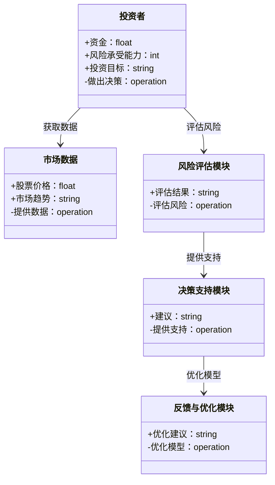
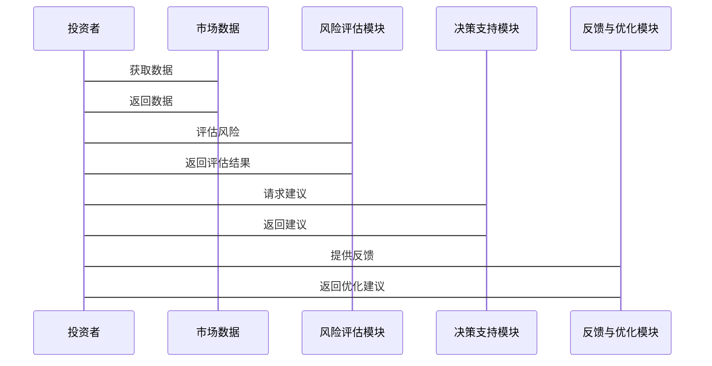

                 

# 芮格的"赢家的诅咒"警示：避免过度自信

## 关键词
- 芮格
- 赢家的诅咒
- 过度自信
- 投资决策
- 行为经济学

## 摘要
本文通过分析芒格提出的“赢家的诅咒”概念，探讨了过度自信对投资决策的负面影响。文章从背景介绍、核心概念、心理学原理、系统架构设计到项目实战，详细阐述了如何识别和避免过度自信，帮助读者在投资和决策中保持理性。

---

## 第1章：芒格及其投资理念

### 1.1 芮格的生平简介
芒格是巴菲特的长期合作伙伴，以其深刻的投资哲学闻名。他的教育背景和商业经验为他的投资理念奠定了基础。

- **1.1.1 芝加格大学教育背景**：芒格在芝加哥大学学习法律，培养了严谨的思维方式。
- **1.1.2 与巴菲特的合作历程**：两人合作超过50年，芒格的理性思维和巴菲特的价值投资理念相辅相成。

### 1.2 芮格的投资哲学
芒格的投资哲学强调安全边际和第二性思维，即从反方向思考问题。

- **1.2.1 格雷厄姆价值投资理论**：芒格扩展了这一理论，引入安全边际概念，强调在价格低于内在价值时买入。
- **1.2.2 第二性思维**：芒格建议投资者从反方向思考，避免随大流。

### 1.3 "赢家的诅咒"的提出背景
“赢家的诅咒”源于20世纪90年代互联网泡沫，芒格观察到许多看似成功的人因过度自信而失败。

- **1.3.1 传统投资分析的局限性**：仅关注数字，忽视了心理因素。
- **1.3.2 互联网泡沫的影响**：许多人因短期成功而过度自信，导致长期失败。
- **1.3.3 芮格的观察与总结**：赢家的诅咒揭示了过度自信的危害。

---

## 第2章："赢家的诅咒"的核心概念

### 2.1 过度自信的定义与表现
过度自信指个体高估自己判断能力，低估风险。

- **2.1.1 定义**：个体认为自己比实际更优秀。
- **2.1.2 表现**：高估能力，低估风险，固执己见。

### 2.2 赢家的诅咒的形成机制
认知偏差和信息过载导致过度自信。

- **2.2.1 认知偏差**：确认偏差导致坚持错误判断。
- **2.2.2 信息过载**：过多信息干扰决策。

### 2.3 赢家的诅咒与投资决策的关系
过度自信影响投资决策，导致失败。

- **2.3.1 影响**：高估资产价值，低估风险。
- **2.3.2 结果**：决策失误，投资失败。

---

## 第3章：认知偏差与决策错误

### 3.1 认知偏差的定义与分类
认知偏差影响决策，常见的有确认偏差、过度自信偏差和可得性偏差。

- **3.1.1 确认偏差**：寻求支持现有观点的信息。
- **3.1.2 过度自信偏差**：高估自己判断能力。
- **3.1.3 可得性偏差**：高估容易想到事件的概率。

### 3.2 认知偏差对投资决策的影响
认知偏差导致非理性决策。

- **3.2.1 高估资产价值**：投资者因过度自信而高估资产。
- **3.2.2 非理性决策**：忽视风险，追求高回报。

### 3.3 行为经济学中的相关理论
前景理论解释人们在决策中的非理性行为。

- **3.3.1 心理账户理论**：人们如何分类和处理财务信息。
- **3.3.2 前景理论**：人们更关注损失，导致风险厌恶。

---

## 第4章：系统分析与架构设计方案

### 4.1 问题场景介绍
投资者因过度自信导致决策失误。

### 4.2 系统功能设计
设计一个投资决策支持系统，帮助识别和避免过度自信。

- **4.2.1 风险评估模块**：评估投资风险。
- **4.2.2 决策支持模块**：提供理性建议。
- **4.2.3 反馈与优化模块**：优化决策模型。

### 4.3 系统架构设计
使用分层架构设计，模块独立，便于扩展。

### 4.4 系统接口设计
定义清晰的输入和输出接口，确保系统交互顺畅。

### 4.5 系统交互设计
设计用户与系统的交互流程，确保用户友好体验。

---

## 第5章：项目实战

### 5.1 项目介绍
开发一个投资决策支持系统，帮助投资者识别过度自信。

### 5.2 环境安装
安装必要的开发工具和库，如Python、Pandas、Matplotlib。

### 5.3 核心代码实现
实现风险评估和决策支持功能，使用Python代码。

### 5.4 案例分析
分析一个实际案例，展示如何避免过度自信，优化投资决策。

### 5.5 项目小结
总结项目成果，强调理性决策的重要性。

---

## 第6章：总结与展望

### 6.1 最佳实践 tips
- 保持怀疑态度，避免过度自信。
- 定期反思决策，修正错误。

### 6.2 小结
芒格的“赢家的诅咒”提醒我们避免过度自信，保持理性。

### 6.3 注意事项
- 投资需谨慎，避免情绪化决策。
- 结合多方面信息，做出全面分析。

### 6.4 拓展阅读
推荐相关书籍和文章，深入学习投资心理学和行为经济学。

---

## 图表和公式

### 4.3 系统架构设计

### 4.5 系统交互设计

---

## 数学模型

### 风险评估中的贝叶斯定理
$$P(A|B) = \frac{P(B|A) P(A)}{P(B)}$$

其中，$A$是资产价值，$B$是市场数据。通过贝叶斯定理，系统可以更新对资产价值的评估。

---

通过以上结构，文章详细分析了芒格的“赢家的诅咒”及其对投资决策的影响，结合心理学理论、系统设计和实际案例，帮助读者理解和避免过度自信。

