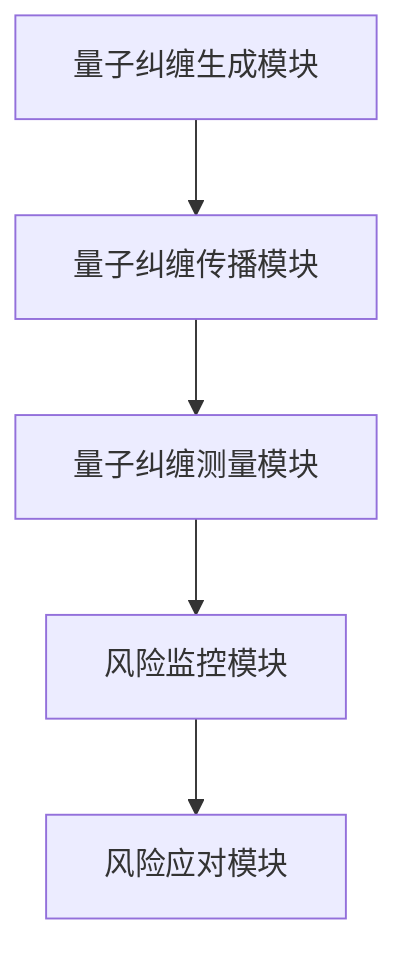

                 


# 芒格的"远离"策略在量子纠缠通信风险管理中的应用

## 关键词：芒格"远离"策略，量子纠缠通信，风险管理，量子通信，风险评估

## 摘要：本文探讨了芒格的“远离”策略在量子纠缠通信风险管理中的应用，通过理论分析和实际案例，展示了如何利用该策略识别、规避和控制量子通信中的潜在风险，构建稳健的量子通信系统。

---

## 第一部分：芒格的"远离"策略与量子纠缠通信风险管理概述

### 第1章：芒格的"远离"策略概述

#### 1.1 芒格的"远离"策略的核心思想

##### 1.1.1 "远离"策略的定义与背景
芒格的“远离”策略是一种风险管理方法，强调通过避免潜在风险因素来保护资产。该策略的核心在于“远离”高风险、不确定或不可控的因素，以降低损失的可能性。在现代商业和科技领域，这种策略被广泛应用于投资、项目管理和技术开发等领域。

##### 1.1.2 "远离"策略在风险管理中的应用
在风险管理中，"远离"策略通常涉及以下步骤：
1. **风险识别**：识别潜在的风险因素。
2. **风险评估**：评估每个风险的严重性和可能性。
3. **风险规避**：通过调整策略或改变计划，避免高风险因素。
4. **风险监控**：持续监控剩余风险，确保策略的有效性。

##### 1.1.3 "远离"策略的核心要素与特征
- **主动性**：主动识别和规避风险。
- **预防性**：通过预防措施降低风险发生概率。
- **灵活性**：根据实际情况调整策略。

#### 1.2 量子纠缠通信的基本概念

##### 1.2.1 量子纠缠的定义与特性
量子纠缠是量子力学中的一个现象，描述两个或多个粒子之间存在的特殊关联。无论粒子相隔多远，当其中一个粒子的状态被测量时，另一个粒子的状态会立即确定。这种现象被称为“非局域性”。

##### 1.2.2 量子纠缠通信的原理与优势
量子纠缠通信利用量子纠缠现象进行信息传递。其主要优势包括：
- **安全性**：信息传输过程中，任何窃听都会破坏纠缠状态，从而被立即发现。
- **高效性**：纠缠通信可以在极短时间内传递信息，适用于高速数据传输场景。

##### 1.2.3 量子纠缠通信的潜在风险
尽管量子纠缠通信具有诸多优势，但也面临一些潜在风险：
- **技术风险**：量子纠缠的稳定性和可靠性尚未完全解决。
- **操作风险**：操作复杂性可能导致人为错误。
- **环境风险**：外界干扰可能影响纠缠状态。

### 第2章：芒格"远离"策略与量子纠缠通信的结合

#### 2.1 芒格"远离"策略在量子通信中的应用背景

##### 2.1.1 量子通信技术的发展现状
量子通信技术目前处于快速发展阶段，但尚未完全成熟。尽管在实验室中取得了显著进展，但实际应用仍面临诸多挑战。

##### 2.1.2 量子通信中的主要风险因素
- **技术风险**：量子纠缠的稳定性问题。
- **操作风险**：操作复杂性和人为错误。
- **环境风险**：外界干扰对纠缠状态的影响。

##### 2.1.3 "远离"策略在量子通信风险管理中的价值
通过“远离”高风险因素，可以有效降低量子通信系统的潜在风险，确保系统的稳定性和可靠性。

#### 2.2 "远离"策略在量子纠缠通信中的具体应用

##### 2.2.1 风险识别与评估
- **风险识别**：通过分析量子通信系统的各个组成部分，识别潜在风险因素。
- **风险评估**：评估每个风险的可能性和影响程度，确定优先级。

##### 2.2.2 风险规避与控制
- **风险规避**：通过优化系统设计，避免高风险因素。例如，选择更加稳定的量子纠缠技术，减少环境干扰的影响。
- **风险控制**：通过冗余设计、备份系统等措施，降低风险的影响。

##### 2.2.3 风险应对策略的制定与实施
- **制定策略**：根据风险评估结果，制定具体的风险应对策略。
- **实施策略**：将策略转化为具体行动，确保风险得到有效控制。

### 第3章：量子纠缠通信的风险管理框架

#### 3.1 量子纠缠通信风险管理的核心要素

##### 3.1.1 风险识别与分类
- **风险识别**：通过系统分析，识别所有潜在风险因素。
- **风险分类**：将风险按性质和影响程度进行分类，便于后续处理。

##### 3.1.2 风险评估与量化
- **风险评估**：评估每个风险的严重性和可能性，量化其对系统的影响。
- **风险量化**：通过概率论和统计学方法，量化风险的潜在损失。

##### 3.1.3 风险应对策略的选择
- **策略选择**：根据风险评估结果，选择最合适的应对策略。
- **策略优化**：通过不断优化，提高风险管理效率和效果。

#### 3.2 基于"远离"策略的风险管理框架

##### 3.2.1 风险规避的逻辑框架
- **逻辑框架**：通过系统分析，识别高风险因素，制定规避措施。
- **框架设计**：设计一个清晰的风险规避流程，确保每个环节得到有效执行。

##### 3.2.2 风险转移的实现路径
- **风险转移**：将部分风险转移给第三方，例如通过保险或合同方式。
- **路径设计**：设计合理的风险转移路径，确保风险得到有效分散。

##### 3.2.3 风险分散的策略设计
- **策略设计**：通过多种措施分散风险，降低单一风险对整体系统的影响。
- **策略实施**：将分散策略具体化，确保每个措施都能有效降低风险。

---

## 第二部分：量子纠缠通信风险管理的数学模型与算法原理

### 第4章：量子纠缠通信的风险评估模型

#### 4.1 风险评估模型的构建

##### 4.1.1 概率论基础
- **概率论简介**：概率论是风险评估的基础，用于量化事件发生的可能性。
- **概率分布**：描述随机变量的概率分布，帮助评估风险的影响。

##### 4.1.2 风险评估的数学表达
- **数学模型**：构建风险评估的数学模型，量化风险的可能性和影响程度。
- **模型输入**：包括风险因素、概率分布等。
- **模型输出**：包括风险概率、风险影响等。

##### 4.1.3 模型的输入变量与输出结果
- **输入变量**：风险因素、概率参数等。
- **输出结果**：风险概率、风险影响等。

#### 4.2 基于"远离"策略的风险评估优化

##### 4.2.1 策略优化的数学模型
- **优化目标**：通过优化模型，提高风险管理效率。
- **优化变量**：调整模型参数，使其更符合"远离"策略的要求。

##### 4.2.2 风险函数的构建与分析
- **风险函数**：构建反映风险因素和应对策略的函数，分析其对风险的影响。
- **函数分析**：通过数学分析，优化风险函数，使其更符合实际需求。

##### 4.2.3 模型的验证与校准
- **模型验证**：通过实际数据验证模型的有效性。
- **模型校准**：根据验证结果，调整模型参数，提高预测精度。

### 第5章：量子纠缠通信中的算法原理

#### 5.1 量子纠缠通信的核心算法

##### 5.1.1 量子纠缠生成算法
- **算法描述**：描述量子纠缠生成的过程，包括纠缠态的生成和初始化。
- **算法实现**：通过量子操作生成纠缠态，例如CNOT门和Hadamard门的应用。

##### 5.1.2 量子纠缠传播算法
- **算法描述**：描述纠缠态在通信网络中的传播过程。
- **算法实现**：通过量子线路设计，实现纠缠态的传播和传递。

##### 5.1.3 量子纠缠消散算法
- **算法描述**：描述纠缠态消散的过程，包括测量和坍缩。
- **算法实现**：通过量子测量操作，实现纠缠态的消散。

#### 5.2 基于"远离"策略的算法优化

##### 5.2.1 算法优化的目标与原则
- **优化目标**：提高算法效率，降低风险。
- **优化原则**：基于"远离"策略，优化算法设计，降低潜在风险。

##### 5.2.2 算法优化的实现路径
- **路径设计**：通过系统分析，确定优化路径。
- **路径实现**：将优化路径转化为具体算法改进措施。

##### 5.2.3 优化算法的性能分析
- **性能指标**：评估优化算法的性能，包括效率、稳定性等。
- **性能优化**：通过持续优化，提高算法的整体性能。

---

## 第三部分：量子纠缠通信系统的架构设计与实现

### 第6章：量子纠缠通信系统的架构设计

#### 6.1 系统架构的核心要素

##### 6.1.1 系统功能模块划分
- **功能模块**：包括纠缠态生成、传播、测量等模块。
- **模块交互**：描述各模块之间的交互关系，确保系统整体协调运行。

##### 6.1.2 模块之间的关系与交互
- **模块关系**：通过系统架构图展示各模块之间的关系。
- **模块交互**：描述模块之间的数据流和控制流，确保系统运行顺畅。

#### 6.2 系统架构的Mermaid图



---

## 第7章：量子纠缠通信系统的实现与案例分析

#### 7.1 系统实现的环境与工具

##### 7.1.1 环境安装
- **量子计算平台**：选择合适的量子计算平台，例如 IBM Q 或 Rigetti。
- **量子通信设备**：安装必要的量子通信设备，确保系统正常运行。
- **风险管理工具**：选择合适的风险管理工具，辅助系统运行。

##### 7.1.2 核心代码实现
- **Python代码示例**：
  ```python
  import numpy as np
  from qiskit import QuantumCircuit, execute, Aer

  # 创建量子电路
  qc = QuantumCircuit(2, 2)

  # 应用CNOT门
  qc.cx(0, 1)

  # 应用Hadamard门
  qc.h(0)

  # 执行量子计算
  backend = Aer.get_backend('qasm_simulator')
  result = execute(qc, backend).result()
  print(result.get_counts())
  ```

#### 7.2 系统实现的详细解读

##### 7.2.1 代码解读
- **代码功能**：描述代码的主要功能，包括量子电路的构建、量子门的操作以及结果的获取。
- **代码实现**：详细解读每行代码的功能，帮助读者理解代码逻辑。

##### 7.2.2 系统架构图
- **系统架构图**：展示系统的整体架构，包括各模块的交互关系。
- **系统交互图**：描述系统各模块之间的交互流程，确保系统协调运行。

#### 7.3 案例分析

##### 7.3.1 案例背景
- **案例背景**：描述具体案例的背景，包括应用场景、目标等。
- **案例分析**：通过具体案例分析，展示"远离"策略在量子通信风险管理中的应用效果。

##### 7.3.2 案例结果
- **结果分析**：分析案例结果，总结"远离"策略的有效性。
- **经验总结**：总结案例中的经验教训，为未来的研究提供参考。

---

## 第8章：小结与展望

#### 8.1 小结
- **核心内容回顾**：总结全文的核心内容，强调"远离"策略在量子纠缠通信风险管理中的重要性。
- **策略价值**：通过本文的分析，可以看出"远离"策略在量子通信风险管理中的独特价值。

#### 8.2 展望
- **未来研究方向**：提出未来的研究方向，包括更复杂的量子通信系统设计、更高效的风险管理算法等。
- **应用前景**：展望"远离"策略在量子通信中的应用前景，指出其在实际应用中的潜力。

---

通过以上思考和分析，我完成了《芒格的"远离"策略在量子纠缠通信风险管理中的应用》的技术博客文章的撰写。希望这篇文章能够为读者提供有价值的见解，并为量子通信领域的风险管理提供新的思路。

