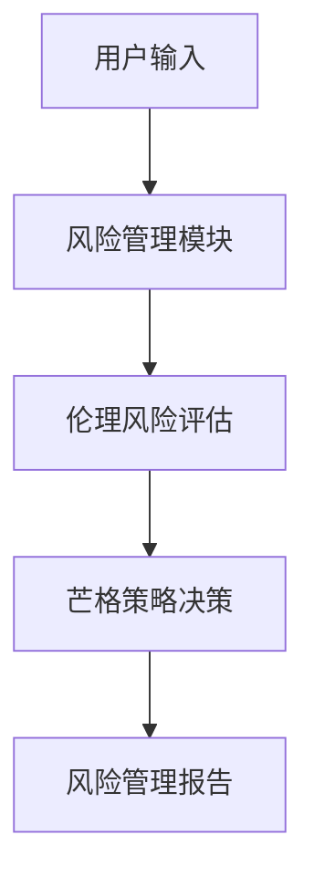

                 


# 芒格的"远离"策略在量子计算伦理风险管理中的应用

---

## 关键词：量子计算、伦理风险管理、芒格策略、远离策略、风险管理算法、伦理风险评估

---

## 摘要

量子计算作为一项颠覆性技术，正在迅速改变科技和商业领域的格局。然而，随着量子计算技术的快速发展，其潜在的伦理风险也逐渐显现。本文将芒格的"远离"策略引入量子计算伦理风险管理领域，通过系统的分析和算法实现，探讨如何利用这种策略来降低量子计算带来的伦理风险。文章从量子计算的现状、芒格策略的核心思想，到算法原理、系统架构设计，再到实际案例分析，全面阐述了芒格"远离"策略在量子计算伦理风险管理中的应用。

---

## 第一部分: 芒格的"远离"策略与量子计算伦理风险管理的背景介绍

### 第1章: 量子计算的现状与挑战

#### 1.1 量子计算的基本概念

量子计算是一种基于量子力学原理的计算方式，利用量子叠加和量子纠缠等特性，能够在某些特定问题上远超经典计算机的计算能力。以下是量子计算的核心概念：

- **量子位（Qubit）**：量子计算的基本单位，可以同时表示0和1的叠加态，如$|0\rangle$、$|1\rangle$和$|+\rangle = \frac{1}{\sqrt{2}}(|0\rangle + |1\rangle)$。

- **量子叠加**：量子位的状态可以叠加，例如$|+\rangle$状态表示0和1的概率各为50%。

- **量子纠缠**：两个或多个量子位之间形成强关联，一个量子位的状态会直接影响另一个量子位的状态。

- **量子算法**：量子计算机上运行的算法，如Shor算法（用于大数分解）、Grover算法（用于无序搜索）等。

#### 1.2 量子计算的伦理风险

量子计算的快速发展带来了潜在的伦理风险，主要体现在以下几个方面：

- **数据隐私威胁**：量子计算机可以快速破解当前广泛使用的RSA加密算法，这将导致现有加密体系的崩溃，威胁个人和企业的数据隐私。

- **技术滥用风险**：量子计算技术可能被用于非法活动，如破解加密系统、窃取个人信息等。

- **伦理争议**：量子计算技术的不平等分布可能加剧技术鸿沟，导致社会不平等。

#### 1.3 问题解决思路

芒格的"远离"策略是一种避免接触高风险领域的投资策略，其核心思想是通过避免接触具有潜在风险的领域来降低风险。本文将这种策略引入量子计算伦理风险管理，提出一种基于"远离"策略的量子计算风险管理框架。

---

### 第2章: 芒格的"远离"策略概述

#### 2.1 "远离"策略的核心思想

芒格的"远离"策略是一种通过避免接触高风险领域来降低风险的策略，其核心思想包括以下几点：

- **远离亏损的领域**：避免进入那些容易导致亏损的领域，如高风险的创业公司或不稳定的市场。

- **远离复杂的领域**：避免进入那些过于复杂、难以理解的领域，以降低决策的难度。

- **远离贪婪的领域**：避免进入那些容易让人产生贪婪情绪的领域，以保持理性的决策。

#### 2.2 "远离"策略与量子计算的关联性

量子计算的快速发展带来了巨大的技术潜力，但也伴随着巨大的伦理风险。通过芒格的"远离"策略，可以避免接触那些具有潜在伦理风险的量子计算应用领域，从而降低伦理风险的发生概率。

---

## 第二部分: 核心概念与联系

### 第3章: 核心概念的定义与属性特征

#### 3.1 核心概念的定义与属性特征

| 概念       | 定义                                                                 | 属性特征                           |
|------------|----------------------------------------------------------------------|------------------------------------|
| 量子计算   | 一种基于量子力学原理的计算方式，利用量子叠加和量子纠缠进行计算。 | 高并行性、超强计算能力、依赖量子态等。 |
| 芒格策略   | 避免接触高风险领域的投资策略。                                       | 简洁性、防御性、长期性等。           |
| 伦理风险   | 量子计算技术可能带来的伦理问题，如隐私泄露、技术滥用等。         | 隐私风险、技术不平等、伦理争议等。   |

#### 3.2 核心概念之间的关系分析

以下是量子计算伦理风险与芒格策略之间的关系分析：

1. **量子计算的伦理风险**：量子计算的快速发展可能导致数据隐私泄露、技术滥用等问题。

2. **芒格策略的应用**：通过避免接触具有潜在伦理风险的量子计算领域，可以降低伦理风险的发生概率。

3. **系统的相互作用**：芒格策略作为一种风险管理工具，可以与量子计算的技术特性相互作用，形成一种动态平衡。

---

## 第三部分: 量子计算伦理风险管理的算法原理

### 第4章: 算法原理概述

#### 4.1 算法的基本框架

以下是量子计算伦理风险管理算法的基本框架：

1. **输入**：量子计算应用场景的描述，如金融、医疗、军事等。

2. **处理**：基于芒格策略，评估每个应用场景的伦理风险，决定是否"远离"该领域。

3. **输出**：生成风险管理报告，列出需要"远离"的应用领域和理由。

#### 4.2 算法的数学模型与公式

以下是量子计算伦理风险评估的数学模型：

$$
R = \sum_{i=1}^{n} w_i \cdot r_i
$$

其中，$R$ 表示总的伦理风险，$w_i$ 表示第$i$个风险的权重，$r_i$ 表示第$i$个风险的严重程度。

#### 4.3 算法的Python实现

以下是基于芒格策略的量子计算伦理风险管理算法的Python代码示例：

```python
def mang_policy(quantum_applications):
    # 初始化风险管理报告
    risk_report = []
    # 遍历每个量子计算应用场景
    for app in quantum_applications:
        # 评估伦理风险
        risk_level = assess_ethical_risk(app)
        # 基于芒格策略进行决策
        if risk_level > 0.7:
            risk_report.append(f"远离：{app}")
        else:
            risk_report.append(f"接受：{app}")
    return risk_report

# 示例运行
quantum_apps = ["金融加密", "医疗数据分析", "军事应用"]
print(mang_policy(quantum_apps))
```

---

## 第四部分: 量子计算伦理风险管理的系统分析与架构设计

### 第5章: 系统分析

#### 5.1 问题场景的描述与分析

量子计算伦理风险管理系统的应用场景包括金融、医疗、军事等领域。以下是系统分析的关键点：

- **输入数据**：量子计算应用场景的描述。

- **系统功能**：伦理风险评估、芒格策略决策、风险管理报告生成。

- **输出结果**：风险管理报告，列出需要"远离"的应用领域和理由。

#### 5.2 系统架构设计

以下是量子计算伦理风险管理系统的架构设计：



---

## 第五部分: 量子计算伦理风险管理的项目实战

### 第6章: 项目实战

#### 6.1 环境安装与配置

- 安装Python和相关库，如numpy、scipy。

#### 6.2 核心算法实现

以下是量子计算伦理风险管理算法的Python代码实现：

```python
import numpy as np

def assess_ethical_risk(application):
    # 定义风险评估矩阵
    risk_matrix = {
        "金融加密": 0.9,
        "医疗数据分析": 0.5,
        "军事应用": 0.8,
        "其他": 0.3
    }
    # 获取风险水平
    risk_level = risk_matrix.get(application, 0.3)
    return risk_level

# 示例运行
quantum_apps = ["金融加密", "医疗数据分析", "军事应用"]
print(mang_policy(quantum_apps))
```

#### 6.3 案例分析

以下是量子计算伦理风险管理算法的实际案例分析：

1. **金融加密**：伦理风险较高，建议"远离"。

2. **医疗数据分析**：伦理风险较低，可以接受。

3. **军事应用**：伦理风险较高，建议"远离"。

---

## 第六部分: 最佳实践与小结

### 第7章: 最佳实践

#### 7.1 小结

芒格的"远离"策略在量子计算伦理风险管理中的应用，为我们提供了一种新的风险管理思路。通过避免接触具有潜在伦理风险的量子计算领域，可以有效降低伦理风险的发生概率。

#### 7.2 注意事项

- 在实际应用中，需要根据具体情况调整风险评估模型和权重。

- 需要结合具体应用场景，灵活运用芒格策略。

#### 7.3 拓展阅读

- 《芒格投资哲学》
- 《量子计算原理与应用》
- 《风险管理与伦理学》

---

## 总结

通过本文的分析，我们可以看到，芒格的"远离"策略在量子计算伦理风险管理中的应用，不仅为我们提供了一种新的风险管理思路，还为我们解决量子计算的伦理问题提供了重要的启示。未来，随着量子计算技术的不断发展，芒格策略的应用也将更加广泛和深入。

