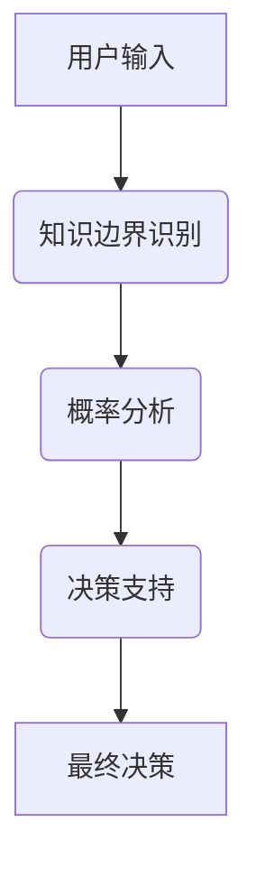

                 


# 《芒格的"远离"策略：知道自己不懂什么同样重要》

---

## 关键词：
芒格, 远离策略, 投资哲学, 决策框架, 风险管理, 价值投资, 知识边界

---

## 摘要：
本文深入探讨了芒格提出的“远离”策略，分析了其在投资和决策中的重要性。文章从芒格的生平和投资理念出发，详细阐述了“远离”策略的核心概念、决策框架、数学模型以及系统架构设计。通过实际案例分析，展示了如何在现实场景中应用这些策略，帮助读者构建科学的决策体系，避免认知偏差和决策错误，从而在复杂环境中做出更优决策。

---

## 正文：

### 第1章：芒格的生平与投资理念

#### 1.1 芒格的生平简介
查理·芒格（Charlie Munger）是美国著名的投资家、作家和心理学家，毕业于芝加哥大学法学院。他是巴菲特的长期合作伙伴，共同创立了伯克希尔·哈撒韦公司。芒格的投资理念深受价值投资和风险管理的影响，强调长期稳健的回报而非短期收益。

#### 1.2 投资理念的核心思想
芒格的投资哲学以“价值投资”为基础，但更强调“远离”策略。他认为，投资者应该专注于自己熟悉且具备竞争优势的领域，避免进入自己不熟悉的领域，以降低风险。这种策略的核心在于“知道自己不懂什么”，从而避免犯错。

#### 1.3 芒格的“远离”策略的哲学基础
芒格的“远离”策略基于对人类认知局限性的深刻理解。他提出，投资者应该构建自己的“知识边界”，避免进入能力圈之外的领域。这种认知边界通过概率论和决策树分析来实现，帮助投资者在决策中避免非理性偏差。

---

### 第2章：“远离”策略的核心概念

#### 2.1 “远离”策略的定义
“远离”策略是指通过识别和避免自己不熟悉的领域，来降低决策风险。这种策略强调风险管理的重要性，认为避免错误比追求收益更重要。

#### 2.2 “远离”策略的核心特点
- **知识边界**：通过自我认知和概率分析，确定自己的知识范围。
- **风险管理**：优先考虑风险控制，而非收益最大化。
- **长期稳健**：通过避免错误，实现长期稳定的回报。

#### 2.3 “远离”策略与其他投资策略的对比
与传统价值投资相比，芒格的“远离”策略更注重避免错误，而非寻找机会。与成长型投资相比，它更注重风险控制而非高增长潜力。

---

### 第3章：芒格“远离”策略的决策框架

#### 3.1 决策科学与心理学基础
芒格的决策框架结合了决策科学和心理学理论。他强调避免认知偏差，如确认偏差和从众心理，通过概率分析来做出更理性的决策。

#### 3.2 芒格的决策模型
芒格的决策模型基于概率论和决策树分析。他提出，决策应基于数据和概率，而非直觉和情感。

#### 3.3 决策框架的实现步骤
1. **识别知识边界**：通过自我评估确定自己的知识范围。
2. **概率分析**：使用数学模型评估不同选项的风险和收益。
3. **避免进入未知领域**：通过排除法减少决策错误。

---

### 第4章：数学模型与算法原理

#### 4.1 知识的边界与概率论
芒格的决策模型基于概率论，通过计算不同选项的期望值，避免进入高风险领域。公式如下：
$$
期望值 = \sum (概率_i \times 收益_i)
$$

#### 4.2 决策树分析
决策树是一种用于分析决策问题的工具。通过构建决策树，可以清晰地看到不同决策路径的风险和收益。

#### 4.3 芒格的决策模型代码实现
```python
def calculate_probability_outcomes(probabilities, outcomes):
    expected_value = 0
    for prob, outcome in zip(probabilities, outcomes):
        expected_value += prob * outcome
    return expected_value

# 示例：计算进入未知领域的期望值
probabilities = [0.3, 0.5, 0.2]
outcomes = [100, 200, -100]
expected_value = calculate_probability_outcomes(probabilities, outcomes)
print(f"期望值为：{expected_value}")
```

---

### 第5章：系统架构设计

#### 5.1 系统功能设计
- **知识边界识别**：通过自我评估和数据分析确定能力圈。
- **概率分析**：使用数学模型评估不同选项的风险和收益。
- **决策支持**：基于分析结果提供决策建议。

#### 5.2 系统架构图


#### 5.3 系统接口设计
- **输入**：用户提供的数据和知识范围。
- **输出**：概率分析结果和决策建议。

---

### 第6章：项目实战

#### 6.1 环境安装
- 安装必要的Python库，如numpy和pandas。

#### 6.2 核心实现代码
```python
import numpy as np

def calculate_probability_matrix(probabilities, outcomes):
    return np.dot(probabilities, outcomes)

# 示例：计算多个领域的期望值
prob_matrix = np.array([[0.3, 0.5, 0.2], [0.4, 0.3, 0.3]])
outcome_matrix = np.array([[100, 200, -100], [150, 250, -150]])
expected_values = calculate_probability_matrix(prob_matrix, outcome_matrix)
print(f"期望值矩阵为：\n{expected_values}")
```

#### 6.3 案例分析
假设投资者有三个投资领域，每个领域有不同的概率和收益。通过计算期望值，投资者可以识别高风险领域并选择低风险的选项。

---

### 第7章：最佳实践与小结

#### 7.1 小结
芒格的“远离”策略强调认知边界和风险管理，通过概率分析和决策树实现科学决策。

#### 7.2 注意事项
- 定期更新知识边界。
- 结合实际案例不断优化决策模型。

#### 7.3 拓展阅读
推荐阅读芒格的《Poor Charlie's Almanack》和巴菲特的《The Intelligent Investor》。

---

通过以上章节的分析，芒格的“远离”策略为投资者提供了一种科学的决策方法，帮助他们在复杂环境中做出更优决策。

