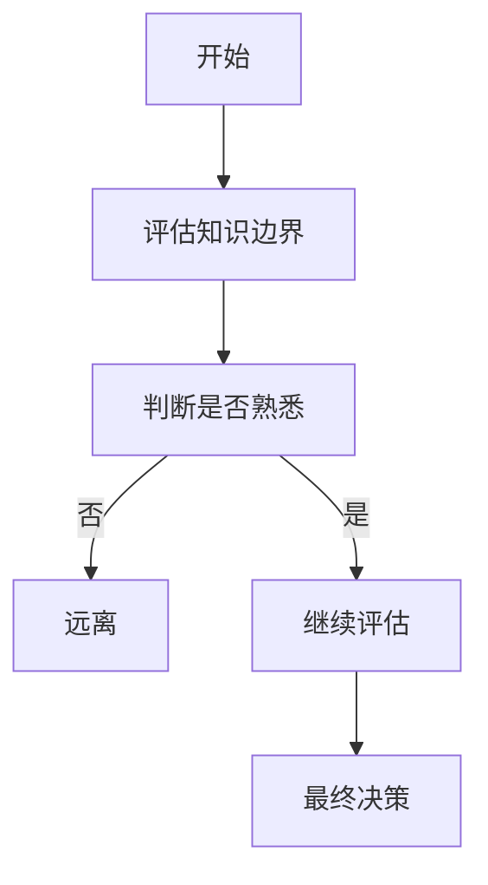
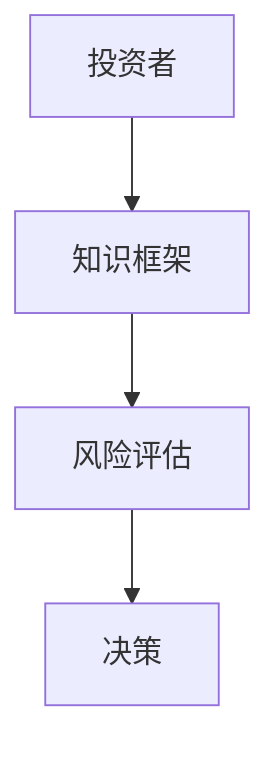

                 


# 芒格的"远离"策略：知道自己不懂什么的重要性

## 关键词
芒格，远离策略，投资决策，风险管理，自我认知，知识框架

## 摘要
芒格的“远离”策略是一种基于自我认知和风险管理的投资方法，强调识别和避免自己不熟悉的领域以降低风险。本文将深入探讨该策略的核心概念、算法原理、系统架构以及实际应用。

---

## 第1章：芒格“远离”策略的背景与基础

### 1.1 芒格的生平与投资理念
芒格是一位著名的投资者和思想家，他的投资哲学强调理性思考和长期价值。他提出的“远离”策略是其思想的重要组成部分。

### 1.2 “远离”策略的定义与意义
“远离”策略是指投资者主动避免投资于自己不熟悉或高风险的领域，以减少潜在损失。

### 1.3 核心要素
- **自我认知**：识别自己的知识边界。
- **风险控制**：避免过度投资。
- **知识框架**：构建决策的边界。

---

## 第2章：芒格“远离”策略的核心概念与联系

### 2.1 核心原理
“远离”策略通过自我认知和风险控制，避免在不熟悉的领域投资。

### 2.2 对比表
| 策略类型 | 核心思想 | 优点 | 缺点 |
|----------|----------|------|------|
| “远离”策略 | 避免不熟悉领域 | 风险低 | 可能错过机会 |

### 2.3 实体关系图


---

## 第3章：芒格“远离”策略的算法原理

### 3.1 算法流程


### 3.2 数学模型
$$ R = \frac{C}{K} $$
其中，C是不熟悉领域的风险，K是知识边界。

### 3.3 示例
假设某投资者对科技股不熟悉，模型计算显示风险较高，因此选择远离。

---

## 第4章：芒格“远离”策略的系统分析与架构设计

### 4.1 系统架构


### 4.2 接口设计
- 输入：投资领域
- 输出：是否远离的决策

### 4.3 交互图


---

## 第5章：项目实战

### 5.1 环境配置
安装必要的工具和库。

### 5.2 核心代码
```python
def远离策略(领域):
    if 领域 in 知识框架:
        return "继续评估"
    else:
        return "远离"
```

### 5.3 案例分析
分析一个实际案例，展示策略的应用。

### 5.4 总结
总结项目实施的经验和教训。

---

## 第6章：最佳实践与小结

### 6.1 最佳实践
- 定期更新知识框架。
- 保持风险敏感性。

### 6.2 小结
芒格的“远离”策略通过自我认知和风险管理，帮助投资者做出明智决策。

### 6.3 注意事项
- 定期评估和调整策略。
- 避免过度自信。

### 6.4 拓展阅读
推荐相关书籍和资源。

---

## 总结
芒格的“远离”策略通过清晰的自我认知和风险管理，帮助投资者在复杂市场中做出明智决策。通过本文的详细分析，读者可以更好地理解和应用这一策略。

