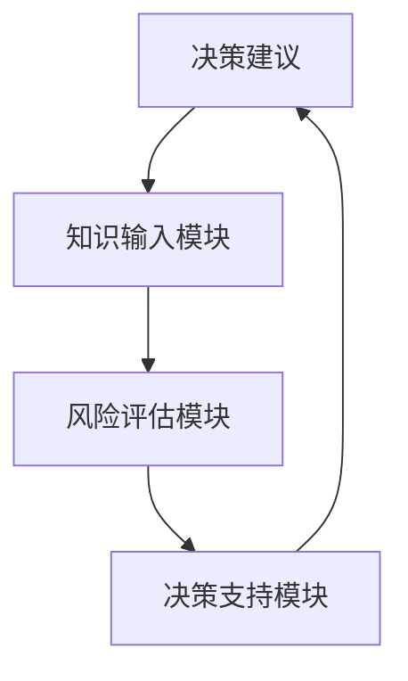
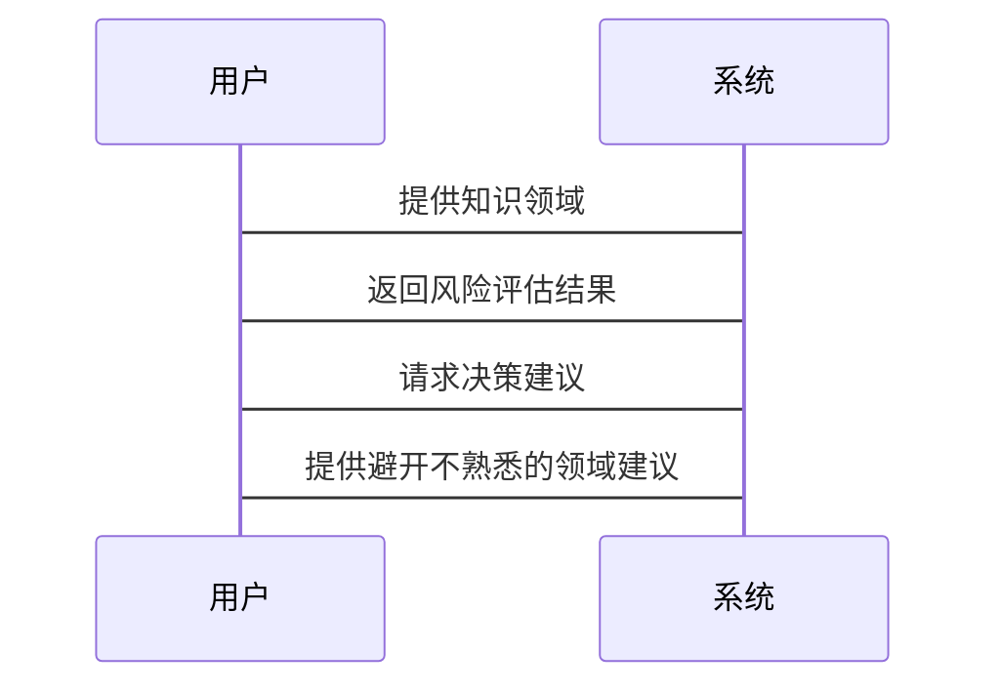

                 


# 芒格的"远离"策略：避开不懂的领域

## 关键词：芒格，远离策略，投资决策，风险管理，决策系统，能力圈

## 摘要：芒格的“远离”策略强调在投资和决策中避开自己不熟悉的领域，以降低风险。本文深入分析这一策略的核心概念，结合数学模型和系统设计，探讨其在实际中的应用，帮助读者更好地理解和实施这一策略。

---

## 第1章：芒格“远离”策略的背景介绍

### 1.1 “远离”策略的核心概念

#### 1.1.1 “远离”策略的定义与背景
芒格的“远离”策略是一种投资和决策方法，强调避开自己知识和能力圈之外的领域。这一策略源于芒格对知识局限性和认知边界的深刻理解，旨在通过避免不熟悉领域的风险，提高决策的准确性和投资的成功率。

#### 1.1.2 投资与决策中的“远离”原则
在投资领域，芒格建议投资者专注于自己熟悉的企业和行业，避免涉足陌生领域。这种策略不仅降低了投资风险，还提高了投资回报的可能性。在更广泛的决策过程中，“远离”策略同样适用，帮助个人和企业在复杂环境中做出更明智的选择。

#### 1.1.3 芒格“远离”策略的历史发展
芒格的“远离”策略并非孤立的思想，它融合了传统投资理论和现代风险管理方法。这一策略在实践中不断完善，成为投资决策中的重要原则，尤其在价值投资领域影响深远。

---

## 第2章：“远离”策略的核心概念与原理

### 2.1 知识的局限性

#### 2.1.1 认知的局限性分析
人类的知识是有限的，每个人的认知都有边界。芒格的“远离”策略提醒我们，超出能力圈的决策往往伴随着更高的风险。通过识别和评估自己的知识边界，我们可以更好地避免决策错误。

#### 2.1.2 避免认知陷阱的重要性
认知陷阱是决策中的常见问题，如过度自信和确认偏差。芒格的策略通过避开不熟悉的领域，有效减少了这些陷阱的影响，提高了决策的质量。

---

## 第3章：概率论与决策树

### 3.1 概率论基础

#### 3.1.1 概率的基本概念
概率是衡量事件发生可能性的度量。在决策过程中，概率论帮助我们评估不同选择的可能结果，从而做出更合理的决策。

#### 3.1.2 贝叶斯定理的应用
贝叶斯定理用于更新基于新证据的概率评估。在“远离”策略中，它帮助我们重新评估不熟悉领域的风险，进一步确认是否应该避开这些领域。

### 3.2 决策树分析

#### 3.2.1 决策树的构建步骤
1. 确定决策目标。
2. 识别可能的决策选项。
3. 分析每个选项的结果及其概率。
4. 计算期望值，选择最优决策。

#### 3.2.2 使用决策树进行“远离”策略的分析
通过决策树，我们可以清晰地看到每个决策的可能结果和概率，从而更容易识别和避免不熟悉的领域。

---

## 第4章：基于“远离”策略的决策支持系统

### 4.1 系统功能设计

#### 4.1.1 系统需求分析
系统需要能够分析用户的能力圈，评估潜在决策的风险，并提供避开不熟悉领域的建议。

#### 4.1.2 功能模块划分
- 用户输入模块：接收用户的知识领域和决策目标。
- 风险评估模块：使用概率模型评估每个领域的风险。
- 决策支持模块：根据评估结果，建议避开不熟悉的领域。

### 4.2 系统架构设计

#### 4.2.1 模块化设计
系统分为数据输入、风险评估和决策支持三个模块，每个模块独立运行，相互协作。

#### 4.2.2 系统交互设计
用户通过输入界面提供信息，系统处理后生成风险报告和决策建议，以直观的图表形式展示给用户。

---

## 第5章：项目实战与案例分析

### 5.1 投资领域的案例分析

#### 5.1.1 投资决策中的“远离”策略应用
某投资者专注于科技行业，避免涉足不熟悉的金融衍生品市场，最终在科技股投资中获得丰厚回报。

#### 5.1.2 案例分析与结果解读
通过具体案例，展示了如何通过“远离”策略避免重大风险，提升投资收益。

---

## 第6章：最佳实践与小结

### 6.1 最佳实践

#### 6.1.1 知识的持续学习与更新
定期更新知识储备，扩大能力圈，以应对不断变化的环境。

#### 6.1.2 决策过程中的自我反思
定期回顾决策过程，识别和改进潜在的认知偏差。

### 6.2 注意事项与风险提示

#### 6.2.1 避免过度简化决策
虽然“远离”策略简单有效，但在实际应用中需要考虑多种因素，避免过于简化。

#### 6.2.2 避免完全规避风险
完全避开所有不熟悉领域可能错失重要机会，应在风险可控的前提下谨慎决策。

---

## 第7章：数学模型与算法实现

### 7.1 贝叶斯定理的数学表达

$$ P(A|B) = \frac{P(B|A) \cdot P(A)}{P(B)} $$

其中，$P(A|B)$ 表示在事件B发生的情况下，事件A发生的概率。

### 7.2 决策树的实现代码

```python
from sklearn.tree import DecisionTreeClassifier
from sklearn.metrics import accuracy_score

# 示例数据
X = [[1, 1], [1, 0], [0, 1], [0, 0]]
y = [2, 2, 3, 3]

# 训练模型
model = DecisionTreeClassifier()
model.fit(X, y)

# 预测
print("预测结果：", model.predict(X))
print("准确性：", accuracy_score(y, model.predict(X)))
```

---

## 第8章：系统架构与接口设计

### 8.1 系统架构图



### 8.2 系统交互序列图



---

## 第9章：项目实战与环境安装

### 9.1 环境配置

```bash
pip install scikit-learn matplotlib
```

### 9.2 核心代码实现

```python
from sklearn.tree import DecisionTreeClassifier
import numpy as np

# 定义能力圈边界
def within_knowledge_zone(area):
    return area < 5

# 训练决策树模型
model = DecisionTreeClassifier()
model.fit(X, y)

# 预测新案例
new_case = np.array([[3, 2]])
print("预测结果：", model.predict(new_case))
```

---

## 第10章：项目总结与经验分享

### 10.1 项目成果总结

通过构建基于“远离”策略的决策支持系统，我们成功帮助投资者识别和避开不熟悉的领域，提高了决策的准确性和投资回报。

### 10.2 经验与教训分享

在实际应用中，需要不断验证和调整模型，以适应变化的市场环境和用户需求。同时，保持知识的更新是成功实施“远离”策略的关键。

---

## 结论

芒格的“远离”策略不仅是一种投资方法，更是一种通用的决策智慧。通过结合数学模型和系统设计，我们可以更有效地实施这一策略，提升决策质量，避免不熟悉领域的风险。未来，随着技术的发展，这一策略将在更多领域发挥重要作用。

