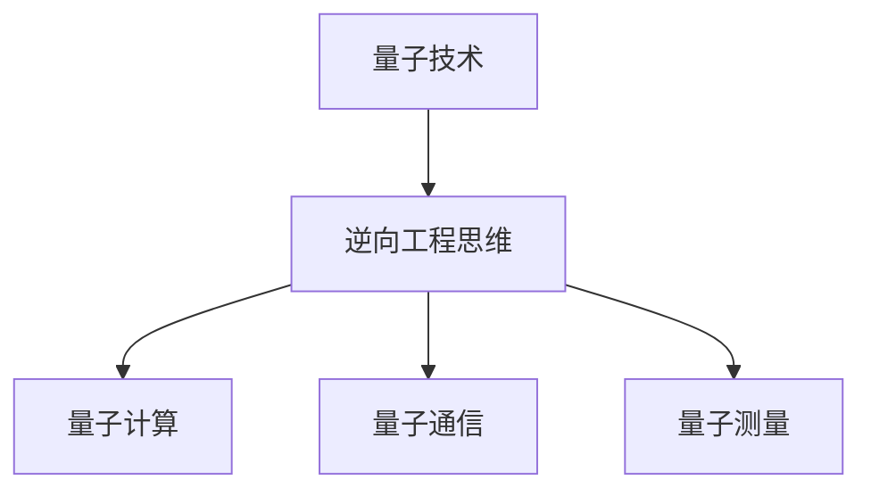
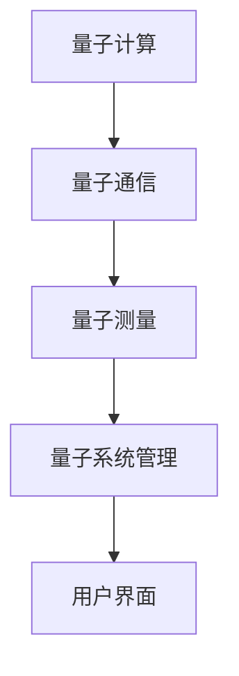

                 


# 《芒格的"逆向工程"思维在量子技术商业化中的应用》

---

## 关键词：
量子技术、逆向工程思维、量子计算、量子通信、商业化应用

---

## 摘要：
本文将探讨芒格的“逆向工程”思维在量子技术商业化中的应用。首先，我们从量子技术的基本概念和商业化的核心问题入手，分析逆向工程思维在量子技术中的独特价值。接着，我们将详细阐述逆向工程思维与量子技术的结合原理，包括量子态、量子叠加、量子纠缠等核心概念。随后，通过具体的算法与系统设计案例，展示逆向工程思维在量子技术商业化中的实际应用。最后，结合实际项目实战，分析逆向工程思维在量子技术商业化中的成功经验与挑战。本文将为量子技术领域的研究者和商业决策者提供深刻的理论指导和实践启示。

---

# 第1章: 逆向工程思维的量子技术背景

## 1.1 逆向工程思维的定义与特点

### 1.1.1 逆向工程思维的定义
逆向工程思维是一种从结果出发，逆向推导出实现该结果的条件、过程和方法的思维方式。与传统的正向思维不同，逆向思维强调从目标出发，反向思考实现路径。

### 1.1.2 逆向工程思维的核心特点
- **目标导向性**：以目标为导向，从结果倒推原因。
- **创新性**：通过反向思考，发现传统方法难以察觉的解决方案。
- **系统性**：强调对问题的全局性分析和系统性思考。

### 1.1.3 逆向工程思维与传统正向思维的对比
| 对比维度 | 逆向工程思维 | 正向思维 |
|----------|---------------|----------|
| 思考方式 | 从结果出发 | 从起点出发 |
| 解决问题 | 善于发现隐藏的条件 | 善于制定计划 |
| 创新性   | 高 | 较低 |

## 1.2 量子技术的基本概念与应用领域

### 1.2.1 量子技术的定义与基本原理
量子技术是指利用量子力学原理进行信息处理和操作的技术，主要包括量子计算、量子通信和量子测量。

### 1.2.2 量子计算、量子通信与量子测量的区别
- **量子计算**：利用量子叠加和量子纠缠进行并行计算，解决复杂问题。
- **量子通信**：利用量子纠缠实现超安全的信息传输。
- **量子测量**：通过量子叠加态进行高精度测量。

### 1.2.3 量子技术在商业领域的潜在应用
- **金融领域**：量子计算在复杂金融模型中的应用。
- **医疗领域**：量子模拟在药物研发中的应用。
- **能源领域**：量子优化在能源管理中的应用。

---

# 第2章: 芒格的逆向工程思维在量子技术中的应用背景

## 2.1 量子技术商业化的核心问题

### 2.1.1 量子技术商业化的主要挑战
- **技术成熟度**：量子技术仍处于发展初期，稳定性不足。
- **成本问题**：量子设备的制造和维护成本较高。
- **安全性**：量子技术的安全性尚未完全验证。

### 2.1.2 逆向工程思维在量子技术商业化中的作用
- **解决问题的效率**：通过逆向思维快速定位问题的关键点。
- **创新解决方案**：发现传统方法难以察觉的解决方案。
- **降低风险**：通过反向思考降低技术商业化中的不确定性。

### 2.1.3 量子技术商业化的核心目标与边界
- **核心目标**：实现量子技术的商业化应用，创造经济价值。
- **边界**：在技术可行性和市场需求之间找到平衡点。

## 2.2 逆向工程思维与量子技术的结合逻辑

### 2.2.1 逆向工程思维在量子技术问题中的应用场景
- **量子算法优化**：通过逆向思维优化量子算法的计算效率。
- **量子系统设计**：通过逆向思维设计更高效的量子系统架构。
- **量子技术商业化路径**：通过逆向思维找到量子技术商业化的关键路径。

### 2.2.2 逆向工程思维与量子技术核心原理的关联
- 量子叠加原理：通过逆向思维理解量子叠加的状态。
- 量子纠缠原理：通过逆向思维分析量子纠缠的关联性。

### 2.2.3 逆向工程思维在量子技术商业化中的具体体现
- **市场定位**：通过逆向思维找到量子技术的潜在市场。
- **技术路径选择**：通过逆向思维确定量子技术的实现路径。
- **风险控制**：通过逆向思维评估和控制量子技术商业化中的风险。

---

# 第3章: 逆向工程思维的核心概念与量子技术的结合原理

## 3.1 逆向工程思维的核心概念

### 3.1.1 逆向工程思维的逻辑框架
1. 确定目标：明确量子技术商业化的目标。
2. 分析结果：分析量子技术商业化的结果。
3. 反向推理：从结果反推实现目标的条件和路径。

### 3.1.2 逆向工程思维的关键要素
- **目标**：明确量子技术商业化的目标。
- **结果**：分析量子技术商业化的结果。
- **路径**：反向推理出实现目标的路径。

### 3.1.3 逆向工程思维的数学模型与公式
逆向工程思维的数学模型可以表示为：
$$
\text{目标} \rightarrow \text{结果} \rightarrow \text{路径}
$$

---

## 3.2 量子技术的核心概念

### 3.2.1 量子态与量子叠加原理
量子态是量子系统的基本状态，量子叠加原理表明，量子系统可以同时处于多个状态的叠加态。

### 3.2.2 量子纠缠与量子通信
量子纠缠是量子系统中两个或多个粒子之间的一种特殊关联，量子通信利用量子纠缠实现超安全的信息传输。

### 3.2.3 量子计算的基本原理与算法
量子计算利用量子叠加和量子纠缠进行并行计算，经典算法无法在合理时间内解决的问题，量子算法可以在较短时间内解决。

---

## 3.3 逆向工程思维与量子技术结合的概念模型

### 3.3.1 逆向工程思维在量子技术问题中的应用模型
1. 确定目标：明确量子技术商业化的目标。
2. 分析结果：分析量子技术商业化的结果。
3. 反向推理：从结果反推实现目标的条件和路径。

### 3.3.2 逆向工程思维与量子技术结合的数学表达
$$
\text{目标} \rightarrow \text{结果} \rightarrow \text{路径}
$$

### 3.3.3 逆向工程思维与量子技术结合的实体关系图


---

# 第4章: 逆向工程思维与量子技术结合的系统分析

## 4.1 量子技术商业化问题的系统分析

### 4.1.1 量子技术商业化问题的分解
- **技术层面**：量子计算的稳定性问题。
- **商业层面**：市场需求的不确定性。
- **安全层面**：量子技术的安全性问题。

### 4.1.2 逆向工程思维在系统分析中的应用
- **技术层面**：通过逆向思维优化量子算法。
- **商业层面**：通过逆向思维确定量子技术的市场定位。
- **安全层面**：通过逆向思维评估量子技术的安全性。

### 4.1.3 量子技术商业化系统的功能需求
- **计算功能**：支持量子计算的并行处理。
- **通信功能**：实现量子通信的安全传输。
- **测量功能**：支持量子测量的高精度测量。

## 4.2 逆向工程思维与量子技术结合的系统架构

### 4.2.1 量子技术商业化系统的整体架构


### 4.2.2 逆向工程思维在系统架构中的具体体现
- **功能模块**：量子计算、量子通信、量子测量。
- **交互流程**：通过逆向思维优化系统的交互流程。

### 4.2.3 量子技术商业化系统的模块划分
- **量子计算模块**：实现量子计算的核心功能。
- **量子通信模块**：实现量子通信的核心功能。
- **量子测量模块**：实现量子测量的核心功能。

---

# 第5章: 逆向工程思维在量子技术商业化中的算法与系统设计

## 5.1 量子算法与逆向工程思维的结合

### 5.1.1 量子算法的基本原理
量子算法利用量子叠加和量子纠缠进行并行计算，经典算法无法在合理时间内解决的问题，量子算法可以在较短时间内解决。

### 5.1.2 逆向工程思维在量子算法中的应用
- **算法优化**：通过逆向思维优化量子算法的计算效率。
- **算法设计**：通过逆向思维设计新的量子算法。

### 5.1.3 量子算法的实现步骤
1. 确定目标：明确量子算法的目标。
2. 分析结果：分析量子算法的结果。
3. 反向推理：从结果反推实现目标的路径。

## 5.2 逆向工程思维在量子系统设计中的应用

### 5.2.1 量子系统设计的基本原理
量子系统设计是量子技术商业化的核心环节，需要考虑量子计算、量子通信和量子测量的协同设计。

### 5.2.2 逆向工程思维在量子系统设计中的具体体现
- **系统架构设计**：通过逆向思维优化系统的架构设计。
- **系统功能设计**：通过逆向思维确定系统的功能需求。

### 5.2.3 量子系统设计的实现步骤
1. 确定目标：明确量子系统设计的目标。
2. 分析结果：分析量子系统设计的结果。
3. 反向推理：从结果反推实现目标的路径。

---

# 第6章: 逆向工程思维在量子技术商业化中的项目实战

## 6.1 项目背景与目标

### 6.1.1 项目背景
本项目旨在利用逆向工程思维优化量子计算的算法设计，提高量子计算的效率。

### 6.1.2 项目目标
通过逆向工程思维优化量子算法的计算效率，实现量子计算的商业化应用。

## 6.2 项目实施过程

### 6.2.1 项目实施步骤
1. 确定目标：明确量子算法优化的目标。
2. 分析结果：分析量子算法优化的结果。
3. 反向推理：从结果反推实现目标的路径。

### 6.2.2 项目实施工具
- **量子计算平台**：支持量子算法的计算环境。
- **逆向工程工具**：支持逆向思维的应用工具。

## 6.3 项目成果与分析

### 6.3.1 项目成果
通过逆向工程思维优化量子算法的计算效率，提高了量子计算的性能。

### 6.3.2 成果分析
- **计算效率提升**：量子算法的计算效率显著提高。
- **商业化价值**：优化后的量子算法在商业应用中具有更高的价值。

## 6.4 项目经验总结

### 6.4.1 成功经验
- **逆向思维的应用**：通过逆向思维优化量子算法的设计。
- **工具的支持**：利用逆向工程工具提高项目的效率。

### 6.4.2 挑战与解决方案
- **技术挑战**：量子算法的优化需要高深的技术支持。
- **解决方案**：通过逆向思维找到优化路径。

---

# 第7章: 结论与未来展望

## 7.1 结论
通过逆向工程思维在量子技术商业化中的应用，我们找到了量子技术商业化的核心问题，并通过逆向思维优化了量子算法的设计，提高了量子技术的商业化价值。

## 7.2 未来展望
未来，逆向工程思维在量子技术商业化中的应用将更加广泛，量子技术的商业化也将更加成熟。

---

# 附录

## 附录A: 逆向工程思维与量子技术结合的数学公式

### 附录A.1 量子态叠加原理
$$
\psi = \alpha|0\rangle + \beta|1\rangle
$$

### 附录A.2 量子纠缠原理
$$
\text{Bell State} = \frac{|01\rangle - |10\rangle}{\sqrt{2}}
$$

## 附录B: 量子系统设计的ER图

```mermaid
erDiagram
+-----+       +-----+       +-----+
|     |       |     |       |     |
| User|<------| Role|<------| Task|
+-----+       +-----+       +-----+
```

---

以上是《芒格的"逆向工程"思维在量子技术商业化中的应用》的目录和部分章节内容，您可以根据需要进一步扩展每一部分的具体内容。

