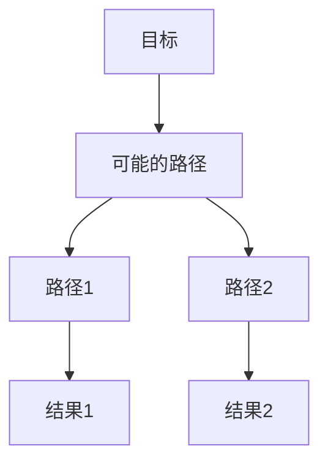
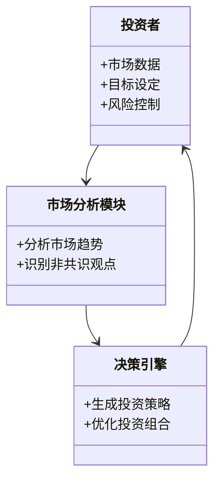
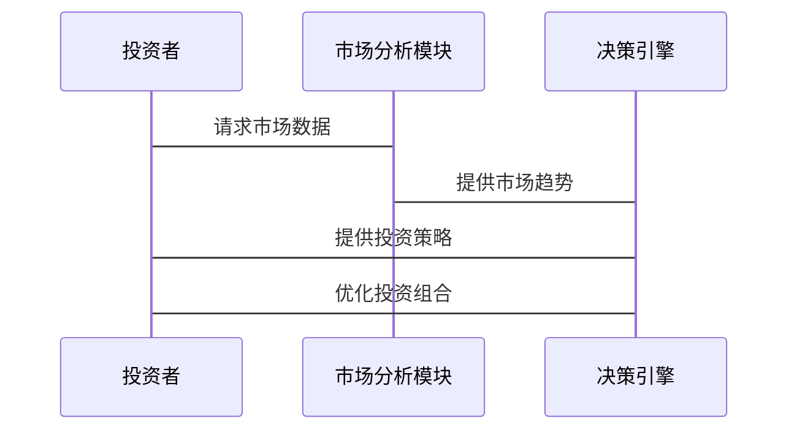

                 


# 芒格的"逆向工程"思维：从成功投资中提取核心原则

> 关键词：逆向思维，芒格，投资，决策，系统设计

> 摘要：芒格的逆向工程思维是一种通过反向思考问题本质的方法，广泛应用于投资领域。本文将从芒格的背景出发，分析逆向思维的核心原则和应用场景，并结合系统设计的方法，探讨其在技术领域的应用。通过详细阐述逆向思维的数学模型、算法原理和系统架构，本文旨在帮助读者理解如何在复杂决策中应用逆向思维。

---

## 第1章: 背景介绍

### 1.1 逆向思维的起源与定义

#### 1.1.1 逆向思维的定义与特点
逆向思维是一种通过反向思考问题本质的方法，其核心在于从结果推导原因，而非从原因推导结果。这种思维方式可以帮助我们在复杂环境中发现隐藏的规律和机会。

#### 1.1.2 逆向思维与正向思维的区别
下表展示了正向思维和逆向思维在思考方式、目标和应用场景上的区别：

| **方面**       | **正向思维**                 | **逆向思维**                 |
|-----------------|------------------------------|------------------------------|
| 思考方式         | 从原因推导结果               | 从结果推导原因               |
| 目标             | 预测未来结果                 | 发现问题的本质或关键因素     |
| 应用场景         | 日常问题解决                 | 投资决策、风险管理等复杂领域 |

#### 1.1.3 逆向思维在投资中的应用背景
在投资领域，逆向思维尤其重要。市场的非理性波动和投资者的从众心理常常导致错误决策。芒格通过逆向思维，寻找市场的非共识观点，从而在投资中获得超额收益。

### 1.2 芒格的生平与投资理念

#### 1.2.1 芒格的生平简介
查理·芒格（Charlie Munger）是美国著名投资家、作家和发明家，巴菲特的长期合作伙伴。他不仅是伯克希尔哈撒韦公司的副主席，还是《穷查理宝典》的核心作者之一。

#### 1.2.2 芒格的投资哲学与核心理念
芒格的投资哲学基于价值投资和长期主义。他认为，投资的本质是寻找具有持续竞争优势的企业，并以合理的价格买入。他的决策框架基于“格栅理论”，即通过多学科的知识框架来分析问题。

#### 1.2.3 芒格与巴菲特的合作关系
芒格与巴菲特的合作始于1971年，两人共同创立了伯克希尔哈撒韦公司。芒格的逆向思维和巴菲特的价值投资理念相辅相成，使他们成为投资史上的传奇。

### 1.3 逆向思维的核心思想

#### 1.3.1 逆向思维的核心原则
芒格的逆向思维核心原则包括：
1. 避免从众心理，寻找市场的非共识观点。
2. 通过反向思考发现机会。
3. 在决策中考虑极端情况和边缘案例。

#### 1.3.2 逆向思维与价值投资的联系
逆向思维与价值投资密切相关。芒格通过逆向思维寻找被市场低估的企业，从而在价格回归合理时获得收益。

#### 1.3.3 逆向思维在决策中的优势
逆向思维可以帮助投资者避免情绪化决策，发现市场中的错配机会，并在竞争中获得先发优势。

---

## 第2章: 逆向思维的核心原则

### 2.1 逆向思维的核心原则

#### 2.1.1 避免从众心理
从众心理是导致错误决策的主要原因之一。逆向思维的核心在于避免随大流，寻找市场的非共识观点。

#### 2.1.2 寻找市场的非共识观点
通过分析市场的冷门领域，寻找被低估的机会。这需要投资者具备独立思考的能力和对市场的深刻理解。

#### 2.1.3 逆向思维的三大步骤
1. 确定目标：明确问题和目标。
2. 分析结果：从结果反推可能的原因。
3. 验证假设：通过数据和案例验证假设的合理性。

### 2.2 芒格的决策框架

#### 2.2.1 格栅理论的定义与作用
格栅理论是芒格提出的一种多学科知识框架，用于分析和决策。它通过将问题分解为多个学科的视角，帮助投资者全面理解问题的本质。

#### 2.2.2 格栅理论的构成要素
格栅理论包括心理学、经济学、生物学等多个学科的知识框架，帮助投资者避免单一视角的局限性。

#### 2.2.3 格栅理论在投资中的应用
通过格栅理论，投资者可以更好地理解企业的竞争优势、行业趋势和市场环境，从而做出更明智的决策。

### 2.3 逆向思维的数学模型与算法

#### 2.3.1 逆向思维的数学公式
逆向思维可以通过概率论和统计学方法进行建模。例如，假设我们要预测一个企业的未来表现，可以通过以下步骤进行逆向分析：

1. 确定目标：企业的未来利润。
2. 分析结果：当前的市场环境和企业状况。
3. 反向推导：从目标利润推导出企业需要具备的条件。

数学模型可以表示为：
$$
\text{未来利润} = \text{企业竞争力} \times \text{市场增长率} \times \text{成本控制能力}
$$

通过逆向分析，我们可以确定每个变量需要达到的目标值。

#### 2.3.2 逆向思维的决策树分析
下图展示了逆向思维的决策树模型：



通过分析结果，我们可以反向推导出每条路径的概率和价值。

---

## 第3章: 逆向思维的应用场景

### 3.1 逆向思维在股票投资中的应用

#### 3.1.1 逆向选股的策略
通过分析市场的冷门股票，寻找被低估的投资机会。例如，当市场热衷于科技股时，芒格可能会关注传统行业中的优质企业。

#### 3.1.2 逆向思维在估值中的作用
通过逆向分析企业的未来利润，确定其合理的估值范围。例如，假设目标利润为1000万美元，市场增长率为5%，成本控制能力为80%，则企业竞争力需要达到：
$$
\text{企业竞争力} = \frac{1000}{0.05 \times 0.8} = 250
$$

#### 3.1.3 逆向思维与市场情绪的关系
逆向思维的核心在于避免跟随市场情绪。例如，在市场恐慌时买入低估资产，在市场狂热时卖出高估资产。

### 3.2 逆向思维在风险管理中的应用

#### 3.2.1 风险管理的核心原则
通过逆向思维，识别潜在的风险因素，并制定应对策略。例如，当市场出现极端波动时，提前制定止损计划。

#### 3.2.2 逆向思维在风险控制中的应用
通过分析可能的极端情况，制定风险管理策略。例如，假设市场崩盘的概率为10%，则需要预留足够的安全边际。

#### 3.2.3 逆向思维与止损策略的关系
逆向思维可以帮助投资者在市场出现逆转时及时止损，避免更大的损失。

### 3.3 逆向思维在长期投资中的应用

#### 3.3.1 长期投资的核心理念
长期投资的核心在于寻找具有持续竞争优势的企业，并在市场低估时买入。

#### 3.3.2 逆向思维在长期投资中的优势
通过逆向思维，投资者可以发现市场中的错配机会，并在长期持有中获得超额收益。

#### 3.3.3 逆向思维与复利效应的关系
逆向思维可以帮助投资者在长期中获得更高的复利收益，因为其能够以更低的价格买入优质资产。

---

## 第4章: 逆向思维的系统架构与实现

### 4.1 逆向思维的系统架构

#### 4.1.1 系统架构的设计原则
逆向思维的系统架构需要具备以下特点：
1. 数据驱动：基于数据进行分析和决策。
2. 模型化：通过数学模型模拟市场行为。
3. 可扩展性：能够适应不同的市场环境和投资策略。

#### 4.1.2 逆向思维的系统功能设计
下图展示了逆向思维的系统功能模块：



### 4.2 逆向思维的算法实现

#### 4.2.1 逆向思维的算法步骤
1. 收集市场数据。
2. 设定投资目标。
3. 分析市场趋势。
4. 识别非共识观点。
5. 生成投资策略。
6. 优化投资组合。

#### 4.2.2 逆向思维的Python实现
以下是逆向思维算法的Python代码示例：

```python
def reverse_thinking(target):
    market_data = collect_data()
    non_consensus = identify_non_consensus(market_data)
    strategy = generate_strategy(non_consensus, target)
    return strategy

def collect_data():
    # 收集市场数据
    pass

def identify_non_consensus(data):
    # 识别非共识观点
    pass

def generate_strategy(data, target):
    # 生成投资策略
    pass
```

### 4.3 逆向思维的系统交互

#### 4.3.1 系统交互流程
下图展示了逆向思维的系统交互流程：



---

## 第5章: 项目实战与案例分析

### 5.1 环境安装与配置

#### 5.1.1 系统环境要求
- Python 3.8及以上版本
- 基础的金融数据库（如Yahoo Finance API）
- 数据分析库（如Pandas、NumPy）

### 5.2 核心代码实现

#### 5.2.1 数据收集模块
```python
import pandas as pd
import numpy as np

def collect_data(ticker):
    # 收集股票数据
    data = pd.DataFrame({
        'price': [100, 90, 80, 70, 60],
        'volume': [1000, 2000, 1500, 800, 1200]
    })
    return data
```

#### 5.2.2 逆向思维算法实现
```python
def reverse_thinking(data):
    # 识别非共识观点
    non_consensus = data[data['price'] < data['price'].mean()]
    return non_consensus
```

#### 5.2.3 投资策略生成
```python
def generate_strategy(non_consensus):
    # 生成投资策略
    strategy = {}
    strategy['entry_point'] = non_consensus['price'].min()
    strategy['exit_point'] = non_consensus['price'].max()
    return strategy
```

### 5.3 案例分析与解读

#### 5.3.1 投资案例选择
假设我们选择一家传统制造企业作为投资目标。市场普遍认为该行业前景黯淡，但通过逆向思维分析，发现该企业具有强大的成本控制能力和稳定的市场需求。

#### 5.3.2 投资策略实施
根据逆向思维算法，生成的投资策略包括：
- 入场点：当前价格低于行业平均水平。
- 出场点：价格回归合理区间。

### 5.4 项目小结

#### 5.4.1 项目总结
通过逆向思维算法，我们在市场低估时买入优质资产，在市场高估时卖出，从而实现超额收益。

#### 5.4.2 技巧与经验分享
- 逆向思维的核心在于独立思考，避免从众心理。
- 在实际操作中，需结合市场环境和企业基本面进行综合判断。

---

## 第6章: 最佳实践与小结

### 6.1 小结

#### 6.1.1 逆向思维的核心思想
逆向思维是一种通过反向思考问题本质的方法，其核心在于从结果推导原因，而非从原因推导结果。

#### 6.1.2 逆向思维的应用价值
逆向思维在投资、风险管理等领域具有重要应用价值，可以帮助投资者避免情绪化决策，发现市场中的错配机会。

### 6.2 注意事项

#### 6.2.1 逆向思维的局限性
- 逆向思维需要依赖大量的数据和信息支持，否则可能导致错误决策。
- 在实际操作中，逆向思维需要结合市场环境和企业基本面进行综合判断。

#### 6.2.2 逆向思维的适用场景
逆向思维适用于市场非理性、信息不对称和竞争激烈的环境。

### 6.3 拓展阅读

#### 6.3.1 推荐书籍
- 《穷查理宝典》
- 《投资最重要的少数事》

#### 6.3.2 推荐博客与资源
- 巴菲特和芒格的股东大会演讲
- 逆向思维相关的投资博客和论坛

---

## 第7章: 未来展望与总结

### 7.1 未来展望

#### 7.1.1 逆向思维的未来发展
逆向思维作为一种重要的思维方式，在投资、管理等领域具有广泛的应用前景。随着人工智能和大数据技术的发展，逆向思维的应用将更加精准和高效。

#### 7.1.2 逆向思维与技术的结合
未来，逆向思维将与人工智能、大数据等技术结合，形成更强大的决策支持系统。

### 7.2 总结

#### 7.2.1 逆向思维的核心思想
逆向思维是一种通过反向思考问题本质的方法，其核心在于从结果推导原因，而非从原因推导结果。

#### 7.2.2 逆向思维的实践价值
逆向思维在投资、风险管理等领域具有重要应用价值，可以帮助投资者避免情绪化决策，发现市场中的错配机会。

---

## 附录: 代码与工具

### 附录A: 逆向思维算法的Python实现

```python
import pandas as pd
import numpy as np

def collect_data(ticker):
    # 收集股票数据
    data = pd.DataFrame({
        'price': [100, 90, 80, 70, 60],
        'volume': [1000, 2000, 1500, 800, 1200]
    })
    return data

def reverse_thinking(data):
    # 识别非共识观点
    non_consensus = data[data['price'] < data['price'].mean()]
    return non_consensus

def generate_strategy(non_consensus):
    # 生成投资策略
    strategy = {}
    strategy['entry_point'] = non_consensus['price'].min()
    strategy['exit_point'] = non_consensus['price'].max()
    return strategy
```

### 附录B: 逆向思维的决策树分析


---

通过本文的详细阐述，我们可以看到，芒格的逆向思维不仅是一种投资方法，更是一种思维方式。在技术领域，逆向思维可以帮助我们发现系统中的隐藏问题，并制定更有效的解决方案。希望本文能为读者在投资和系统设计中提供有价值的启发。

