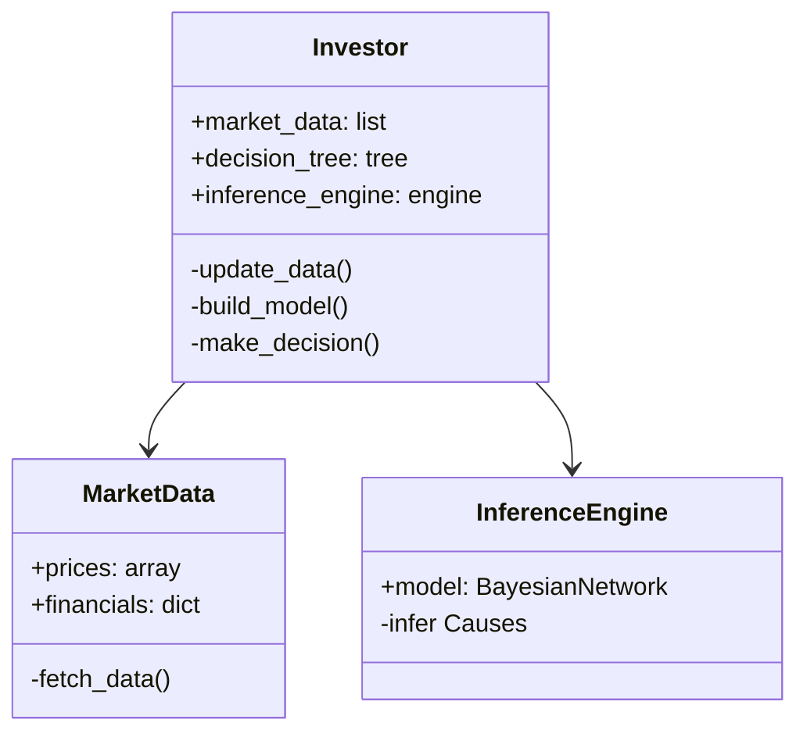
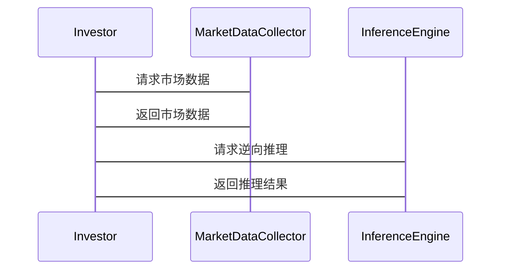

                 


```markdown
# 芒格的"逆向工程"思维：从结果倒推投资决策

> 关键词：逆向工程思维，投资决策，芒格，决策树，贝叶斯定理，系统架构设计，项目实战

> 摘要：本文将深入探讨芒格的逆向工程思维在投资决策中的应用，通过系统分析、数学建模、算法实现、项目实战等多维度，全面解析如何从结果倒推投资决策的最优路径。文章结合理论与实践，为读者提供一套完整的逆向思维投资决策方法论。

---

## 第一部分: 芒格的"逆向工程"思维概述

### 第1章: 逆向工程思维的定义与背景

#### 1.1 逆向工程思维的定义
逆向工程思维是一种从结果出发，逆向推导出产生该结果的原因和路径的思维方式。在投资决策中，这种思维可以帮助投资者发现市场中的“套利机会”或“估值偏差”，从而做出更明智的投资决策。

#### 1.2 芒格的生平与投资理念
芒格作为巴菲特的长期合作伙伴，他的投资理念强调“逆向思维”和“安全边际”。他主张通过逆向思考，寻找市场中被忽视的投资机会，并通过长期价值评估来做出决策。

---

### 第2章: 逆向工程思维的核心概念

#### 2.1 投资决策的逆向思维模型
- **定义**：从投资结果出发，分析可能的原因，构建因果关系模型。
- **特点**：以结果为导向，注重因果关系分析，强调反向思考。
- **与传统思维的对比**：传统思维从原因出发，逆向思维从结果出发，强调从反向路径寻找机会。

#### 2.2 逆向思维与传统投资思维的对比
- **传统思维**：基于市场趋势和公司基本面分析，从原因出发。
- **逆向思维**：从结果出发，寻找市场中的低估机会或错误定价。

---

## 第二部分: 逆向工程思维的数学模型与算法原理

### 第3章: 逆向思维的数学模型

#### 3.1 投资结果的数学表达
- 投资结果可以表示为随机变量，其概率分布由市场因素决定。
- 例如，股票价格的变化可以用几何布朗运动模型表示。

#### 3.2 决策因素的因果关系模型
- 使用贝叶斯网络构建因果关系模型，分析各个因素对投资结果的影响。
- 示例：$$P(A|B) = \frac{P(B|A)P(A)}{P(B)}$$

### 第4章: 逆向思维的算法实现

#### 4.1 逆向思维决策树的构建
- 使用决策树算法，从结果出发，反向构建决策路径。
- 示例代码：
  ```python
  def build_decision_tree(targets):
      # 从结果出发，反向构建决策树
      pass
  ```

#### 4.2 基于概率的逆向推理算法
- 使用马尔可夫链模型，模拟从结果到原因的逆向过程。
- 示例代码：
  ```python
  def reverse_inference():
      # 从结果出发，推导原因
      pass
  ```

---

## 第三部分: 逆向工程思维的系统分析与架构设计

### 第5章: 系统分析

#### 5.1 问题场景介绍
- 投资者希望通过逆向思维，找到市场中的低估股票。
- 系统需求：数据采集、模型构建、结果输出。

#### 5.2 系统功能设计
- 数据采集模块：收集市场数据。
- 模型构建模块：构建逆向思维模型。
- 结果输出模块：输出投资决策建议。

#### 5.3 领域模型（Mermaid 类图）


### 第6章: 系统架构设计

#### 6.1 系统架构（Mermaid 架构图）
```mermaid
container InvestmentSystem {
    MarketDataCollector
    InferenceEngine
    DecisionTreeBuilder
    ResultOutput
}
```

#### 6.2 系统接口设计
- API接口：市场数据接口、模型构建接口、结果输出接口。

#### 6.3 系统交互（Mermaid 序列图）


---

## 第四部分: 逆向工程思维的项目实战

### 第7章: 项目环境与工具安装

#### 7.1 开发环境配置
- 操作系统：Linux/Windows/Mac
- 开发工具：Python、Jupyter Notebook、IDE

#### 7.2 逆向思维分析工具安装
- 安装Python库：numpy、pandas、scikit-learn、networkx

#### 7.3 数据采集与处理工具安装
- 安装数据接口库：yfinance、pandas_datareader

### 第8章: 系统核心实现源代码

#### 8.1 数据处理代码
```python
import pandas as pd
from pandas_datareader import DataReader

def fetch_market_data(tickers, start_date, end_date):
    data = DataReader(tickers, 'yahoo', start_date, end_date)
    return data
```

#### 8.2 逆向思维模型实现
```python
from sklearn.tree import DecisionTreeClassifier

def build_decision_tree(targets):
    model = DecisionTreeClassifier()
    model.fit(X, y)
    return model
```

### 第9章: 实际案例分析与详细解读

#### 9.1 案例介绍
- 分析某公司股票的投资决策，使用逆向思维模型进行定价偏差分析。

#### 9.2 数据分析与处理
```python
data = fetch_market_data(['AAPL'], '2020-01-01', '2023-01-01')
print(data.head())
```

#### 9.3 模型构建与应用
```python
model = build_decision_tree(targets)
print(model.predict(X))
```

### 第10章: 项目小结

#### 10.1 项目成果
- 成功构建逆向思维模型，应用于投资决策分析。
- 提供了一套完整的投资决策支持系统。

---

## 第五部分: 最佳实践与总结

### 第11章: 最佳实践 tips

#### 11.1 应用逆向思维的关键点
- 确保数据质量
- 合理选择模型
- 定期模型更新

#### 11.2 注意事项
- 避免过度依赖模型
- 结合市场实际情况进行调整
- 注意模型的可解释性

### 第12章: 小结

逆向工程思维是一种强大的投资决策工具，通过从结果出发，逆向推导原因，可以帮助投资者发现市场中的低估机会，做出更明智的投资决策。

---

## 第六部分: 拓展阅读与进一步研究

### 第13章: 拓展阅读

#### 13.1 推荐书籍
- 《穷查理宝典》
- 《投资学原理》

#### 13.2 相关论文
- 贝叶斯网络在投资决策中的应用

### 第14章: 未来研究方向

- 逆向思维与机器学习的结合
- 大数据驱动的逆向投资策略
- 逆向思维在风险管理中的应用

---

## 结语

芒格的逆向工程思维为我们提供了一种全新的投资决策方法。通过系统的分析、数学建模、算法实现和项目实战，我们可以将这种思维应用于实际投资中，发现更多的投资机会，做出更明智的投资决策。
```

