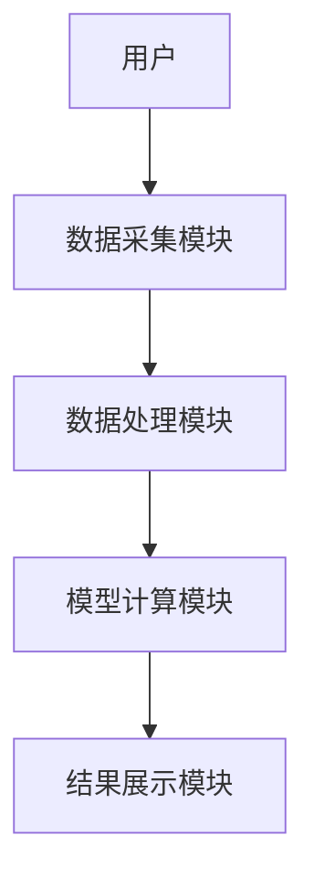
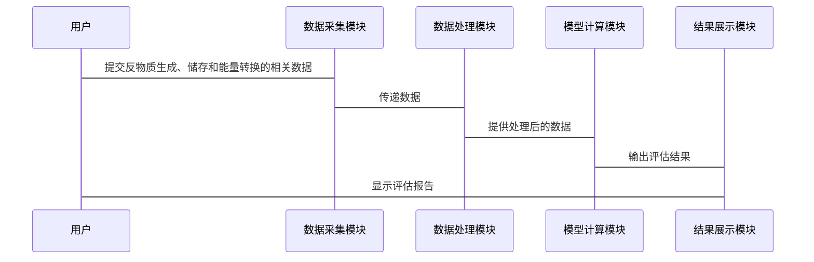

                 


# 《芒格的"逆向思维"在反物质能源商业化评估中的应用》

## 关键词：逆向思维, 反物质能源, 商业化评估, 能源技术, 科学方法, 系统架构

## 摘要：本文探讨了芒格的逆向思维在反物质能源商业化评估中的应用。首先介绍了逆向思维的定义和特点，以及反物质能源的基本概念。接着深入分析了逆向思维的原理与方法，结合反物质能源的科学基础，提出了商业化评估模型。通过系统架构设计和项目实战，展示了如何应用逆向思维来设计和实现反物质能源评估系统。最后总结了最佳实践和未来展望。

---

## 第一章：逆向思维与反物质能源的背景

### 1.1 逆向思维的定义与特点

#### 1.1.1 逆向思维的定义
逆向思维是一种与正向思维相对的思维方式，通过从问题的对立面出发，寻找解决问题的方法。其核心在于“反着思考，正着行动”。

#### 1.1.2 逆向思维的核心特征
- **反向推理**：从结果出发，推导可能的原因。
- **创新性**：通过反向思考，发现新的解决方案。
- **批判性**：逆向思维要求对现有假设进行质疑和验证。

#### 1.1.3 逆向思维在决策中的应用
- **问题分析**：识别问题的根本原因。
- **假设检验**：通过反向推理验证假设的合理性。
- **解决方案设计**：从对立面寻找更优的解决方案。

### 1.2 反物质能源的基本概念

#### 1.2.1 反物质的定义与特性
反物质是与正常物质相对应的物质，具有相同的质量和能量，但粒子的电荷、磁矩等性质与正常物质相反。例如，反质子具有正电荷，而质子具有负电荷。

#### 1.2.2 反物质能源的科学基础
反物质与正常物质相遇时会发生湮灭反应，释放出巨大的能量。这一过程释放的能量是核聚变或核裂变反应的数百万倍，具有极高的能量密度。

#### 1.2.3 反物质能源的潜在应用领域
- **太空探索**：作为飞船燃料，提供超长续航能力。
- **能源供应**：作为清洁能源，解决地球能源危机。
- **医学领域**：用于放射治疗和粒子束癌症治疗。

### 1.3 逆向思维在反物质能源评估中的意义

#### 1.3.1 逆向思维在能源评估中的作用
- **风险识别**：通过逆向思维发现潜在风险。
- **成本优化**：从失败案例中学习，优化项目成本。
- **技术可行性分析**：通过反向推理验证技术可行性。

#### 1.3.2 反物质能源评估的复杂性与挑战
- **技术难度**：反物质的生成和储存技术尚未成熟。
- **成本高昂**：反物质的生产成本极高。
- **市场需求**：反物质能源的市场需求和商业可行性未知。

#### 1.3.3 逆向思维如何帮助解决评估难题
- **从失败中学习**：通过分析失败案例，推导成功策略。
- **风险控制**：提前识别潜在风险，制定应对措施。
- **优化方案设计**：通过反向推理优化项目方案。

---

## 第二章：逆向思维的原理与方法

### 2.1 逆向思维的逻辑框架

#### 2.1.1 问题分析与假设检验
- **问题分析**：明确问题的核心和边界。
- **假设检验**：通过逆向推理验证假设的合理性。
- **问题分解**：将复杂问题分解为简单问题，逐一解决。

#### 2.1.2 解决方案的逆向推导
- **目标设定**：明确评估的目标和关键指标。
- **路径规划**：通过反向推理制定解决方案。
- **步骤细化**：将解决方案分解为具体步骤。

#### 2.1.3 逆向思维的步骤与流程
1. 明确问题：识别问题的核心和边界。
2. 设定目标：明确评估的目标和关键指标。
3. 制定假设：从对立面出发，提出可能的解决方案。
4. 验证假设：通过实验和数据验证假设的合理性。
5. 优化方案：根据验证结果优化解决方案。

### 2.2 逆向思维在反物质能源评估中的应用

#### 2.2.1 评估框架的设计
- **目标设定**：评估反物质能源的技术可行性和商业可行性。
- **关键指标**：包括生产成本、能量转换效率、市场需求等。

#### 2.2.2 数据收集与分析
- **数据来源**：收集反物质生成、储存和能量转换的相关数据。
- **数据处理**：通过逆向推理分析数据，寻找潜在问题和优化方向。

#### 2.2.3 方案设计与优化
- **方案设计**：从对立面出发，设计反物质能源评估方案。
- **方案优化**：通过反向推理优化方案，降低评估成本，提高评估效率。

---

## 第三章：反物质能源的科学基础

### 3.1 反物质的基本性质

#### 3.1.1 反物质的定义与特性
- **反物质**：由反粒子组成的物质，与正常物质互为镜像。
- **反粒子**：具有与正常粒子相反的电荷、磁矩等性质。

#### 3.1.2 反物质的生成与储存
- **生成方法**：通过高能粒子加速器产生反粒子，并将其捕获和储存。
- **储存技术**：利用磁场和电场将反粒子限制在特定区域内，形成反物质储存装置。

#### 3.1.3 反物质的能量转换机制
- **湮灭反应**：反物质与正常物质相遇时发生湮灭反应，释放出巨大的能量。
- **能量释放**：湮灭反应释放的能量包括动能和辐射能，能量密度极高。

### 3.2 反物质能源的能量计算

#### 3.2.1 能量释放公式
湮灭反应释放的能量可以表示为：
$$ E = mc^2 $$
其中，$m$ 是湮灭的质量，$c$ 是光速。

#### 3.2.2 能量转换效率
- **能量转换效率**：湮灭反应的能量转换效率接近100%，但实际应用中由于能量损失，效率可能降低。
- **效率计算**：能量转换效率 = 实际释放的能量 / 理论最大能量。

#### 3.2.3 能量密度比较
- **能量密度**：反物质能源的能量密度远高于传统能源。
- **比较分析**：与核聚变、核裂变等能源相比，反物质能源的能量密度更高。

### 3.3 反物质能源的科学挑战

#### 3.3.1 技术难题
- **生成与储存**：反物质的生成和储存技术尚未成熟。
- **能量控制**：控制湮灭反应的难度极大。

#### 3.3.2 科学争议
- **可行性争议**：反物质能源的实际应用可行性存在争议。
- **技术瓶颈**：当前技术水平难以实现大规模反物质生产。

#### 3.3.3 研究进展
- **实验成果**：国际空间站等项目已经进行了反物质生成和储存的实验。
- **理论研究**：物理学界对反物质能源的研究不断深入，但尚未取得突破性进展。

---

## 第四章：商业化评估模型

### 4.1 评估模型的设计

#### 4.1.1 模型构建方法
- **目标设定**：评估反物质能源的技术可行性和商业可行性。
- **关键指标**：包括生产成本、能量转换效率、市场需求等。
- **模型结构**：构建包含技术、经济、市场等多个模块的评估模型。

#### 4.1.2 数据来源与处理
- **数据收集**：收集反物质生成、储存和能量转换的相关数据。
- **数据处理**：对数据进行清洗、转换和分析，为模型提供输入。

#### 4.1.3 模型验证
- **验证方法**：通过历史数据验证模型的准确性和可靠性。
- **结果分析**：分析模型输出的结果，判断模型的合理性。

### 4.2 评估模型的实现

#### 4.2.1 技术可行性分析
- **技术评估**：评估反物质能源的技术可行性，包括生成、储存和能量转换的可行性。
- **技术风险**：识别潜在的技术风险，并制定应对措施。

#### 4.2.2 经济可行性分析
- **成本计算**：计算反物质能源的生产成本，包括生成、储存和运输成本。
- **经济效益**：评估反物质能源的市场价值和经济效益，判断其商业可行性。

#### 4.2.3 市场需求分析
- **市场需求**：预测反物质能源的市场需求，包括太空探索、能源供应等领域。
- **竞争分析**：分析反物质能源与传统能源的竞争关系，判断其市场前景。

### 4.3 评估模型的优化

#### 4.3.1 模型优化方法
- **参数调整**：根据实际数据调整模型参数，提高模型的准确性和可靠性。
- **模块优化**：优化模型的各个模块，提高模型的运行效率和计算精度。

#### 4.3.2 模型应用案例
- **案例分析**：通过具体案例分析模型的应用效果，验证模型的合理性。
- **经验总结**：总结案例分析中的经验教训，为未来的模型优化提供参考。

---

## 第五章：系统架构设计

### 5.1 系统功能设计

#### 5.1.1 系统目标
- **系统目标**：构建一个高效的反物质能源商业化评估系统，实现对反物质能源的技术可行性和商业可行性的全面评估。

#### 5.1.2 功能模块
- **数据采集模块**：负责采集反物质生成、储存和能量转换的相关数据。
- **数据处理模块**：对采集到的数据进行清洗、转换和分析，为模型提供输入。
- **模型计算模块**：根据输入数据进行模型计算，输出评估结果。
- **结果展示模块**：将模型计算结果以可视化的方式展示给用户。

#### 5.1.3 功能流程
1. 数据采集：通过传感器和数据库采集反物质生成、储存和能量转换的相关数据。
2. 数据处理：对采集到的数据进行清洗、转换和分析，为模型提供输入。
3. 模型计算：根据输入数据进行模型计算，输出评估结果。
4. 结果展示：将模型计算结果以图表、报告等形式展示给用户。

### 5.2 系统架构设计

#### 5.2.1 系统架构图


#### 5.2.2 关键模块设计
- **数据采集模块**：负责采集反物质生成、储存和能量转换的相关数据。
- **数据处理模块**：对采集到的数据进行清洗、转换和分析，为模型提供输入。
- **模型计算模块**：根据输入数据进行模型计算，输出评估结果。
- **结果展示模块**：将模型计算结果以可视化的方式展示给用户。

#### 5.2.3 系统接口设计
- **输入接口**：接收反物质生成、储存和能量转换的相关数据。
- **输出接口**：输出模型计算结果，包括技术可行性和商业可行性评估报告。

### 5.3 系统交互设计

#### 5.3.1 交互流程
1. 用户通过输入接口提交反物质生成、储存和能量转换的相关数据。
2. 数据采集模块接收数据，并将其传递给数据处理模块。
3. 数据处理模块对数据进行清洗、转换和分析，为模型计算模块提供输入。
4. 模型计算模块根据输入数据进行模型计算，输出评估结果。
5. 结果展示模块将模型计算结果以图表、报告等形式展示给用户。

#### 5.3.2 交互序列图


---

## 第六章：项目实战

### 6.1 项目环境安装

#### 6.1.1 环境要求
- **操作系统**：推荐使用Linux或Windows系统。
- **开发工具**：安装Python、Jupyter Notebook等开发工具。
- **依赖库安装**：安装numpy、pandas、matplotlib等数据分析和可视化库。

#### 6.1.2 数据准备
- **数据来源**：收集反物质生成、储存和能量转换的相关数据。
- **数据格式**：数据应以CSV或Excel格式存储，便于后续处理和分析。

### 6.2 核心实现

#### 6.2.1 数据采集模块实现
```python
import pandas as pd

def collect_data():
    # 读取CSV文件
    data = pd.read_csv('anti_matter_data.csv')
    return data

# 示例运行
data = collect_data()
print(data.head())
```

#### 6.2.2 数据处理模块实现
```python
import pandas as pd
import numpy as np

def process_data(data):
    # 数据清洗
    data.dropna(inplace=True)
    # 数据转换
    data['energy_efficiency'] = data['energy_output'] / data['energy_input']
    return data

# 示例运行
processed_data = process_data(data)
print(processed_data.head())
```

#### 6.2.3 模型计算模块实现
```python
import pandas as pd
import numpy as np
from sklearn.linear_model import LinearRegression

def calculate_model(processed_data):
    # 训练模型
    model = LinearRegression()
    model.fit(processed_data[['production_cost', 'storage_efficiency']], processed_data['energy_efficiency'])
    return model

# 示例运行
model = calculate_model(processed_data)
print(model.coef_)
```

#### 6.2.4 结果展示模块实现
```python
import pandas as pd
import matplotlib.pyplot as plt

def display_results(model, processed_data):
    # 绘制散点图
    plt.scatter(processed_data['production_cost'], processed_data['energy_efficiency'])
    plt.xlabel('Production Cost')
    plt.ylabel('Energy Efficiency')
    plt.title('Energy Efficiency vs Production Cost')
    plt.show()

# 示例运行
display_results(model, processed_data)
```

### 6.3 项目实战总结

#### 6.3.1 实战经验总结
- **数据采集**：数据采集是项目成功的关键，确保数据的准确性和完整性。
- **数据处理**：数据处理需要仔细清洗和转换，确保模型输入的数据质量。
- **模型计算**：选择合适的模型和算法，确保模型的准确性和可靠性。
- **结果展示**：结果展示需要直观和清晰，便于用户理解和分析。

#### 6.3.2 项目优化建议
- **数据源优化**：寻找更高质量的数据源，提高模型的准确性。
- **模型优化**：尝试不同的模型和算法，寻找最优解决方案。
- **系统优化**：优化系统的各个模块，提高系统的运行效率和计算速度。

---

## 第七章：最佳实践与未来展望

### 7.1 最佳实践

#### 7.1.1 项目管理
- **制定计划**：制定详细的项目计划，明确各个阶段的目标和任务。
- **团队协作**：合理分配任务，确保团队成员之间的高效协作。
- **风险控制**：提前识别潜在风险，制定应对措施。

#### 7.1.2 技术实现
- **技术选型**：选择合适的技术和工具，确保系统的高效和稳定。
- **代码规范**：制定统一的代码规范，确保代码的可读性和可维护性。
- **测试优化**：加强系统的测试和优化，确保系统的稳定性和可靠性。

### 7.2 未来展望

#### 7.2.1 技术进步
- **生成技术**：随着科技的进步，反物质的生成和储存技术将不断改进。
- **能量转换**：能量转换效率将不断提高，反物质能源的潜力将得到更大的发挥。

#### 7.2.2 市场发展
- **市场需求**：随着能源需求的增加，反物质能源的市场需求将逐渐扩大。
- **商业应用**：反物质能源将在太空探索、能源供应等领域得到更广泛的应用。

#### 7.2.3 科学研究
- **基础研究**：物理学界对反物质能源的研究将不断深入，为未来的应用提供理论支持。
- **国际合作**：反物质能源的研究需要全球科学家的共同努力，未来国际合作将更加紧密。

---

## 附录：工具与资源

### 附录A：常用工具与库
- **数据分析**：Python、Pandas、NumPy、Scikit-learn。
- **数据可视化**：Matplotlib、Seaborn、Plotly。
- **机器学习**：TensorFlow、PyTorch。

### 附录B：参考文献
- 物理学教材：《物理学导论》。
- 科技期刊：《自然》、《科学》等。
- 网络资源：相关学术论文和研究报告。

---

## 结语

芒格的逆向思维在反物质能源商业化评估中的应用，不仅为能源评估提供了一种新的思维方式，也为反物质能源的研究和开发提供了新的思路。通过本文的探讨，我们相信，随着科技的进步和研究的深入，反物质能源的商业化应用将成为可能，并为人类社会的发展带来巨大的推动作用。

--- 

**作者：[您的名字]**

