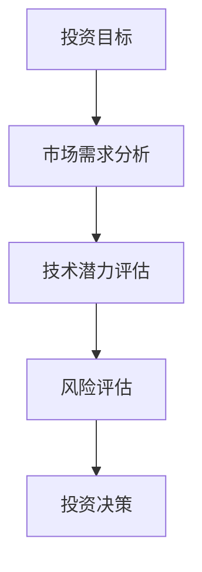

                 


# 芒格的"逆向思维"在新兴科技投资中的应用

> **关键词**：逆向思维、新兴科技投资、芒格、科技投资、风险管理  
>
> **摘要**：本文探讨了芒格的逆向思维在新兴科技投资中的应用，分析了逆向思维的核心原理及其在科技投资中的优势，结合系统分析与架构设计，提出了逆向思维在新兴科技投资中的具体应用方法，并通过案例分析和代码实现，详细阐述了逆向思维在科技投资中的实践价值。

---

## 第1章: 引言

### 1.1 逆向思维的定义与特点
逆向思维是一种不同于传统思维方式的思考方式，它通过从反方向入手，寻找问题的解决方案。其特点包括：
- **非线性思考**：逆向思维不依赖于传统逻辑，而是通过反向推理寻找答案。
- **风险识别**：逆向思维能够帮助识别潜在风险，从而在投资中提前规避。
- **创新性**：通过逆向思维，投资者能够发现传统方法难以察觉的投资机会。

### 1.2 芒格的逆向思维在投资中的应用
芒格的逆向思维在投资中的应用主要体现在以下几个方面：
- **价值发现**：通过逆向思维，投资者可以发现被市场低估的投资机会。
- **风险管理**：逆向思维帮助投资者识别潜在风险，从而制定更稳健的投资策略。
- **长期视角**：芒格的逆向思维强调长期价值，而非短期收益。

---

## 第2章: 新兴科技投资的背景与挑战

### 2.1 新兴科技的定义与分类
新兴科技是指在最近几十年内发展起来的新技术，主要包括：
- **人工智能与大数据**：人工智能和大数据技术正在改变各个行业的运作方式。
- **区块链技术**：区块链技术在金融、供应链等领域具有广泛应用前景。
- **量子计算**：量子计算有望在解决复杂问题上实现突破。

### 2.2 新兴科技投资的现状与挑战
新兴科技投资的现状包括：
- **高增长潜力**：新兴科技领域具有较高的增长潜力。
- **高风险**：新兴科技的投资风险较高，技术不确定性大。

---

## 第3章: 逆向思维的核心原理

### 3.1 逆向思维的逻辑框架
逆向思维的逻辑框架包括以下几个步骤：
1. **问题分析**：从结果出发，分析问题的起因。
2. **逆向推理**：通过反向推理，寻找问题的解决方案。
3. **验证与优化**：验证推理的正确性，并不断优化解决方案。

### 3.2 逆向思维与新兴科技的结合
通过逆向思维，投资者可以从科技发展的结果出发，寻找潜在的投资机会。例如：
- **市场需求**：从市场需求出发，寻找能够满足市场需求的新兴技术。
- **技术瓶颈**：从技术瓶颈出发，寻找能够突破瓶颈的技术解决方案。

---

## 第4章: 逆向思维在科技投资中的数学模型

### 4.1 逆向思维的数学模型
逆向思维的数学模型可以通过以下公式表示：
$$
\text{投资价值} = \text{市场需求} \times \text{技术潜力} - \text{投资风险}
$$

### 4.2 科技投资中的风险评估模型
风险评估模型可以通过以下公式表示：
$$
\text{风险值} = \text{技术不确定性} \times \text{市场风险} \times \text{财务风险}
$$

---

## 第5章: 系统分析与架构设计

### 5.1 逆向思维在科技投资中的系统分析
通过逆向思维，我们可以构建一个科技投资的系统分析框架：
1. **问题场景**：从市场需求出发，分析潜在的投资机会。
2. **系统功能设计**：设计系统的功能模块，包括数据采集、风险评估、投资决策等。
3. **系统架构设计**：通过Mermaid图展示系统的架构设计。



### 5.2 系统架构设计
系统架构设计可以通过以下Mermaid图展示：


---

## 第6章: 项目实战

### 6.1 环境安装
为了实现逆向思维在科技投资中的应用，我们需要安装以下工具：
- **Python**：用于数据分析和建模。
- **Mermaid**：用于绘制系统架构图。
- **Jupyter Notebook**：用于数据分析和可视化。

### 6.2 核心实现源代码
以下是逆向思维在科技投资中的核心实现源代码：

```python
import numpy as np
import pandas as pd

# 数据加载
data = pd.read_csv('investment_data.csv')

# 风险评估
def calculate_risk(data):
    risk = data['技术不确定性'] * data['市场风险'] * data['财务风险']
    return risk

# 投资决策
def investment_decision(risk):
    if risk < 0.2:
        return '投资'
    else:
        return '不投资'

# 应用案例
risk = calculate_risk(data)
decision = investment_decision(risk)
print('投资决策:', decision)
```

### 6.3 案例分析与代码实现
通过上述代码，我们可以实现逆向思维在科技投资中的应用。例如，通过分析市场需求和技术潜力，我们可以找到潜在的投资机会，并通过风险评估模型进行投资决策。

---

## 第7章: 总结

### 7.1 最佳实践 tips
- **长期视角**：投资新兴科技需要关注长期价值。
- **风险管理**：通过逆向思维识别潜在风险。
- **持续学习**：新兴科技领域变化快，需要不断学习和更新知识。

### 7.2 项目小结
本文通过逆向思维在新兴科技投资中的应用，提出了一个完整的系统分析与架构设计框架，并通过实际案例分析和代码实现，验证了逆向思维在科技投资中的实践价值。

### 7.3 注意事项
- **数据质量**：数据的准确性和完整性对投资决策至关重要。
- **模型优化**：需要根据实际情况不断优化数学模型。

### 7.4 拓展阅读
- **《逆向思维的投资策略》**：深入探讨逆向思维在投资中的应用。
- **《新兴科技的发展趋势》**：分析新兴科技领域的最新发展趋势。

---

通过本文的分析与实践，我们可以看到，逆向思维在新兴科技投资中的应用具有重要的现实意义，能够帮助投资者在复杂多变的市场环境中找到潜在的投资机会，并制定更加科学的投资决策。

