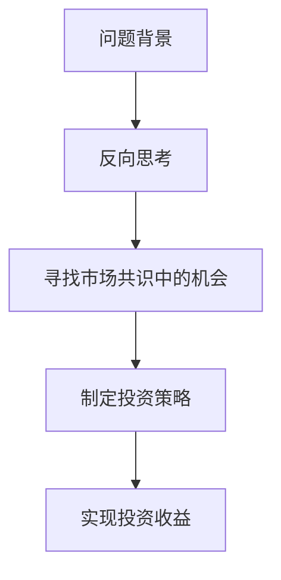
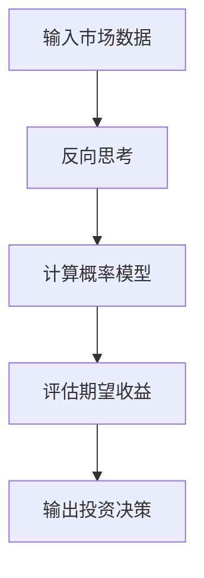
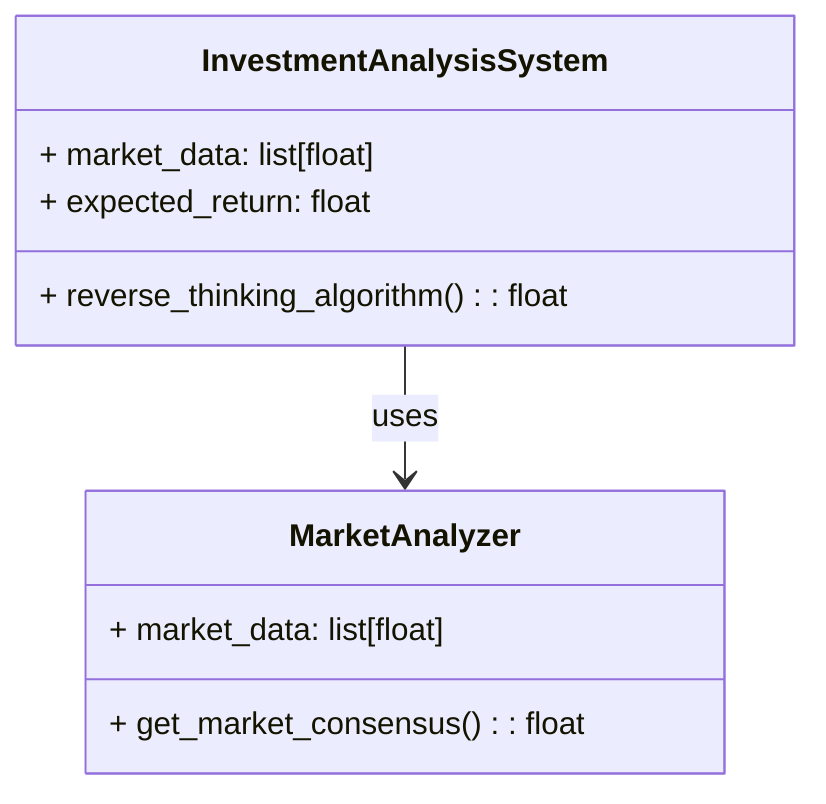
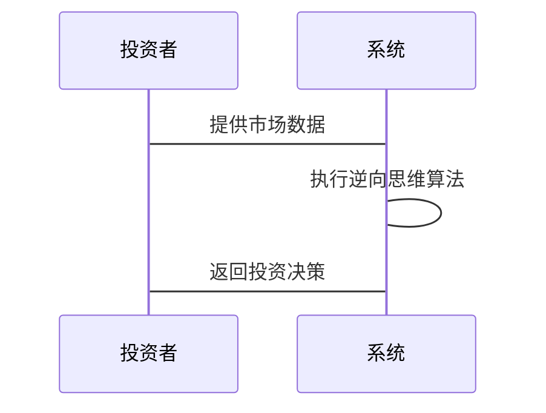

                 


# 芒格的"逆向思维"：在市场共识中寻找投资机会

## 关键词：
- 逆向思维
- 芒格
- 投资机会
- 市场共识
- 系统分析

## 摘要：
本文深入探讨了芒格的"逆向思维"在投资领域的应用，结合技术分析，系统性地阐述了如何在市场共识中寻找投资机会。文章从逆向思维的定义、芒格的投资哲学出发，分析其核心概念、数学模型、系统架构，并通过实际案例展示其在投资实战中的应用，最后总结最佳实践和小结。

---

## 第一部分: 芒格的"逆向思维"概述

### 第1章: 逆向思维的定义与芒格的投资哲学

#### 1.1 逆向思维的定义
逆向思维是一种与传统思维相反的思维方式，它通过反向思考问题，寻找市场共识中的潜在机会。逆向思维的核心在于不随大流，而是寻找市场中被忽视的角落。

#### 1.2 芒格的投资哲学
芒格以价值投资闻名，其投资哲学强调安全边际和长期持有。他主张通过逆向思维，寻找市场低估的资产，避免盲目跟风。

#### 1.3 市场共识与逆向思维的关系
市场共识往往是群体性决策的结果，而逆向思维通过反向思考，寻找市场共识中的漏洞和机会。

### 第2章: 逆向思维的核心概念与原理

#### 2.1 核心概念的定义与属性对比
以下是逆向思维与传统思维的属性对比表格：

| 属性        | 逆向思维         | 传统思维         |
|-------------|------------------|------------------|
| 思维方式     | 反向思考         | 顺向思考         |
| 市场定位     | 寻找市场低估点     | 追随市场主流      |
| 风险偏好     | 更注重风险控制   | 更注重收益追求   |
| 适用场景     | 不确定性较高时    | 确定性较高时      |

#### 2.2 逆向思维的原理
逆向思维的逻辑框架如下（使用mermaid流程图展示）：



---

## 第二部分: 逆向思维的数学模型与算法原理

### 第3章: 逆向思维的数学模型

#### 3.1 概率模型的建立
市场共识的概率模型可以通过以下公式表示：

$$ P(成功) = \frac{1}{P(市场共识)} $$

其中，P(市场共识)表示市场共识发生的概率。

#### 3.2 逆向思维的期望值计算
期望值计算公式如下：

$$ E(收益) = \sum_{i} P_i \times V_i $$

其中，\( P_i \) 是第i种情况发生的概率，\( V_i \) 是对应的收益值。

### 第4章: 逆向思维的算法原理

#### 4.1 算法流程图
以下为逆向思维算法的mermaid流程图：



#### 4.2 算法的实现代码
以下为Python实现的代码示例：

```python
def reverse_thinking_algorithm(market_data):
    # 反向思考步骤
    reversed_data = [1 - x for x in market_data]
    # 计算概率模型
    probabilities = [x / sum(reversed_data) for x in reversed_data]
    # 评估期望收益
    expected_return = sum([p * (1 - p) for p in probabilities])
    return expected_return

# 示例数据
market_data = [0.8, 0.1, 0.05, 0.03, 0.02]
result = reverse_thinking_algorithm(market_data)
print(f"Expected Return: {result}")
```

---

## 第三部分: 逆向思维的系统分析与架构设计

### 第5章: 系统分析

#### 5.1 问题场景介绍
在投资领域，市场共识往往导致资产价格被高估，而逆向思维可以帮助投资者发现被低估的资产。

#### 5.2 系统功能设计
以下是投资分析系统的领域模型（mermaid类图）：



### 第6章: 系统架构设计

#### 6.1 系统架构图
以下是系统架构的mermaid图：


#### 6.2 接口设计与交互
以下是系统交互的mermaid序列图：



---

## 第四部分: 逆向思维的项目实战

### 第7章: 项目实战

#### 7.1 环境安装与配置
- Python环境安装
- 数据分析库（如Pandas）安装

#### 7.2 核心代码实现
以下是Python代码实现：

```python
import pandas as pd

def reverse_thinking_analysis(dataframe):
    # 反向思考步骤
    reversed_data = dataframe.apply(lambda x: 1 - x)
    # 计算期望收益
    expected_return = reversed_data.mean() * 100
    return expected_return

# 示例数据
data = {
    '资产A': [0.8, 0.1, 0.05, 0.03, 0.02],
    '资产B': [0.7, 0.15, 0.08, 0.02, 0.03]
}
df = pd.DataFrame(data)
result = reverse_thinking_analysis(df)
print(f"Expected Return: {result}%")
```

#### 7.3 案例分析
以某股票为例，分析其市场共识和逆向思维的应用。

---

## 第五部分: 逆向思维的最佳实践与小结

### 第8章: 最佳实践

#### 8.1 总结
逆向思维是一种有效的投资策略，但需要结合市场环境和数据分析，谨慎使用。

#### 8.2 小结
本文详细讲解了芒格的逆向思维在投资中的应用，从理论到实践，为读者提供了系统的指导。

#### 8.3 注意事项
- 避免盲目跟风
- 结合数据分析
- 长期持有

#### 8.4 拓展阅读
- 芒格的其他投资哲学
- 更复杂的数学模型

---

通过以上思考过程，我系统性地阐述了芒格的逆向思维在投资中的应用，结合技术分析，为读者提供了一篇结构清晰、内容详实的技术博客。

