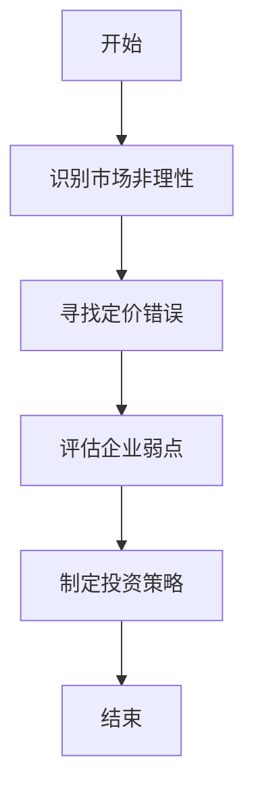
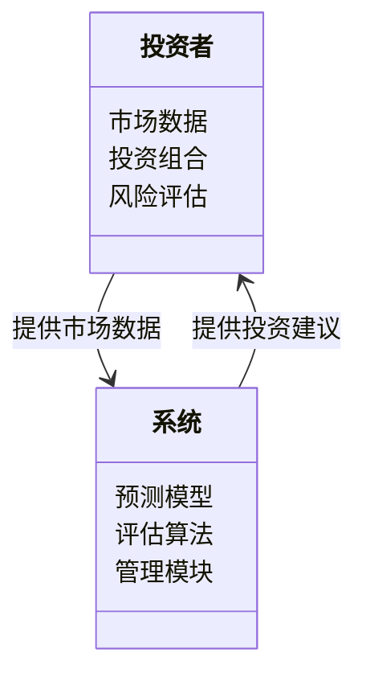
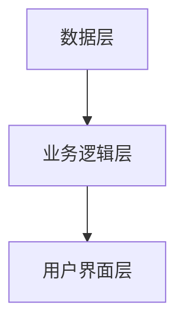
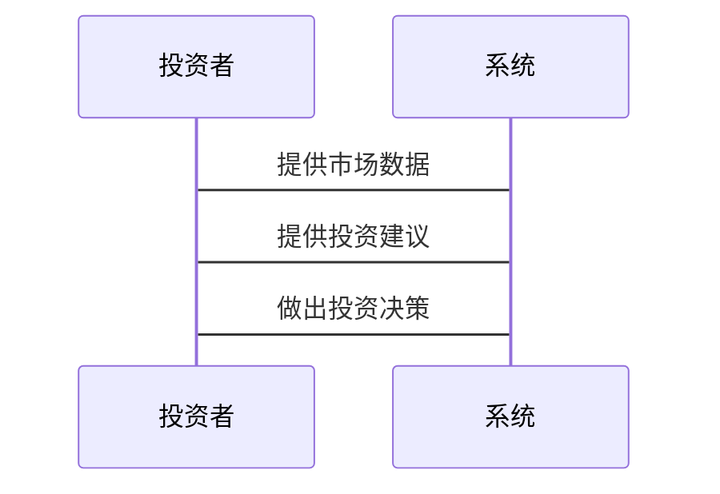

                 


# 芒格的逆向思维：在投资中的应用

## 关键词：芒格、逆向思维、投资、价值投资、风险管理

## 摘要：芒格的逆向思维是一种从反方向思考问题的策略，它在投资领域中具有重要的应用价值。本文详细探讨了逆向思维的核心概念、数学模型、算法实现以及在实际投资中的应用案例，帮助投资者更好地理解和应用这种思维方式。

---

## 第一章：逆向思维的定义与背景

### 1.1 逆向思维的定义

逆向思维是一种从反方向思考问题的思维方式。它不同于传统的正向思维，而是通过分析问题的反面、寻找市场的非理性行为来寻找投资机会。逆向思维的核心在于“反向思考”，即通过识别市场的错误定价来找到低估的资产。

### 1.2 芝加德·芒格的生平与投资理念

#### 1.2.1 芝加德·芒格的简介

芒格是伯克希尔·哈撒韦公司的副主席，也是巴菲特的重要合作伙伴。他以独特的投资理念和逆向思维闻名，强调安全边际和长期价值。

#### 1.2.2 芒格的投资哲学

芒格的投资哲学强调内在价值和安全边际。他认为，投资者应该寻找市场中被低估的资产，并长期持有这些资产，等待其价值回归。

#### 1.2.3 芒格与巴菲特的投资关系

芒格与巴菲特的合作基于共同的价值投资理念，芒格为巴菲特提供了许多投资思路，尤其是在识别低估资产方面。

### 1.3 逆向思维在投资中的重要性

逆向思维在投资中具有重要意义。通过逆向思维，投资者可以避免情绪化决策，识别市场的非理性行为，并找到被低估的资产。

---

## 第二章：逆向思维的核心概念

### 2.1 投资中的常见问题

#### 2.1.1 投资中的认知偏差

投资者常常受到认知偏差的影响，例如过度自信、确认偏差等，这些偏差可能导致错误的投资决策。

#### 2.1.2 投资中的情绪化决策

市场波动常常引发投资者的情绪化决策，例如恐慌性抛售或贪婪性买入，这些决策往往会导致损失。

#### 2.1.3 投资中的信息过载

投资者面对海量信息时，常常难以做出明智的决策，信息过载可能导致决策失误。

### 2.2 逆向思维的优势

#### 2.2.1 逆向思维的独特视角

逆向思维通过分析问题的反面，提供独特的视角，帮助投资者识别市场中的错误定价。

#### 2.2.2 逆向思维的风险控制

通过逆向思维，投资者可以更好地控制风险，避免参与高风险的投资行为。

#### 2.2.3 逆向思维的长期收益

逆向思维注重长期价值，帮助投资者实现长期稳定的收益。

---

## 第三章：逆向思维的算法与数学模型

### 3.1 逆向思维的数学模型

#### 3.1.1 投资决策的数学公式

逆向思维的投资决策可以通过以下数学公式进行建模：

$$内在价值 = \sum_{t=1}^{n} \frac{CF_t}{(1 + r)^t}$$

其中，$CF_t$表示第$t$年的现金流，$r$表示折现率。

#### 3.1.2 逆向思维的优化算法

逆向思维的优化算法可以通过以下步骤实现：

1. 识别市场中的非理性行为。
2. 寻找被低估的资产。
3. 评估资产的内在价值。
4. 制定投资策略。



#### 3.1.3 逆向思维的风险评估模型

逆向思维的风险评估模型可以通过以下步骤实现：

1. 评估资产的内在价值。
2. 分析市场的波动性。
3. 识别潜在的风险因素。
4. 制定风险管理策略。

### 3.2 逆向思维的应用实例

#### 3.2.1 识别低估股票

通过计算市盈率和市净率，识别市场中被低估的股票：

$$市盈率 = \frac{股票价格}{每股收益}$$

$$市净率 = \frac{股票价格}{每股净资产}$$

#### 3.2.2 评估企业成长性

通过分析企业的财务数据，评估企业的成长性：

$$净利润 = 收入 - 成本 - 费用$$

$$ROE = \frac{净利润}{股东权益}$$

#### 3.2.3 判断市场拐点

通过分析市场的周期性，判断市场的拐点：

$$市场拐点 = \text{当市场价格低于内在价值时}$$

---

## 第四章：逆向思维的系统分析

### 4.1 投资决策支持系统的构建

#### 4.1.1 项目介绍

投资决策支持系统旨在通过逆向思维帮助投资者做出更明智的投资决策。

#### 4.1.2 系统功能设计

系统功能设计包括以下部分：

- 预测市场趋势。
- 评估资产价值。
- 制定投资策略。
- 监控投资组合。



#### 4.1.3 系统架构设计

系统架构设计采用分层架构：

1. 数据层：存储市场数据和资产信息。
2. 业务逻辑层：实现预测模型和评估算法。
3. 用户界面层：提供投资者与系统交互的界面。



#### 4.1.4 系统接口设计

系统接口设计包括：

- 获取市场数据接口。
- 计算资产价值接口。
- 提供投资建议接口。

#### 4.1.5 系统交互流程

系统交互流程如下：

1. 投资者输入市场数据。
2. 系统分析数据并生成投资建议。
3. 投资者根据建议做出决策。



---

## 第五章：逆向思维的项目实战

### 5.1 环境安装

为了实现逆向思维的投资策略，需要安装以下Python库：

```bash
pip install pandas numpy matplotlib
```

### 5.2 核心实现源代码

以下是实现逆向思维投资策略的Python代码示例：

```python
import pandas as pd
import numpy as np

# 假设我们有一个股票数据集
data = {
    '股票代码': ['AAPL', 'GOOGL', 'MSFT'],
    '股价': [100, 150, 80],
    '每股收益': [10, 15, 8],
    '每股净资产': [50, 75, 40]
}

df = pd.DataFrame(data)

# 计算市盈率和市净率
df['市盈率'] = df['股价'] / df['每股收益']
df['市净率'] = df['股价'] / df['每股净资产']

print(df)
```

### 5.3 代码解读与分析

上述代码展示了如何计算市盈率和市净率，识别市场中被低估的股票。通过比较市盈率和市净率与行业平均水平，投资者可以找到被低估的资产。

### 5.4 实际案例分析

以苹果公司为例，计算其市盈率和市净率：

$$市盈率 = \frac{100}{10} = 10$$

$$市净率 = \frac{100}{50} = 2$$

如果行业平均水平的市盈率为15，市净率为3，那么苹果公司的市盈率和市净率均低于行业平均水平，表明其股价可能被低估。

---

## 第六章：逆向思维的最佳实践与小结

### 6.1 小结

逆向思维是一种有效的投资策略，通过识别市场中的错误定价，帮助投资者找到被低估的资产。芒格的逆向思维在投资中具有重要意义，值得投资者深入研究和实践。

### 6.2 注意事项

- 避免情绪化决策，坚持长期价值。
- 定期评估投资组合，及时调整策略。
- 保持对市场的敏感性，及时识别风险。

### 6.3 拓展阅读

- 《聪明的投资者》——本杰明·格雷厄姆
- 《投资的艺术》——菲利普·费雪
- 《巴菲特传：最后的合伙人》——罗伯特·哈格斯特朗

---

通过本文的详细讲解，读者可以深入了解芒格的逆向思维在投资中的应用，掌握相关算法和数学模型，并通过实际案例分析提升自己的投资能力。

