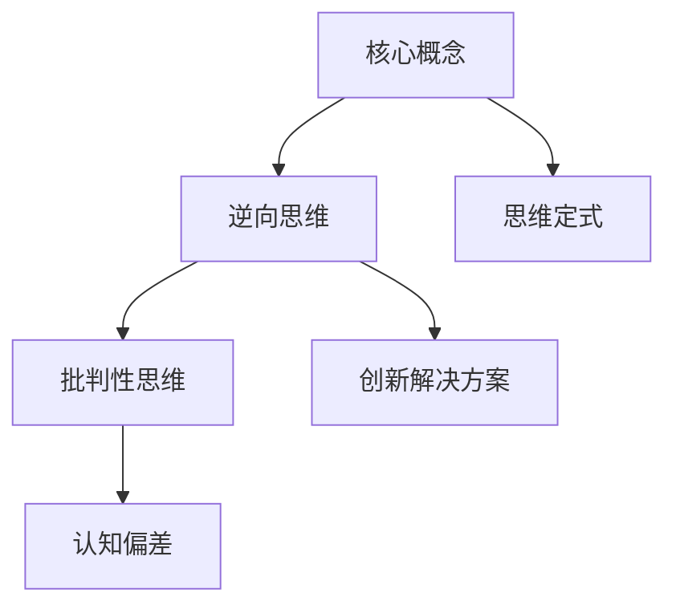
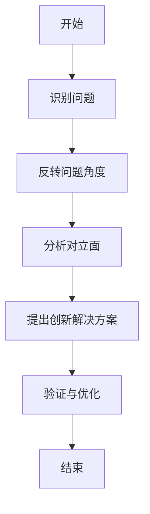
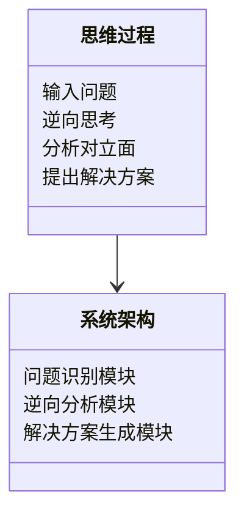

                 


# 芒格的逆向思考法：挑战常规思维模式

## 关键词：
- 逆向思考法
- 批判性思维
- 认知偏差
- 芒格思维
- 创新解决方案

## 摘要：
芒格的逆向思考法是一种挑战常规思维模式的方法，旨在通过逆向思维和批判性分析来突破传统思维的局限性，寻找更优解决方案。本文从背景介绍、核心概念、算法原理、系统架构设计、项目实战到总结，全面解析逆向思考法的理论与实践应用，帮助读者掌握这一创新思维工具。

---

## 第一部分：芒格逆向思考法的背景与核心概念

### 第1章：逆向思考法的背景与问题背景

#### 1.1 问题背景

在快速变化的现代社会中，传统思维模式往往导致创新不足和决策失误。芒格的逆向思考法作为一种颠覆性思维策略，强调从反向角度思考问题，寻找非直观的解决方案。这种方法不仅挑战了传统的线性思维，还提供了从对立面出发解决问题的新视角。

#### 1.2 问题描述

常规思维模式往往受限于已有的知识和经验，容易陷入认知偏差和思维定式。例如，确认偏差导致人们倾向于接受支持自己观点的信息，忽略反驳信息；而从众思维则让人随波逐流，缺乏独立判断。这些问题在决策过程中可能导致错误的选择和判断。

#### 1.3 问题解决

逆向思考法通过反转问题的角度，重新审视问题的本质，从而发现新的解决方案。例如，在商业策略中，可以从竞争对手的失败案例中汲取教训，找到市场空白。这种方法不仅提高了决策的质量，还能够突破常规思维的限制，激发创新思维。

#### 1.4 边界与外延

虽然逆向思考法在多种场景中具有广泛的应用，但其适用范围也有一定的边界。例如，在需要快速决策的情况下，逆向思考法可能不如直觉决策高效。此外，逆向思考法的局限性在于需要大量信息和时间进行分析，不适合所有类型的问题。

#### 1.5 核心概念结构与组成

逆向思考法的核心概念包括：
- 逆向思维：从反方向思考问题，寻找非直观的解决方案。
- 批判性思维：对问题进行质疑与分析，识别潜在的问题和机会。
- 认知偏差：理解并克服思维中的偏见，以更客观的方式看待问题。

---

## 第二部分：逆向思考法的核心概念与原理

### 第2章：逆向思考法的核心原理

#### 2.1 核心概念原理

逆向思维的核心在于反转问题，从对立面寻找答案。例如，面对“如何提高销售量”这个问题，可以从“如何减少销售障碍”反向思考，从而找到更有效的解决方案。这种思维方式帮助我们摆脱常规思维的束缚，发现新的可能性。

#### 2.2 核心概念对比表

| 概念         | 定义                                         | 特点                           | 应用场景                     |
|--------------|--------------------------------------------|--------------------------------|------------------------------|
| 逆向思维     | 从反方向思考问题，寻找非直观的解决方案     | 突破常规，激发创新             | 创新设计、问题解决           |
| 批判性思维   | 对问题进行质疑与分析，识别潜在问题和机会   | 分析问题根源，提出改进方案     | 学术研究、决策制定           |
| 认知偏差     | 思维中的偏见，影响判断和决策               | 了解并克服偏见，提高决策质量   | 个人决策、团队协作           |

#### 2.3 实体关系图（Mermaid）



---

## 第三部分：逆向思考法的算法原理与数学模型

### 第3章：逆向思考法的算法原理

#### 3.1 算法流程图（Mermaid）



#### 3.2 数学模型与公式

逆向思考法在决策过程中可以结合概率论和贝叶斯定理进行分析。例如，假设我们有一个事件A，其逆向事件为¬A，那么根据贝叶斯定理：

$$ P(A|B) = \frac{P(B|A) \cdot P(A)}{P(B)} $$

通过计算逆向事件的概率，我们可以更全面地评估问题。

---

## 第四部分：逆向思考法的系统分析与架构设计

### 第4章：逆向思考法的系统分析与架构设计

#### 4.1 系统功能设计（Mermaid类图）



#### 4.2 系统架构设计（Mermaid架构图）


---

## 第五部分：逆向思考法的项目实战

### 第5章：逆向思考法的项目实战

#### 5.1 项目环境安装

为了实践逆向思考法，建议安装以下工具：
- 思维导图软件（如MindMap）
- 项目管理工具（如Trello）
- 数据分析工具（如Excel或Python的Pandas库）

#### 5.2 核心代码实现（Python示例）

```python
# 示例代码：逆向思考法在问题解决中的应用
def reverse_thinking(problem):
    # 反转问题角度
    reversed_problem = problem[::-1]
    # 分析对立面
    opposite_analysis = reversed_problem.split()
    # 提出解决方案
    solution = [i for i in opposite_analysis if i not in problem]
    return solution

# 应用示例
problem = "如何提高销售量"
solution = reverse_thinking(problem)
print(solution)
```

#### 5.3 案例分析

以“如何提高团队效率”为例，使用逆向思考法：
1. 反转问题：如何降低效率损耗？
2. 分析对立面：识别效率低下的原因，如沟通不畅、任务分配不合理。
3. 提出解决方案：优化沟通渠道，重新分配任务。

---

## 第六部分：总结与展望

### 6.1 最佳实践 Tips

- 定期练习逆向思考法，培养逆向思维的习惯。
- 结合批判性思维，深入分析问题的对立面。
- 在团队中推广逆向思考法，提升整体创新能力。

### 6.2 小结

芒格的逆向思考法是一种强大的思维工具，通过反转问题角度，突破常规思维的限制，帮助我们找到更优的解决方案。结合批判性思维和认知偏差的分析，逆向思考法在实际应用中展现出独特的优势。

### 6.3 注意事项

- 逆向思考法需要时间练习，切勿急于求成。
- 在实际应用中，结合具体情况灵活运用，避免生搬硬套。

### 6.4 拓展阅读

- 《芒格的思维模型》
- 《批判性思维的艺术》
- 《认知偏差：理解思维的局限性》

---

通过以上详细的内容，我们可以看到，芒格的逆向思考法不仅是一种思维方式，更是一种系统的分析工具，能够帮助我们在复杂的问题中找到突破口，实现创新与突破。

