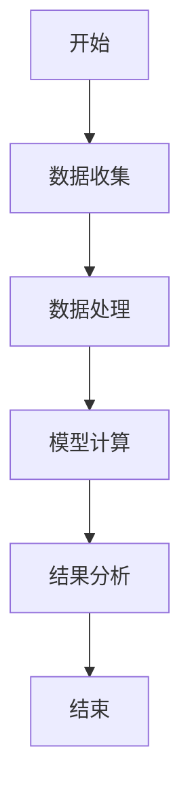
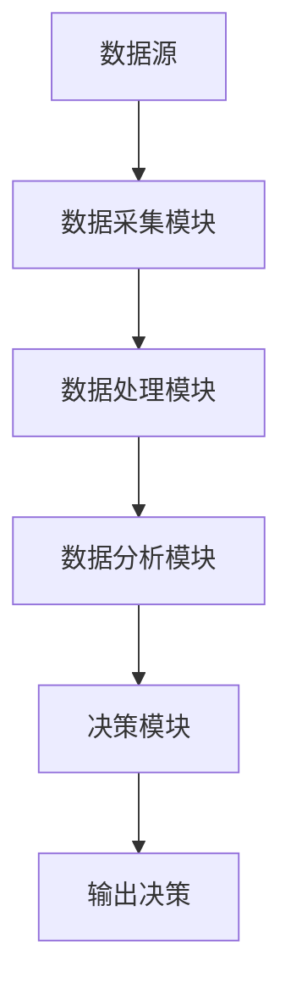

                 

# 《芒格的逆向投资思维：如何在市场恐慌中获利》

## 关键词：芒格, 逆向投资, 市场恐慌, 价值投资, 安全边际, 投资策略

## 摘要：本文深入探讨了芒格的逆向投资思维，分析了其在市场恐慌中的应用策略，结合技术角度，从背景、概念、算法、系统架构到实战案例，详细解析了如何在市场波动中获利。

---

# 第一部分: 逆向投资的背景与基础

# 第1章: 逆向投资的起源与芒格的投资理念

## 1.1 逆向投资的定义与核心思想

### 1.1.1 逆向投资的定义
逆向投资是一种与市场趋势相反的投资策略，强调在市场恐慌时买入，在市场狂热时卖出。其核心思想是“别人恐惧时我贪婪，别人贪婪时我恐惧”。

### 1.1.2 逆向投资的核心思想
- 市场情绪的非理性：市场往往由情绪驱动，而非理性决策导致价格偏离内在价值。
- 安全边际的重要性：通过买入低于内在价值的资产，降低投资风险。
- 长期价值导向：逆向投资关注资产的长期价值，而非短期价格波动。

### 1.1.3 逆向投资与传统投资的区别
| 方面 | 逆向投资 | 顺势投资 |
|------|----------|----------|
| 投资时机 | 市场恐慌时买入 | 市场上涨时买入 |
| 投资心态 | 逆市场情绪 | 顺市场情绪 |
| 风险控制 | 重视安全边际 | 依赖市场趋势 |

## 1.2 芝姆格的生平与投资哲学

### 1.2.1 芝姆格的生平简介
- 沃伦·巴菲特的合伙人。
- “格格不入”的投资理念创始人。
- 强调理性思考和安全边际。

### 1.2.2 芝姆格的投资哲学
- 价值投资：买入低于内在价值的资产。
- 安全边际：通过价格折扣降低风险。
- 避免从众心理：逆市场情绪做出决策。

### 1.2.3 芝姆格的“格格不入”投资理念
- 投资者应独立思考，避免随波逐流。
- 逆市场情绪做出投资决策。

## 1.3 逆向投资的现实意义

### 1.3.1 逆向投资在现代金融中的地位
- 逆向投资是应对市场波动的重要策略。
- 在市场恐慌时，逆向投资能够发现被低估的资产。

### 1.3.2 逆向投资与市场周期的关系
- 逆向投资与市场周期密切相关。
- 在市场底部买入，在市场顶部卖出。

### 1.3.3 逆向投资对个人投资者的启示
- 逆向投资需要强大的心理素质和纪律性。
- 需要持续学习和研究，才能识别市场恐慌中的机会。

## 1.4 本章小结
本章介绍了逆向投资的定义、核心思想、与传统投资的区别，以及芒格的投资哲学和“格格不入”的投资理念。同时，探讨了逆向投资的现实意义，强调了在市场恐慌中发现机会的重要性。

---

# 第2章: 逆向投资的核心概念与联系

## 2.1 价值投资的核心原理

### 2.1.1 价值投资的定义
价值投资是一种投资策略，强调以低于内在价值的价格买入资产。

### 2.1.2 价值投资的核心要素
- 内在价值：资产的真正价值，不随市场波动而变化。
- 安全边际：买入价格与内在价值的差距，作为风险缓冲。

### 2.1.3 价值投资与逆向投资的联系
- 价值投资是逆向投资的核心理念。
- 逆向投资通过价值投资在市场恐慌时发现低估资产。

## 2.2 市场情绪与投资者心理

### 2.2.1 市场情绪的定义与分类
- 市场情绪：投资者情绪的集合，影响市场价格。
- 分类：乐观、悲观、狂热、恐慌。

### 2.2.2 投资者心理的常见偏差
- 过度自信：投资者认为自己能预测市场。
- 过度从众：跟随市场趋势，忽略独立思考。

### 2.2.3 市场恐慌与投资机会的关系
- 市场恐慌导致资产价格低估，创造投资机会。
- 投资者恐慌时，容易做出非理性决策。

## 2.3 安全边际的概念与应用

### 2.3.1 安全边际的定义
安全边际是买入价格与资产内在价值之间的差距，用于降低投资风险。

### 2.3.2 安全边际的计算方法
- 内在价值评估：通过现金流折现法等方法计算。
- 买入价格：低于内在价值的价格。

### 2.3.3 安全边际在逆向投资中的应用
- 在市场恐慌时，寻找安全边际大的资产。
- 通过安全边际降低投资风险。

## 2.4 核心概念对比表

| 概念 | 价值投资 | 逆向投资 |
|------|----------|----------|
| 核心理念 | 买入低于内在价值的资产 | 在市场恐慌时买入低估资产 |
| 关注点 | 内在价值 | 市场情绪与价格关系 |
| 风险控制 | 安全边际 | 市场恐慌时的机会 |

## 2.5 本章小结
本章探讨了价值投资的核心原理、市场情绪与投资者心理，以及安全边际的概念与应用。通过对比分析，明确了逆向投资与价值投资的联系和区别。

---

# 第3章: 逆向投资的数学模型与算法原理

## 3.1 逆向投资的数学模型

### 3.1.1 价值评估模型
价值评估模型用于计算资产的内在价值，常用的方法包括现金流折现法（DCF）。

### 3.1.2 市场情绪指数模型
市场情绪指数模型用于量化市场情绪，常用的方法包括基于成交量、价格波动等指标的综合指数。

### 3.1.3 安全边际计算公式
$$ 安全边际 = 内在价值 - 买入价格 $$

## 3.2 逆向投资算法的流程图

## 3.3 价值评估模型的数学公式
$$ V = \frac{CF}{k} $$
其中，V为内在价值，CF为未来现金流，k为折现率。

## 3.4 市场情绪指数的计算
$$ S = \frac{\sum_{i=1}^{n} p_i}{n} $$
其中，S为市场情绪指数，p_i为各个指标的情绪值。

## 3.5 安全边际的计算步骤
1. 计算资产的内在价值。
2. 确定买入价格。
3. 计算安全边际：安全边际 = 内在价值 - 买入价格。

## 3.6 本章小结
本章通过数学模型和流程图，详细讲解了逆向投资的算法原理。通过价值评估模型和市场情绪指数模型，帮助投资者在市场恐慌中识别低估资产。

---

# 第4章: 逆向投资的系统架构与实现

## 4.1 投资决策系统的架构设计

### 4.1.1 系统功能设计
- 数据采集：收集市场数据，包括价格、成交量等。
- 数据分析：计算市场情绪指数，评估资产内在价值。
- 决策模块：根据分析结果，生成投资决策。

### 4.1.2 系统架构图

## 4.2 系统实现的详细步骤

### 4.2.1 数据采集
- 数据来源：股票价格、成交量、市场情绪指标等。
- 数据格式：结构化数据，便于分析。

### 4.2.2 数据分析
- 计算市场情绪指数。
- 评估资产内在价值。

### 4.2.3 决策生成
- 根据安全边际和市场情绪，生成买入或卖出信号。

## 4.3 系统实现的注意事项

### 4.3.1 数据的实时性
- 系统需要实时采集和分析数据，以捕捉市场机会。

### 4.3.2 模型的准确性
- 价值评估模型和市场情绪指数模型需要不断优化，以提高准确性。

### 4.3.3 风险控制
- 设置止损点，避免过度亏损。

## 4.4 本章小结
本章通过系统架构设计，展示了如何构建一个逆向投资决策系统。通过数据分析和模型计算，帮助投资者在市场恐慌中做出明智决策。

---

# 第5章: 逆向投资的实战案例分析

## 5.1 案例背景介绍

### 5.1.1 市场环境
- 2008年金融危机期间，市场恐慌指数达到高峰。
- 大量资产价格被低估。

### 5.1.2 投资目标
选择一只被市场恐慌抛售的股票，进行逆向投资。

## 5.2 数据分析与决策

### 5.2.1 数据收集
- 收集目标股票的历史价格、成交量等数据。
- 计算市场情绪指数。

### 5.2.2 价值评估
- 使用DCF模型计算股票的内在价值。
- 确定安全边际。

## 5.3 投资决策

### 5.3.1 买入时机
- 在市场恐慌时，当安全边际大于10%时买入。

### 5.3.2 买入数量
- 根据资金量和风险承受能力，决定买入数量。

## 5.4 投资结果

### 5.4.1 买入后的市场变化
- 市场逐渐恢复，股票价格回归内在价值。

### 5.4.2 投资收益
- 通过逆向投资，获得超过市场的收益。

## 5.5 案例总结

### 5.5.1 成功因素
- 精准的市场分析。
- 合理的安全边际设置。

### 5.5.2 经验教训
- 需要持续关注市场变化，及时调整投资策略。

## 5.6 本章小结
本章通过一个实际案例，展示了逆向投资在市场恐慌中的应用。通过数据分析和价值评估，投资者可以在市场底部发现机会，实现超额收益。

---

# 第6章: 逆向投资的最佳实践与注意事项

## 6.1 投资策略的制定

### 6.1.1 确定投资目标
- 明确投资目标，制定长期计划。

### 6.1.2 风险管理
- 设置止损点，控制投资风险。

## 6.2 投资心态的调整

### 6.2.1 保持冷静
- 在市场恐慌时，保持冷静，避免非理性决策。

### 6.2.2 长期思维
- 逆向投资需要耐心，等待市场回归理性。

## 6.3 市场分析的技巧

### 6.3.1 关注基本面
- 重点分析企业的财务状况，而非市场情绪。

### 6.3.2 多元化投资
- 分散投资，降低风险。

## 6.4 逆向投资的注意事项

### 6.4.1 避免过度逆向
- 避免在市场极度恐慌时过度买入，导致亏损。

### 6.4.2 保持灵活性
- 根据市场变化，及时调整投资策略。

## 6.5 本章小结
本章总结了逆向投资的最佳实践，强调了投资策略、心态调整和市场分析的重要性。同时，提醒投资者注意风险，避免过度逆向。

---

# 第7章: 逆向投资的未来展望与拓展阅读

## 7.1 逆向投资的未来展望

### 7.1.1 技术进步对逆向投资的影响
- 大数据分析和人工智能将为逆向投资提供更精准的工具。

### 7.1.2 逆向投资的全球化趋势
- 全球市场波动为逆向投资提供更多机会。

## 7.2 拓展阅读推荐

### 7.2.1 经典书籍
- 《芒格的投资哲学》
- 《价值投资实战策略》

### 7.2.2 网络资源
- 投资论坛和博客，分享逆向投资经验。

## 7.3 本章小结
本章展望了逆向投资的未来发展趋势，并推荐了相关阅读资料，帮助投资者进一步学习和实践。

---

# 附录: 逆向投资的数学公式汇总

## 附录A: 价值评估模型

$$ V = \frac{CF}{k} $$

## 附录B: 市场情绪指数计算

$$ S = \frac{\sum_{i=1}^{n} p_i}{n} $$

## 附录C: 安全边际计算

$$ 安全边际 = 内在价值 - 买入价格 $$

---

# 结语
通过本文的系统讲解，读者可以全面理解芒格的逆向投资思维，并掌握在市场恐慌中获利的具体方法。逆向投资不仅是一种投资策略，更是一种需要长期学习和实践的投资哲学。希望本文能为投资者在市场波动中提供有价值的指导。

