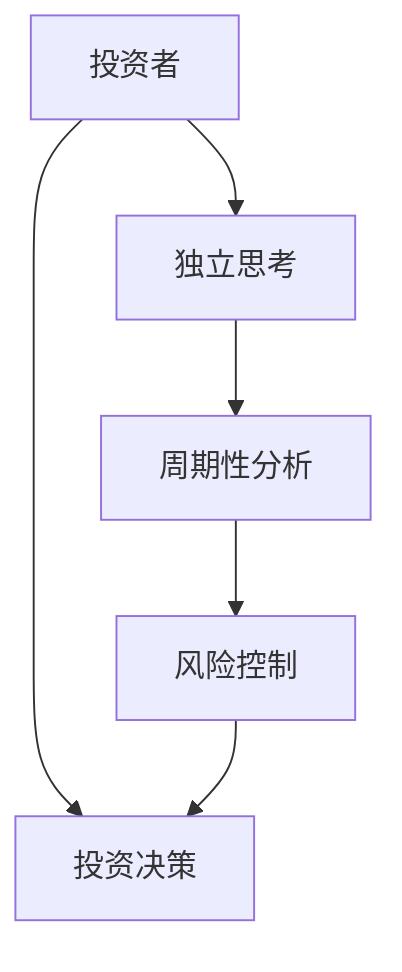

                 


# 芒格的"避免失败"原则在前沿科技风险投资中的应用

---

## 关键词：芒格，风险投资，避免失败，前沿科技，投资策略，决策树，概率分析

---

## 摘要：  
本文深入探讨了芒格的“避免失败”原则在前沿科技风险投资中的应用。通过分析芒格的核心理念、构建数学模型、设计系统架构，并结合实际案例，展示了如何将这些原则转化为具体的投资策略。文章从理论到实践，详细阐述了如何在科技投资中避免失败，提高投资成功的概率。

---

# 第一部分：芒格“避免失败”原则的背景与基础

## 第1章：芒格“避免失败”原则概述

### 1.1 芒格“避免失败”原则的核心理念  
芒格的“避免失败”原则强调通过独立思考和深入分析，识别和避免潜在风险，从而降低投资失败的概率。这种方法在前沿科技投资中尤为重要，因为这些领域通常具有高度不确定性和快速变化的特性。

### 1.2 芒格“避免失败”原则在风险投资中的应用背景  
在前沿科技领域，投资者面临的技术风险和市场不确定性极高。传统的投资方法往往依赖于市场趋势和公司财务数据，但在科技投资中，技术路径的选择和团队能力更为关键。芒格的原则提供了一种基于风险控制的投资策略，帮助投资者在不确定的环境中做出更明智的决策。

### 1.3 本章小结  
本章通过介绍芒格的核心理念及其在科技投资中的应用背景，为读者提供了理解后续内容的基础。接下来，我们将深入分析这些原则的核心要素和实现方法。

---

# 第二部分：芒格“避免失败”原则的核心概念与分析

## 第2章：芒格“避免失败”原则的核心要素

### 2.1 芒格“避免失败”原则的核心要素分析  
- **独立思考**：芒格强调独立思考的重要性，避免随波逐流。通过独立分析，投资者能够识别潜在风险，避免集体错误。  
- **周期性分析**：芒格认为市场和企业都有周期性，通过分析周期性变化，投资者可以在市场低谷时寻找机会。  
- **风险控制**：芒格将风险控制放在首位，认为避免重大损失是投资成功的基石。

### 2.2 芒格“避免失败”原则与其他投资原则的对比  
- **与价值投资的对比**：价值投资关注低估资产，而芒格的原则更注重风险控制和周期性分析。  
- **与成长投资的对比**：成长投资侧重于高增长潜力，而芒格的方法更注重避免失败。  
- **与技术分析的对比**：技术分析依赖价格和成交量，而芒格的方法更关注基本面和风险因素。

### 2.3 芒格“避免失败”原则的属性特征对比表  
| 原则 | 独立性 | 周期性 | 风险控制 |  
|------|--------|--------|----------|  
| 芒格 | 高     | 高     | 强        |  
| 价值 | 中     | 中     | 中        |  
| 成长 | 中     | 低     | 弱        |  

### 2.4 芒格“避免失败”原则的ER实体关系图  


---

# 第三部分：芒格“避免失败”原则的算法原理

## 第3章：芒格“避免失败”原则的数学模型

### 3.1 决策树模型的构建  
芒格的“避免失败”原则可以通过决策树模型来表示。决策树帮助投资者在不同决策节点上评估可能的结果，选择最优路径。  
- **节点定义**：每个节点代表一个决策点，边代表可能的结果，权重代表概率。  
- **决策树构建**：通过分析每个决策点的可能结果和概率，构建决策树并进行剪枝，选择概率最高的路径。  

### 3.2 概率分析模型  
芒格的概率分析模型通过计算每个投资标的成功的概率，帮助投资者做出决策。  
- **成功概率公式**：  
  $$ P(\text{成功}) = \frac{\text{成功案例数}}{\text{总案例数}} $$  
- **风险调整后的期望值公式**：  
  $$ E = \sum (P_i \times R_i) $$  

### 3.3 决策树与概率分析的结合  
通过结合决策树和概率分析，投资者可以在每个决策点评估不同路径的概率和收益，最终选择风险最小、收益最大的路径。

---

# 第四部分：系统分析与架构设计

## 第4章：系统架构与功能设计

### 4.1 系统架构设计  
构建基于芒格原则的投资系统，需要设计合理的系统架构。  
- **系统架构图**：  
  ```mermaid
  graph TD
      A[投资者] --> B[数据采集]
      B --> C[数据分析]
      C --> D[风险评估]
      D --> E[投资决策]
  ```

### 4.2 功能模块设计  
- **数据采集模块**：收集市场数据、公司信息等。  
- **数据分析模块**：分析数据，评估风险。  
- **风险评估模块**：计算每个投资标的成功概率。  
- **投资决策模块**：根据分析结果，生成投资策略。

---

# 第五部分：项目实战

## 第5章：项目实战与案例分析

### 5.1 实战环境安装  
- 安装Python、Pandas、NumPy等工具。  

### 5.2 系统核心实现代码  
```python
import pandas as pd
import numpy as np

# 数据加载
data = pd.read_csv('tech_invest.csv')

# 成功概率计算
def calculate_success_probability(data):
    success = data[data['result'] == 'success']
    probability = len(success) / len(data)
    return probability

# 风险评估
def risk_assessment(probability):
    if probability > 0.7:
        return 'high'
    elif probability > 0.4:
        return 'medium'
    else:
        return 'low'

# 投资决策
def investment_decision(probability, risk):
    if risk == 'high' and probability > 0.6:
        return 'invest'
    else:
        return 'avoid'

# 示例分析
prob = calculate_success_probability(data)
risk = risk_assessment(prob)
decision = investment_decision(prob, risk)
print(f"成功概率：{prob}, 风险等级：{risk}, 投资决策：{decision}")
```

### 5.3 代码应用解读  
通过上述代码，投资者可以计算每个科技项目的成功概率，并根据风险评估结果做出投资决策。例如，若某项目的成功概率为0.7，风险等级为“high”，则决策为“invest”。

### 5.4 案例分析  
以某人工智能初创公司为例，分析其成功概率和风险等级，最终做出投资决策。

### 5.5 项目小结  
通过实战分析，展示了如何将芒格的“避免失败”原则转化为具体的代码实现，并应用于实际投资决策。

---

# 第六部分：最佳实践与小结

## 第6章：最佳实践与小结

### 6.1 最佳实践  
- **持续学习**：保持对前沿科技的了解，及时更新投资策略。  
- **风险评估**：定期评估投资组合中的风险，及时调整。  
- **独立思考**：避免盲目跟风，坚持独立分析。

### 6.2 小结  
本文通过理论分析、算法构建、系统设计和实战案例，全面探讨了芒格“避免失败”原则在前沿科技投资中的应用。通过系统的分析和实践，投资者可以有效降低风险，提高投资成功率。

### 6.3 注意事项  
- **数据质量**：确保数据来源可靠，分析结果准确。  
- **模型局限性**：认识到模型的局限性，避免过度依赖。  
- **市场变化**：及时关注市场变化，灵活调整策略。

### 6.4 拓展阅读  
推荐阅读《芒格的智慧》、《科技投资指南》等书籍，深入了解芒格的投资理念和科技投资策略。

---

# 结语  
芒格的“避免失败”原则为前沿科技风险投资提供了一种新的思路。通过理论与实践的结合，投资者可以在高度不确定的环境中做出更明智的决策。希望本文能够为读者在科技投资领域提供有价值的参考和指导。

