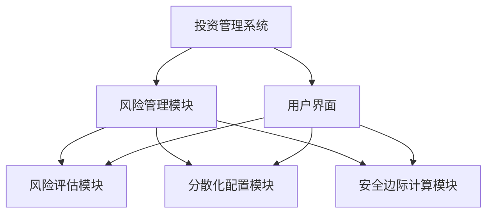
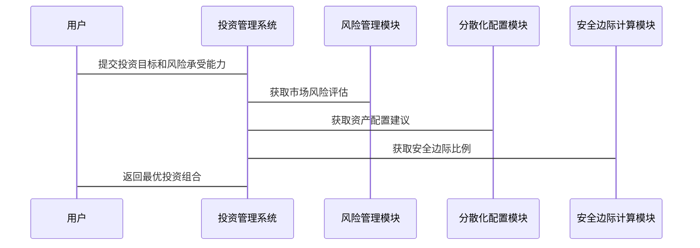

                 


# 芒格的"避免失败"原则：投资成功的另一面

## 关键词：
- 投资策略，风险管理，芒格原则，安全边际，分散投资

## 摘要：
本文深入探讨了芒格的“避免失败”投资原则，分析其在投资决策中的重要性。通过结合风险管理、安全边际和分散投资等核心概念，文章详细阐述了如何通过避免重大损失来实现投资成功。结合实际案例和数学模型，文章为读者提供了清晰的理论框架和实践指南。

---

# 第1章：芒格及其投资哲学概述

## 1.1 芒格的生平简介

### 1.1.1 芝加格大学教育背景
- 芒格毕业于芝加哥大学法学院，拥有深厚的法学背景。
- 在大学期间，他对经济学和心理学产生了浓厚兴趣，为后来的投资哲学奠定了基础。

### 1.1.2 早期职业生涯与合伙企业
- 1971年，芒格与巴菲特合伙创立合伙企业，开始共同管理资金。
- 他的合伙企业以稳健的投资风格和长期优异的业绩闻名。

### 1.1.3 投资理念的形成与发展
- 芒格的投资理念深受价值投资和行为金融学影响。
- 他强调理性决策、避免情绪化交易，注重长期价值。

## 1.2 “避免失败”原则的提出

### 1.2.1 传统投资理念的局限性
- 传统投资策略过于关注收益，忽视风险控制。
- 2008年金融危机暴露了过度杠杆和风险集中化的弊端。

### 1.2.2 芒格投资哲学的核心思想
- 芒格认为，投资成功的关键不是追求高收益，而是避免重大损失。
- 他强调“先保护本金，再追求收益”。

### 1.2.3 “避免失败”原则的定义与目标
- 定义：通过严格的风险管理和分散投资，降低投资组合的整体风险。
- 目标：在市场波动中保持稳健，实现长期稳定的收益。

---

# 第2章：芒格“避免失败”原则的理论基础

## 2.1 投资学基础理论

### 2.1.1 现代投资组合理论（MPT）
- MPT由哈里·马科维茨提出，强调通过分散投资降低风险。
- 通过合理配置不同资产，优化风险与收益的比率。

### 2.1.2 CAPM模型与资产定价
- CAPM模型用于确定资产的预期收益，考虑其系统性风险。
- 芒格的原则与CAPM模型的内在一致性，即注重系统性风险的控制。

### 2.1.3 风险与收益的平衡
- 风险与收益呈正相关，但过高的风险可能导致不可承受的损失。
- 芒格的方法通过降低风险，间接提高了收益的稳定性。

## 2.2 行为金融学与决策偏差

### 2.2.1 常见的决策偏差类型
- 心理偏差：过度自信、从众心理、损失厌恶等。
- 这些偏差可能导致非理性的投资决策。

### 2.2.2 行为金融学对投资决策的影响
- 行为金融学解释了投资者的非理性行为，如恐慌性抛售。
- 芒格的原则通过严格的风险管理和纪律性交易，帮助克服这些偏差。

### 2.2.3 如何克服认知偏差
- 提高自我认知，识别和纠正认知偏差。
- 制定严格的交易纪律，避免情绪化决策。

## 2.3 芒格原则与传统投资理论的对比

### 2.3.1 传统投资理论的优缺点
- 优点：提供系统性的分析框架。
- 缺点：过于注重收益，忽视风险控制。

### 2.3.2 芒格原则的独特之处
- 强调风险管理，将风险控制放在首位。
- 通过分散投资和安全边际降低整体风险。

### 2.3.3 两者的结合与应用
- 结合MPT和芒格原则，构建稳健的投资组合。
- 在追求收益的同时，注重风险的分散和控制。

---

# 第3章：芒格“避免失败”原则的核心概念与联系

## 3.1 核心概念与联系

### 3.1.1 风险管理的核心地位
- 风险管理是投资决策中的首要任务。
- 芒格通过严格的筛选标准和分散投资降低风险。

### 3.1.2 投资组合的分散化策略
- 分散化是降低风险的有效方法。
- 通过投资不同资产类别、行业和地域，降低特定风险。

### 3.1.3 安全边际的重要性
- 安全边际是指买入价格低于内在价值的幅度。
- 通过安全边际保护本金，避免市场波动带来的损失。

---

# 第4章：芒格“避免失败”原则的系统分析与架构设计

## 4.1 投资管理系统功能设计

### 4.1.1 风险评估模块
- 输入：资产的历史数据、市场波动情况。
- 输出：风险评估报告，包括VaR、CVaR等指标。

### 4.1.2 分散化配置模块
- 输入：投资目标、风险承受能力。
- 输出：最优资产配置方案，包括各类资产的比例。

### 4.1.3 安全边际计算模块
- 输入：资产的内在价值估算。
- 输出：安全边际比例，指导买入价格。

## 4.2 系统架构设计图


## 4.3 接口设计与交互流程图


---

# 第5章：项目实战

## 5.1 投资组合优化模型

### 5.1.1 环境安装
- 安装Python和相关库（如numpy、pandas、scipy）。

### 5.1.2 核心代码实现
```python
import numpy as np
import pandas as pd
from scipy.optimize import minimize

# 示例数据：资产的预期收益率和协方差矩阵
returns = np.array([0.05, 0.10])
cov_matrix = np.array([[0.02, 0.01],
                        [0.01, 0.03]])

# 定义优化目标函数
def portfolio_variance(weights, covariance_matrix):
    return np.dot(weights.T, np.dot(covariance_matrix, weights))

# 约束条件：权重之和为1
def constraint(weights):
    return np.sum(weights) - 1

# 求解最小方差组合
def min_variance_portfolio(covariance_matrix):
    n = covariance_matrix.shape[0]
    init_guess = np.array([1.0/n]*n)
    constraints = [{'type': 'eq', 'fun': constraint}]
    result = minimize(portfolio_variance, init_guess, args=cov_matrix, constraints=constraints)
    return result.x

# 示例运行
weights = min_variance_portfolio(cov_matrix)
print("最优权重:", weights)
```

### 5.1.3 案例分析与结果解读
- 示例数据中，两只资产的最优权重分别为0.5和0.5，组合的预期方差最小。
- 这表明分散投资可以有效降低整体风险。

---

# 第6章：最佳实践与总结

## 6.1 小结
- 芒格的“避免失败”原则提供了独特的投资视角。
- 通过严格的风险管理和分散投资，实现稳健的长期收益。

## 6.2 注意事项
- 风险管理是长期投资的关键，需持续关注和调整。
- 避免过度分散，确保投资组合的逻辑性和可操作性。

## 6.3 未来研究方向
- 结合机器学习优化风险管理模型。
- 研究不同市场环境下的策略适应性。

---

# 总结
芒格的“避免失败”原则强调稳健和审慎，通过避免重大损失实现长期成功。本文从理论到实践，全面阐述了该原则的核心概念、系统架构和实际应用，为投资者提供了实用的指导和启示。

