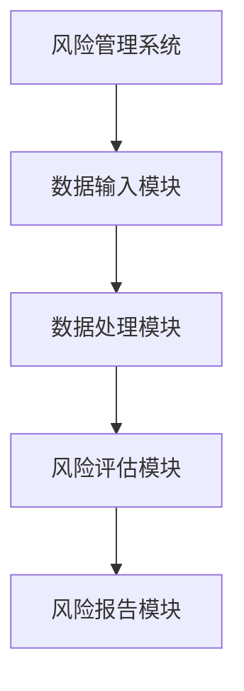
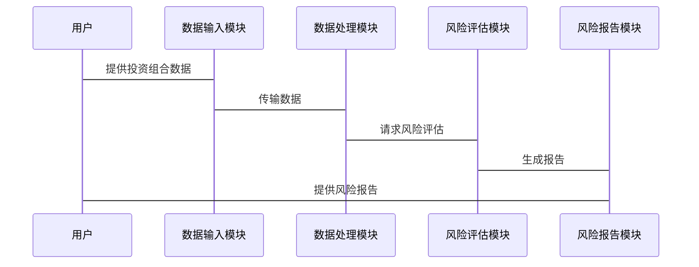

                 


# 芒格的"避免愚蠢"原则在风险管理中的应用

---

## 关键词：芒格、风险管理、避免愚蠢、VaR、CVaR、概率论、独立思考

---

## 摘要：

本文深入探讨了芒格的“避免愚蠢”原则在风险管理中的应用。通过分析芒格的核心思想，结合风险管理的基本概念、算法模型和系统架构，本文详细阐述了如何将“避免愚蠢”的理念转化为具体的实践策略。从理论到算法，从系统设计到项目实战，本文为风险管理领域的从业者提供了全面的指导和实用的建议。

---

## 第一部分：芒格的"避免愚蠢"原则概述

### 第1章：芒格的生平与思想体系

#### 1.1 芝诺的生平简介

- **早年经历**：芒格出生于1924年，早年生活在美国 Omaha。他在青少年时期就表现出对数学和哲学的浓厚兴趣。
- **教育背景**：芒格在芝加哥大学学习法律，后转学到哥伦比亚大学法学院。
- **职业生涯**：芒格是巴菲特的 mentor，他的投资理念深刻影响了巴菲特的决策风格。

#### 1.2 芝诺的"避免愚蠢"原则

- **原则的核心理念**：芒格强调“避免犯大错”，而不是追求高回报。
- **原则的适用场景**：在投资和风险管理中，避免情绪化决策、从众心理和认知偏差。
- **原则与风险管理的关系**：芒格的“避免愚蠢”原则为风险管理提供了一种基于心理和行为的框架。

#### 1.3 风险管理的基本概念

- **风险的定义**：风险是指未来结果的不确定性。
- **风险管理的目标**：通过识别、评估和应对风险，降低潜在损失。
- **风险管理的流程**：包括风险识别、风险评估、风险应对和风险监控。

---

## 第二部分："避免愚蠢"原则的核心概念

### 第2章："避免愚蠢"原则的理论框架

#### 2.1 原则的核心要素

| 核心要素 | 描述 |
|----------|------|
| 愚者的特征 | 情绪化、从众心理、过度自信 |
| 情绪与决策 | 情绪化决策导致非理性行为 |
| 认知偏差 | 确认偏差、从众偏差、过度自信偏差 |

#### 2.2 原则与风险管理的联系

- **情绪与决策**：避免情绪化决策，尤其是在市场波动时。
- **认知偏差**：识别和克服认知偏差，提高决策质量。
- **从众心理**：独立思考，避免随大流。

---

## 第三部分：风险管理中的算法与数学模型

### 第3章：风险管理算法基础

#### 3.1 风险评估的数学模型

##### 3.1.1 威险值（VaR）的计算公式

$$ \text{VaR} = \text{损失金额} \times \text{概率} $$

##### 3.1.2 例子

假设某投资组合在95%的置信水平下，1天的VaR为100万美元，意味着在95%的概率下，损失不超过100万美元。

#### 3.2 风险管理算法的实现

##### 3.2.1 用Python实现VaR计算

```python
import numpy as np
import scipy.stats as stats

def calculate_var(portfolio_returns, confidence_level=0.95):
    sorted_returns = np.sort(portfolio_returns)
    var_index = int(len(sorted_returns) * (1 - confidence_level))
    var = sorted_returns[var_index]
    return var

# 示例数据
portfolio_returns = np.random.normal(loc=0, scale=1, size=1000)
var_95 = calculate_var(portfolio_returns, 0.95)
print(f"VaR at 95% confidence level: {var_95}")
```

---

## 第四部分：系统分析与架构设计

### 第4章：风险管理系统的架构设计

#### 4.1 问题场景介绍

- **场景描述**：一个投资机构需要管理其投资组合的风险。
- **目标**：实时监控风险，评估潜在损失。

#### 4.2 系统功能设计

- **数据输入**：投资组合的资产回报数据。
- **数据处理**：计算VaR、CVaR等风险指标。
- **风险评估**：生成风险报告，识别高风险资产。
- **风险控制**：制定风险缓解策略。

#### 4.3 系统架构设计



#### 4.4 系统接口设计



---

## 第五部分：项目实战

### 第5章：风险管理系统的实现

#### 5.1 环境安装

- **安装Python和必要的库**：
  ```bash
  pip install numpy scipy matplotlib
  ```

#### 5.2 核心代码实现

##### 5.2.1 风险管理系统的实现

```python
import numpy as np
import pandas as pd
from scipy.stats import norm

def calculate VaR(portfolio_returns, confidence_level=0.95):
    sorted_returns = np.sort(portfolio_returns)
    var_index = int(len(sorted_returns) * (1 - confidence_level))
    var = sorted_returns[var_index]
    return var

def calculate CVaR(portfolio_returns, confidence_level=0.95):
    var = calculate_var(portfolio_returns, confidence_level)
    cvar = np.mean(portfolio_returns[portfolio_returns <= var])
    return cvar

# 示例数据
portfolio_returns = np.random.normal(loc=0, scale=1, size=1000)
var_95 = calculate_var(portfolio_returns, 0.95)
cvar_95 = calculate_cvar(portfolio_returns, 0.95)
print(f"VaR at 95% confidence level: {var_95}")
print(f"CVaR at 95% confidence level: {cvar_95}")
```

#### 5.3 案例分析

- **案例背景**：某投资组合在市场波动加剧时，需要评估潜在损失。
- **分析过程**：计算VaR和CVaR，识别高风险资产，制定风险缓解策略。
- **结果解读**：通过VaR和CVaR，识别潜在损失，并调整投资组合以降低风险。

---

## 第六部分：总结与最佳实践

### 第6章：总结

- **核心观点**：芒格的“避免愚蠢”原则为风险管理提供了心理和行为的框架，结合数学模型和系统设计，可以有效降低潜在风险。
- **最佳实践**：
  - 定期审查决策过程，避免情绪化和从众心理。
  - 坚持独立思考，识别和克服认知偏差。
  - 持续学习，更新风险管理模型和策略。

---

## 第七部分：注意事项与拓展阅读

### 7.1 注意事项

- **数据质量**：风险管理模型的准确性依赖于数据的质量。
- **模型假设**：数学模型的假设可能与实际情况不符，需要根据具体场景调整。
- **风险管理的局限性**：风险管理无法完全消除风险，只能降低潜在损失。

### 7.2 拓展阅读

- **推荐书籍**：
  - 《风险管理与VaR模型》
  - 《概率论与随机过程》
  - 《芒格的投资思想》

---

## 附录

### 附录A：Python代码实现

```python
import numpy as np
import scipy.stats as stats

def calculate_var(portfolio_returns, confidence_level=0.95):
    sorted_returns = np.sort(portfolio_returns)
    var_index = int(len(sorted_returns) * (1 - confidence_level))
    var = sorted_returns[var_index]
    return var

# 示例数据
portfolio_returns = np.random.normal(loc=0, scale=1, size=1000)
var_95 = calculate_var(portfolio_returns, 0.95)
print(f"VaR at 95% confidence level: {var_95}")
```

### 附录B：系统架构图


---

通过本文的详细讲解和实战分析，读者可以深入了解芒格的“避免愚蠢”原则在风险管理中的应用，并能够将其应用于实际工作中。

