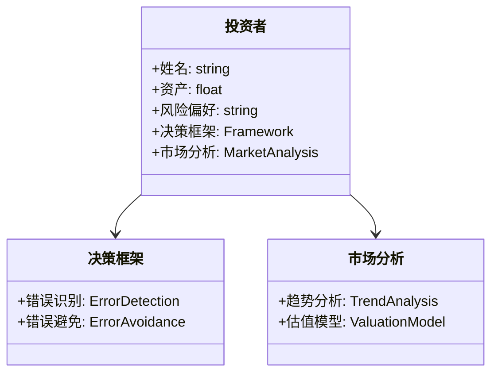
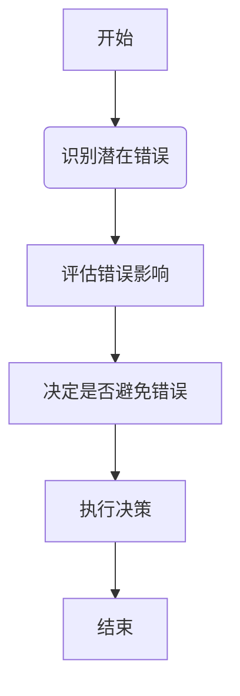

                 


# 芒格的"避免愚蠢"原则：明智投资的基础

## 关键词：芒格，避免愚蠢，投资原则，决策框架，系统分析

## 摘要：芒格的“避免愚蠢”原则是明智投资的核心理念，强调通过避免常见错误来实现长期成功。本文系统地分析了这一原则的背景、核心概念、算法原理、数学模型以及实际应用，为读者提供了全面的理解和实践指南。

---

## 第1章：芒格的“避免愚蠢”原则概述

### 1.1 芒格“避免愚蠢”原则的背景

#### 1.1.1 投资领域中的常见误区
在投资领域，投资者常常陷入以下误区：
- **过度自信**：认为自己能够预测市场波动。
- **从众心理**：盲目跟随市场趋势。
- **短期思维**：关注短期收益而忽视长期价值。

#### 1.1.2 芒格投资理念的起源与演变
芒格的“避免愚蠢”原则起源于他对心理学和人类认知的深刻理解。他认为，投资成功的关键在于避免犯下愚蠢的错误，而不是寻找完美的投资机会。

#### 1.1.3 “避免愚蠢”原则的核心目标
该原则的目标是通过识别和避免常见错误，帮助投资者做出更明智的决策，从而实现长期稳定的收益。

### 1.2 “避免愚蠢”原则的定义与特点

#### 1.2.1 原则的定义
“避免愚蠢”原则是指在投资过程中，通过识别和避免常见错误，降低决策失误的概率，从而提高投资成功的可能性。

#### 1.2.2 原则的核心特点
- **防御性**：强调避免损失，而非追求最大收益。
- **系统性**：通过系统化的方法识别和避免错误。
- **实用性**：适用于各种投资环境和市场条件。

#### 1.2.3 与其他投资原则的区别
与其他投资原则相比，“避免愚蠢”原则更注重心理层面的控制和错误的预防，而非单纯依赖市场分析或技术指标。

### 1.3 相关概念对比分析

#### 1.3.1 “避免愚蠢”原则与其他投资原则的对比
| 原则 | 重点 | 方法 |
|------|------|------|
| 股价法 | 估值 | 精确计算公司价值 |
| 技术分析 | 市场趋势 | 通过图表预测价格 |
| “避免愚蠢” | 错误控制 | 通过心理和行为调整减少错误 |

#### 1.3.2 核心概念属性特征对比表格
| 特征 | “避免愚蠢”原则 | 其他原则 |
|------|----------------|------------|
| 目标 | 避免错误 | 追求收益最大化 |
| 方法 | 心理控制 | 市场分析 |
| 适用性 | 各类投资者 | 专业投资者 |

#### 1.3.3 ER实体关系图架构
```mermaid
er
 entity 投资者 {
   key: 投资者ID
   属性: 姓名, 资产, 风险偏好
 }

 entity 错误类型 {
   key: 错误ID
   属性: 错误名称, 错误描述
 }

 entity 关系 {
   关系: 投资者 -> 错误类型
   属性: 发生时间, 是否避免
 }
```

---

## 第2章：芒格决策框架的系统分析

### 2.1 系统分析与架构设计

#### 2.1.1 投资决策问题场景介绍
投资决策涉及多个因素，包括市场环境、公司基本面、投资者心理等。芒格的决策框架通过系统化的方法，帮助投资者在复杂环境中做出合理决策。

#### 2.1.2 系统功能设计（领域模型 mermaid 类图）


#### 2.1.3 系统架构设计 mermaid 架构图
```mermaid
archimate
    partition 投资者系统 {
        component 投资者
        component 决策框架
        component 市场分析
    }
    partition 市场环境 {
        component 市场数据
        component 趋势分析
    }
    投资者 --> 决策框架
    决策框架 --> 市场分析
```

---

## 第3章：芒格决策框架的算法原理

### 3.1 算法原理讲解

#### 3.1.1 算法 mermaid 流程图


#### 3.1.2 算法原理的数学模型和公式
假设投资者的决策可以表示为一个函数：
$$
f(x) = \begin{cases}
    \text{避免错误} & \text{如果 } x > 0 \\
    \text{继续投资} & \text{否则}
\end{cases}
$$
其中，\( x \) 表示潜在错误的影响程度。

#### 3.1.3 通俗易懂的举例说明
例如，当市场出现恐慌性抛售时，投资者需要识别并避免从众心理，保持冷静分析。

### 3.2 数学模型与公式

#### 3.2.1 投资决策的数学模型
$$
\text{收益} = \text{投资金额} \times (\text{收益率} - \text{风险调整系数})
$$

#### 3.2.2 相关公式推导与解释
假设投资金额为 \( P \)，收益率为 \( R \)，风险调整系数为 \( C \)，则收益为：
$$
\text{收益} = P \times (R - C)
$$

#### 3.2.3 实际案例分析与详细解读
以股票投资为例，如果 \( P = 10,000 \)， \( R = 10\% \)， \( C = 3\% \)，则收益为：
$$
\text{收益} = 10,000 \times (0.10 - 0.03) = 700
$$

---

## 第4章：芒格“避免愚蠢”原则的项目实战

### 4.1 项目实战环境安装

#### 4.1.1 系统环境要求
- 操作系统：Windows、MacOS、Linux
- 开发工具：Python 3.8+

#### 4.1.2 工具安装与配置
安装Python和必要的库：
```bash
pip install numpy pandas matplotlib
```

### 4.2 核心实现源代码

#### 4.2.1 投资决策模型代码实现
```python
def avoid_stupid_investing(principal, rate, risk):
    expected_return = principal * (rate - risk)
    if expected_return < 0:
        return "避免投资"
    else:
        return "继续投资"

# 示例
print(avoid_stupid_investing(10000, 0.10, 0.03))  # 输出：继续投资
```

#### 4.2.2 代码应用解读与分析
通过上述代码，投资者可以根据当前收益率和风险系数，决定是否继续投资。

### 4.3 案例分析与详细解读

#### 4.3.1 实际案例分析
假设投资者有10万元本金，预期收益率为12%，风险系数为5%。根据公式：
$$
\text{收益} = 100000 \times (0.12 - 0.05) = 7000
$$
因此，建议继续投资。

#### 4.3.2 详细解读与剖析
通过避免潜在错误，投资者可以更合理地分配资产，降低风险，提高收益。

---

## 第5章：芒格“避免愚蠢”原则的最佳实践

### 5.1 最佳实践 tips

#### 5.1.1 投资中的心理因素
- 控制贪婪和恐惧情绪。
- 避免从众心理和过度自信。

#### 5.1.2 决策框架的优化建议
- 定期回顾和调整决策框架。
- 结合市场环境灵活应用原则。

#### 5.1.3 风险管理的注意事项
- 设定止损点。
- 分散投资以降低风险。

### 5.2 总结与小结

#### 5.2.1 全书内容总结
芒格的“避免愚蠢”原则通过系统化的方法，帮助投资者识别和避免常见错误，从而实现长期稳定的收益。

#### 5.2.2 读者思考与行动建议
- 反思自身的投资行为。
- 实践“避免愚蠢”原则，优化投资决策。

### 5.3 拓展阅读与未来趋势

#### 5.3.1 相关书籍与文献推荐
- 《芒格的智慧：投资的哲学》
- 《行为经济学与投资决策》

#### 5.3.2 未来投资领域的趋势分析
随着人工智能和大数据技术的发展，投资决策将更加依赖于系统化的方法和数据分析。

---

## 附录：相关 mermaid 图

### 投资者系统类图


### 投资决策流程图


