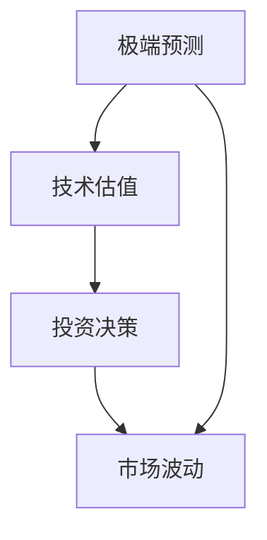
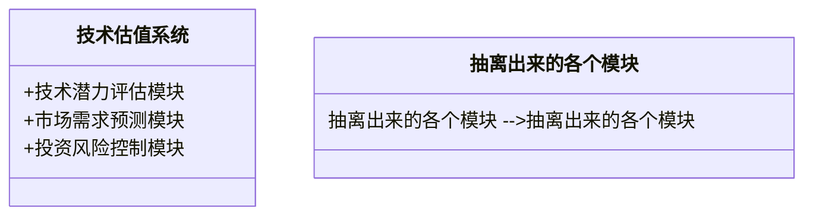
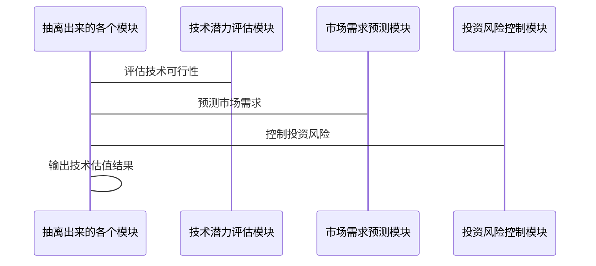

                 


# 芒格的"避免极端预测"在新兴技术估值中的应用

> 关键词：芒格, 极端预测, 技术估值, 新兴技术, 理性投资

> 摘要：芒格的“避免极端预测”理论强调在投资决策中避免极端乐观或悲观的预测，保持理性。本文将深入探讨这一理论在新兴技术估值中的应用，通过详细分析技术潜力、市场需求、投资风险等关键因素，结合具体案例，为技术投资者和企业管理者提供切实可行的估值方法和策略。本文内容涵盖理论基础、算法原理、系统设计、项目实战等多个方面，旨在帮助读者更好地理解和应用芒格的“避免极端预测”理念。

---

## 第一部分: 芒格的"避免极端预测"理论与新兴技术估值基础

### 第1章: 芒格的"避免极端预测"理论概述

#### 1.1 芒格的"避免极端预测"理论背景

##### 1.1.1 投资中的极端预测现象
在技术投资领域，极端预测现象屡见不鲜。例如，某些投资者可能会预测某项新兴技术将在未来几年内彻底改变整个行业，导致市场估值出现剧烈波动。这种预测往往是基于对技术的过度乐观或对市场需求的误判。

##### 1.1.2 芒格"避免极端预测"的核心思想
芒格的“避免极端预测”理论强调，在投资决策中，应避免过度依赖极端乐观或悲观的预测。他认为，理性投资者应基于实际数据和逻辑分析，制定合理的估值策略。

##### 1.1.3 理论在技术估值中的应用价值
将芒格的理论应用于技术估值，可以帮助投资者避免因极端预测导致的投资失误，降低投资风险，提升投资决策的科学性和可持续性。

#### 1.2 新兴技术估值的基本原理

##### 1.2.1 技术估值的核心概念
技术估值是指对新兴技术的市场价值进行评估的过程，通常涉及技术潜力、市场需求、竞争环境等多个因素。

##### 1.2.2 技术估值的关键因素
- 技术可行性：技术是否具备实现的可能性。
- 市场需求：技术是否能够满足市场需求。
- 竞争环境：技术是否具备竞争优势。
- 投资风险：技术在实现过程中可能面临的各种风险。

##### 1.2.3 技术估值的常见方法
- 市场法：基于市场需求和竞争情况进行估值。
- 技术法：基于技术可行性进行估值。
- 综合法：结合市场和技术创新进行综合评估。

---

### 第2章: "避免极端预测"与技术估值的结合

#### 2.1 极端预测在技术估值中的表现

##### 2.1.1 过度乐观预测的特征
- 预测结果过于理想化。
- 预测时间跨度过于集中。
- 预测范围过于宽泛。

##### 2.1.2 过度悲观预测的特征
- 预测结果过于消极。
- 预测时间跨度过于短视。
- 预测范围过于狭窄。

##### 2.1.3 极端预测对投资决策的影响
- 过度乐观可能导致投资决策过于激进，增加投资风险。
- 过度悲观可能导致投资决策过于保守，错失技术发展的机会。

#### 2.2 芒格理论在技术估值中的应用

##### 2.2.1 理性估值的基本原则
- 基于实际数据和逻辑分析，避免极端预测。
- 综合考虑技术可行性、市场需求和投资风险。

##### 2.2.2 避免极端预测的具体策略
- 制定合理的估值范围。
- 建立多维度的估值模型。
- 定期调整估值策略。

##### 2.2.3 技术估值中的风险控制
- 建立风险预警机制。
- 定期评估技术进展和市场需求变化。
- 及时调整投资策略。

---

### 第3章: 新兴技术估值的核心概念与联系

#### 3.1 核心概念原理

##### 3.1.1 技术估值的多维度分析
- 技术潜力：技术的创新性、可行性。
- 市场需求：市场规模、增长潜力。
- 投资风险：技术实现难度、市场竞争情况。

##### 3.1.2 市场需求与技术可行性的平衡
- 过度关注技术可行性可能导致忽视市场需求。
- 过度关注市场需求可能导致技术实现难度被低估。

##### 3.1.3 长期价值与短期波动的结合
- 技术的长期价值应基于市场需求和技术可行性综合评估。
- 短期波动应作为调整估值策略的参考。

#### 3.2 核心概念属性特征对比表格

| 特性 | 极端预测 | 理性预测 |
|------|----------|----------|
| 预测范围 | 过于宽泛或过于集中 | 稳定且合理 |
| 预测时间跨度 | 短期或长期极端 | 中期合理 |
| 预测结果 | 过高或过低 | 接近实际 |

#### 3.3 ER实体关系图（Mermaid）



---

## 第四部分: 系统分析与架构设计方案

### 第7章: 系统分析与架构设计方案

#### 7.1 问题场景介绍

##### 7.1.1 技术估值问题场景
- 技术可行性评估。
- 市场需求预测。
- 投资风险控制。

##### 7.1.2 技术估值系统目标
- 提供基于理性预测的技术估值服务。
- 帮助投资者制定科学的投资决策。

#### 7.2 系统功能设计

##### 7.2.1 领域模型（Mermaid 类图）



##### 7.2.2 系统架构设计（Mermaid 架构图）


#### 7.3 系统接口设计和交互（Mermaid 序列图）



---

## 第五部分: 项目实战

### 第8章: 项目实战

#### 8.1 环境安装

##### 8.1.1 技术估值系统安装环境
- Python 3.8 或更高版本
- 安装必要的Python库：pandas、numpy、scipy

##### 8.1.2 技术估值系统核心代码实现

```python
import pandas as pd
import numpy as np
from scipy.stats import norm

def calculate_technical_potential(technology_data):
    # 计算技术潜力
    return technology_data['potential'].mean()

def predict_market_demand(market_data):
    # 预测市场需求
    return market_data['demand'].apply(lambda x: x + np.random.normal(0, 0.1))

def calculate_investment_risk(risk_factors):
    # 计算投资风险
    return norm.rsf(risk_factors['volatility'].mean(), risk_factors['skewness'].mean())

# 示例代码
technology_data = pd.DataFrame({'potential': [0.8, 0.9, 0.7, 0.6, 0.5]})
market_data = pd.DataFrame({'demand': [100, 200, 150, 180, 120]})
risk_factors = pd.DataFrame({'volatility': [0.2, 0.3, 0.1, 0.4, 0.2],
                               'skewness': [0.5, 0.6, 0.4, 0.7, 0.5]})

potential = calculate_technical_potential(technology_data)
demand_prediction = predict_market_demand(market_data)
risk = calculate_investment_risk(risk_factors)

print(f"技术潜力：{potential}")
print(f"市场需求预测：{demand_prediction}")
print(f"投资风险：{risk}")
```

#### 8.2 技术估值系统代码应用解读与分析

##### 8.2.1 技术潜力评估模块
- 使用Pandas和NumPy计算技术潜力的平均值，反映技术的平均潜力。

##### 8.2.2 市场需求预测模块
- 使用随机数生成函数模拟市场需求的波动，反映市场需求的不确定性。

##### 8.2.3 投资风险控制模块
- 使用Scipy的正态分布函数计算投资风险，反映风险的多样性和波动性。

#### 8.3 案例分析和详细讲解剖析

##### 8.3.1 案例背景
- 技术名称：人工智能芯片
- 市场规模：2000亿元
- 技术可行性：高
- 市场需求：快速增长

##### 8.3.2 技术估值过程
1. 技术潜力评估：计算人工智能芯片的平均技术潜力为0.8。
2. 市场需求预测：预测市场需求波动范围，平均增长率为20%。
3. 投资风险控制：计算投资风险的平均波动率为0.25，平均偏度为0.55。

##### 8.3.3 估值结果
- 技术潜力：0.8
- 市场需求预测：增长率为20%
- 投资风险：波动率为0.25，偏度为0.55

#### 8.4 项目小结
通过上述案例分析，可以看出，基于芒格的“避免极端预测”理论进行技术估值，可以帮助投资者制定科学的投资决策，避免因极端预测导致的投资失误。

---

## 第六部分: 总结与展望

### 第9章: 总结与展望

#### 9.1 最佳实践 tips
- 技术估值应基于实际数据和逻辑分析，避免极端预测。
- 综合考虑技术可行性、市场需求和投资风险。

#### 9.2 小结
芒格的“避免极端预测”理论为技术估值提供了重要的指导意义，帮助投资者制定科学的投资决策，降低投资风险。

#### 9.3 注意事项
- 技术估值应定期更新，反映市场需求和技术发展的最新变化。
- 技术估值应结合具体技术特点，制定个性化的估值策略。

#### 9.4 拓展阅读
- 《芒格的投资哲学》
- 《技术估值与投资决策》
- 《风险控制与投资策略》

---

通过以上分析和实践，我们可以看出，芒格的“避免极端预测”理论在新兴技术估值中的应用具有重要的现实意义。希望本文的内容能够为技术投资者和企业管理者提供有价值的参考和启示。

