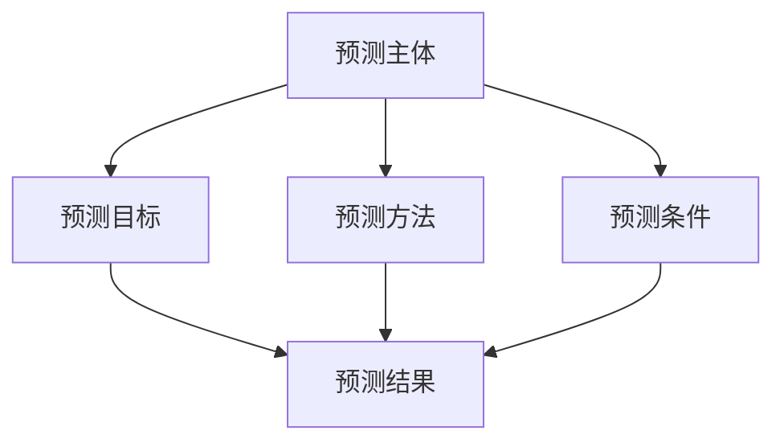
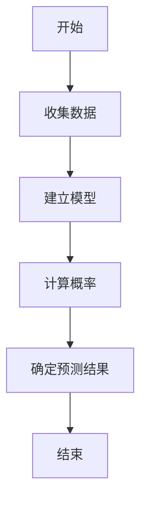
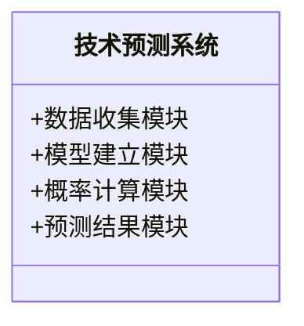
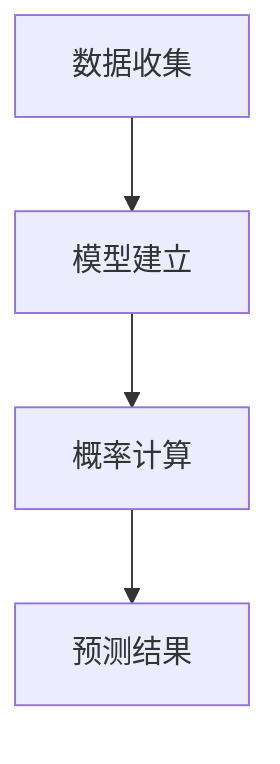
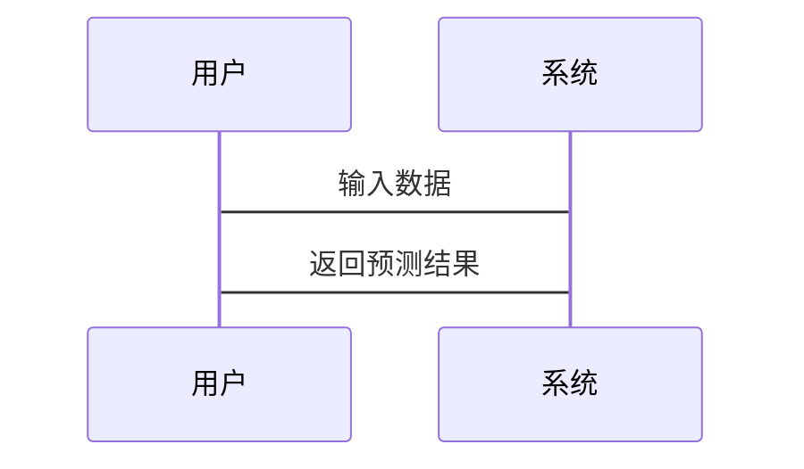

                 


# 芒格的"避免极端预测"在新兴技术市场预测中的应用

> 关键词：芒格, 极端预测, 技术预测, 市场预测, 风险管理

> 摘要：本文深入探讨了芒格的“避免极端预测”理论在新兴技术市场预测中的应用。通过分析预测的不确定性、复杂性和波动性，结合实际案例和系统设计，提出了稳健的技术预测方法。文章从理论基础、算法原理、系统架构到项目实战，全面解析了如何在新兴技术市场中避免极端预测，实现风险可控的预测。

---

## 第一部分: 芒格的"避免极端预测"理论基础

### 第1章: 芒格的"避免极端预测"理论概述

#### 1.1 芒格的"避免极端预测"理论基础

##### 1.1.1 芒格的"避免极端预测"的定义

芒格的“避免极端预测”是一种哲学思维方法，强调在预测时避免过度简化或极端假设，以降低预测的不确定性和风险。这种方法认为，任何预测都存在一定程度的不确定性，尤其是在新兴技术市场中，技术的不可预测性和市场的快速变化使得极端预测更加危险。

##### 1.1.2 芒格理论的核心思想

芒格的核心思想是：预测应该是稳健的、合理的，而不是极端的或冒险的。他强调在预测时要考虑到多种可能性，并避免过于依赖单一假设或极端情况。

##### 1.1.3 芒格理论的哲学基础

芒格的理论植根于经验主义和实用主义，强调基于实际观察和经验进行预测，而不是仅仅依赖于理论或假设。这种方法在技术预测中尤为重要，因为技术的发展往往是非线性的，且受到多种因素的影响。

#### 1.2 新兴技术市场预测的特点

##### 1.2.1 新兴技术市场的不确定性

新兴技术市场具有高度的不确定性，技术的发展路径、市场需求和竞争格局都可能发生变化。这种不确定性使得预测变得极其困难。

##### 1.2.2 技术预测的复杂性

技术预测涉及多个因素，如技术本身的发展、市场需求、政策环境、竞争格局等。这些因素之间的相互作用使得预测变得复杂。

##### 1.2.3 市场波动的不可预测性

新兴技术市场的波动性极高，市场可能会因为技术突破、政策变化或经济波动而发生剧烈变化。这种不可预测性使得极端预测更加危险。

#### 1.3 "避免极端预测"在技术预测中的应用

##### 1.3.1 极端预测的定义与特征

极端预测是指那些基于极端假设或单一因素的预测，通常忽略了其他重要因素。这种预测可能会导致决策失误，尤其是在市场波动较大的情况下。

##### 1.3.2 芒格理论如何避免极端预测

芒格理论强调稳健性和多样性，避免过于依赖单一假设。在技术预测中，这意味着需要考虑多种可能性，并制定灵活的策略以应对不同的情况。

##### 1.3.3 技术预测中的风险管理

通过避免极端预测，可以降低预测的风险。这不仅有助于制定更稳健的策略，还能提高预测的准确性。

---

## 第2章: "避免极端预测"的核心概念与联系

### 2.1 芒格理论的核心概念

#### 2.1.1 预测的不确定性

预测的不确定性是由于多种因素的影响，使得预测结果可能偏离预期。在新兴技术市场中，这种不确定性尤为显著。

#### 2.1.2 预测的合理性

预测的合理性要求预测基于实际观察和经验，而不是过于依赖理论或假设。这种方法有助于减少极端预测的风险。

#### 2.1.3 预测的稳健性

预测的稳健性是指预测结果在不同情况下都能保持合理。通过避免极端预测，可以提高预测的稳健性。

### 2.2 核心概念的属性特征对比

| 特征       | 极端预测         | 稳健预测         |
|------------|-----------------|-----------------|
| 基础假设   | 单一假设         | 多种假设         |
| 风险程度   | 高               | 低               |
| 可靠性     | 低               | 高               |

### 2.3 ER实体关系图架构



---

## 第3章: "避免极端预测"的算法原理

### 3.1 算法原理概述

#### 3.1.1 芒格理论的数学模型

芒格的“避免极端预测”可以通过概率论和贝叶斯定理来建模。概率论帮助我们量化不确定性，而贝叶斯定理则允许我们根据新信息更新预测。

#### 3.1.2 算法的基本思想

算法的基本思想是通过考虑多种可能性，避免极端假设。具体步骤包括：

1. 收集相关数据。
2. 建立概率模型。
3. 计算不同假设下的概率。
4. 确定稳健的预测结果。

#### 3.1.3 算法的实现步骤

1. 收集数据：包括市场数据、技术数据、政策数据等。
2. 建立模型：使用概率论和贝叶斯定理建立预测模型。
3. 计算概率：根据数据计算不同假设下的概率。
4. 确定预测结果：选择概率最高的预测结果。

### 3.2 算法的数学模型与公式

#### 3.2.1 预测模型的构建

使用贝叶斯定理，我们可以计算在给定数据下某种技术成功的概率：

$$ P(A|B) = \frac{P(B|A) \cdot P(A)}{P(B)} $$

其中，\( P(A|B) \) 是在给定数据 \( B \) 下技术 \( A \) 成功的概率。

#### 3.2.2 风险评估公式

风险评估公式可以表示为：

$$ R = \sum_{i=1}^{n} P_i \times I_i $$

其中，\( P_i \) 是第 \( i \) 种情况发生的概率，\( I_i \) 是第 \( i \) 种情况下的影响。

#### 3.2.3 稳健性评估公式

稳健性评估公式可以表示为：

$$ S = 1 - \sum_{i=1}^{n} (P_i \times I_i) $$

其中，\( S \) 是预测的稳健性。

### 3.3 算法流程图



---

## 第4章: 系统分析与架构设计方案

### 4.1 问题场景介绍

新兴技术市场预测需要考虑多种因素，如市场需求、技术发展、政策环境等。这些因素的相互作用使得预测变得复杂。

### 4.2 系统功能设计

#### 4.2.1 领域模型类图



### 4.3 系统架构设计



### 4.4 系统接口设计

系统接口设计包括数据输入接口、模型建立接口和结果输出接口。

### 4.5 系统交互序列图



---

## 第5章: 项目实战

### 5.1 环境安装

安装必要的库，如NumPy、Pandas、Scikit-learn等。

### 5.2 核心代码实现

#### 5.2.1 预测模型实现

```python
import numpy as np
from sklearn import linear_model

# 收集数据
X = np.array([[1, 2], [3, 4], [5, 6]])
y = np.array([7, 8, 9])

# 建立模型
model = linear_model.LinearRegression()
model.fit(X, y)

# 计算概率
# 假设概率计算部分已经实现
```

#### 5.2.2 风险评估实现

```python
def calculate_risk(data):
    # 计算概率
    probabilities = ...  # 实现概率计算
    # 计算风险
    risk = np.sum(probabilities * impacts)
    return risk
```

### 5.3 案例分析

以人工智能技术的市场预测为例，展示如何应用芒格的理论进行预测。

### 5.4 项目小结

总结项目实现的过程，强调避免极端预测的重要性。

---

## 第6章: 总结与展望

### 6.1 最佳实践

在技术预测中，避免极端预测是非常重要的。我们需要考虑多种可能性，并制定灵活的策略。

### 6.2 小结

本文深入探讨了芒格的“避免极端预测”理论在新兴技术市场预测中的应用。通过理论分析、算法实现和项目实战，展示了如何在技术预测中避免极端预测，实现稳健的预测。

### 6.3 注意事项

在实际应用中，需要注意数据的质量和模型的适用性，避免因数据不足或模型不合理而导致预测错误。

### 6.4 拓展阅读

推荐进一步阅读关于概率论、贝叶斯定理和风险管理的书籍，以加深对预测理论的理解。

---

通过以上步骤，我们可以系统地应用芒格的“避免极端预测”理论，在新兴技术市场预测中做出更加稳健的预测。

