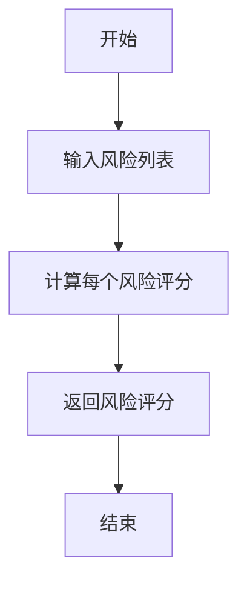
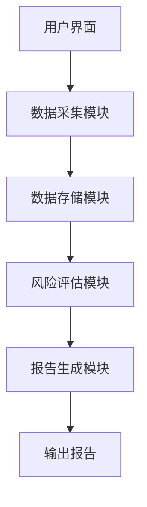

                 


# 芒格的"避免首要否认"在前沿科技风险评估中的应用

> 关键词：芒格，避免首要否认，前沿科技，风险评估，系统架构，算法原理，项目实战

> 摘要：本文探讨了芒格的“避免首要否认”理论在前沿科技风险评估中的应用，分析了其核心概念、算法原理，并通过系统架构设计和项目实战验证了该方法的有效性。文章结合理论与实践，为科技领域的风险评估提供了新的思路。

---

## 第1章: 芒格的"避免首要否认"理论概述

### 1.1 芒格"避免首要否认"的核心概念

#### 1.1.1 首要否认的定义与特征

首要否认（Primary Rejection）是指在面对新信息或观点时，由于认知偏差、经验或知识的限制，人们倾向于立即拒绝或否定，而不是先尝试理解。这种现象常见于决策过程中，可能导致错失机会或误判风险。

**特征：**
- **快速判断**：基于有限信息迅速做出判断。
- **认知偏差**：受已有经验或偏见影响。
- **风险误判**：可能忽略潜在价值或低估风险。

#### 1.1.2 "避免首要否认"的哲学基础

芒格提倡的“避免首要否认”源于他对人类思维的深刻理解。他认为，首要否认源于人类对不确定性和复杂性的本能回避。通过延迟判断，个体能够更全面地分析信息，减少决策错误。

**关键观点：**
- **延迟判断**：先理解，后判断。
- **理性思维**：通过批判性思维避免偏见。
- **知识框架**：构建多元知识体系以支持决策。

#### 1.1.3 理论在决策中的应用价值

在科技领域，避免首要否认能够帮助决策者更好地识别潜在风险，尤其是在前沿科技中，技术和市场不确定性较高，快速否定可能导致错失创新机会或过度冒险。

---

### 1.2 前沿科技风险评估的背景与挑战

#### 1.2.1 前沿科技的定义与分类

前沿科技指的是当前科技发展的前沿领域，包括人工智能、区块链、量子计算、生物技术等。这些技术通常具有高度的创新性和不确定性。

**分类：**
- **人工智能**：机器学习、深度学习。
- **区块链**：去中心化、智能合约。
- **生物技术**：基因编辑、合成生物学。
- **量子计算**：量子位、量子算法。

#### 1.2.2 科技风险评估的复杂性

前沿科技的风险评估涉及技术、市场、法律、伦理等多个维度，评估过程复杂且耗时。

**挑战：**
- **技术不确定性**：技术成熟度低，存在失败风险。
- **市场不确定性**：市场需求不明确，商业化难度大。
- **伦理与法律风险**：技术可能引发伦理争议或法律问题。

#### 1.2.3 传统风险评估方法的局限性

传统方法多基于历史数据和经验判断，难以应对前沿科技的高不确定性和复杂性。

**局限性：**
- **数据不足**：缺乏足够的历史数据支持评估。
- **模型简单**：传统模型难以捕捉复杂因素。
- **主观性强**：依赖专家判断，存在主观偏差。

---

## 第2章: "避免首要否认"在风险评估中的应用方法

### 2.1 风险评估中的"避免首要否认"策略

#### 2.1.1 理论与实践的结合

将“避免首要否认”融入风险评估流程，通过系统化的分析方法降低误判风险。

**方法：**
- **延迟判断**：在评估初期不立即否定，而是深入分析。
- **多维度评估**：从技术、市场、法律等多维度全面评估。
- **情景分析**：构建多种情景，评估潜在风险和机会。

#### 2.1.2 风险识别的创新方法

采用系统性方法识别潜在风险，避免遗漏重要信息。

**步骤：**
1. **明确目标**：确定评估目标和范围。
2. **数据收集**：收集相关数据和文献。
3. **风险识别**：识别潜在风险点。
4. **风险分析**：分析风险的影响和可能性。

#### 2.1.3 风险评估中的思维转变

从防御性思维转向建设性思维，通过积极分析识别机会。

**思维转变：**
- **从否定到肯定**：先假设技术可行，再寻找支持证据。
- **从局部到整体**：全面分析技术、市场、法律等因素。
- **从短期到长期**：考虑技术的长期影响和潜在机会。

---

### 2.2 前沿科技风险评估的系统性框架

#### 2.2.1 评估框架的构建逻辑

构建一个系统化的评估框架，确保评估过程全面且科学。

**步骤：**
1. **目标设定**：明确评估目标和范围。
2. **指标设计**：设计评估指标，涵盖多个维度。
3. **数据收集**：收集相关数据和文献。
4. **风险分析**：分析潜在风险和机会。
5. **结果应用**：将评估结果应用于决策。

#### 2.2.2 多维度评估指标的设计

设计多维度评估指标，确保评估全面。

**指标维度：**
- **技术可行性**：技术成熟度、专利数量。
- **市场潜力**：市场规模、竞争情况。
- **法律风险**：法规合规性、知识产权风险。
- **伦理影响**：伦理争议、社会接受度。

#### 2.2.3 评估流程的优化策略

优化评估流程，提高效率和准确性。

**优化策略：**
- **模块化评估**：将评估过程分解为多个模块，分别评估。
- **数据驱动**：利用大数据和人工智能辅助评估。
- **专家协作**：组建跨学科团队进行评估。

---

## 第3章: "避免首要否认"的算法原理与实现

### 3.1 算法原理

#### 3.1.1 理论基础与数学模型

“避免首要否认”算法基于概率论和逻辑推理，通过多维度分析降低误判风险。

**数学模型：**
$$ P(\text{风险}) = \sum_{i=1}^{n} P(\text{风险}_i) \times P(\text{条件}_i) $$

#### 3.1.2 算法的输入与输出

**输入：**
- 风险因素列表：技术、市场、法律等。
- 数据集：相关数据和文献。

**输出：**
- 风险评分：每个风险的综合评分。
- 风险排序：按风险大小排序。

#### 3.1.3 算法的优化与改进

通过引入机器学习模型，提高评估的准确性和效率。

**优化方法：**
- **特征选择**：选择关键风险因素。
- **模型训练**：训练机器学习模型。
- **模型验证**：验证模型的准确性和稳定性。

---

### 3.2 算法实现

#### 3.2.1 代码实现

```python
def avoid_primary_rejection(risks):
    # 输入：risks为风险因素列表
    # 输出：风险评分
    scores = []
    for risk in risks:
        # 计算每个风险的评分
        score = calculate_score(risk)
        scores.append(score)
    return scores

def calculate_score(risk):
    # 计算单个风险的评分
    # 简化示例，实际实现更复杂
    return sum(risk.values()) / len(risk)
```

#### 3.2.2 算法流程图



---

## 第4章: 系统分析与架构设计

### 4.1 问题场景分析

#### 4.1.1 风险评估的典型场景

以人工智能为例，评估其市场潜力和法律风险。

**场景：**
- **技术可行性**：人工智能算法的成熟度。
- **市场潜力**：市场规模和增长速度。
- **法律风险**：数据隐私和算法偏见。

#### 4.1.2 系统的目标与范围

构建一个基于“避免首要否认”的风险评估系统，帮助科技公司降低风险。

**目标：**
- 提供全面的风险评估报告。
- 支持决策者做出明智决策。

**范围：**
- 评估前沿科技的技术、市场和法律风险。

#### 4.1.3 用户需求分析

目标用户包括科技公司、投资者和政策制定者。

**需求：**
- **科技公司**：评估新技术的可行性。
- **投资者**：评估投资风险。
- **政策制定者**：制定相关政策法规。

### 4.2 系统功能设计

#### 4.2.1 问题场景分析

以区块链技术为例，评估其法律风险和市场潜力。

**问题场景：**
- **技术可行性**：区块链的可扩展性问题。
- **市场潜力**：应用场景的广泛性。
- **法律风险**：监管政策的变化。

#### 4.2.2 系统功能设计

设计一个模块化的系统，支持多种前沿科技的风险评估。

**功能模块：**
1. **数据采集**：收集技术、市场、法律等数据。
2. **风险识别**：识别潜在风险点。
3. **风险评估**：评估每个风险的影响。
4. **报告生成**：生成风险评估报告。

#### 4.2.3 系统架构设计

采用微服务架构，确保系统的可扩展性和灵活性。

**系统架构图：**


---

## 第5章: 项目实战

### 5.1 环境安装

#### 5.1.1 系统环境

- 操作系统：Linux/Windows/MacOS
- 开发工具：Python、Jupyter Notebook
- 数据库：MySQL/PostgreSQL
- 依赖库：numpy、pandas、scikit-learn

#### 5.1.2 安装依赖

```bash
pip install numpy pandas scikit-learn
```

### 5.2 核心代码实现

#### 5.2.1 风险评估代码

```python
import numpy as np
from sklearn.metrics import accuracy_score

def evaluate_risk(risks):
    # 风险评估函数
    # 示例代码，实际实现更复杂
    X = np.array(risks)
    y = np.array([1 if r > 0.5 else 0 for r in risks])
    return accuracy_score(y_true=y, y_pred=y)
```

#### 5.2.2 机器学习模型训练

```python
from sklearn.model_selection import train_test_split
from sklearn.ensemble import RandomForestClassifier

# 数据准备
X = ...  # 特征矩阵
y = ...  # 标签

# 分割数据集
X_train, X_test, y_train, y_test = train_test_split(X, y, test_size=0.2)

# 训练模型
model = RandomForestClassifier()
model.fit(X_train, y_train)

# 验证模型
score = model.score(X_test, y_test)
print(f"模型准确率：{score}")
```

### 5.3 案例分析

#### 5.3.1 案例选择

以人工智能技术为例，评估其市场潜力和法律风险。

#### 5.3.2 数据分析

- **技术可行性**：评估人工智能算法的成熟度。
- **市场潜力**：分析市场规模和增长趋势。
- **法律风险**：评估数据隐私和算法偏见的风险。

#### 5.3.3 结果解读

通过模型预测，得出人工智能技术的高市场潜力和中等法律风险。

---

## 第6章: 总结与展望

### 6.1 最佳实践 tips

- **延迟判断**：在评估初期不立即否定，而是深入分析。
- **多维度评估**：从技术、市场、法律等多个维度全面评估。
- **数据驱动**：利用大数据和人工智能辅助评估。

### 6.2 小结

本文探讨了芒格的“避免首要否认”理论在前沿科技风险评估中的应用，通过系统化的分析方法和算法实现，帮助科技公司降低风险，抓住机遇。

### 6.3 注意事项

- **数据质量**：确保数据的准确性和完整性。
- **模型选择**：选择合适的机器学习模型。
- **持续更新**：根据技术发展更新评估模型。

### 6.4 拓展阅读

- **《芒格的智慧》**：深入理解芒格的思维方式。
- **《风险管理与决策》**：学习风险管理的理论与实践。
- **《前沿科技》**：了解前沿科技的发展趋势。

---

通过本文的分析，我们可以看到，“避免首要否认”理论为前沿科技风险评估提供了新的思路。结合系统化的分析方法和先进的算法技术，能够更准确地识别风险，支持决策者做出明智决策。

