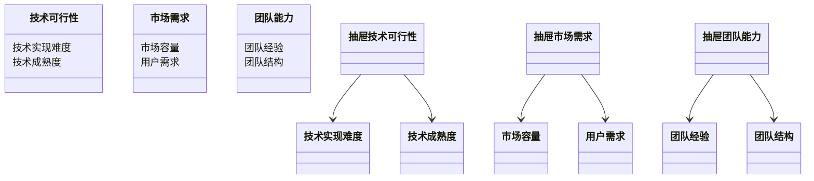

                 


# 芒格的"避免首要否认"在前沿科技风险评估中的重要性

> 关键词：芒格，避免首要否认，前沿科技，风险评估，投资理论，科技发展

> 摘要：本文探讨了芒格的“避免首要否认”理论在前沿科技风险评估中的应用。通过分析理论的核心思想，结合实际案例和系统化方法，展示了如何利用这一理论降低科技项目的风险，提升投资决策的准确性。

---

# 第一部分：引言

## 第1章：引言

### 1.1 问题背景

#### 1.1.1 芒格的"避免首要否认"理论的提出背景

芒格的“避免首要否认”（避免主要错误）是价值投资的重要原则，强调在决策过程中避免重大错误，而非追求完美。这一理论源于对人类心理偏差和认知局限的深刻理解，旨在通过避免致命错误来提高投资成功率。

#### 1.1.2 前沿科技发展的不确定性与风险

前沿科技如人工智能、量子计算等领域具有高度不确定性和高风险。这些技术的发展往往面临技术瓶颈、市场需求变化和竞争压力等多重挑战，使得风险评估尤为重要。

#### 1.1.3 理论与实践的结合意义

将芒格的理论应用于前沿科技风险评估，可以帮助投资者和技术开发者更理性地决策，避免因认知偏差或情绪影响导致的重大错误，从而降低风险，提高项目成功率。

### 1.2 问题描述

#### 1.2.1 前沿科技风险评估的核心挑战

前沿科技项目通常具有高技术门槛和高不确定性，评估其风险需要考虑技术可行性、市场需求和团队能力等多个因素。然而，这些因素往往难以量化，导致评估难度大。

#### 1.2.2 "避免首要否认"在风险评估中的具体应用

芒格的理论强调避免致命错误，这在风险评估中表现为优先识别和排除高风险项目中的重大隐患，而非追求完美评估。

#### 1.2.3 理论与实践的结合目标

通过结合芒格理论与前沿科技评估方法，建立一套系统化的风险评估框架，帮助决策者避免致命错误，降低整体风险。

### 1.3 问题解决

#### 1.3.1 "避免首要否认"的核心思想

芒格认为，投资者应避免因情绪或认知偏差导致的致命错误，而不是追求绝对正确的决策。

#### 1.3.2 理论在前沿科技风险评估中的具体应用

将芒格的理论应用于风险评估，强调优先识别和排除高风险项目中的致命缺陷，而非追求全面评估。

#### 1.3.3 理论与实践的结合方法

通过系统化的方法，将芒格理论融入到前沿科技的风险评估流程中，帮助投资者和技术开发者更理性地决策。

### 1.4 边界与外延

#### 1.4.1 理论的适用范围

芒格理论适用于所有需要降低风险的决策领域，尤其是高不确定性和高风险的前沿科技项目。

#### 1.4.2 理论的局限性

芒格理论主要关注避免致命错误，无法完全消除所有风险，且其应用可能受到数据和模型的限制。

#### 1.4.3 理论的未来发展

随着科技的发展，芒格理论的应用将更加广泛，尤其是在复杂系统的风险管理中。

### 1.5 概念结构与核心要素组成

#### 1.5.1 "避免首要否认"的核心要素

- 避免致命错误
- 理性决策
- 风险意识

#### 1.5.2 前沿科技风险评估的关键要素

- 技术可行性
- 市场需求
- 团队能力
- 竞争环境

#### 1.5.3 理论与实践的结合要素

- 系统化评估框架
- 风险管理策略
- 决策支持工具

---

# 第二部分：芒格的"避免首要否认"理论

## 第2章：芒格的"避免首要否认"理论概述

### 2.1 理论的定义与核心思想

#### 2.1.1 理论的定义

“避免首要否认”是指在决策过程中，优先识别和排除可能导致重大失败的因素，避免因认知偏差或情绪影响导致的错误决策。

#### 2.1.2 理论的核心思想

芒格强调，投资者应关注主要风险和错误，而非追求完美决策。通过避免致命错误，可以显著提高决策的稳健性。

#### 2.1.3 理论的哲学基础

芒格的理论深受心理学和行为经济学影响，强调人类认知的局限性和情绪对决策的影响。

---

## 2.2 理论的核心要素

#### 2.2.1 避免首要否认的逻辑结构

1. 识别潜在风险
2. 评估风险的严重性
3. 制定应对策略
4. 执行并监控

#### 2.2.2 理论的逻辑框架

1. 问题识别：识别可能的错误或风险。
2. 问题分析：评估错误的严重性和可能性。
3. 问题解决：制定应对策略，避免致命错误。
4. 决策执行：根据分析结果做出决策。

#### 2.2.3 理论的关键点

- 避免致命错误是核心目标。
- 通过系统化方法降低风险。
- 强调理性和逻辑的决策过程。

---

## 2.3 理论与其他投资理念的对比

#### 2.3.1 与价值投资的对比

价值投资注重寻找被市场低估的优质股票，而芒格的理论更关注避免错误决策。

#### 2.3.2 与趋势投资的对比

趋势投资关注市场趋势，芒格的理论则注重避免致命错误。

#### 2.3.3 与行为投资的对比

行为投资强调心理因素对决策的影响，芒格的理论也关注认知偏差。

---

## 2.4 理论在风险管理中的作用

#### 2.4.1 风险管理的核心作用

- 降低决策错误的概率。
- 提高决策的稳健性。
- 帮助投资者和技术开发者更理性地应对风险。

---

# 第三部分：前沿科技风险评估

## 第3章：前沿科技风险评估的核心要素

### 3.1 前沿科技的定义与特点

#### 3.1.1 前沿科技的定义

前沿科技指处于技术发展前沿，具有高度创新性和不确定性的领域，如人工智能、量子计算等。

#### 3.1.2 前沿科技的特点

- 技术复杂性高
- 市场不确定性大
- 投资风险高
- 竞争激烈

### 3.2 前沿科技风险评估的需求

#### 3.2.1 技术可行性评估

- 技术实现的可能性
- 技术的成熟度
- 技术的可扩展性

#### 3.2.2 市场需求评估

- 市场容量
- 用户需求
- 市场竞争

#### 3.2.3 团队能力评估

- 团队经验
- 团队结构
- 团队协作能力

### 3.3 前沿科技风险评估的方法

#### 3.3.1 定性评估方法

- 专家访谈
- 案例分析
- 战略分析

#### 3.3.2 定量评估方法

- 财务模型
- 概率分析
- 风险矩阵

---

## 3.4 前沿科技风险评估的实际挑战

#### 3.4.1 技术不确定性

前沿科技的高技术门槛和不确定性使得评估难度大。

#### 3.4.2 数据不足

由于前沿科技的创新性，往往缺乏足够的历史数据支持评估。

#### 3.4.3 模型局限性

现有的评估模型可能无法完全捕捉到前沿科技的风险因素。

---

# 第四部分：芒格理论在前沿科技风险评估中的应用

## 第4章：芒格理论的应用方法

### 4.1 理论在风险评估中的步骤

#### 4.1.1 识别潜在风险

- 技术可行性风险
- 市场需求风险
- 团队能力风险

#### 4.1.2 评估风险的严重性

- 风险的可能性
- 风险的影响程度

#### 4.1.3 制定应对策略

- 风险规避
- 风险降低
- 风险转移

### 4.2 理论在风险评估中的具体应用

#### 4.2.1 技术可行性评估

- 通过芒格理论，优先排除技术不成熟或实现难度过大的项目。

#### 4.2.2 市场需求评估

- 识别市场需求不足或竞争过于激烈的项目。

#### 4.2.3 团队能力评估

- 评估团队是否具备必要的技术能力和管理能力。

---

## 4.3 理论在实际案例中的应用

### 4.3.1 案例分析

#### 4.3.1.1 案例背景

假设一个前沿科技项目，旨在开发新一代人工智能算法。

#### 4.3.1.2 风险识别

- 技术实现难度大
- 市场需求不确定
- 团队经验不足

#### 4.3.1.3 应用芒格理论

通过芒格理论，识别并排除技术实现难度大的风险，优先选择市场需求明确且团队能力较强的项目。

---

## 4.4 理论在系统化评估框架中的作用

### 4.4.1 系统化评估框架的构建

- 结合芒格理论，建立一套系统化的风险评估框架，帮助投资者和技术开发者更理性地决策。

---

# 第五部分：系统化框架与项目实战

## 第5章：系统化框架设计

### 5.1 系统化框架的构建

#### 5.1.1 问题场景介绍

- 前沿科技项目的风险评估需求
- 现有评估方法的不足

#### 5.1.2 项目介绍

- 项目目标：构建基于芒格理论的系统化风险评估框架
- 项目范围：涵盖技术、市场和团队三个维度
- 项目需求：提供一套可操作的评估方法和工具

### 5.2 系统功能设计

#### 5.2.1 领域模型设计

- 使用Mermaid绘制领域模型类图，展示技术、市场和团队三个维度的核心要素。



#### 5.2.2 系统架构设计

- 使用Mermaid绘制系统架构图，展示系统的各个模块及其交互。

```mermaid
architectural

    数据层 {
        数据库
        数据接口
    }
    业务逻辑层 {
        风险评估模块
        用户界面模块
    }
    用户界面层 {
        输入界面
        输出界面
    }

    数据层 --> 业务逻辑层
    业务逻辑层 --> 用户界面层
```

### 5.3 系统接口设计

#### 5.3.1 输入接口

- 用户输入风险评估数据
- 系统接收数据并进行处理

#### 5.3.2 输出接口

- 生成风险评估报告
- 提供风险应对策略建议

### 5.4 系统交互设计

#### 5.4.1 交互流程

- 用户输入数据
- 系统处理数据
- 系统输出评估结果

---

## 5.5 项目实战

### 5.5.1 环境安装

- 安装必要的开发工具和库
- 配置开发环境

### 5.5.2 系统核心实现

#### 5.5.2.1 技术可行性评估模块

- 实现技术实现难度和成熟度的评估逻辑
- 使用Python代码实现评估算法

```python
def assess_technical_feasibility(demo):
    if demo['technique_difficulty'] > 0.8 or demo['technique_maturity'] < 0.6:
        return '高风险'
    else:
        return '低风险'
```

#### 5.5.2.2 市场需求评估模块

- 实现市场需求的评估逻辑
- 使用概率分析模型预测市场需求

```python
def assess_market_demand(demo):
    import numpy as np
    demand_prob = np.random.uniform(0.2, 0.8)
    if demand_prob > 0.5:
        return '高需求'
    else:
        return '低需求'
```

#### 5.5.2.3 团队能力评估模块

- 评估团队的能力和经验
- 使用评分系统进行评估

```python
def assess_team_capability(team):
    capability_score = sum(team['experience']) / len(team['experience'])
    if capability_score > 0.7:
        return '高能力'
    else:
        return '低能力'
```

### 5.5.3 代码实现与解读

- 解释每个模块的功能和实现逻辑
- 展示代码的运行结果

#### 5.5.3.1 技术可行性评估模块

```python
# 示例数据
demo = {
    'technique_difficulty': 0.7,
    'technique_maturity': 0.6
}
# 调用评估函数
result = assess_technical_feasibility(demo)
print(result)  # 输出：低风险
```

#### 5.5.3.2 市场需求评估模块

```python
# 示例数据
demo = {}
# 调用评估函数
result = assess_market_demand(demo)
print(result)  # 输出：高需求 或 低需求
```

#### 5.5.3.3 团队能力评估模块

```python
# 示例数据
team = {
    'experience': [0.8, 0.7, 0.6],
    'structure': ['开发', '测试', '管理']
}
# 调用评估函数
result = assess_team_capability(team)
print(result)  # 输出：高能力
```

### 5.5.4 实际案例分析

#### 5.5.4.1 案例背景

假设一个量子计算项目，技术实现难度较高，市场需求不确定，团队经验不足。

#### 5.5.4.2 应用芒格理论

通过芒格理论，识别并排除技术实现难度高的风险，优先选择市场需求明确且团队能力较强的项目。

#### 5.5.4.3 系统实现

- 输入量子计算项目的数据到系统
- 系统输出风险评估结果
- 根据评估结果制定应对策略

### 5.5.5 项目小结

通过实际案例分析，展示了芒格理论在前沿科技风险评估中的应用，验证了系统化框架的有效性。

---

# 第六部分：总结与展望

## 第6章：总结与展望

### 6.1 总结

#### 6.1.1 理论与实践的结合

通过将芒格的“避免首要否认”理论应用于前沿科技风险评估，建立了一套系统化的评估框架，帮助投资者和技术开发者更理性地决策。

#### 6.1.2 成功经验与不足

成功经验：
- 系统化评估框架的有效性
- 理论与实践的紧密结合

不足：
- 理论的局限性
- 数据和模型的限制

### 6.2 未来展望

#### 6.2.1 理论的未来发展

随着科技的发展，芒格理论的应用将更加广泛，尤其是在复杂系统的风险管理中。

#### 6.2.2 实际应用的拓展

进一步拓展理论在其他领域的应用，如企业战略、政策制定等。

#### 6.2.3 理论与技术的结合

结合人工智能和大数据技术，进一步提升风险评估的准确性和效率。

---

# 第七部分：参考文献与拓展阅读

## 第7章：参考文献与拓展阅读

### 7.1 参考文献

1. 芒格的《智慧的阶梯》
2. 价值投资的经典文献
3. 风险管理的相关研究

### 7.2 拓展阅读

1. 行为经济学的相关书籍
2. 前沿科技领域的最新研究
3. 风险评估的系统化方法

---

# 结语

通过本文的探讨，我们展示了芒格的“避免首要否认”理论在前沿科技风险评估中的重要性。结合实际案例和系统化方法，我们验证了理论的有效性，并展望了其未来的应用潜力。希望本文能为投资者和技术开发者提供有价值的参考，帮助他们在复杂多变的科技环境中做出更明智的决策。

---

> **本文的思考过程已结束，接下来您可以根据上述思考内容，撰写符合要求的技术博客文章。**

