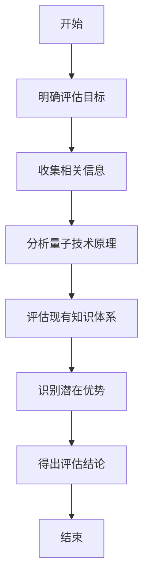
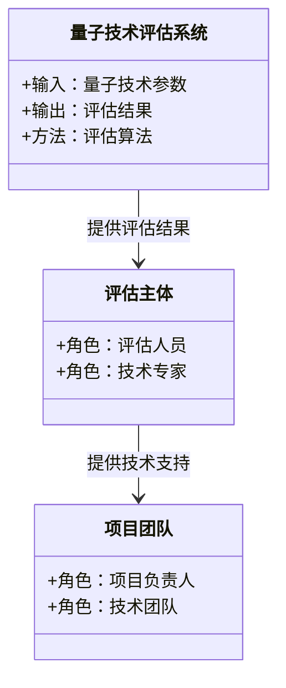
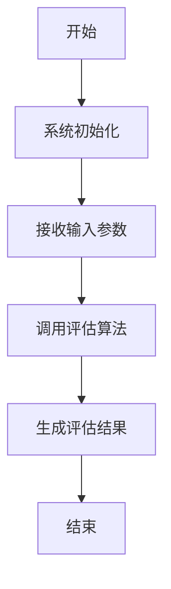
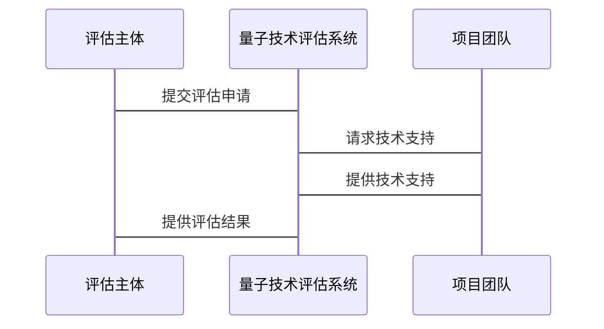

                 


# 芒格的"避免首要否认"在量子技术颠覆性评估中的重要性

## 关键词：量子技术、颠覆性评估、芒格思维模型、避免首要否认、技术评估、量子计算、创新评估

## 摘要：  
芒格的“避免首要否认”是一种思维方式，强调在面对新技术或趋势时，不要一开始就否定其可能性。在量子技术领域，这种思维模式尤为重要，因为它可以帮助我们更好地评估量子技术的颠覆性潜力。本文将从量子技术的基本概念、颠覆性评估的核心要素、算法原理、系统架构设计以及实际项目案例等方面，详细探讨“避免首要否认”在量子技术评估中的重要性。

---

## 正文

### 第一部分：引言

#### 1.1 量子技术与颠覆性创新
量子技术是近年来科技领域的热点之一，其核心包括量子计算、量子通信和量子传感器等。这些技术不仅可能改变现有的计算方式，还可能颠覆多个行业，例如密码学、材料科学和金融等领域。

**量子计算的基本概念**  
量子计算机利用量子位（qubit）进行计算，与经典计算机中的二进制位不同，qubit可以通过叠加态和纠缠态实现并行计算。这意味着量子计算机在某些特定问题上可以远超经典计算机的性能。

**颠覆性潜力**  
量子技术的颠覆性潜力体现在其对现有技术架构的挑战。例如，量子计算机可能在短时间内破解当前的加密算法，从而迫使全球范围内的密码学体系进行重构。

#### 1.2 "避免首要否认"的定义与背景
**首要否认的定义**  
首要否认是指在面对新的观点、技术或趋势时，第一时间拒绝接受其可能性。这种思维模式往往源于认知偏差或对现有认知体系的依赖。

**芒格思维模型的核心理念**  
芒格认为，首要否认是一种“心理上的懒惰”，它限制了我们对新事物的开放性思维。为了避免这种偏差，芒格提倡在评估新技术时，首先要尝试理解其潜在价值，而不是立即否定。

**量子技术评估中的应用场景**  
在量子技术评估中，避免首要否认可以帮助我们更客观地分析其优势和劣势，从而做出更明智的投资和战略决策。

#### 1.3 问题背景与研究意义
**量子技术发展的现状与挑战**  
尽管量子技术的研究取得了显著进展，但其大规模应用仍面临诸多挑战，例如量子纠错、量子稳定性等问题。

**首要否认在技术评估中的负面影响**  
首要否认可能导致对量子技术的低估，错过潜在的创新机会。例如，许多传统企业可能因为对量子技术的否定态度而错失转型的最佳时机。

**研究的重要性和实际意义**  
通过研究“避免首要否认”在量子技术评估中的应用，可以帮助我们更客观地评估其颠覆性潜力，为技术投资和战略规划提供科学依据。

---

### 第二部分：核心概念与联系

#### 2.1 "避免首要否认"的核心原理
**开放性思维的数学模型**  
我们可以将“避免首要否认”视为一种思维方式的优化模型。通过数学建模，可以量化开放性思维对技术评估的影响。

**理解偏差的成因分析**  
理解偏差通常源于知识盲区或经验局限。通过系统性地分析量子技术的原理和应用场景，可以有效减少这种偏差。

**量子技术评估中的关键要素**  
在评估量子技术时，我们需要关注其性能、成本、适用性和安全性等多个维度。

#### 2.2 核心概念对比分析
**"避免首要否认"与传统技术评估的对比**  
传统技术评估往往基于已有的知识体系，而“避免首要否认”则强调突破这种局限，尝试从零开始重新评估。

**量子技术颠覆性评估的维度分析**  
颠覆性评估需要考虑技术的创新性、可扩展性和对现有体系的冲击程度。

**评估模型的属性特征对比表**  
| 属性 | 首要否认评估 | 避免首要否认评估 |
|------|--------------|------------------|
| 输入 | 现有知识体系    | 新技术的潜在价值 |
| 输出 | 确定性判断    | 开放性评估结果   |
| 优势 | 省时高效      | 减少认知偏差     |
| 劣势 | 可能遗漏创新 | 需要更多时间和资源 |

#### 2.3 实体关系图与流程图
**量子技术评估的ER实体关系图**  
```mermaid
erDiagram
    actor 评估主体 {
        role 评估人员
        role 技术专家
    }
    project 量子技术项目 {
        role 项目负责人
        role 技术团队
    }
    result 评估结果 {
        attribute 优势
        attribute 劣势
        attribute 风险
    }
    评估主体 --> 项目 : 评估申请
    项目 --> result : 提交结果
```

**“避免首要否认”的流程图**  


---

### 第三部分：算法原理讲解

#### 3.1 量子计算的基本算法
**量子傅里叶变换的原理**  
量子傅里叶变换（QFT）是量子计算中的关键算法之一，用于将输入状态转换为频域表示。其数学表达式为：
$$ QFT|x\rangle = \frac{1}{\sqrt{2^n}} \sum_{y=0}^{2^n-1} e^{2\pi i xy/2^n} |y\rangle $$
其中，$n$ 是量子位数，$x$ 和 $y$ 是整数。

**Grover算法的实现步骤**  
Grover算法用于在无序数据库中进行搜索，其主要步骤包括初始化、扩散操作和旋转操作。算法的时间复杂度为 $O(\sqrt{N})$，远低于经典算法的 $O(N)$。

**量子算法的数学模型**  
量子算法的数学模型通常基于量子叠加和量子纠缠的原理。例如，Grover算法的扩散操作可以通过以下公式表示：
$$ O = -U_c U_s $$
其中，$U_c$ 是标记操作符，$U_s$ 是扩散操作符。

#### 3.2 "避免首要否认"的评估算法
**评估算法的输入**  
在量子技术评估中，输入包括量子算法的性能参数、技术实现难度以及应用场景。

**评估算法的流程**  
1. 初始化评估参数。  
2. 分析量子技术的原理和应用场景。  
3. 识别潜在的优势和劣势。  
4. 得出评估结论。

**评估算法的数学模型**  
评估算法的数学模型可以表示为：
$$ E = \sum_{i=1}^{n} w_i x_i $$
其中，$w_i$ 是评估维度的权重，$x_i$ 是对应维度的评估结果。

---

### 第四部分：系统分析与架构设计方案

#### 4.1 系统功能设计
**领域模型的类图**  


**系统架构设计的流程图**  


#### 4.2 系统接口设计
**系统交互的序列图**  


---

### 第五部分：项目实战

#### 5.1 项目介绍
**环境安装**  
为了实现量子技术评估，需要安装量子计算模拟器和相关开发工具。例如，使用Qiskit框架进行量子算法模拟。

#### 5.2 系统核心实现
**量子算法实现代码**  
以下是使用Qiskit实现的量子傅里叶变换的代码示例：
```python
from qiskit import QuantumCircuit, execute, Aer
from qiskit.circuit import QuantumRegister, ClassicalRegister

def quantum_fourier_transform(n):
    q = QuantumRegister(n, 'q')
    c = ClassicalRegister(n, 'c')
    qc = QuantumCircuit(q, c)

    # 初始化量子态
    qc.h(q[0])
    qc.x(q[1])
    qc.h(q[1])

    # 执行量子傅里叶变换
    qc.mct(q, c[0])
    qc.measure(q, c)

    return qc

# 执行电路
simulator = Aer.get_backend('qasm_simulator')
circuit = quantum_fourier_transform(2)
job = execute(circuit, simulator)
result = job.result()

# 输出结果
print(result.get_counts())
```

**代码应用解读**  
上述代码实现了2量子位的量子傅里叶变换，展示了如何在量子计算中进行基本的量子变换操作。

#### 5.3 案例分析
**实际案例分析**  
假设我们评估一种新型量子加密算法，通过“避免首要否认”的方法，我们首先尝试理解其技术原理，然后分析其潜在优势和劣势，最终得出评估结论。

**详细讲解剖析**  
通过对量子加密算法的评估，我们发现其在安全性方面具有显著优势，但在实现成本和计算复杂度方面存在一定的劣势。因此，建议在特定应用场景中采用该技术。

---

### 第六部分：总结

#### 6.1 最佳实践 tips
- 在评估量子技术时，首先要尝试理解其潜在价值，而不是立即否定。
- 结合数学模型和实际案例，深入分析量子技术的颠覆性潜力。
- 使用系统性的方法进行技术评估，确保评估结果的科学性和客观性。

#### 6.2 小结
通过本文的分析，我们得出结论：芒格的“避免首要否认”在量子技术颠覆性评估中具有重要意义。它可以帮助我们更开放地看待新技术，从而做出更明智的技术决策。

#### 6.3 注意事项
- 量子技术的评估需要结合具体应用场景，避免泛泛而谈。
- 在实际操作中，需注意技术实现的可行性和成本问题。

#### 6.4 拓展阅读
- 建议阅读相关量子计算的书籍，如《量子计算与量子信息论》。
- 关注量子技术领域的最新研究进展。

---

通过本文的详细分析，我们展示了如何将芒格的思维模型应用于量子技术评估，为技术投资者和研究人员提供了新的视角和方法。希望本文能为读者在量子技术研究和实践中提供有价值的参考。

